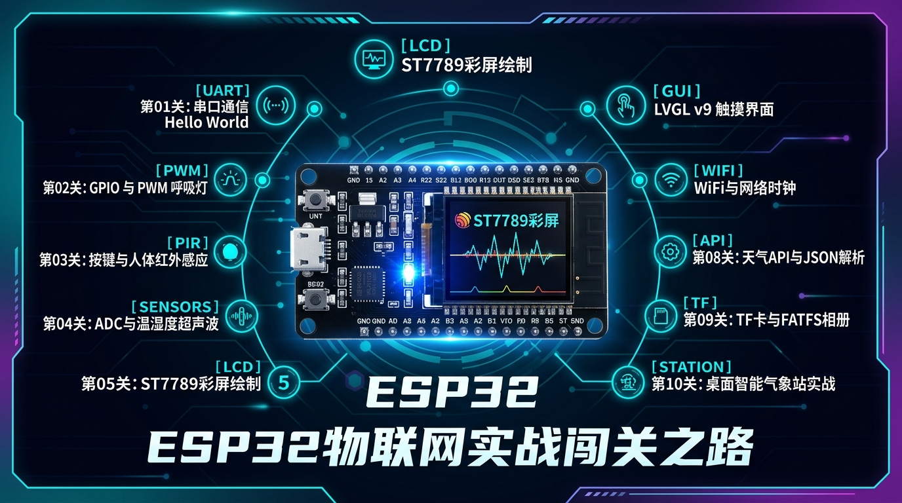

# ESP32 Starter Journey 🚀



> 基于 **ESP-IDF v6.0** 与 **ESP32-WROOM-32E (8MB Flash + 2MB PSRAM)** 的嵌入式物联网从零进阶实战项目。  
> 集成 1.69 英寸 ST7789 触摸彩屏、LVGL v9 GUI、常用传感器驱动及完整原理图资料。

---

## 🛠️ 硬件参数与特性

| 模块 | 核心规格 | 说明 |
| :--- | :--- | :--- |
| **主控芯片** | **ESP32-D0WD-V3 / ESP32-WROOM-32E** | 双核 240MHz Xtensa LX6，算力 600 DMIPS |
| **存储配置** | **8 MB SPI Flash + 2 MB Quad PSRAM** | 充足的片外内存，轻松运行复杂 LVGL 图形界面 |
| **彩色屏幕** | **1.69 英寸 ST7789 SPI LCD** | 分辨率 240 × 280，色彩绚丽 |
| **电容触摸** | **CST816S (I2C 总线)** | 支持单点触摸、滑动与手势识别 |
| **板载传感器** | **DHT11、HC-SR04、SR602、NTC、WS2812** | 温湿度、超声波测距、人体红外、热敏测温、RGB灯珠 |
| **外部存储** | **MicroSD / TF 卡槽** | 4-bit 高速 SDIO 接口 |
| **下载调试** | **Type-C + CH340C** | 支持 DTR/RTS 硬件自动复位下载 |

---

## 🗺️ 实战通关路线图 (6 阶段 · 17 关卡体系)

本项目配有详细的实战学习任务表，详见 [**`ESP32_小白入门实战学习计划.md`**](./ESP32_小白入门实战学习计划.md)：

### 阶段一：见光验证与数字控制（基础输入输出）
- [x] **第 01 关：ESP32 串口通信与 Hello World 打印** 📖 [【阅读深度教程】](./book/01_串口通信与HelloWorld深度解析.md)
- [x] **第 02 关：ESP32 GPIO 数字输出与 PWM 呼吸灯** 📖 [【阅读深度教程】](./book/02_GPIO输出与PWM呼吸灯.md)
- [x] **第 03 关：ESP32 GPIO 数字输入与人体红外感应** 📖 [【阅读深度教程】](./book/03_按键检测与人体红外感应.md)

### 阶段二：中断机制与 FreeRTOS 操作系统（底层基石）
- [x] **第 04 关：ESP32 GPIO 外部中断(ISR)与按键事件驱动** 📖 [【阅读深度教程】](./book/04_GPIO外部中断与按键事件驱动.md)
- [x] **第 05 关：FreeRTOS 多任务调度与队列(Queue)跨任务通信** 📖 [【阅读深度教程】](./book/05_FreeRTOS多任务调度与队列通信.md)
- [x] **第 06 关：ESP32 RMT 硬件脉冲外设与 WS2812 幻彩 RGB 跑马灯** 📖 [【阅读深度教程】](./book/06_RMT硬件脉冲与WS2812幻彩RGB.md)

### 阶段三：传感器集结与通信总线（模拟量与数据通信）
- [ ] **第 07 关：ESP32 模拟量采集(ADC 测温)与超声波测距(HC-SR04)** 📖 [【阅读深度教程】](./book/07_ADC模数转换与超声波测距.md)
- [ ] **第 08 关：I2C 通信总线探秘(I2C Scanner)与 DHT11 单总线时序解析** 📖 [【阅读深度教程】](./book/08_I2C总线探秘与DHT11温湿度解析.md)

### 阶段四：本地存储与视觉交互（现代化人机界面）
- [ ] **第 09 关：ESP32 NVS 非易失性存储与 Flash 偏好设置(断电不丢数据)** 📖 [【阅读深度教程】](./book/09_NVS非易失性存储与Flash偏好设置.md)
- [ ] **第 10 关：ESP32 驱动 1.69寸 ST7789 彩屏与几何图形渲染(SPI DMA)** 📖 [【阅读深度教程】](./book/10_ST7789彩屏驱动与几何图形渲染.md)
- [ ] **第 11 关：ESP32 搭载 LVGL v9 现代图形界面与 CST816S 电容触摸实战** 📖 [【阅读深度教程】](./book/11_LVGL图形框架与电容触摸实战.md)

### 阶段五：无线互联与智能物联网（打通手机与云端）
- [ ] **第 12 关：ESP32 Wi-Fi 联网、SNTP 网络授时时钟与 HTTP/cJSON 天气获取** 📖 [【阅读深度教程】](./book/12_WiFi联网与SNTP天气时钟.md)
- [ ] **第 13 关：ESP32 MQTT 物联网双向通信与云平台联动实战(手机远程控制)** 📖 [【阅读深度教程】](./book/13_MQTT物联网双向通信与云平台联动.md)
- [ ] **第 14 关：ESP32 BLE 低功耗蓝牙实战与微信小程序双向互联** 📖 [【阅读深度教程】](./book/14_BLE低功耗蓝牙与微信小程序互联.md)

### 阶段六：架构、扩展与毕业设计实战
- [ ] **第 15 关：ESP32 挂载 MicroSD/TF 卡(4-bit SDIO)与 FATFS 电子相册** 📖 [【阅读深度教程】](./book/15_TF卡文件系统与电子相册.md)
- [ ] **第 16 关：ESP32 低功耗电源管理与 Deep-sleep 休眠唤醒(电池省电技术)** 📖 [【阅读深度教程】](./book/16_低功耗电源管理与DeepSleep.md)
- [ ] **第 17 关：嵌入式软件工程化 —— 驱动/业务分层、事件总线与组件化模块设计** 📖 [【阅读深度教程】](./book/17_嵌入式软件工程与模块化分层架构.md)
- [ ] **第 18 关：ESP32 终极综合大实战 —— 桌面多功能智能气象站与物联网超级中控台** 📖 [【阅读深度教程】](./book/18_桌面智能气象站与物联网超级中控.md)

---

## 📖 开源电子书目录 (`book/`)

本项目已同步建设出版级开源实战教程：👉 [**`book/SUMMARY.md`**](./book/SUMMARY.md)

* 📘 [**第 00 章：环境搭建与开发准备**](./book/00_环境搭建与开发准备.md)
* 📘 [**第 01 章：ESP32 串口通信与 Hello World 深度剖析**](./book/01_串口通信与HelloWorld深度解析.md)
* 📘 [**第 02 章：ESP32 GPIO 数字输出与 PWM 呼吸灯**](./book/02_GPIO输出与PWM呼吸灯.md)
* 📘 [**第 03 章：ESP32 GPIO 数字输入与人体红外感应**](./book/03_按键检测与人体红外感应.md)
* 📘 [**第 04 章：ESP32 GPIO 外部中断(ISR)与按键事件驱动**](./book/04_GPIO外部中断与按键事件驱动.md)
* 📘 [**第 05 章：FreeRTOS 多任务调度与队列(Queue)跨任务通信**](./book/05_FreeRTOS多任务调度与队列通信.md)
* 📘 [**第 06 章：ESP32 RMT 硬件脉冲外设与 WS2812 幻彩 RGB 跑马灯**](./book/06_RMT硬件脉冲与WS2812幻彩RGB.md)
* 📘 [**第 07 章：ESP32 模拟量采集(ADC 测温)与超声波测距(温声融合雷达)**](./book/07_ADC模数转换与超声波测距.md)
* 📘 [**第 08 章：ESP32 I2C 通信总线探秘与 DHT11 单总线温湿度解析**](./book/08_I2C总线探秘与DHT11温湿度解析.md)
* 📘 [**第 09 章：ESP32 NVS 非易失性存储与 Flash 偏好设置(断电不丢数据)**](./book/09_NVS非易失性存储与Flash偏好设置.md)
* 📘 [**第 10 章：ESP32 驱动 1.69寸 ST7789 彩屏与几何图形渲染(SPI DMA)**](./book/10_ST7789彩屏驱动与几何图形渲染.md)
* 📘 [**第 11 章：ESP32 搭载 LVGL v9 现代图形界面与 CST816S 电容触摸实战**](./book/11_LVGL图形框架与电容触摸实战.md)
* 📘 *(第 12 ~ 18 章随实战路线持续推进)*

---

## 📂 源码目录结构与示例代码一键切换 (`code/`)

本项目为每个章节的每个演进实验都提供了**独立、完整、可直接编译运行的 C 语言源码文件**，统一存放在 [`code/`](./code) 目录下。

```text
code/
├── 01_hello_world/         # Level 01: 串口通信与 Hello World 打印
├── 02_gpio_pwm/            # Level 02: 实验1(LED闪烁) / 实验2(PWM呼吸灯)
├── 03_gpio_input/          # Level 03: 实验1(按键消抖) / 实验2(人体红外感应)
├── 04_gpio_interrupt/      # Level 04: 实验1(GPIO外部中断与事件驱动)
├── 05_freertos_queue/      # Level 05: 实验1(FreeRTOS多任务与双核队列通信)
├── 06_ws2812_rmt/          # Level 06: 实验1(RMT硬件脉冲与WS2812彩虹流光)
├── 07_adc_ultrasonic/      # Level 07: 实验1(ADC采样) / 实验2(NTC测温) / 实验3(超声波测距) / 实验4(温声雷达)
├── 08_i2c_dht11/           # Level 08: 实验1(I2C Scanner) / 实验2(DHT11温湿度) / 实验3(双总线气象站)
├── 09_nvs_storage/         # Level 09: 实验1(开机计数器) / 实验2(用户偏好读写) / 实验3(配置管理与出厂重置)
├── 10_st7789_display/      # Level 10: 实验1(彩屏三原色) / 实验2(几何卡片) / 实验3(动态示波器仪表盘)
└── 11_lvgl_touch/          # Level 11: 实验1(LVGL Hello) / 实验2(触摸按钮) / 实验3(智能家居中控面板)
```

### 🛠️ 使用 `switch_code.sh` 秒级切换与运行实验

为了避免频繁手动复制粘贴代码，项目根目录提供了便捷的切换脚本 [`switch_code.sh`](./switch_code.sh)：

```bash
# 1. 查看所有可用关卡与实验清单
./switch_code.sh list

# 2. 一键切换到指定关卡和实验 (部署到 main/app_main.c)
./switch_code.sh 11 1          # 切换到第 11 关实验 1 (LVGL 基础跑通)
./switch_code.sh 11 3          # 切换到第 11 关实验 3 (智能家居中控屏)

# 3. 一键切换并直接编译/烧录运行
./switch_code.sh 11 3 --flash  # 切换到第 11 关实验 3 并自动烧录启动监视器
```

---

## 📂 项目完整目录结构

```text
├── ESP32_小白入门实战学习计划.md   # 18 关实战任务与打卡指南
├── README.md                      # 项目说明文档
├── switch_code.sh                 # 🛠️ 示例代码一键切换与编译工具
├── CMakeLists.txt                 # ESP-IDF 根项目构建脚本
├── sdkconfig.defaults             # 默认芯片配置 (PSRAM / 主频 / LVGL)
│
├── code/                          # 💻 各关卡独立实验源码库 (可一键切换)
│   ├── 01_hello_world/
│   ├── 02_gpio_pwm/
│   ├── 03_gpio_input/
│   ├── 04_gpio_interrupt/
│   ├── 05_freertos_queue/
│   ├── 06_ws2812_rmt/
│   ├── 07_adc_ultrasonic/
│   ├── 08_i2c_dht11/
│   ├── 09_nvs_storage/
│   ├── 10_st7789_display/
│   └── 11_lvgl_touch/
│
├── main/                          # 核心构建主入口
│   ├── app_main.c                 # 当前激活关卡源码
│   ├── CMakeLists.txt             # 组件构建配置
│   └── idf_component.yml          # LVGL 与触摸组件依赖
│
├── book/                          # 📖 开源电子书教程（章节解析与知识点精讲）
│   ├── SUMMARY.md                 # 教程目录大纲 (6阶段17关全景体系)
│   ├── 00_环境搭建与开发准备.md
│   ├── 01_串口通信与HelloWorld深度解析.md
│   ├── 02_GPIO输出与PWM呼吸灯.md
│   ├── 03_按键检测与人体红外感应.md
│   ├── 04_GPIO外部中断与按键事件驱动.md
│   ├── 05_FreeRTOS多任务调度与队列通信.md
│   ├── 06_RMT硬件脉冲与WS2812幻彩RGB.md
│   ├── 07_ADC模数转换与超声波测距.md
│   ├── 08_I2C总线探秘与DHT11温湿度解析.md
│   ├── 09_NVS非易失性存储与Flash偏好设置.md
│   ├── 10_ST7789彩屏驱动与几何图形渲染.md
│   ├── 11_LVGL图形框架与电容触摸实战.md
│   └── ... (更多章节)
│
├── docs/                          # 硬件原理图、实物照片与设计资料
│   ├── images/                    # 关卡封面插画与硬件模块高清图
│   ├── ESP32开发板原理图1.1.pdf
│   ├── ESP32物联网开发套件使用说明.pdf
│   └── ESP32开发板资料整理_复核修订版.md
│
└── archive/                       # 历史实验源码与归档
```

---

## ⚡ 快速上手与编译烧录

### 1. 编译固件
```bash
idf.py build
```

### 2. 烧录到开发板
```bash
idf.py -p COMx flash
```
*(将 `COMx` 替换为您开发板对应的串口号，如 `COM3`)*

### 3. 打开串口监视器
```bash
idf.py -p COMx monitor
```

---

## 📄 开源许可 (License)

本项目基于 [MIT License](./LICENSE) 开源协议发布，欢迎广大嵌入式开发者、物联网爱好者与高校师生自由学习、Fork、参考及二次开发。

* 💻 **代码部分**：遵循 [MIT License](./LICENSE) 协议；
* 📖 **电子书教程与文档**：遵循 [CC BY-SA 4.0](https://creativecommons.org/licenses/by-sa/4.0/) 知识共享署名-相同方式共享协议。

Copyright © 2026 [Calvin (heycalvin)](https://github.com/heycalvin) · All Rights Reserved.

