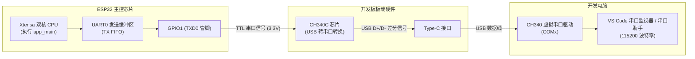

# 第 01 章：串口通信与 Hello World 深度剖析

> **本章导读**：在桌面软件开发中，`printf("Hello, World!\n")` 往往只是几行简单的代码；但在嵌入式系统与单片机开发中，“让电脑屏幕打印出第一行文字”意味着芯片供电建立、时钟晶振起振、Bootloader 引导成功、FreeRTOS 内核就绪、UART 串口控制器配置无误以及 USB 转串口芯片链路完全打通。本章将以显微镜级的视角，深度剖析这一看似简单却至关重要的基石程序。

---

## 1.1 实验目标与学习收获

完成本章学习后，你将能够：
1. 理解 ESP-IDF 程序的启动过程与入口函数 `app_main()` 的调用时机。
2. 掌握 ESP-IDF 组件化依赖管理机制（CMakeLists.txt 与 `REQUIRES`）。
3. 熟练运用 ESP-IDF 标准日志系统（`ESP_LOGI`、`ESP_LOGE` 等）替代裸 `printf` 进行专业级调试。
4. 理解 FreeRTOS 任务调度、系统节拍（Tick）与 `vTaskDelay()` 的底层运作机制。
5. 掌握通过系统 API 动态读取芯片硬件参数（CPU 核心数、芯片版本、Flash 容量、空闲内存 Heap）。

---

## 1.2 硬件链路与工作原理

在 ESP32 上执行串口输出的底层硬件链路如下图所示：



* **TTL 电平**：ESP32 的 GPIO1 输出的是 0V（低电平）和 3.3V（高电平）的数字信号。
* **协议参数**：默认通信波特率为 **115200 bps**，数据位 8 位，停止位 1 位，无奇偶校验位（`115200, 8, N, 1`）。

---

## 1.3 完整关卡源码精析

当前关卡的完整源码位于 [`main/app_main.c`](../main/app_main.c)：

```c
/**
 * ============================================================================
 * 关卡 1：串口通信与 Hello World 打印
 * ============================================================================
 */

#include <stdio.h>
#include <inttypes.h>
#include "freertos/FreeRTOS.h"
#include "freertos/task.h"
#include "esp_log.h"
#include "esp_system.h"
#include "esp_chip_info.h"
#include "esp_flash.h"

// 1. 定义当前模块私有的日志标签 TAG
static const char *TAG = "LEVEL_1_HELLO";

void app_main(void)
{
    // 2. 打印带色彩高亮的标题
    ESP_LOGI(TAG, "==================================================");
    ESP_LOGI(TAG, "       🎉 恭喜！ESP32 关卡 1 启动成功！          ");
    ESP_LOGI(TAG, "==================================================");

    // 3. 动态获取并打印当前芯片硬件参数
    esp_chip_info_t chip_info;
    uint32_t flash_size;
    esp_chip_info(&chip_info);

    ESP_LOGI(TAG, "【硬件信息】CPU 核心数: %d 核", chip_info.cores);
    ESP_LOGI(TAG, "【硬件信息】芯片版本 (Revision): v%d", chip_info.revision);
    ESP_LOGI(TAG, "【硬件信息】无线特性: %s%s",
             (chip_info.features & CHIP_FEATURE_WIFI_BGN) ? "2.4GHz Wi-Fi " : "",
             (chip_info.features & CHIP_FEATURE_BT) ? "+ 经典蓝牙/BLE" : "");

    // 4. 读取 Flash 存储容量
    if (esp_flash_get_size(NULL, &flash_size) == ESP_OK) {
        ESP_LOGI(TAG, "【硬件信息】板载 Flash 大小: %" PRIu32 " MB", flash_size / (1024 * 1024));
    }

    ESP_LOGI(TAG, "--------------------------------------------------");
    ESP_LOGI(TAG, "开始进入主循环，每秒打印一次心跳...");

    int count = 0;

    // 5. 嵌入式主循环
    while (1) {
        count++;

        // 获取当前系统剩余可用内存 (SRAM)
        uint32_t free_heap = esp_get_free_heap_size();

        // 打印带计数和内存信息的日志
        ESP_LOGI(TAG, "[#%04d] Hello ESP32! 当前空闲内存: %" PRIu32 " 字节", count, free_heap);

        // 使用标准 printf 对比输出
        printf("       -> 来自 printf 的问候: 距离开机运行已过去 %d 秒\n", count);

        // 延时 1000 毫秒 (1 秒)
        vTaskDelay(pdMS_TO_TICKS(1000));
    }
}
```

---

## 1.4 深度知识点全景剖析

### 知识点 1：头文件包含规范与 CMake 组件依赖
* **`<stdio.h>` vs `"esp_log.h"`**：
  * 尖括号 `< >` 用于引用标准 C 语言工具链提供的库头文件。
  * 双引号 `""` 用于引用当前工程源码或 ESP-IDF 内部组件暴露的头文件。
* **为什么需要 `main/CMakeLists.txt` 的 `REQUIRES`？**
  ESP-IDF 采用模块化组件管理体系。如果在代码中包含了 `#include "esp_flash.h"`，必须在 `main/CMakeLists.txt` 中显式添加 `spi_flash` 组件声明：
  ```cmake
  idf_component_register(
      SRCS "app_main.c"
      INCLUDE_DIRS "."
      REQUIRES driver esp_timer esp_psram spi_flash
  )
  ```
  否则编译器在构建该模块时，将不会包含 `spi_flash` 的头文件搜索路径，导致报错。

---

### 知识点 2：C 语言关键字与类型修饰符
* **`static const char *TAG = "LEVEL_1_HELLO";`**
  * `const`：表示字符串内容只读，编译器将其分配在 Flash 的只读数据区（`.rodata`），不占用宝贵的 RAM 内存。
  * `static`：限定变量作用域仅在当前 `.c` 文件内部，避免与其他文件中的同名 `TAG` 发生符号冲突。
* **`%" PRIu32 "` 的由来**：
  在 32 位嵌入式系统中，`uint32_t` 表示严格的无符号 32 位整型。在 `<inttypes.h>` 标准库中，`PRIu32` 是一个格式化占位宏（在 32 位平台上展开为 `"u"` 或 `"lu"`）。使用 `ESP_LOGI(TAG, "容量: %" PRIu32, flash_size)` 可以保证在任何编译器架构下均不会出现类型不匹配警告。

---

### 知识点 3：ESP-IDF 专业日志系统（ESP_LOGx）

在嵌入式生产环境中，禁止滥用裸 `printf`，应统一使用 ESP-IDF 的 `ESP_LOG` 体系：

| 宏名称 | 对应级别 | 终端颜色 | 典型用途 |
| :--- | :--- | :--- | :--- |
| **`ESP_LOGE`** | Error (错误) | **红色** | 致命故障、初始化失败、指针为空 |
| **`ESP_LOGW`** | Warn (警告) | **黄色** | 可恢复的异常状态、重试机制 |
| **`ESP_LOGI`** | Info (信息) | **绿色** | 业务主流程状态、版本号输出 |
| **`ESP_LOGD`** | Debug (调试) | **白色** | 详细通信数据、算法中间过程 |
| **`ESP_LOGV`** | Verbose (冗余)| **灰色** | 最底层寄存器、海量流水日志 |

**日志行结构解剖**：
```text
I (1360) LEVEL_1_HELLO: [#0001] Hello ESP32! 当前空闲内存: 298412 字节
│   │          │          └─ 实际打印的消息文本
│   │          └─ 模块标签 (TAG)
│   └─ 系统启动至今的运行时间戳 (毫秒 ms)
└─ 日志级别标识符 (I = Info)
```

---

### 知识点 4：芯片硬件检测与错误处理（`esp_err_t`）
* **结构体与指针传参**：
  `esp_chip_info(&chip_info);` 传入结构体变量的内存地址（`&`），函数内部直接对该内存区域赋值，实现多值返回。
* **位掩码特性检测**：
  `chip_info.features` 采用按位编码，通过 `(features & CHIP_FEATURE_WIFI_BGN)` 按位与操作快速检测是否支持 2.4G Wi-Fi。
* **标准错误处理**：
  ESP-IDF 绝大多数驱动 API 均返回 `esp_err_t` 类型。`ESP_OK`（数值为 0）代表操作成功。在编写健壮的嵌入式程序时，务必对关键函数的返回值进行校验。

---

### 知识点 5：FreeRTOS 任务调度与延时原理

```c
while (1) {
    // 业务逻辑...
    vTaskDelay(pdMS_TO_TICKS(1000));
}
```

* **为什么绝对禁止使用 `for (int i=0; i<1000000; i++);` 空循环延时？**
  1. 空循环会霸占 CPU 核心，导致单片机全速空转、功耗飙升发热；
  2. 霸占 CPU 会阻止 FreeRTOS 调度其他后台任务（如 Wi-Fi 协议栈、蓝牙和系统监控）；
  3. 超过看门狗超时阈值时，系统会触发 **Watchdog Timer (WDT) 复位**，导致芯片异常重启崩溃。
* **`vTaskDelay()` 的工作机制**：
  调用 `vTaskDelay()` 时，FreeRTOS 会立即将当前任务置入 **Blocked（阻塞休眠）** 状态，并主动将 CPU 控制权交出给空闲任务（IDLE Task）或其他就绪任务。
* **系统节拍 Tick 与 `pdMS_TO_TICKS()`**：
  * FreeRTOS 的时间基准是“节拍（Tick）”。ESP-IDF 默认时钟节拍频率为 **100 Hz**（即 1 个 Tick = 10 ms）。
  * `pdMS_TO_TICKS(1000)` 宏负责将 1000 毫秒换算为 $1000 / 10 = 100$ 个 Ticks。

---

## 1.5 实验排错与常见问题排查（FAQ）

| 故障现象 | 可能原因 | 解决办法 |
| :--- | :--- | :--- |
| **电脑设备管理器无 COM 端口** | 使用了仅充电 USB 线，或未安装 CH340 驱动 | 更换支持数据传输的 Type-C 线；安装 WCH 官方 CH340 驱动程序 |
| **烧录时提示 `Timed out waiting for packet header`** | 自动下载电路未触发，串口被占用 | 按住板载 **BOOT** 键不放，短按一次 **RESET** 键进入下载模式，再重新烧录 |
| **串口监视器输出乱码** | 终端波特率与代码不匹配 | 检查串口工具波特率是否配置为 **115200** |
| **代码死机并报错 `Task watchdog got triggered`** | 在 `while(1)` 循环中未添加 `vTaskDelay()` 阻塞 | 确保死循环体内包含有效的 FreeRTOS 阻塞延时函数 |

---

## 1.6 课后思考与动手实验

1. **实验 A（修改日志级别）**：将 `ESP_LOGI` 分别改为 `ESP_LOGW` 和 `ESP_LOGE`，重新编译烧录，观察终端文字颜色的变化。
2. **实验 B（调整心跳频率）**：将延时函数改为 `vTaskDelay(pdMS_TO_TICKS(200))`，观察串口打印的频率与开机计时器的变化速度。
3. **思考题**：如果一个任务需要无限期挂起（不再执行但也不销毁），应该传入什么参数给 `vTaskDelay()`？*(提示：`portMAX_DELAY`)*
