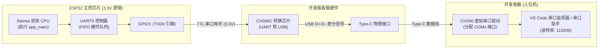
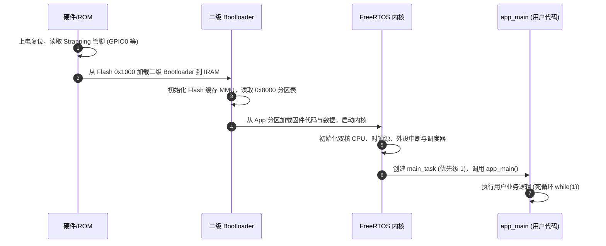
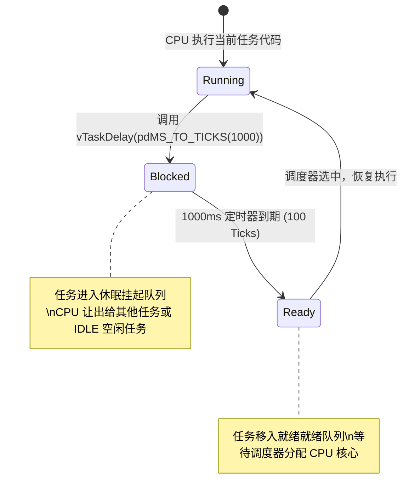

# 第 01 章：串口通信与 Hello World 深度剖析（大师级进阶精讲）

> **本章导读**：在桌面软件开发中，`printf("Hello, World!\n")` 往往只是几行平淡无奇的代码；但在嵌入式系统与单片机底层开发中，“让电脑屏幕打印出第一行文字”意味着芯片供电建立、时钟晶振起振、Bootloader 引导成功、FreeRTOS 内核就绪、UART 串口控制器配置无误以及 USB 转串口芯片链路完全打通。
> 本章将以**出版级教材标准**，从**硬件物理层、芯片启动流程、C语言内存模型、CMake构建系统、ESP-IDF日志架构到FreeRTOS内核多任务调度**进行全方位的深度拆解，为你铺平整个嵌入式开发的底层认知基石。

---

## 1.1 实验目标与知识全景地图

```
                    ┌────────────────────────────────────────────────────────┐
                    │               第 01 章 核心知识全景图                    │
                    └────────────────────────────────────────────────────────┘
                                                │
         ┌──────────────────┬───────────────────┼───────────────────┬──────────────────┐
         ▼                  ▼                   ▼                   ▼                  ▼
  【硬件物理链路】    【芯片启动全流程】    【构建系统与依赖】    【C语法与内存模型】   【FreeRTOS调度内核】
  · TTL电平与波形     · 一级ROM Bootloader · CMake积木式架构   · Flash与SRAM分段     · 任务状态机与TCB
  · 115200波特率时序  · 二级Flash引导      · REQUIRES机制      · const/.rodata优化   · SysTick节拍中断
  · UART FIFO硬件队列 · FreeRTOS主任务创建 · 依赖项防循环引用  · 跨平台PRIu32标准   · 看门狗(WDT)工作机制
```

完成本章学习后，你将能够：
1. **洞悉启动全貌**：清晰阐述 ESP32 从上电复位向量（Reset Vector）到执行 `app_main()` 的三个阶段。
2. **理解底层存储**：搞懂只读数据段（`.rodata`）、代码段（`.text`）、数据段（`.data`）、未初始化段（`.bss`）与堆栈（Heap/Stack）的物理分布。
3. **掌握工程规范**：熟练运用 CMake 组件依赖关系、ANSI 终端转义色彩、ESP-IDF 5 级日志过滤与宏机制。
4. **精通多任务原理**：深刻理解 FreeRTOS 时间片轮转、Tick 节拍中断、任务让出机制及看门狗防死锁机制。

---

## 1.2 硬件物理链路与微观时序通信原理

### 1. 硬件连接拓扑图

在 ESP32 上执行串口输出的底层硬件拓扑如下：



### 2. 什么是 TTL 串口？微观时间线与波形解密

串口通信（UART，通用异步收发器）是**异步串行**通信：
* **串行**：数据是一位一位（Bit by Bit）按时间顺序先后在同一根信号线上发送的；
* **异步**：发送方和接收方之间没有专门的时钟同步线（CLK），完全依赖双方约定好的**波特率（Baud Rate）**进行采样。

一个标准串口数据帧（`115200, 8, N, 1`）在示波器上的微观波形如下：

```
       空闲 (高电平 3.3V)
───────┐                                                     ┌──────── 空闲
       │ 起始位 │ D0  │ D1  │ D2  │ D3  │ D4  │ D5  │ D6  │ D7  │ 停止位 │
       │ (0V)   │ LSB │     │     │     │     │     │     │ MSB │ (3.3V) │
       └────────┴─────┴─────┴─────┴─────┴─────┴─────┴─────┴─────┴────────┘
       ▲                                                        ▲
       │                                                        │
    下跳沿触发采样                                          结束标志
```

#### 关键时序计算：
* **波特率 115200 bps** 的物理含义：每秒传输 115200 个二进制位。
* **每一位（Bit）的持续时间（$T_{\text{bit}}$）**：
  $$T_{\text{bit}} = \frac{1}{115200\text{ s}} \approx 8.68\ \mu\text{s} \text{（微秒）}$$
* **传输 1 个字符字节（Byte）的耗时**：
  1 帧 = 1 起始位 + 8 数据位 + 0 校验位 + 1 停止位 = 10 位。
  $$T_{\text{byte}} = 10 \times 8.68\ \mu\text{s} \approx 86.8\ \mu\text{s}$$
  *这意味着单片机发送 1000 个字节的日志，纯硬件耗时约 86.8 毫秒。*

---

## 1.3 ESP32 芯片启动三步曲（从硬件复位到 `app_main`）

当你按下开发板上的 **RESET 按键** 或给单片机上电时，芯片内部发生了一系列精密的引导流程：



### 阶段 1：一级引导（First-stage Bootloader / ROM Code）
* **存储位置**：固化在 ESP32 芯片出厂时的内部只读掩膜 ROM 中（不可更改）。
* **执行任务**：
  1. 上电后，CPU 从复位向量地址 `0x40000400` 启动；
  2. 读取芯片的 **Strapping 管脚**（特别是 `GPIO0`、`GPIO2`）：
     * 若 `GPIO0` 为低电平，进入 **UART 串口下载模式**（等待电脑烧录固件）；
     * 若 `GPIO0` 为高电平，进入 **SPI Flash 引导运行模式**；
  3. 从外部 Flash 的起始地址 `0x1000` 处读取二级 Bootloader 并加载到内部 SRAM 中执行。

### 阶段 2：二级引导（Second-stage Bootloader）
* **存储位置**：Flash 分区偏移 `0x1000` 处（由 ESP-IDF 编译生成）。
* **执行任务**：
  1. 读取 Flash 偏移 `0x8000` 处的**分区表（Partition Table）**；
  2. 寻找标记为 `app` 类型的固件分区；
  3. 配置外部 SPI Flash 的 MMU 映射与缓存（Cache），使得 CPU 能够像访问普通内存一样直接以 XIP（原地执行）方式执行 Flash 中的代码；
  4. 校验应用程序固件头部信息，然后跳转到应用程序入口。

### 阶段 3：FreeRTOS 初始化与 `app_main` 诞生
1. 执行 C 运行时初始化：将全局变量的初值从 Flash 复制到 SRAM 的 `.data` 段，将未初始化段 `.bss` 清零，调用全局构造函数；
2. 初始化 PRO_CPU（核心0）和 APP_CPU（核心1）的双核对称多处理（SMP）调度环境；
3. 初始化默认的 UART0 驱动作为标准输入输出终端（`stdin`/`stdout`）；
4. 创建名为 **`main_task`** 的 FreeRTOS 主任务（默认优先级为 1，任务栈大小约 3.5 KB），并由该任务正式调用用户的 **`app_main()`** 函数！

---

## 1.4 完整源码逐行深度精析

当前关卡的完整源码位于 [`main/app_main.c`](../main/app_main.c)：

```c
/**
 * ============================================================================
 * 关卡 1：串口通信与 Hello World 打印
 * ============================================================================
 */

#include <stdio.h>               // C 标准输入输出库 (提供 printf 等)
#include <inttypes.h>            // C99 标准整型跨平台打印宏 (提供 PRIu32 等)
#include "freertos/FreeRTOS.h"   // FreeRTOS 基础操作系统配置头文件
#include "freertos/task.h"       // FreeRTOS 任务调度管理 API (提供 vTaskDelay 等)
#include "esp_log.h"             // ESP-IDF 专业日志系统 (提供 ESP_LOGI 等)
#include "esp_system.h"          // ESP 系统核心管理库 (提供 esp_get_free_heap_size 等)
#include "esp_chip_info.h"       // 芯片基础硬件信息库 (提供 esp_chip_info 等)
#include "esp_flash.h"           // Flash 存储操作管理库 (提供 esp_flash_get_size 等)

// 1. 定义当前模块的私有日志标签 TAG
static const char *TAG = "LEVEL_1_HELLO";

void app_main(void)
{
    // 2. 打印带色彩高亮的启动横幅
    ESP_LOGI(TAG, "==================================================");
    ESP_LOGI(TAG, "       🎉 恭喜！ESP32 关卡 1 启动成功！          ");
    ESP_LOGI(TAG, "==================================================");

    // 3. 动态获取并打印当前芯片的基础硬件参数
    esp_chip_info_t chip_info;
    uint32_t flash_size;
    
    // 传入结构体变量的内存地址，函数内部将硬件数据写入结构体
    esp_chip_info(&chip_info);

    ESP_LOGI(TAG, "【硬件信息】CPU 核心数: %d 核", chip_info.cores);
    ESP_LOGI(TAG, "【硬件信息】芯片版本 (Revision): v%d", chip_info.revision);
    
    // 利用位掩码 (Bitmask) 按位与判断是否具备对应硬件无线功能
    ESP_LOGI(TAG, "【硬件信息】无线特性: %s%s",
             (chip_info.features & CHIP_FEATURE_WIFI_BGN) ? "2.4GHz Wi-Fi " : "",
             (chip_info.features & CHIP_FEATURE_BT) ? "+ 经典蓝牙/BLE" : "");

    // 4. 读取 Flash 存储物理容量，严格校验返回值是否等于 ESP_OK
    if (esp_flash_get_size(NULL, &flash_size) == ESP_OK) {
        ESP_LOGI(TAG, "【硬件信息】板载 Flash 大小: %" PRIu32 " MB", flash_size / (1024 * 1024));
    }

    ESP_LOGI(TAG, "--------------------------------------------------");
    ESP_LOGI(TAG, "开始进入主循环，每秒打印一次心跳...");

    int count = 0;

    // 5. 嵌入式主死循环 (Super Loop)
    while (1) {
        count++;

        // 获取当前系统内部 SRAM 剩余可用堆内存 (单位: 字节)
        uint32_t free_heap = esp_get_free_heap_size();

        // 使用 ESP_LOGI 输出结构化日志
        ESP_LOGI(TAG, "[#%04d] Hello ESP32! 当前空闲内存: %" PRIu32 " 字节", count, free_heap);

        // 使用裸 printf 对比输出体验
        printf("       -> 来自 printf 的问候: 距离开机运行已过去 %d 秒\n", count);

        // 阻塞当前任务 1000 毫秒，将 CPU 算力主动释放给系统调度器
        vTaskDelay(pdMS_TO_TICKS(1000));
    }
}
```

---

## 1.5 核心知识点全景深度剖析

---

### 知识点一：C 语言在嵌入式内存模型中的分布（Flash vs SRAM）

在电脑开发中，很多初学者不在乎内存分配在哪；但在单片机中，**内存分为外部 SPI Flash（8MB，容量大但速度慢）与内部 SRAM（520KB，极速但容量珍贵）**。

C 语言编译后的典型内存分段模型如下：

```
┌──────────────────────────────────────────────────────────────┐
│                    Flash 外部只读存储区                      │
├──────────────────────────────┬───────────────────────────────┤
│  .text 段 (代码段)           │  存放所有函数编译后的机器指令 │
├──────────────────────────────┼───────────────────────────────┤
│  .rodata 段 (只读数据段)     │  存放 const 常量与字符串常量  │
└──────────────────────────────┴───────────────────────────────┘
                                ▲
                                │ XIP (原地执行 / 高速 Cache 映射)
                                ▼
┌──────────────────────────────────────────────────────────────┐
│                    SRAM 片内运行内存区                       │
├──────────────────────────────┬───────────────────────────────┤
│  .data 段 (已初始化数据段)   │  存放有初始值的全局/静态变量  │
├──────────────────────────────┼───────────────────────────────┤
│  .bss 段 (未初始化数据段)    │  存放未初始化的全局/静态变量  │
├──────────────────────────────┼───────────────────────────────┤
│  Heap (堆内存区)             │  malloc / 动态内存申请区      │
├──────────────────────────────┼───────────────────────────────┤
│  Stack (栈内存区)            │  局部变量 / 函数调用上下文    │
└──────────────────────────────┴───────────────────────────────┘
```

#### 为什么写 `static const char *TAG = "LEVEL_1_HELLO";`？
1. **`const` 的内存收益**：
   * 如果不加 `const`，编译器会认为这是一个可修改的字符数组，会在单片机启动时把字符串拷贝进 **SRAM**，白白消耗珍贵的片上内存；
   * 加上 `const` 后，编译器明确知道该内容永不修改，将其直接保存在 Flash 的 **`.rodata` 段** 中，**零占用 SRAM 内存**！
2. **`static` 的作用域保护**：
   * 在 C 语言中，没有加 `static` 的全局变量默认拥有“外部链接属性（External Linkage）”；
   * 如果你在 `app_main.c` 中定义了 `TAG`，而未来在 `sensor.c` 中也定义了 `TAG`，链接器在合并生成最终固件时会直接报错：`multiple definition of 'TAG'`；
   * 加上 `static` 限制了符号只在当前源文件可见，实现了代码模块的封装隔离。

---

### 知识点二：CMake 构建系统与 ESP-IDF 组件模型

ESP-IDF 抛弃了传统单片机古老的 Makefile，全面拥抱现代 CMake 体系。

```
项目根目录/
├── CMakeLists.txt              <-- [项目级构建入口] 声明 project()
└── main/
    ├── CMakeLists.txt          <-- [组件级注册脚本] idf_component_register()
    └── app_main.c              <-- 源码
```

#### `main/CMakeLists.txt` 的解析机制：
```cmake
idf_component_register(
    SRCS "app_main.c"
    INCLUDE_DIRS "."
    REQUIRES driver esp_timer esp_psram spi_flash
)
```
* **`SRCS`**：指定该组件参与编译的源文件列表。
* **`INCLUDE_DIRS`**：指定头文件的公开搜索路径（`.` 表示当前目录）。
* **`REQUIRES` vs `PRIV_REQUIRES`（依赖声明）**：
  * **`REQUIRES`（公共依赖）**：当前组件对外公开的头文件（`.h`）中如果包含了其他组件的头文件，必须使用 `REQUIRES`，这样依赖当前组件的上层模块也能自动获得该依赖；
  * **`PRIV_REQUIRES`（私有依赖）**：仅在当前组件的源文件（`.c`）内部使用的头文件，可以使用 `PRIV_REQUIRES`。
  * *我们在第一关中使用了 `#include "esp_flash.h"`，因此必须声明依赖 `spi_flash` 组件，否则构建系统不会传递该组件的头文件包含路径与链接库。*

---

### 知识点三：ESP-IDF 专业日志系统底层机制

#### 1. 五级日志架构与色彩控制（ANSI Escape Codes）
终端里的彩色文字并不是神秘魔法，而是利用了 **ANSI 终端转义序列**。当 ESP-IDF 输出 `\033[0;32m` 时，串口终端识别到该控制字符就会将后续文字渲染为绿色，输出 `\033[0m` 则重置为默认颜色。

| 宏名称 | 日志级别 | 默认颜色 | 内部 ANSI 编码 | 适用场景 |
| :--- | :--- | :--- | :--- | :--- |
| **`ESP_LOGE`** | Error (错误) | 🔴 红色 | `\033[0;31m` | 致命异常、外设初始化失败、内存耗尽 |
| **`ESP_LOGW`** | Warn (警告) | 🟡 黄色 | `\033[0;33m` | 可恢复异常、通信重试、参数超限 |
| **`ESP_LOGI`** | Info (信息) | 🟢 绿色 | `\033[0;32m` | 业务关键状态切换、版本展示、开机成功 |
| **`ESP_LOGD`** | Debug (调试) | ⚪ 白色 | `\033[0;37m` | 协议数据包细节、算法中间计算过程 |
| **`ESP_LOGV`** | Verbose (冗余) | 🔘 灰色 | `\033[0;38m` | 最底层硬件寄存器读写流水（海量数据） |

#### 2. 编译期零成本裁剪（Zero-Cost Filtering）
在产品发布（Release）固件中，如果不需要 Debug 或 Verbose 日志，可以在 `menuconfig` 中将全局日志级别设置为 `Info`。
此时所有 `ESP_LOGD` 和 `ESP_LOGV` 宏在预编译阶段会被**直接替换为空指令**：
* 既不产生任何汇编代码；
* 也不占用任何 Flash 存储和字符串空间；
* 运行速度达到极致，零性能损耗。

#### 3. 为什么多任务同时打印不会乱字？（线程安全）
如果在多个不同的 FreeRTOS 任务中同时调用 `printf`，字符可能会交织在一起（例如 `HeHelloll`）。
而 `ESP_LOG` 宏在底层实现中使用了 **互斥锁（Mutex）**，确保一条日志在输出完毕前，其他任务的打印请求必须排队等待，保证了日志的原子性与整洁性。

---

### 知识点四：系统 API 深入与位运算特性检测

#### 1. 结构体与指针传参（Pass by Reference）
```c
esp_chip_info_t chip_info;
esp_chip_info(&chip_info);
```
* 在 C 语言中，普通的形参传递是**值传递（复制一份内存）**。若函数想要修改调用者定义的变量，必须传入该变量的**内存物理地址（`&chip_info`）**。
* `esp_chip_info()` 内部声明为 `void esp_chip_info(esp_chip_info_t *out_info)`，通过解引用指针 `out_info->cores = 2` 将硬件寄存器探测出的数据直接写入外部变量。

#### 2. 位运算与特性掩码（Bitmask Operations）
在 `esp_chip_info_t` 中，芯片的功能特性被压缩在一个 32 位的整型 `features` 字段中：
```c
#define CHIP_FEATURE_WIFI_BGN (1 << 0)  // 第0位为1: 00000000000000000000000000000001
#define CHIP_FEATURE_BLE      (1 << 1)  // 第1位为1: 00000000000000000000000000000010
#define CHIP_FEATURE_BT       (1 << 4)  // 第4位为1: 00000000000000000000000100000000
```
* **按位与检测原理**：
  ```text
    features:            00000000 00000000 00000001 00000001  (支持Wi-Fi和经典BT)
  & CHIP_FEATURE_WIFI:   00000000 00000000 00000000 00000001
  -------------------------------------------------------------
    结果:                00000000 00000000 00000000 00000001  (非零，条件为真！)
  ```
  *这种位掩码设计在操作系统和硬件驱动开发中无处不在，是高效节省内存的典范。*

#### 3. 堆内存监控与内存泄漏（Memory Leak）
* 单片机没有操作系统的“虚拟内存扩展”和“页面置换机制”。内部 SRAM 一旦被分配耗尽，后续的 `malloc()` 会直接返回 `NULL`。
* 在主循环中每秒输出 `esp_get_free_heap_size()`，如果发现该数值随着时间单调递减，说明程序中存在**申请了内存但未调用 `free()` 释放的内存泄漏 Bug**。

---

### 知识点五：FreeRTOS 多任务内核调度与延时机制

```c
while (1) {
    // 主循环任务逻辑...
    vTaskDelay(pdMS_TO_TICKS(1000));
}
```

#### 1. 为什么绝对禁止使用 `for (int i=0; i<1000000; i++);` 空循环？
在传统单片机裸机开发中，很多人习惯用空循环延时。在 ESP32 + FreeRTOS 架构下这是**极其严重的禁忌**：
1. **能耗与发热**：CPU 双核以 240MHz 的满血频率狂飙执行无效跳转指令，功耗飙升至 100mA 以上，芯片急剧发热；
2. **多任务饥饿（Task Starvation）**：ESP32 是双核多任务系统，后台需要实时处理 Wi-Fi 协议栈、蓝牙射频、TCP/IP 数据收发。空循环独占 CPU 核心，导致后台高优先级任务被活活“饿死”；
3. **触发看门狗复位（Watchdog Timer Reset）**：
   * ESP-IDF 默认启用了 **任务看门狗（Task WDT，默认超时阈值为 300ms ~ 800ms）**；
   * 如果看门狗发现当前 CPU 核心运行的任务连续几百毫秒没有产生任务调度，也没有喂狗（Feed Watchdog），看门狗会判定系统死锁崩溃，**直接强制拉低硬件复位引脚使单片机重启（Panic: Task watchdog got triggered）**！

#### 2. `vTaskDelay()` 的底层状态机流转

* **主动让出 CPU**：调用 `vTaskDelay()` 后，任务立即被移出就绪链表，进入阻塞休眠链表，CPU 核心自动切换去执行其他就绪任务或系统的**空闲任务（IDLE Task）**。在空闲任务中，CPU 可以进入动态休眠降低功耗。

#### 3. 系统节拍 Tick 与换算公式
* FreeRTOS 的时间计量单位是 **Tick（节拍）**。硬件定时器每隔固定周期产生一次时钟中断（SysTick Interrupt），驱动内核节拍计数器递增。
* 在当前工程的配置中，系统时钟节拍频率为 `CONFIG_FREERTOS_HZ = 100`（即每秒 100 次时钟中断）：
  $$\text{1 个 Tick 的物理时间} = \frac{1\text{ 秒}}{100} = 10\text{ 毫秒 (ms)}$$
* **`pdMS_TO_TICKS()` 宏的计算展开**：
  $$\text{目标 Ticks} = \frac{\text{目标时间 (ms)} \times \text{CONFIG\_FREERTOS\_HZ}}{1000} = \frac{1000 \times 100}{1000} = 100\text{ Ticks}$$

---

## 1.6 实验排错与高频故障定位手册（Troubleshooting）

| 故障现象 | 底层根因分析 | 标准排查步骤与解决方案 |
| :--- | :--- | :--- |
| **电脑设备管理器无任何 COM 端口显示** | 1. 使用了不带数据传输能力的“纯充电线”；<br>2. 电脑缺少 WCH CH340 虚拟串口驱动。 | 1. 换用随手机附带的标准 4 芯/全功能 Type-C 数据线；<br>2. 重新安装官方 CH340 驱动，插拔确认设备管理器出现 `COMx`。 |
| **烧录时反复提示 `A fatal error occurred: Failed to connect to ESP32: Timed out`** | 自动下载电路的三极管未能在复位瞬间成功将 GPIO0 拉低至低电平。 | 硬件手动进入 Bootloader 模式：按住板载 **BOOT 键（SW2）** 不放，轻按一次 **RESET 键（SW1）** 松开，再松开 BOOT 键，然后点击烧录。 |
| **串口监视器输出内容全部为乱码（如 `▒▒`）** | 终端波特率与 ESP32 UART0 硬件寄存器波特率设置不一致。 | 确保 VS Code 底部状态栏或串口监视器波特率统一设置为 **`115200`**。 |
| **程序运行几秒后突然报错 `Task watchdog got triggered on CPU 0` 并重启** | 代码在 `while(1)` 中执行了耗时计算或死循环，未调用 `vTaskDelay`。 | 检查所有死循环和长任务逻辑，确保周期性调用 `vTaskDelay(pdMS_TO_TICKS(10))` 释放 CPU 调度权。 |

---

## 1.7 课后动手实验与挑战思考题

为帮助读者深度内化本章所学，请完成以下进阶动手实验：

### 🎯 动手实验 1：炫彩 ASCII Art 终端问候语
* **实验任务**：利用 ANSI Escape Code 转义字符，修改 `app_main()`，在开机时打印一段带有不同颜色渐变（红、绿、黄、蓝、紫、青）的大型字符艺术字（ASCII Art），并观察在串口监视器中的炫彩视觉呈现。

### 🎯 动手实验 2：多任务双核并行打印
* **实验任务**：使用 FreeRTOS 的 `xTaskCreatePinnedToCore()` 创建一个新任务，分别让 `app_main` 运行在 Core 0，新任务运行在 Core 1，两个任务以不同的延时周期（如 500ms 和 1200ms）向串口打印日志，观察双核独立并发运行的时序交错现象。

### 🧠 进阶思考题
1. **思考题 A**：如果我们在 `app_main` 中调用了 `malloc(1024 * 1024)` 尝试申请 1MB 内存，为什么片上 SRAM 会申请失败？应该使用什么函数才能申请到板载的 2MB PSRAM 扩展内存？*(提示：`heap_caps_malloc`)*
2. **思考题 B**：如果把 FreeRTOS 的 `CONFIG_FREERTOS_HZ` 从 100 改为 1000，`pdMS_TO_TICKS(10)` 的计算结果会发生什么改变？系统的定时精度与 CPU 调度开销会产生怎样的权衡（Trade-off）？
