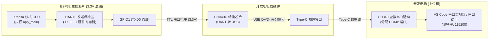

# 第 01 章：串口通信与 Hello World 深度剖析

> **本章导读**：在桌面软件开发中，`printf("Hello, World!\n")` 往往只是几行简单的代码；但在嵌入式系统与单片机开发中，“让电脑屏幕打印出第一行文字”意味着芯片供电建立、时钟晶振起振、Bootloader 引导成功、FreeRTOS 内核就绪、UART 串口控制器配置无误以及 USB 转串口芯片链路完全打通。本章将以显微镜级的视角，深度剖析这一看似简单却至关重要的基石程序，带你彻底搞懂背后的语法、架构、内存分配与操作系统机制。

---

## 1.1 实验目标与学习收获

完成本章学习后，你将掌握：
1. **启动与入口机制**：理解 ESP-IDF 底层启动过程，以及 `void app_main(void)` 与桌面 C 语言 `int main()` 的根本区别。
2. **构建与依赖系统**：掌握 ESP-IDF 的“积木式”组件化管理体系，搞懂 `#include` 引用规则与 `CMakeLists.txt` 中的 `REQUIRES` 依赖声明。
3. **C 语言嵌入式修饰符**：理解 `static`、`const` 在嵌入式内存分布（Flash 与 RAM）中的核心作用，以及 `%" PRIu32 "` 跨平台格式化输出原理。
4. **工业级日志系统**：熟练运用 ESP-IDF 标准日志宏（`ESP_LOGI`、`ESP_LOGE`、`ESP_LOGW` 等）替代裸 `printf`，掌握时间戳、标签过滤与日志级别配置。
5. **系统 API 与底层指针**：理解结构体地址传参（`&chip_info`）、位掩码（Bitmask）特性检测、`esp_err_t` 工业级错误码机制与 SRAM 堆内存（Heap）健康监控。
6. **FreeRTOS 调度与延时原理**：深刻理解 `while(1)` 死循环的必要性、系统节拍（Tick）、`pdMS_TO_TICKS()` 换算公式，以及**为何绝对禁止空循环死等（防止触发看门狗 WDT 复位）**。

---

## 1.2 硬件链路与通信原理

在 ESP32 上执行串口输出的底层硬件链路如下图所示：



### 通信核心参数
* **电平标准**：TTL 数字电平（高电平为 3.3V，低电平为 0V）。
* **波特率 (Baud Rate)**：**115200 bps**（即每秒传输 115200 个二进制位）。
* **帧格式**：`115200, 8, N, 1`（8 位数据位，无奇偶校验位 No Parity，1 位停止位）。

---

## 1.3 完整关卡源码精析

当前关卡的完整源码位于工程根目录下的 [`main/app_main.c`](../main/app_main.c)：

```c
/**
 * ============================================================================
 * 关卡 1：串口通信与 Hello World 打印
 * ============================================================================
 * 
 * 学习目标：
 * 1. 理解 ESP32 程序的入口函数 app_main()。
 * 2. 掌握使用 printf() 和 ESP_LOGI() 向电脑串口打印调试日志。
 * 3. 理解 FreeRTOS 的任务延时函数 vTaskDelay() 与死循环 (while(1))。
 * 4. 读取当前芯片的基础运行信息（CPU 核心、主频、剩余内存）。
 * ============================================================================
 */

#include <stdio.h>
#include <inttypes.h>
#include "freertos/FreeRTOS.h"
#include "freertos/task.h"
#include "esp_log.h"
#include "esp_system.h"
#include "esp_chip_info.h"
#include "esp_flash.h"

// 1. 定义当前模块私有的日志标签 TAG，用于标识日志来源
static const char *TAG = "LEVEL_1_HELLO";

void app_main(void)
{
    // 2. 打印带色彩高亮的标题横幅
    ESP_LOGI(TAG, "==================================================");
    ESP_LOGI(TAG, "       🎉 恭喜！ESP32 关卡 1 启动成功！          ");
    ESP_LOGI(TAG, "==================================================");

    // 3. 动态获取并打印当前芯片硬件参数
    esp_chip_info_t chip_info;
    uint32_t flash_size;
    esp_chip_info(&chip_info);

    ESP_LOGI(TAG, "【硬件信息】CPU 核心数: %d 核", chip_info.cores);
    ESP_LOGI(TAG, "【硬件信息】芯片版本 (Revision): v%d", chip_info.revision);
    ESP_LOGI(TAG, "【硬件信息】无线特性: %s%s",
             (chip_info.features & CHIP_FEATURE_WIFI_BGN) ? "2.4GHz Wi-Fi " : "",
             (chip_info.features & CHIP_FEATURE_BT) ? "+ 经典蓝牙/BLE" : "");

    // 4. 读取 Flash 存储容量（带错误码检查）
    if (esp_flash_get_size(NULL, &flash_size) == ESP_OK) {
        ESP_LOGI(TAG, "【硬件信息】板载 Flash 大小: %" PRIu32 " MB", flash_size / (1024 * 1024));
    }

    ESP_LOGI(TAG, "--------------------------------------------------");
    ESP_LOGI(TAG, "开始进入主循环，每秒打印一次心跳...");

    int count = 0;

    // 5. 嵌入式主死循环
    while (1) {
        count++;

        // 获取当前系统剩余可用堆内存 (SRAM)
        uint32_t free_heap = esp_get_free_heap_size();

        // 打印带计数和内存信息的日志
        ESP_LOGI(TAG, "[#%04d] Hello ESP32! 当前空闲内存: %" PRIu32 " 字节", count, free_heap);

        // 使用标准 printf 对比输出
        printf("       -> 来自 printf 的问候: 距离开机运行已过去 %d 秒\n", count);

        // 延时 1000 毫秒 (1 秒)
        vTaskDelay(pdMS_TO_TICKS(1000));
    }
}
```

---

## 1.4 深度知识点全景剖析

```
知识全景地图：
[一、头文件与组件依赖] ──► [二、C 语言语法与类型细节] ──► [三、ESP-IDF 专业日志系统]
                                                                        │
[六、工程设置与自测思考] ◄─── [五、FreeRTOS 调度与延时原理] ◄─── [四、系统级 API 与内存监控]
```

---

### 知识点一：头文件引用规则与 CMake 组件依赖机制

#### 1. 为什么有的头文件用 `< >`，有的用 `" "`？
```c
#include <stdio.h>               // 系统/标准 C 库头文件，用尖括号 < >
#include <inttypes.h>
#include "freertos/FreeRTOS.h"   // 项目/组件提供的头文件，用双引号 ""
#include "esp_log.h"
#include "esp_chip_info.h"
#include "esp_flash.h"
```
* **`<stdio.h>` 与 `<inttypes.h>`**：属于 **C 语言标准库（Toolchain Libc）**，编译器直接从交叉编译工具链的系统内置目录中寻找。
* **`"freertos/..."` 与 `"esp_..."`**：属于 **ESP-IDF 框架各组件（Components）** 提供的头文件。使用双引号让编译器在当前工程及所有引入的 IDF 组件目录中进行搜索。

#### 2. 为什么在 `main/CMakeLists.txt` 里必须显式声明 `REQUIRES`？
我们在初次编译时曾遇到报错：`fatal error: esp_flash.h: No such file or directory`。在 `main/CMakeLists.txt` 中添加 `spi_flash` 后解决：
```cmake
idf_component_register(
    SRCS "app_main.c"
    INCLUDE_DIRS "."
    REQUIRES driver esp_timer esp_psram spi_flash
)
```
* **ESP-IDF 的“积木式”组件架构**：
  ESP-IDF 由数十个高度解耦的独立组件（Wi-Fi、蓝牙、文件系统、驱动库等）构成。为了大幅加快编译速度并保证最终生成的固件（`.bin`）体积尽可能小，**哪个模块需要用到其他组件的头文件和功能，就必须在 `REQUIRES`（或 `PRIV_REQUIRES`）后面显式声明依赖**。
  * 用到 GPIO 控制（`gpio_...`） $\rightarrow$ 声明 `driver`
  * 用到硬件定时器（`esp_timer_...`） $\rightarrow$ 声明 `esp_timer`
  * 用到 PSRAM 内存管理 $\rightarrow$ 声明 `esp_psram`
  * 用到 Flash 存储读取（`esp_flash_...`） $\rightarrow$ 声明 `spi_flash`

---

### 知识点二：关键 C 语言语法与类型细节

#### 1. `static const char *TAG = "LEVEL_1_HELLO";`
* **`const`（常量修饰符）**：
  表明 `TAG` 指向的字符串内容是绝对只读的。编译器会把这个字符串存放在 Flash 存储器的**只读数据段（`.rodata` 段）**，而不会占用单片机极其宝贵的内部 RAM（SRAM）运行内存。
* **`static`（静态局部/文件作用域限定符）**：
  限定 `TAG` 变量的可见范围**仅限于当前 `app_main.c` 文件内部**。如果工程中其他 `.c` 文件（如 `wifi.c` 或 `sensor.c`）也定义了同名的 `TAG`，两者在链接时不会发生“符号重复定义（Multiple Definition）”的冲突。
* **TAG 的核心作用**：在串口日志的最前面作为模块标签，让你在海量日志中一眼辨别出该行日志来自于哪一个业务模块。

#### 2. `void app_main(void)` 与桌面开发 `int main()` 的区别
* **桌面程序（Windows/Linux）**：由操作系统的进程调度器启动。程序执行完毕后调用 `return 0;` 将退出状态码返回给操作系统，随后进程被操作系统回收销毁。
* **单片机程序（ESP-IDF）**：
  * 板子上没有传统意义上的上层操作系统进程管理器来接收退出码，因此返回值是 **`void`**。
  * 芯片上电后，硬件 ROM 中的一级引导程序（First-stage Bootloader）会加载 Flash 中的二级 Bootloader，随后初始化 CPU 运行环境与 FreeRTOS 调度器，并自动创建一个 FreeRTOS 主任务来调用 `app_main()` 作为用户逻辑的起点。

#### 3. 跨平台格式化输出占位符：`%" PRIu32 "` 的奥秘
在代码中打印 Flash 容量和空闲内存时，我们写成了：
```c
ESP_LOGI(TAG, "板载 Flash 大小: %" PRIu32 " MB", flash_size / (1024 * 1024));
```
* **为什么不直接写 `%d` 或 `%u`？**
  * 在不同的硬件架构（8位 AVR、16位 MSP430、32位 ARM/Xtensa、64位 x86_64）上，C 语言基础类型 `int`、`long` 占用的字节数可能完全不同。
  * `uint32_t` 严格表示“无符号 32 位整型（固定占用 4 字节）”。
  * 为了在不同编译器和平台之间实现无警告格式化输出，C99 标准在 `<inttypes.h>` 中引入了 `PRIu32` 宏（**PR**int **I**nt **u**nsigned **32**-bit）。
  * 预处理器在编译前会自动将其替换为当前平台最准确的占位符（例如在 32 位平台上替换为 `"u"`，在某些平台上替换为 `"lu"`），利用 C 语言的**字符串字面量自动拼接特性**（`"大小: %" "u" " MB"` 拼接为 `"大小: %u MB"`），保证了代码在任何架构下的严谨性与兼容性。

---

### 知识点三：ESP-IDF 专业日志系统（ESP_LOG 系列宏）

在正式的嵌入式工业开发中，**必须使用 `ESP_LOG` 宏替代裸 `printf`**。

#### 1. 五个日志级别对照表（按严重程度从高到低）
| 宏名称 | 级别英文 | 终端输出颜色 | 适用场景说明 |
| :--- | :--- | :--- | :--- |
| **`ESP_LOGE`** | **Error** (错误) | **🔴 红色** | 严重致命故障（如外设初始化失败、内存耗尽、传感器无应答） |
| **`ESP_LOGW`** | **Warn** (警告) | **🟡 黄色** | 异常情况但系统可容错继续（如通信超时正在重试、电压偏低） |
| **`ESP_LOGI`** | **Info** (信息) | **🟢 绿色** | 业务主流程状态打印（如开机成功、Wi-Fi连接成功、版本号展示） |
| **`ESP_LOGD`** | **Debug** (调试) | **⚪ 白色/普通** | 详细调试信息（如算法中间变量计算值、状态机流转） |
| **`ESP_LOGV`** | **Verbose** (冗余) | **🔘 灰色** | 最底层海量流水日志（如发送/接收到的每一个原始数据字节） |

#### 2. 解剖一行标准的 ESP-IDF 日志
```text
I (1360) LEVEL_1_HELLO: [#0001] Hello ESP32! 当前空闲内存: 298412 字节
│   │          │          └─ 实际打印的消息正文内容
│   │          └─ 模块私有标签 (TAG)
│   └─ 系统从开机/复位至今的运行时间戳 (单位: 毫秒 ms)
└─ 单字符日志级别标识 (I = Info, E = Error, W = Warn...)
```

#### 3. 日志系统的进阶特性
* **全局级别过滤**：在 `sdkconfig` 中可以设置默认日志级别（例如在 Release 生产固件中设置为 `Info` 级别，则代码中的所有 `ESP_LOGD` 和 `ESP_LOGV` 在编译时会被完全剔除，不占用 Flash 空间和串口带宽）。
* **动态模块过滤**：可以在代码中调用 `esp_log_level_set("LEVEL_1_HELLO", ESP_LOG_WARN)` 动态单独提高或降低某一个模块的输出级别。

---

### 知识点四：系统级 API、指针与内存监控

#### 1. 结构体传参为什么必须加取地址符 `&`？（指针初探）
```c
esp_chip_info_t chip_info;        // 1. 在栈上定义一个结构体变量
esp_chip_info(&chip_info);        // 2. 将变量的内存地址（&）传给函数
```
* `esp_chip_info_t` 是一个结构体，内部封装了 CPU 核心数、主频、芯片版本等多个属性。
* C 语言的函数调用默认是**“值传递（Pass by Value）”**，即传入的是变量的一份副本。如果直接传 `chip_info`，函数内部修改的只是副本，外部无法拿到结果。
* 通过传入 `&chip_info`（内存地址），`esp_chip_info()` 函数内部就能通过指针直接把硬件探测到的数据**写入到我们定义的这一块内存空间中**。

#### 2. 位掩码（Bitmask）与特性检测：`(features & CHIP_FEATURE_WIFI_BGN)`
```c
(chip_info.features & CHIP_FEATURE_WIFI_BGN) ? "2.4GHz Wi-Fi " : ""
```
* **为什么用位运算？**
  芯片支持的特性非常多（Wi-Fi、BLE、经典蓝牙、IEEE 802.15.4 等）。如果每个特性都用一个独立的 `bool` 变量表示，会浪费很多字节。
* 乐鑫将所有特性压缩到一个 32 位的整型变量 `features` 的不同二进制位（Bit）中：
  * 第 0 位 (bit 0)：`1` 代表支持 2.4G Wi-Fi (`CHIP_FEATURE_WIFI_BGN`)
  * 第 1 位 (bit 1)：`1` 代表支持低功耗蓝牙 BLE (`CHIP_FEATURE_BLE`)
  * 第 4 位 (bit 4)：`1` 代表支持经典蓝牙 (`CHIP_FEATURE_BT`)
* 使用 **按位与运算符 `&`**，只有当对应二进制位为 `1` 时结果才非零，从而极快地完成硬件特性检测。

#### 3. ESP-IDF 工业级错误处理机制：`esp_err_t` 与 `ESP_OK`
```c
if (esp_flash_get_size(NULL, &flash_size) == ESP_OK) {
    // 成功获取到 Flash 大小
}
```
* ESP-IDF 中超过 95% 的底层驱动函数都会返回一个统一的错误码类型 `esp_err_t`。
* **`ESP_OK`（宏定义为 `0`）** 代表操作成功执行；若返回值不为 0（如 `ESP_ERR_INVALID_ARG` 参数无效、`ESP_ERR_NO_MEM` 内存不足、`ESP_FAIL` 失败等），代表发生了异常。
* **开发黄金准则**：在工业级嵌入式代码中，**对关键函数的返回值检查是否等于 `ESP_OK` 是杜绝系统暗病的最重要习惯**。

#### 4. 系统堆内存（Heap）健康监控：`esp_get_free_heap_size()`
* **什么是堆内存（Heap）？**
  ESP32 片上集成了 520 KB SRAM。除去操作系统自身占用的内存外，剩下的动态可用内存称为“堆内存（Heap）”。所有通过 `malloc()`、FreeRTOS 任务创建、队列以及 Wi-Fi 通信缓冲申请的内存都来自这里。
* **为什么要监控它？**
  单片机没有虚拟内存或硬盘交换区（Swap），一旦发生**内存泄漏（Memory Leak，申请了但忘记释放）**，剩余的 Heap 空间会逐步减少至 0，导致系统直接崩溃死机（Panic）。在主循环中定期打印空闲内存，能让你随时洞察系统的“健康体征”。

---

### 知识点五：FreeRTOS 任务调度与延时原理

```c
while (1) {
    // 主循环任务逻辑...
    vTaskDelay(pdMS_TO_TICKS(1000));
}
```

#### 1. 为什么单片机必须在 `while (1)` 死循环中运行？
* 单片机作为专用嵌入式设备，从通电上电那一刻起就需要 7×24 小时不间断运行。
* 如果 `app_main` 执行到底退出了，FreeRTOS 的底层启动机制会把这个主任务自动从调度队列中删除销毁。

#### 2. 为什么绝对禁止使用 `for (int i=0; i<1000000; i++);` 空循环延时？
初学者在没有操作系统概念时常写空循环死等，但在 ESP-IDF + FreeRTOS 架构下这是**极其严重的错误**：
1. **CPU 霸占与能耗飙升**：在空循环期间，CPU 双核以 240MHz 的全速拼命执行无意义指令，芯片剧烈发热、功耗达到峰值。
2. **阻止后台任务调度**：ESP32 是双核多任务系统，后台运行着 Wi-Fi 协议栈、蓝牙协议栈、TCP/IP 数据包处理等重要系统任务。空循环会霸占 CPU，导致后台任务饿死。
3. **触发看门狗复位（Watchdog Timer Reset）**：ESP32 的看门狗定时器若监测到某个任务持续占用 CPU 超过预设时间（如 300ms~800ms）且没有产生任务调度，会判定系统死锁，**强制将芯片进行硬件复位重启（Guru Meditation Error / Task Watchdog Triggered）**。

#### 3. `vTaskDelay()` 与 `pdMS_TO_TICKS()` 的底层运行机制
* **`vTaskDelay()` 是“主动休眠让出 CPU”**：
  当调用 `vTaskDelay` 时，FreeRTOS 会把当前主任务的状态标记为 **Blocked（阻塞休眠）**，并**主动将 CPU 核心的使用权让给其他就绪任务或系统的空闲任务（IDLE Task）**，CPU 在空闲任务中甚至可以进入轻度睡眠降功耗。
* **什么是系统节拍（Tick）？**
  * FreeRTOS 的内核依靠硬件定时器产生固定频率的时钟中断，像心脏起搏一样滴答跳动，每一次中断跳动称为一个 **Tick**。
  * 在 ESP-IDF 的默认配置（`CONFIG_FREERTOS_HZ`）中，系统节拍频率是 **100 Hz**，即：
    $$\text{1 个 Tick 的时间周期} = \frac{1000\text{ ms}}{100} = 10\text{ ms}$$
* **`pdMS_TO_TICKS(1000)` 的换算公式**：
  $$\text{目标节拍数 (Ticks)} = \frac{\text{目标毫秒数 (ms)}}{\text{每个 Tick 的毫秒数}} = \frac{1000\text{ ms}}{10\text{ ms/tick}} = 100\text{ Ticks}$$
  这个宏负责把人类直观的“毫秒”精准换算成 FreeRTOS 内部识别的“节拍数”。

---

## 1.5 实验排错与常见问题排查（FAQ）

| 故障现象 | 潜在原因分析 | 标准解决方案 |
| :--- | :--- | :--- |
| **电脑设备管理器中完全看不到 COM 端口** | 1. 使用了仅用于充电的 2 芯 USB 线；<br>2. 电脑未安装 WCH CH340 USB 驱动。 | 1. 更换为能够传输数据的标准 Type-C 数据线；<br>2. 重新下载并安装官方 CH340 驱动程序。 |
| **烧录提示 `Timed out waiting for packet header`** | 自动下载电路受板载电容充放电影响未能自动拉低 GPIO0。 | 按住板载 **BOOT (SW2)** 键不放，短按一次 **RESET (SW1)** 键使芯片强制进入下载模式，再点击烧录。 |
| **打开串口监视器后全是乱码字符（如 ``）** | 终端波特率与代码中的波特率不匹配。 | 检查 VS Code 或串口助手的波特率设置，确认是否为标准的 **115200**。 |
| **板子运行几秒后突然打印一堆红色英文并自动重启** | 在死循环中使用了空循环死等或耗时阻塞操作，没有调用 `vTaskDelay`。 | 检查死循环体内是否包含了 `vTaskDelay(pdMS_TO_TICKS(...))` 释放 CPU。 |

---

## 1.6 课后动手实验与自测思考

为了巩固本章所学，建议读者在开发板上亲自动手完成以下 3 个小实验：

1. **实验 A（修改日志级别）**：
   将代码中的 `ESP_LOGI` 分别修改为 `ESP_LOGW` 和 `ESP_LOGE`，重新编译烧录，观察终端串口监视器输出文字颜色的变化（黄色与红色）。
2. **实验 B（调整系统心跳频率）**：
   将延时函数修改为 `vTaskDelay(pdMS_TO_TICKS(200))`（即每 200 毫秒打印一次），重新烧录，观察串口打印的刷新速度与开机计时器的变化。
3. **自测思考题**：
   * **问题 1**：为什么我们在 `static const char *TAG = "LEVEL_1_HELLO";` 前面要同时加上 `static` 和 `const`？它们分别保护了什么？
   * **问题 2**：如果一个 FreeRTOS 任务需要永久挂起等待某个特定事件唤醒（不再周期性执行但也不能被销毁），给 `vTaskDelay()` 传入什么参数最标准？*(提示：`portMAX_DELAY`)*
