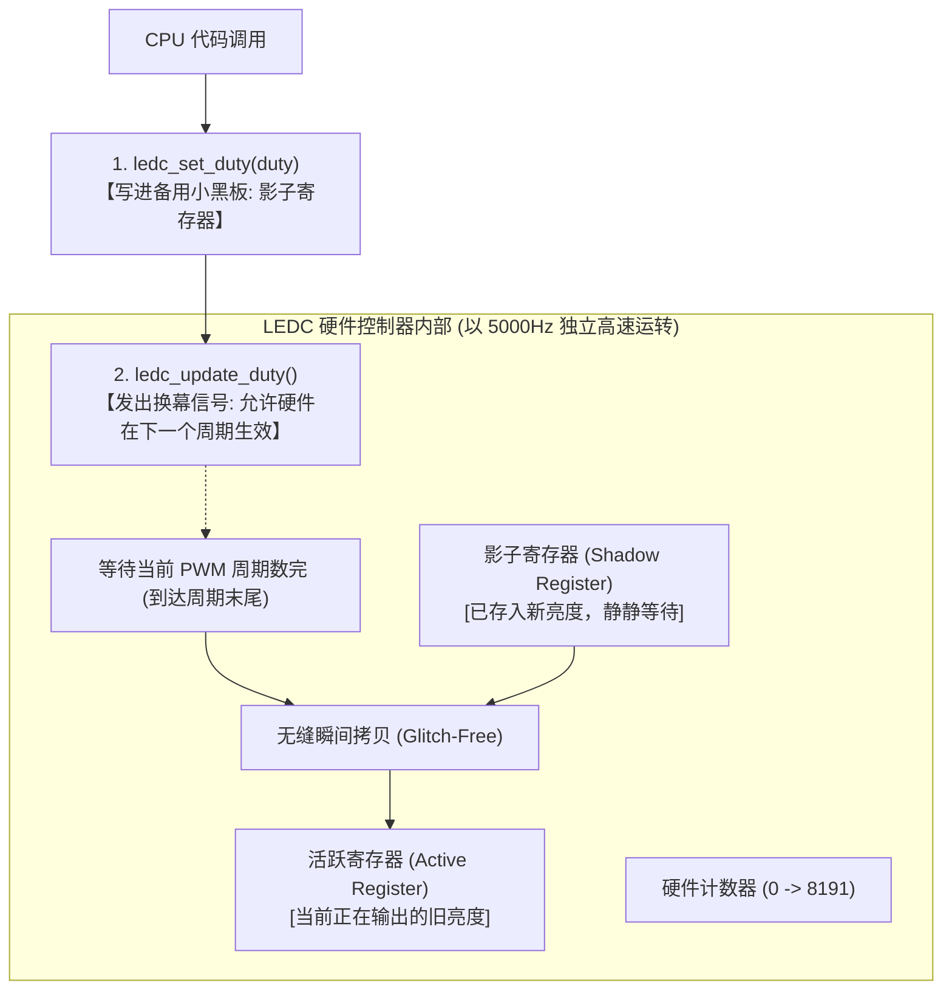

# 第 02 章：掌控电流的力量 —— ESP32 GPIO 数字输出与 PWM 呼吸灯

> **写在前面**：在第一章中，我们让单片机向电脑屏幕打印出了文字，实现了“虚拟世界”的数据交互。
> 
> 从这一章开始，我们将正式跨入**“物理世界”**—— 让代码控制芯片管脚释放真实的电流，去点亮开发板上的第一颗硬件蓝色 LED 灯，并进一步利用 PWM（脉冲宽度调制）技术，让灯光如呼吸般优雅地渐亮渐暗！

---

## 2.1 什么是 GPIO？（单片机的手和脚）

**GPIO** 全称是 *General Purpose Input / Output*（**通用输入输出引脚**）。

如果把 ESP32 芯片比作一个人的大脑，那么 GPIO 引脚就是它的**“手”和“脚”**：
* **作为输出（Output，本章内容）**：大脑命令引脚输出 **3.3V 高电平（相当于打开开关供电）** 或 **0V 低电平（相当于关闭开关断电）**，去控制 LED 点亮、蜂鸣器发声、电机旋转；
* **作为输入（Input，下一章内容）**：引脚用来感知外界电平，检测按键有没有被按下、红外传感器有没有探测到人。

---

## 2.2 🗺️ 手把手教小白看懂人生第一张电路原理图

很多初学者一看到电路图就头大，其实单片机外围电路就像“水流管道”一样简单。

在本项目配套的完整电路图文件 [`docs/ESP32开发板原理图1.1.pdf`](../docs/ESP32开发板原理图1.1.pdf) 中，我们截取出了这颗受控蓝色 LED 的真实电路结构：

```
                    【板载受控蓝色 LED2 电路原理图】

   ESP32 单片机
  ┌──────────────┐          R26 (1kΩ)                LED2 (蓝色灯)          GND (0V 地线)
  │              │        ┌───────────┐                 ┌──┐
  │   GPIO27     ├────────┤ 1000 欧姆 ├───────────▷|────┤  ├─────────────┸ (接地)
  │ (代码控制端) │        └───────────┘                └──┘
  └──────────────┘           [限流电阻]             [发光二极管]
       3.3V / 0V                                  (电流只能单向流过)
```

### 🔍 认识电路图中的 4 个核心符号：

#### 1. 信号源：`GPIO27`（电源总阀门）
* 这是 ESP32 芯片伸出来的一根金属引脚。
* 当代码执行 `gpio_set_level(LED_PIN, 1)` 时，芯片内部把这根引脚连通到 **3.3V 电源**（开闸放水）；
* 当代码执行 `gpio_set_level(LED_PIN, 0)` 时，芯片内部把这根引脚连通到 **0V**（关闸断水）。

#### 2. 限流电阻：`R26 (1kΩ / 1000 欧姆)`（水管节流阀）
* **符号**：一个带有电阻代号的长方框 `[ R26 ]`；
* **为什么必须加它？**
  LED 灯珠非常娇贵，如果直接把 3.3V 电压接上去，瞬间过大的电流会**直接把 LED 灯珠烧爆击穿**！
  串联一个 1kΩ 的电阻就像在水管里加了一个“限流节流阀”，把电流严格限制在极安全的 **0.5 毫安（mA）** 左右，既省电又能保护硬件。

#### 3. 发光二极管：`LED2`（单向透光阀门）
* **符号**：一个三角形撞上一堵竖线 `▷|`，旁边还有两个向外发散的小箭头（代表发光）；
* **核心物理特性（单向导电性）**：
  * 三角形的底边是 **正极（阳极 Anode）**，竖线是 **负极（阴极 Cathode）**；
  * 电流只能**从正极顺着三角箭头流向负极**，如果反过来接，二极管就会死死堵住电流，完全不亮。

#### 4. 地线：`GND (Ground)`（全板下水道）
* **符号**：逐渐变短的三条横线 `┸`；
* **物理含义**：它是整个开发板的**“基准 0V 电位”**（相当于地面的水槽/下水道）。
* **工作闭环**：电流永远**从高电压（3.3V）流向低电压（0V GND）**。只有当电流从 GPIO27 出发，穿过电阻、流过 LED，最后顺利流回 GND 形成**完整闭合回路**时，灯才会发光！

---

### ⚠️ 小白避坑：板载两颗 LED 的惊人区别！

仔细看你的开发板，板上其实焊了 **两颗** 小灯珠，初学者极易搞混：

| 板载丝印 | 颜色 | 电路连接 | 能否被代码控制？ |
| :--- | :--- | :--- | :--- |
| **LED1** | **🔴 红色** | 直接连在 `+3.3V 电源` 与 `GND` 之间 | **不能控制**！它是电源指示灯，只要插上 USB 通电它就死死常亮。 |
| **LED2** | **🔵 蓝色** | 连在 **`GPIO27`** 与 `GND` 之间 | **完全受控**！只有这颗灯才是由我们的程序代码全权调配的。 |

---

## 2.3 关卡源码逐行带读（两种控制模式）

打开 [`main/app_main.c`](../main/app_main.c)，我们在代码中设计了两个循序渐进的阶段：

```c
#include <stdio.h>
#include "freertos/FreeRTOS.h"
#include "freertos/task.h"
#include "driver/gpio.h"     // 引入普通 GPIO 控制库
#include "driver/ledc.h"     // 引入硬件 PWM 控制库
#include "esp_log.h"

static const char *TAG = "LEVEL_2_LED";

// 板载蓝色 LED2 物理引脚定义
#define LED_PIN GPIO_NUM_27
```
👉 **第 1 部分：引入引脚与 PWM 控制头文件**
* 想控制引脚的高低电平？借 `driver/gpio.h`；
* 想做呼吸灯渐变？借 `driver/ledc.h`。

---

### 【模式 1】：普通数字输出模式（基础闪烁 Blink）

```c
static void init_led_gpio(void)
{
    // 1. 将引脚恢复为默认干净状态
    gpio_reset_pin(LED_PIN);
    // 2. 把 GPIO27 配置为输出模式 (Output)
    gpio_set_direction(LED_PIN, GPIO_MODE_OUTPUT);
    // 3. 初始输出 0（低电平，熄灭）
    gpio_set_level(LED_PIN, 0);
}
```
* **开机执行 6 次交替闪烁**：
  ```c
  for (int i = 1; i <= 6; i++) {
      gpio_set_level(LED_PIN, 1);       // 输出高电平：开灯！
      vTaskDelay(pdMS_TO_TICKS(500));   // 保持亮 500 毫秒

      gpio_set_level(LED_PIN, 0);       // 输出低电平：关灯！
      vTaskDelay(pdMS_TO_TICKS(500));   // 保持灭 500 毫秒
  }
  ```

---

### 【模式 2】：硬件 PWM 呼吸灯模式（渐亮渐暗）

#### 💡 什么是 PWM？（欺骗人眼的视觉暂留）
单片机的普通 GPIO 只有“纯开（3.3V）”和“纯关（0V）”，**并不能直接输出 1.5V 这样的中间电压**。那怎么让灯呈现 50% 的半亮状态呢？

答案是：**以极快的速度疯狂开关灯（比如每秒开合 5000 次）！**

```text
10% 亮度 (微弱微光)： 
高电平 ──┐          ┌──          ┌──
低电平   └──────────┘  └──────────┘  └──────────  (开的时间短，灭的时间长)

50% 亮度 (适中亮度)： 
高电平 ──────┐      ──────┐      ──────┐
低电平       └──────┘     └──────┘     └──────    (开一半时间，灭一半时间)

90% 亮度 (极亮状态)： 
高电平 ────────────┐ ────────────┐ ────────────┐
低电平             └┘            └┘            └┘ (开的时间极长，几乎全亮)
```

* **占空比（Duty Cycle）**：在一个开关周期内，“开灯时间”占“总周期”的百分比。
* **人眼视觉暂留**：因为一秒钟开关 5000 次太快了，人眼根本感觉不到闪烁，只能感觉到**灯光的平均亮度在连续平滑变化**！

```c
// 呼吸灯核心循环逻辑：
while (1) {
    // 1. 吸气：从 0% 亮度平滑调高到 100%
    for (int duty = 0; duty <= 8191; duty += 150) {
        ledc_set_duty(LEDC_LOW_SPEED_MODE, LEDC_CHANNEL_0, duty);
        ledc_update_duty(LEDC_LOW_SPEED_MODE, LEDC_CHANNEL_0);
        vTaskDelay(pdMS_TO_TICKS(20)); // 每 20ms 微微调亮一点
    }

    // 2. 呼气：从 100% 亮度平滑调低到 0%
    for (int duty = 8191; duty >= 0; duty -= 150) {
        ledc_set_duty(LEDC_LOW_SPEED_MODE, LEDC_CHANNEL_0, duty);
        ledc_update_duty(LEDC_LOW_SPEED_MODE, LEDC_CHANNEL_0);
        vTaskDelay(pdMS_TO_TICKS(20)); // 每 20ms 微微调暗一点
    }
}
```

---

## 2.3 📚 专属编程知识拓展（库函数字典与语法速查）

---

### 1. 本章引入的头文件与 CMake 依赖

| 头文件 | 所属组件 | 对应 CMake REQUIRES | 主要提供的函数 |
| :--- | :--- | :--- | :--- |
| **`"driver/gpio.h"`** | GPIO 基础驱动 | `esp_driver_gpio` 或 `driver` | `gpio_reset_pin()`、`gpio_set_direction()`、`gpio_set_level()` |
| **`"driver/ledc.h"`** | LEDC (PWM) 控制器 | `esp_driver_ledc` | `ledc_timer_config()`、`ledc_channel_config()`、`ledc_set_duty()` |

> ⚠️ **编译避坑提示**：
> 在 ESP-IDF v6 中，如果使用了 `driver/ledc.h`，必须在 [`main/CMakeLists.txt`](../main/CMakeLists.txt) 中的 `REQUIRES` 后面添加 **`esp_driver_ledc`**，否则编译器会提示找不到该头文件。

---

### 2. 核心库函数功能字典与深度细节

#### ① 普通 GPIO 控制函数三部曲
1. **`gpio_reset_pin(gpio_num_t gpio_num)`**
   * **作用**：将引脚重置回初始默认状态（关闭可能残留的内部上拉/下拉电阻与外设复用绑定）。
2. **`gpio_set_direction(gpio_num_t gpio_num, gpio_mode_t mode)`**
   * **作用**：设置引脚方向。
   * **常用模式**：`GPIO_MODE_OUTPUT`（输出模式）、`GPIO_MODE_INPUT`（输入模式）。
3. **`gpio_set_level(gpio_num_t gpio_num, uint32_t level)`**
   * **作用**：控制引脚输出电平。
   * **参数**：`1` 输出 3.3V 高电平（亮灯），`0` 输出 0V 低电平（灭灯）。

---

#### ② LEDC (PWM) 硬件控制器配置与【核心细节拆解】

很多初学者都会困惑：“为什么调个亮度要先调用 `ledc_set_duty`，紧接着又调用 `ledc_update_duty`？为什么不合成一个函数？”

这里蕴含着极其巧妙的**硬件电路设计智慧**！

##### 💡 深度解密：为什么设置亮度要分“两步走”？（影子寄存器与防抽搐机制）



* **如果不分两步，会发生什么可怕的事？（硬件毛刺 / Glitch）**：
  * 硬件定时器正在以每秒 5000 次（5 kHz）的高速数数（从 0 数到 8191）；
  * 如果没有影子寄存器保护，CPU 在硬件**刚数到一半时**突然强行修改了数值，硬件计数器就会发生**错乱溢出**；
  * 反映在物理 LED 灯上，就是灯光在平滑变亮的过程中，会**突然极其刺眼地“抽搐/闪烁”一下（产生硬件毛刺）**！
* **两步走的真正作用（无缝换幕布）**：
  1. **`ledc_set_duty(mode, channel, duty)`**：
     把新的目标亮度写进备用的**影子寄存器（Shadow Register）**中，此时正在发光的灯**完全不受影响**；
  2. **`ledc_update_duty(mode, channel)`**：
     向硬件发出通知：“我准备好了，请你在**当前这个周期彻底数完的一瞬间**，再把新亮度无缝替换上去”。
  * 这样无论你的 CPU 代码怎么疯狂调节亮度，硬件输出的 PWM 波形永远**极其平整干净，没有一丝抽搐和闪烁**！

---

##### 💡 参数深度剖析：为什么选择 13 位分辨率（8192 级）？

在配置定时器时，我们写了：
```c
.duty_resolution = LEDC_TIMER_13_BIT  // 13 位分辨率
.freq_hz          = 5000              // 5000 Hz 频率
```

* **什么是 13 位分辨率？**
  * 二进制 13 位能表示的最大数字是 $2^{13} - 1 = 8191$。
  * 也就是说，我们把 0% 到 100% 的亮度分成了 **8192 个极其细腻的微小阶梯**。
* **为什么不用传统的 8 位（256 级）？**
  * 人眼对光线的感知是**对数曲线**：在**极微弱的暗光状态下**，人眼对亮度的变化极其敏锐；
  * 如果只有 256 级，呼吸灯在快要熄灭或者刚刚亮起的那一瞬间，人眼能明显看出“一格一格跳动”的顿挫感；
  * 提升到 13 位（8192 级）后，每一级亮度的变化只有 0.012%，呼吸暗光过渡**如丝般顺滑**！

---

##### 💡 进阶彩蛋：ESP32 硬件全自动呼吸（无需 CPU 循环）

除了我们用 `for` 循环软件调光，ESP32 的 LEDC 外设其实还支持**纯硬件自动渐变**！
只需调用下面两个高级 API，设置好“在 1500ms 内从 0 变到 8191”，硬件就会**全自动自己呼吸**，期间你的 CPU 可以去干别的事或者睡觉，完全不耗一点算力：

```c
// 启用硬件渐变功能 (Fade)
ledc_fade_func_install(0);

// 让硬件在 1500 毫秒内自动从当前亮度平滑渐变到 8191 最亮
ledc_set_fade_with_time(LEDC_LOW_SPEED_MODE, LEDC_CHANNEL_0, 8191, 1500);
// 启动渐变 (无阻塞模式)
ledc_fade_start(LEDC_LOW_SPEED_MODE, LEDC_CHANNEL_0, LEDC_FADE_NO_WAIT);
```

---

## 2.4 动手小实验（即时体验）

烧录当前代码到开发板后，仔细观察板子右下方的蓝色 LED2：
1. **现象确认**：开机前 3 秒，蓝色 LED2 会以 0.5 秒一次的节奏清晰闪烁 6 次；随后自动切换为深呼吸般平滑变亮、变暗的呼吸灯！

### 🧪 实验 1：制作“急促喘息”的呼吸灯
将代码中的亮度变化延时从 `20ms` 改为 `5ms`：
```c
vTaskDelay(pdMS_TO_TICKS(5)); // 从 20 改为 5
```
👉 **重新烧录观察**：呼吸速度是不是瞬间快了 4 倍，像跑完步心跳加速一样？

---

### 🧪 实验 2：制作“微弱夜灯”
将最大亮度限制在 10%（约 800）：
```c
const int max_duty = 800; // 不再升到 8191
```
👉 **重新烧录观察**：LED 会在微弱柔和的光线范围内呼吸，不会刺眼。

---

## 2.5 新手排错宝典

| 遇到的现象 | 常见原因 | 解决方案 |
| :--- | :--- | :--- |
| **烧录成功后，板子上的 LED2 毫无反应** | 1. 看错了灯（板上有两颗灯：LED1 是红色的电源灯，LED2 才是蓝色的受控灯）；<br>2. 引脚宏定义写错了。 | 确认板载引脚定义为 **`GPIO_NUM_27`**，观察蓝色 LED2 灯珠。 |
| **编译时报错 `driver/ledc.h: No such file or directory`** | `main/CMakeLists.txt` 中未声明依赖。 | 打开 `main/CMakeLists.txt`，在 `REQUIRES` 后追加 **`esp_driver_ledc`**。 |

---

## 2.6 本章总结与闯关打卡

恭喜你！学完本章，你已经成功跨入了单片机控制硬件外设的大门：
1. 理解了 GPIO 的本质是控制电压高低（3.3V / 0V）；
2. 掌握了普通数字输出 `gpio_set_level()` 的闪烁控制；
3. 掌握了 PWM 脉宽调制的原理，并用硬件定时器实现了优雅的呼吸灯效果。

---

*下一关预告：既然单片机已经能通过 GPIO 向外“输出”信号了，那么下一关，我们将学习**让单片机“感知输入”—— 读取板载按键 SW3 (GPIO39) 和 SR602 人体红外探头（GPIO34）**，实现“按下按键开关灯”与“人来灯亮、人走灯灭”的人机交互！*
