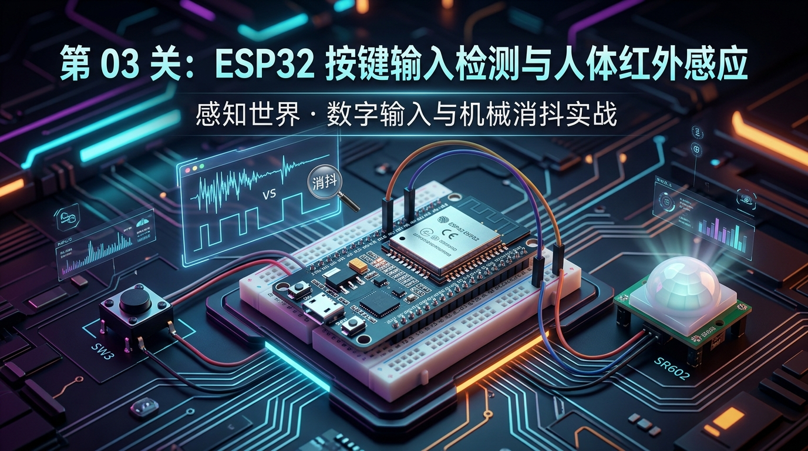
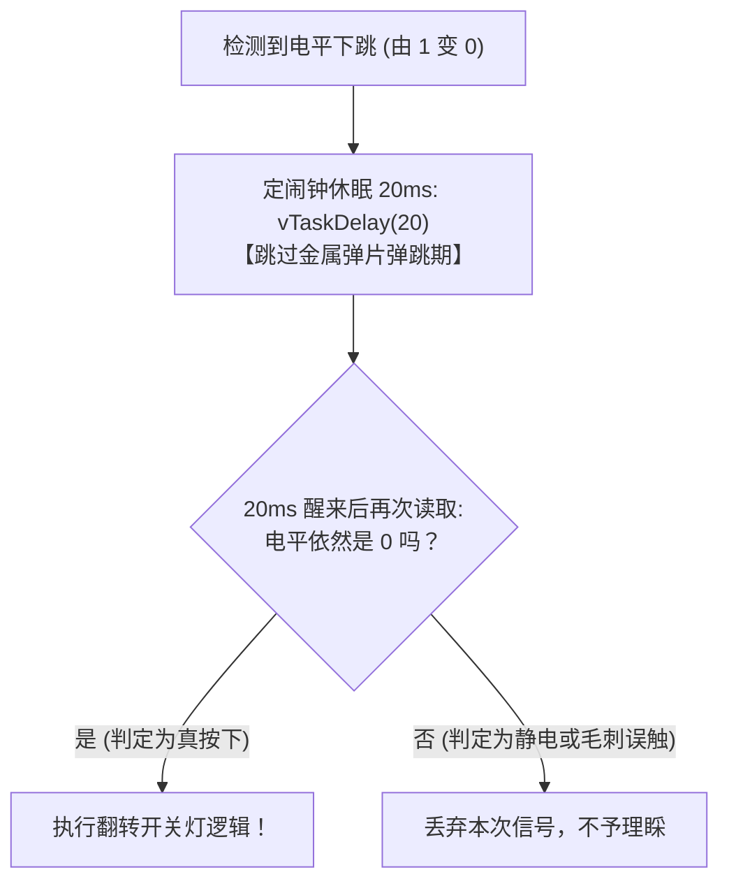

# 第 03 章：感知世界的声音 —— ESP32 按键输入检测与人体红外感应



> **写在前面**：在前两关中，我们学会了向电脑打印文字、向外输出电流点亮 LED。单片机学会了“说话”和“动手动脚”（输出 Output）。
> 
> 但如果单片机只能自己闷头输出，那它只是一个没有灵魂的自动化机器。这一章，我们将为 ESP32 装上**“触觉（机械按键 SW3）”**与**“眼睛（人体红外探头 SR602）”**—— 让代码能够**感知物理世界的输入（Input）**，实现真正的人机交互！

---

## 3.1 什么是 GPIO 输入？（单片机的眼睛与皮肤）

* **GPIO 输出（Output，上一关）**：CPU 内部决定输出 3.3V 还是 0V；
* **GPIO 输入（Input，本关核心）**：引脚处于**“高阻抗监听状态”**，用来测量外部世界送进来的电压是多少：
  * 当外部送来的电压接近 **3.3V** 时，芯片读取到数字 **`1`（高电平）**；
  * 当外部送来的电压接近 **0V** 时，芯片读取到数字 **`0`（低电平）**。


---

## 3.2 🗺️ 手把手看懂输入电路原理图

### 1. 板载用户按键 SW3 电路原理图（微动开关 + 上拉电阻）

查看完整原理图 [`docs/ESP32开发板原理图1.1.pdf`](../docs/ESP32开发板原理图1.1.pdf) 中的按键电路部分：

```text
                  【板载用户按键 SW3 电路原理图】

              +3.3V 电源
                 │
                 │ 10kΩ 上拉电阻 (平时死死把电平拉高到 3.3V)
                 │
  GPIO39 ────────┴─────────○  ○───────────┸ GND (0V 地线)
 (输入监听端)             SW3 机械按键
```

#### 🔍 读图拆解（为什么按下是 0，松开是 1？）：
* **平时松开按键时**：按键内部断开，由于 10kΩ 上拉电阻连着 3.3V，`GPIO39` 会被稳稳地拉到 **3.3V 高电平（读到 `1`）**；
* **手指用力按下按键时**：按键内部的金属弹片接通，直接把 `GPIO39` 连通到了 **GND 地线（0V）**，因此 `GPIO39` 瞬间变成 **0V 低电平（读到 `0`）**。
* 👉 **这就是最经典的“低电平有效”按键电路！**

---

### 2. ⚠️ 小白避坑高压线：ESP32 的 4 根“纯输入管脚”限制！

在 ESP32 芯片上，有 4 根非常特殊的引脚，必须刻在脑海里：

$$\mathbf{GPIO34} \quad \mathbf{GPIO35} \quad \mathbf{GPIO36 (VP)} \quad \mathbf{GPIO39 (VN)}$$

> 🚫 **硬件三大铁律**：
> 1. **绝不能配置为输出**：它们在硅片物理层面就没有输出驱动晶体管，如果你写 `gpio_set_direction(GPIO_NUM_39, GPIO_MODE_OUTPUT)`，不仅无效还会报错；
> 2. **内部没有上拉/下拉电阻**：普通 GPIO 可以通过软件开启内部上拉（`GPIO_PULLUP_ENABLE`），但这 4 根引脚**内部没有上拉电阻**，必须依赖开发板电路上的外部硬件电阻（如板载的 10kΩ 电阻）；
> 3. **极佳用途**：正因为它们纯净，非常适合用来做**按键输入、ADC 模拟采集、红外传感器输入**。

---

### 3. SR602 人体红外传感器原理（PIR 热释电）

开发板上的 `JP5` 排针可连接 **SR602 微型人体红外感应模块**（连接到 `GPIO34`）：
* **物理探测原理**：人体体温大约 37℃，会天然向外界辐射波长约为 $9 \sim 10\ \mu\text{m}$ 的远红外线。SR602 表面的半球形白色罩子叫**菲涅尔透镜（Fresnel Lens）**，它能把环境红外光聚焦到内部的热释电传感器晶片上；
* **信号输出**：
  * **有人体活动时**：SR602 的输出脚送出 **3.3V 高电平（读到 `1`）**；
  * **无人或人完全静止时**：输出脚送出 **0V 低电平（读到 `0`）**。

---

## 3.3 深入核心痛点：为什么按一下按键会触发好几次？

在写单片机代码时，新手最常遇到的诡异 Bug 就是：**“我明明只按了一下按键，为什么灯疯狂闪烁或者日志连弹了 8 次？”**

这是因为真实物理世界中的机械按键，并不是理想的瞬间接通！

```text
               【微观时间轴下的按键抖动 (10~20ms)】

高电平 (3.3V) ────┐    ┌─┐  ┌┐
                  │ ┌──┘ └──┘ └──┐
低电平 (0V)       └─┘            └──────────────────── (稳定按下)
                  ▲              ▲
                  │  机械抖动区  │
                  └── (10~20ms) ─┘
```

* **物理真相（机械碰撞弹跳）**：
  按键内部是两片微小的弹性金属弹片。当你用手指压下去的瞬间，弹片在碰撞时会像乒乓球落地一样发生**数毫秒的微观弹性弹跳（Bounce）**；
* **单片机速度太快**：ESP32 的主频高达 240MHz，在金属弹片跳动的这 10 毫秒内，CPU 已经跑了 240 万条指令，把每一次微观回弹都误当成了你又按了一次按键！

---

### 💡 救星解法：20ms 软件消抖法（定闹钟二次确认）

解决机械抖动最经典、工业界最常用的算法是 **“延时双重确认法（Debounce）”**：



---

## 3.4 关卡源码逐行带读（[`main/app_main.c`](../main/app_main.c)）

打开源码，我们来看看完整的按键消抖与红外检测是如何落地的：

```c
#include <stdio.h>
#include "freertos/FreeRTOS.h"
#include "freertos/task.h"
#include "driver/gpio.h"
#include "esp_log.h"

static const char *TAG = "LEVEL_3_INPUT";

// 引脚宏定义
#define LED_PIN         GPIO_NUM_27  // 板载受控指示灯 LED2 (输出)
#define BUTTON_PIN      GPIO_NUM_39  // 用户按键 SW3 (纯输入)
#define PIR_PIN         GPIO_NUM_34  // SR602 人体红外探头 (纯输入)

// 全局状态变量：记录当前灯是开(true)还是关(false)
static bool g_led_state = false;
```

---

### 1. 初始化 GPIO 方向

```c
static void init_system_gpios(void)
{
    // 1. 初始化 LED2 为输出
    gpio_reset_pin(LED_PIN);
    gpio_set_direction(LED_PIN, GPIO_MODE_OUTPUT);
    gpio_set_level(LED_PIN, 0); // 默认初始熄灭

    // 2. 初始化 SW3 按键为输入
    gpio_reset_pin(BUTTON_PIN);
    gpio_set_direction(BUTTON_PIN, GPIO_MODE_INPUT);

    // 3. 初始化 SR602 红外为输入
    gpio_reset_pin(PIR_PIN);
    gpio_set_direction(PIR_PIN, GPIO_MODE_INPUT);
}
```

---

### 2. 主循环：边沿检测、消抖与状态翻转

```c
void app_main(void)
{
    init_system_gpios();

    int pir_last_state = -1;   // 记录上一次红外状态，防止刷屏
    int button_last_level = 1; // 按键平时松开为高电平 1

    while (1) {
        // --- 模块一：按键扫描与消抖 ---
        int current_btn_level = gpio_get_level(BUTTON_PIN);

        // 边沿检测：只有当按键从“没按(1)”变成“按下了(0)”的瞬间才响应
        if (button_last_level == 1 && current_btn_level == 0) {
            // 💡 软件消抖：睡 20ms 避开金属弹片抖动
            vTaskDelay(pdMS_TO_TICKS(20));

            // 二次确认：醒来后再读一次
            if (gpio_get_level(BUTTON_PIN) == 0) {
                // 💡 状态翻转小技巧：!true 变成 false，!false 变成 true
                g_led_state = !g_led_state;
                gpio_set_level(LED_PIN, g_led_state ? 1 : 0);

                ESP_LOGI(TAG, "🔘 [按键触发] 用户按下了 SW3！当前指示灯: %s", 
                         g_led_state ? "🟢【点亮】" : "⚪【熄灭】");
            }
        }
        button_last_level = current_btn_level; // 更新历史状态

        // --- 模块二：人体红外状态变化监控 ---
        int current_pir_state = gpio_get_level(PIR_PIN);
        if (current_pir_state != pir_last_state) {
            if (current_pir_state == 1) {
                ESP_LOGW(TAG, "🚶‍♂️ [红外感应] 探测到人体活动！(GPIO34 = 1)");
            } else {
                ESP_LOGI(TAG, "🍃 [红外感应] 人体离开或静止无感应。(GPIO34 = 0)");
            }
            pir_last_state = current_pir_state;
        }

        // 极短休眠 10ms，既不漏掉快速点击，又让出 CPU 算力
        vTaskDelay(pdMS_TO_TICKS(10));
    }
}
```

---

## 3.5 📚 专属编程知识拓展（库函数字典与语法速查）

---

### 1. 核心库函数功能字典

| 函数名称 | 典型写法 | 参数说明 | 作用 |
| :--- | :--- | :--- | :--- |
| **`gpio_get_level()`** | `int val = gpio_get_level(GPIO_NUM_39);` | 引脚编号 | 读取该引脚当前电平，返回 `1`（高电平）或 `0`（低电平） |

---

### 2. 嵌入式 C 语言技巧拆解

#### ① 状态翻转取反运算符：`g_led_state = !g_led_state;`
* `g_led_state` 是一个布尔变量（`true` 或 `false`）；
* 加上 `!`（逻辑非）操作符：
  * 如果当前是 `false`（关灯），`!false` 就会变成 `true`（开灯）；
  * 如果当前是 `true`（开灯），`!true` 就会变成 `false`（关灯）；
* 一行代码即可实现**“按一下开，再按一下关”**的优雅切换。

#### ② 边沿检测（Edge Trigger）vs 电平检测（Level Trigger）
* **如果写 `if (current_btn_level == 0)`（电平检测）**：
  只要你手指按着按键不松开，程序每 10ms 就会连续触发一次，灯疯狂闪烁成迪厅；
* **写成 `if (button_last_level == 1 && current_btn_level == 0)`（下跳沿检测）**：
  程序只在**按下去那一瞬间（由 1 变成 0）**触发一次，就算你手指按着一小时不松手，也只算触发一次！

---

## 3.6 动手小实验（即时体验）

烧录固件到开发板后，打开 VS Code 串口监视器：

### 🧪 实验 1：按键开关灯测试
* 用手指按下板载右上角的用户按键 **SW3**：
  * 第一次按：LED2 点亮，终端打印绿色日志 `🔘 当前指示灯: 🟢【点亮】`；
  * 第二次按：LED2 熄灭，终端打印 `🔘 当前指示灯: ⚪【熄灭】`；
  * 长按不放：确认指示灯不会疯狂闪烁，只在按下的瞬间切换一次。

---

### 🧪 实验 2：人体红外感应测试
* 如果板上插了 SR602 模块（JP5）：
  * 用手在白色小球上方晃动一下，观察串口终端立刻弹出黄色警告日志：`🚶‍♂️ [红外感应] 探测到人体活动！`；
  * 手移开保持静止 3 秒后，终端恢复打印：`🍃 人体离开或静止无感应`。

---

## 3.7 新手排错宝典

| 遇到的现象 | 为什么会这样？ | 怎么解决？ |
| :--- | :--- | :--- |
| **按下 SW3 按键没有任何日志输出** | 1. 看错了按键（板上有两个按键：RESET 键按下会重启单片机，旁边的 **SW3** 才是用户按键）；<br>2. 没打开串口监视器。 | 确认按下的是 **SW3** 按键，并确认终端已执行 `idf.py monitor`。 |
| **编译报错提示 GPIO39 不能配输出** | 误把 GPIO39 配置成了 `GPIO_MODE_OUTPUT`。 | 牢记 ESP32 的 4 根纯输入引脚（34/35/36/39）绝对不能配置为输出。 |

---

## 3.8 本章总结与闯关打卡

恭喜你！学完本章，你已经攻克了单片机从“单向输出”到“双向交互”的最关键一步：
1. 掌握了数字输入 `gpio_get_level()` 的使用与电路原理（上拉电阻 + 低电平有效）；
2. 彻底搞懂了机械按键抖动的原因，并掌握了工业级 20ms 软件消抖法；
3. 掌握了边沿检测触发机制与人体红外传感器（PIR）的数据捕获。

---

*下一关预告：既然我们已经能读取数字信号（0和1）了，那么现实世界中**连续变化的温度、距离、湿度**该怎么测量呢？下一关，我们将集结三大传感器 —— **ADC 模数转换测温、DHT11 单总线温湿度与 HC-SR04 超声波测距**！*
