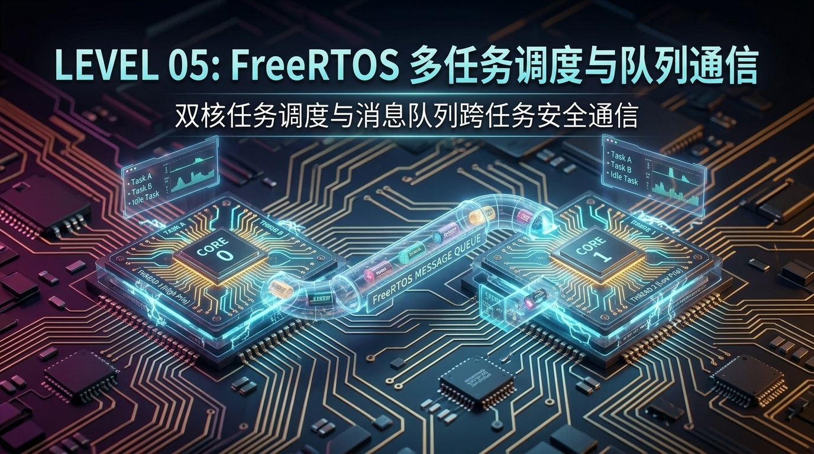
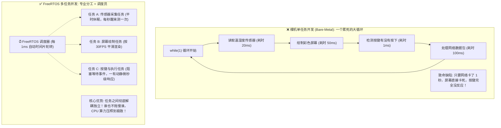
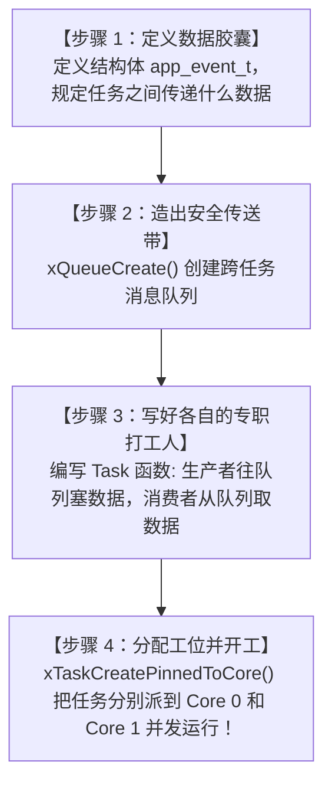
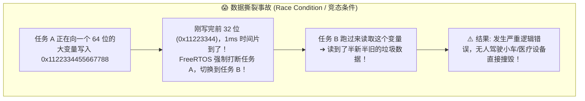
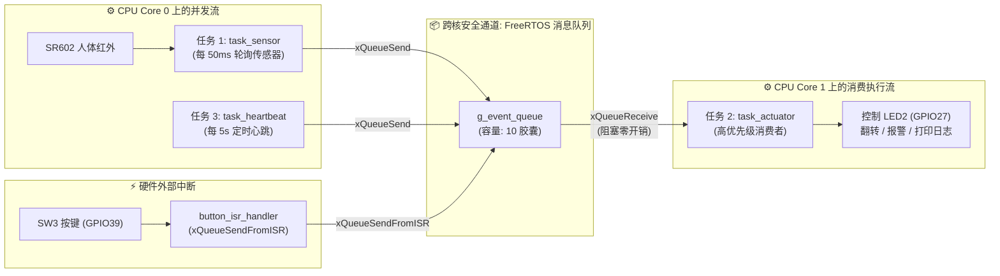

# 第 05 章：芯片的多重影分身 —— FreeRTOS 多任务调度与队列(Queue)跨任务通信



> **写在前面**：在前面的关卡中，我们在第四关领悟了一个极为核心的架构思想 —— **“前台拉警报，后台慢慢干”**。
> 
> 但如果后台只有 `app_main` 一个单打独斗的循环，又要去处理传感器数据、又要去刷新屏幕、还要去连 Wi-Fi 发网络请求，整个程序依然会像排队买奶茶一样卡顿不堪。
> 
> 这一章，我们将正式召唤嵌入式开发的终极灵魂武器 —— **FreeRTOS 实时操作系统（Real-Time Operating System）**！学会让 ESP32 的双核 CPU 同时施展“影分身之术”，并搭建起一条安全坚固的**“跨任务数据传送带（Queue 消息队列）”**，跨入现代大型高并发嵌入式工程的大门！

---

## 5.1 为什么单片机需要操作系统（RTOS）？（杂技演员抛球的艺术）

在进入代码之前，我们先彻底搞懂：**“没有操作系统”与“拥有操作系统”的单片机，究竟有什么本质区别？**



### 💡 生活中的生动比喻：
* **裸机单任务**：就像一个没有经理的小作坊，一个人既要当厨师炒菜、又要当服务员端盘子、还要当收银员算账。一旦算账算卡住了，厨房里的菜就当场烧焦；
* **FreeRTOS 多任务**：就像一个现代化大餐厅，聘请了一个**“超级调度员”**。厨师只管炒菜（任务 A）、服务员只管端盘（任务 B）、收银员只管算账（任务 C）。调度员在极短的时间尺度（微秒/毫秒级）上快速切换，让每个人都感觉事情是在**同时并行发生的**！

---

---

## 5.2 🗺️ FreeRTOS 多任务与队列开发全景（先看总体 4 步流水线骨架）

在深入任何细节之前，我们先站在上帝视角，看清一个标准的 FreeRTOS 多任务工程是**如何从零搭起 4 步骨架的**：



### 💻 4 步极简流水线标准代码全貌（一眼看懂）：

```c
// =========================================================================
// 步骤 1：定义在传送带上流动的“数据胶囊结构体”
// =========================================================================
typedef struct {
    int event_type;       // 事件类型 (比如 1 代表按键，2 代表红外)
    int64_t timestamp_us; // 事件发生的微秒时间戳
} app_event_t;

static QueueHandle_t g_event_queue = NULL; // 传送带全局句柄

// =========================================================================
// 步骤 2：编写各自的专职任务函数（专人专事，永不退出的 while(1)）
// =========================================================================
// 生产者任务：负责采集
void task_sensor_producer(void *pvParameters) {
    while (1) {
        app_event_t event = { .event_type = 1, .timestamp_us = esp_timer_get_time() };
        xQueueSend(g_event_queue, &event, pdMS_TO_TICKS(10)); // 塞入传送带
        vTaskDelay(pdMS_TO_TICKS(1000));                      // 睡 1 秒
    }
}

// 消费者任务：负责执行
void task_actuator_consumer(void *pvParameters) {
    app_event_t rx_event;
    while (1) {
        // 阻塞等待传送带！没有数据就深度休眠(0% CPU)，一有数据秒醒！
        if (xQueueReceive(g_event_queue, &rx_event, portMAX_DELAY) == pdTRUE) {
            ESP_LOGI(TAG, "收到事件: %d, 耗时标记: %lld ms", rx_event.event_type, rx_event.timestamp_us / 1000);
        }
    }
}

// =========================================================================
// 步骤 3 & 4：在 app_main 中创建传送带，并把任务分配到双核启动！
// =========================================================================
void app_main(void) {
    // 步骤 3：创建容量为 10 个数据包的队列传送带
    g_event_queue = xQueueCreate(10, sizeof(app_event_t));

    // 步骤 4：分配工位并启动任务！
    // 生产者跑在 Core 0 (优先级 2)，消费者跑在 Core 1 (优先级 3)
    xTaskCreatePinnedToCore(task_sensor_producer, "task_producer", 3072, NULL, 2, NULL, 0);
    xTaskCreatePinnedToCore(task_actuator_consumer, "task_consumer", 3584, NULL, 3, NULL, 1);
}
```

看完了这清晰明了的 **4 步流水线骨架**，接下来我们由浅入深，逐一拆解每个核心机制背后的原理与玄机！

---

## 5.3 🚀 深度拆解：如何写好一个 FreeRTOS 任务？

在刚才的骨架中，你看到了两个独立的任务函数。在 FreeRTOS 中，每一个“任务（Task）”本质上就是一个**永远不返回的独立 C 语言函数**。

### 1. 任务函数的黄金结构模板

```c
void my_sensor_task(void *pvParameters)
{
    // 1. 任务局部初始化（只跑一次，比如初始化该任务私有的变量）
    ESP_LOGI(TAG, "传感器任务启动就绪！");

    // 2. 任务核心死循环（必须是 while(1)，永远不准 return 退出！）
    while (1) {
        // ① 干活：读取数据、处理计算...
        
        // ② 关键：干完活必须主动交出 CPU 算力！
        // 可以是定闹钟休眠 vTaskDelay()，也可以是阻塞等待队列 xQueueReceive()
        vTaskDelay(pdMS_TO_TICKS(1000));
    }

    // ⚠️ 严禁让代码自然执行到函数大括号末尾！如果某个任务确实只需要跑一次就结束，必须显式自杀：
    // vTaskDelete(NULL);
}
```

---

### 2. 🚀 创建任务并指派工位：`xTaskCreatePinnedToCore()`

ESP32-WROOM-32E 芯片内部是一颗真正的**双核（Dual-Core）处理器**（**Core 0** 和 **Core 1**）。ESP-IDF 提供了专属的创建函数，允许我们把不同的任务指派到不同的物理核心上去跑！

```c
xTaskCreatePinnedToCore(
    task_sensor_producer,    // 1. 任务函数指针 (派谁去干活)
    "task_sensor",           // 2. 任务名称 (用于调试与日志识别，最大 16 字节)
    3072,                    // 3. 任务栈深度 (给该任务分配多大的独立工作台，单位：字节)
    NULL,                    // 4. 传递给任务的入参 (没有则传 NULL)
    2,                       // 5. 任务优先级 (数字越大优先级越高，如 0~24)
    NULL,                    // 6. 传出任务句柄 (用于后续挂起或删除，不需要可传 NULL)
    0                        // 7. 绑定 CPU 核心 (0 代表 Core 0，1 代表 Core 1，tskNO_AFFINITY 代表随意分配)
);
```

#### 🔍 2 个最关键参数深度拆解（小白必知）：

##### ① 参数 3：栈深度（Stack Size）到底该给多大？
* 每一个任务在创建时，FreeRTOS 都会在内存里给它切出一块**“专属工作台（任务栈）”**，用来存放该任务运行时的局部变量、函数调用层级；
* **新手常见雷区（Stack Overflow 栈溢出）**：
  * 如果你在任务里定义了一个很大的数组（比如 `char buf[2048]`）或者调用了深层打印函数，但只给了任务 1024 字节的栈，就会瞬间发生**栈溢出崩溃（Guru Meditation Error: Unhandled debug exception / Stack protection fault）**；
* **经验黄金法则**：
  * 最简单的纯延时/轻量逻辑任务：给 **`2048 字节 (2KB)`**；
  * 带 `ESP_LOGI` 字符串格式化打印或传感器解析：给 **`3072 ~ 4096 字节 (3~4KB)`**；
  * 后续带有 Wi-Fi、MQTT、cJSON、LVGL 的重量级任务：给 **`4096 ~ 8192 字节 (4~8KB)`**。

##### ② 参数 5：任务优先级（Priority）—— 谁高谁先跑
* FreeRTOS 是**抢占式调度器（Preemptive Scheduling）**；
* **规则 1（强者优先）**：只要系统中存在**高优先级**的任务处于“就绪干活状态”，CPU 就会毫不犹豫地立刻剥夺低优先级任务的算力，全部砸给高优先级任务；
* **规则 2（同级平等）**：如果两个任务优先级相同（比如都是 2），调度器就会按 1ms 的时间片一人轮流跑一会（时间片轮转）；
* **规则 3（防饿死铁律）**：高优先级任务**千万不能写无延时的空死循环 `while(1) {}`**，否则低优先级任务将永远拿不到 CPU 算力而被“活活饿死”！

---

## 5.4 📦 深度拆解：跨任务通信的灵魂 —— 消息队列（Queue）

现在我们有了多个任务（任务 A 负责采集传感器、任务 B 负责在屏幕上画图）。

很多初学者第一反应是：**“为什么不直接定义一个全局变量 `int g_sensor_data`，任务 A 往里写，任务 B 从里读，不就行了吗？”**

### ❌ 为什么多任务之间“严禁直接裸用全局变量”？（数据撕裂事故现场）



为了彻底解决任务之间的数据安全传递，FreeRTOS 提供了最核心的同步通信机制 —— **消息队列（Queue）**！

---

### 📦 消息队列模型：跨核安全传送带

消息队列就像工厂车间里一条**带护栏的自动化传送带**（也像一个带有固定格子的邮箱）：

```text
       【FreeRTOS 消息队列工作全景：先进先出 (FIFO)】

  [生产者 1: 传感器采集任务] ──┐
  [生产者 2: 按键硬件中断ISR] ──┼──► 📦【FreeRTOS 消息队列传送带】 ──► [消费者: 执行控制任务]
  [生产者 3: 后台系统心跳包] ──┘      ┌───┬───┬───┬───┬───┐          (阻塞等待，微秒级响应)
                                     │ 5 │ 4 │ 3 │ 2 │ 1 │
                                     └───┴───┴───┴───┴───┘
                                      ▲ 自动缓存 10 个数据胶囊 ▲
```

#### 🌟 消息队列的 3 大神级特性：
1. **线程安全与原子性（Thread-Safe）**：内部有底层硬件锁保护，无论多少个任务/中断同时去塞数据，绝对不会发生数据撕裂；
2. **值拷贝传递（Pass by Value）**：数据放进队列的一瞬间会被完整克隆复制一份，发送方随后修改自己的局部变量，完全不影响队列里的数据；
3. **零消耗阻塞休眠（Zero CPU Blocking）**：
   * 消费者任务调用 `xQueueReceive(..., portMAX_DELAY)` 时，如果队列是空的，消费者任务会**瞬间进入深度休眠，消耗 CPU 算力为 0**；
   * 一旦任何生产者往队列里塞进一个新数据包，FreeRTOS 调度器会在**微秒级时间内自动唤醒消费者任务**起来干活！

---

## 5.5 ⚡ 第四关伏笔闭环：中断（ISR）如何安全给任务发消息？

在上一关中，我们留了一个悬念：**“中断里不能干重活，必须由前台发便签、后台慢慢干”**。

那前台中断究竟怎么给后台任务递这封“便签”呢？

### ⚠️ 绝对严禁在中断里调用普通的 `xQueueSend`！
* 普通的 `xQueueSend` 带有“超时等待时间（如 `pdMS_TO_TICKS(10)`）”，如果队列满了它会尝试休眠等待；
* 但在第四关我们已经学过：**中断具有最高特权，严禁在中断里休眠等待！**
* 如果在 ISR 里调用普通 `xQueueSend`，单片机会当场触发内核断言崩溃！

### ✅ 救星登场：中断专属的 `xQueueSendFromISR`

FreeRTOS 为所有中断场景提供了带有 `FromISR` 后缀的安全函数：

```c
// ⚡ 硬件中断服务函数 (ISR)
static void IRAM_ATTR button_isr_handler(void* arg)
{
    app_event_t event = {
        .type = EVENT_BUTTON_PRESS,
        .timestamp_us = esp_timer_get_time()
    };

    BaseType_t xHigherPriorityTaskWoken = pdFALSE;

    // 🌟 中断专用安全发队列 API (绝不休眠，瞬间入队)
    xQueueSendFromISR(g_event_queue, &event, &xHigherPriorityTaskWoken);

    // 🌟 换幕魔法：如果这次发消息唤醒了一个更高优先级的后台消费者任务，
    // 立即通知 CPU 在退出中断的一瞬间直接切换到消费者任务执行！
    if (xHigherPriorityTaskWoken == pdTRUE) {
        portYIELD_FROM_ISR();
    }
}
```

👉 **架构闭环**：按键按下的瞬间 ➔ 硬件触发中断（ISR 耗时 1 微秒打包入队） ➔ 唤醒 Core 1 上的后台任务 ➔ 后台任务安全优雅地打印日志并翻转灯光！**整个过程没有一丝 CPU 浪费，响应速度达到微秒级极限！**

---

## 5.6 💻 关卡源码逐行带读（[`main/app_main.c`](../main/app_main.c)）

我们来看看本关完整的双核多任务与队列架构：



### 1. 核心业务完整源码实现

```c
#include <stdio.h>
#include <inttypes.h>
#include "freertos/FreeRTOS.h"
#include "freertos/task.h"
#include "freertos/queue.h"
#include "driver/gpio.h"
#include "esp_log.h"
#include "esp_timer.h"

static const char *TAG = "LEVEL_5_RTOS";

#define LED_PIN         GPIO_NUM_27  // 板载受控蓝色 LED2 (执行器)
#define BUTTON_PIN      GPIO_NUM_39  // 用户按键 SW3 (中断生产者)
#define PIR_PIN         GPIO_NUM_34  // SR602 人体红外探头 (传感器生产者)

// 1. 数据胶囊结构体定义
typedef enum {
    EVENT_BUTTON_PRESS,    // 按键按下
    EVENT_PIR_MOTION,      // 人体靠近
    EVENT_PIR_VACANT,      // 人体离开
    EVENT_SYSTEM_HEARTBEAT // 系统心跳
} event_type_t;

typedef struct {
    event_type_t type;
    int64_t timestamp_us;
    uint32_t count;
    int sender_core;
} app_event_t;

static QueueHandle_t g_event_queue = NULL;

// 2. 按键中断生产者 (ISR)
static void IRAM_ATTR button_isr_handler(void* arg)
{
    static int64_t last_intr_time = 0;
    static uint32_t btn_press_count = 0;
    int64_t now = esp_timer_get_time();

    if (now - last_intr_time > 150000) {
        btn_press_count++;
        last_intr_time = now;

        app_event_t event = {
            .type = EVENT_BUTTON_PRESS,
            .timestamp_us = now,
            .count = btn_press_count,
            .sender_core = xPortGetCoreID()
        };

        BaseType_t xHigherPriorityTaskWoken = pdFALSE;
        xQueueSendFromISR(g_event_queue, &event, &xHigherPriorityTaskWoken);
        if (xHigherPriorityTaskWoken == pdTRUE) {
            portYIELD_FROM_ISR();
        }
    }
}

// 3. 传感器采集生产者任务 (Core 0)
static void task_sensor_producer(void *pvParameters)
{
    int last_pir_level = -1;
    uint32_t pir_trigger_count = 0;

    while (1) {
        int current_pir_level = gpio_get_level(PIR_PIN);
        if (current_pir_level != last_pir_level) {
            pir_trigger_count++;
            app_event_t event = {
                .type = (current_pir_level == 1) ? EVENT_PIR_MOTION : EVENT_PIR_VACANT,
                .timestamp_us = esp_timer_get_time(),
                .count = pir_trigger_count,
                .sender_core = xPortGetCoreID()
            };
            xQueueSend(g_event_queue, &event, pdMS_TO_TICKS(10));
            last_pir_level = current_pir_level;
        }
        vTaskDelay(pdMS_TO_TICKS(50));
    }
}

// 4. 执行控制核心消费者任务 (Core 1)
static void task_actuator_consumer(void *pvParameters)
{
    app_event_t rx_event;
    bool led_state = false;

    while (1) {
        // 阻塞等待消息队列 (零开销休眠)
        if (xQueueReceive(g_event_queue, &rx_event, portMAX_DELAY) == pdTRUE) {
            int consumer_core = xPortGetCoreID();
            
            switch (rx_event.type) {
                case EVENT_BUTTON_PRESS:
                    led_state = !led_state;
                    gpio_set_level(LED_PIN, led_state ? 1 : 0);
                    ESP_LOGI(TAG, "⚡ [队列接收] 按键中断事件 #%lu | 发送: Core %d ➔ 消费: Core %d | 灯光翻转: %s",
                             rx_event.count, rx_event.sender_core, consumer_core,
                             led_state ? "🟢【点亮】" : "⚪【熄灭】");
                    break;

                case EVENT_PIR_MOTION:
                    gpio_set_level(LED_PIN, 1);
                    ESP_LOGW(TAG, "🚶‍♂️ [队列接收] 人体移动事件 #%lu | 发送: Core %d ➔ 消费: Core %d | 动作: 自动亮灯",
                             rx_event.count, rx_event.sender_core, consumer_core);
                    break;

                case EVENT_PIR_VACANT:
                    gpio_set_level(LED_PIN, 0);
                    led_state = false;
                    ESP_LOGI(TAG, "🍃 [队列接收] 人体离开事件 #%lu | 发送: Core %d ➔ 消费: Core %d | 动作: 自动熄灯",
                             rx_event.count, rx_event.sender_core, consumer_core);
                    break;

                case EVENT_SYSTEM_HEARTBEAT: {
                    UBaseType_t stack_remaining = uxTaskGetStackHighWaterMark(NULL);
                    ESP_LOGI(TAG, "💓 [系统心跳 #%lu] 双核流水线运行正常 | 消费者任务剩余栈深: %u 字节",
                             rx_event.count, (unsigned int)(stack_remaining * sizeof(StackType_t)));
                    break;
                }
            }
        }
    }
}
```

---

## 5.6 📚 专属编程知识拓展（库函数字典与语法速查）

---

### 1. 核心库函数功能字典

| 函数名称 | 典型写法 | 参数说明 | 作用 |
| :--- | :--- | :--- | :--- |
| **`xQueueCreate()`** | `xQueueCreate(10, sizeof(data_t));` | 队列深度, 单元大小 | 动态分配并创建一条 FreeRTOS 消息队列 |
| **`xQueueSend()`** | `xQueueSend(q, &item, ticks_to_wait);` | 队列句柄, 数据指针, 超时 | 任务上下文中向队列尾部发送数据包 |
| **`xQueueSendFromISR()`** | `xQueueSendFromISR(q, &item, &woken);` | 队列句柄, 数据指针, 换幕标记 | **硬件中断 ISR 专用**向队列发送数据包（绝不阻塞） |
| **`xQueueReceive()`** | `xQueueReceive(q, &buf, portMAX_DELAY);` | 队列句柄, 接收缓存, 超时 | 从队列头部提取数据包（支持死等阻塞休眠） |
| **`xTaskCreatePinnedToCore()`**| `xTaskCreatePinnedToCore(fn, "name", stack, arg, prio, handle, core);` | 函数, 名字, 栈字节, 参数, 优先级, 句柄, 核心号(0/1) | 创建独立任务并绑定到指定 CPU 核心 |
| **`xPortGetCoreID()`** | `int core = xPortGetCoreID();` | 无 | 获取当前代码正在哪个 CPU 核心上运行（返回 `0` 或 `1`） |
| **`uxTaskGetStackHighWaterMark()`** | `UBaseType_t w = uxTaskGetStackHighWaterMark(NULL);` | 任务句柄（NULL 代表当前任务） | 探测任务历史最小剩余栈空间（防溢出探针） |

---

### 2. 嵌入式进阶技巧：什么是“高水位线（Stack High Water Mark）”？
* **很多小白常问**：我给任务分了 4096 字节栈，我怎么知道分多了还是分少了？万一在极端情况下爆栈怎么办？
* FreeRTOS 在创建任务时，会在分配的栈内存里悄悄填满特殊的魔数 `0xA5`；
* 随着程序运行，局部变量和函数调用会像水涨起来一样冲刷掉 `0xA5`；
* 调用 `uxTaskGetStackHighWaterMark()` 时，FreeRTOS 会去数**这块工作台上还剩下多少从来没被淹没过的 `0xA5`**；
* 如果返回的剩余字节数小于 **512 字节**，说明任务非常危险，必须赶紧调大栈空间！

---

## 5.7 🧪 动手小实验（即时体验与真实验收）

把代码编译烧录到开发板后，打开串口终端（`idf.py monitor`），你将看到如下令人惊叹的双核流水线协同效果：

```text
                  【关卡 5 双核多任务与队列通信真实串口日志】

I (712) LEVEL_5_RTOS: ==================================================
I (722) LEVEL_5_RTOS:    🚀 关卡 5 启动：FreeRTOS 多任务与双核队列通信   
I (732) LEVEL_5_RTOS: ==================================================
I (742) LEVEL_5_RTOS: ✅ 硬件初始化就绪: LED2(GPIO27), SW3按键中断(GPIO39), SR602红外(GPIO34)
I (752) LEVEL_5_RTOS: ✅ FreeRTOS 消息队列已创建 (容量: 10 个数据包, 单包: 24 字节)
I (762) LEVEL_5_RTOS: 🟢 [任务启动] task_sensor_producer 已就绪，绑定在 Core 0 (优先级: 2)
I (772) LEVEL_5_RTOS: 🔵 [任务启动] task_actuator_consumer 已就绪，绑定在 Core 1 (优先级: 3)
I (782) LEVEL_5_RTOS: >>> FreeRTOS 双核多任务流水线已全面启动！

I (5782) LEVEL_5_RTOS: 💓 [系统心跳 #1] 双核流水线运行正常 | 消费者任务剩余栈深: 2688 字节
I (10782) LEVEL_5_RTOS: 💓 [系统心跳 #2] 双核流水线运行正常 | 消费者任务剩余栈深: 2688 字节

--- 按下按键 SW3：跨核事件瞬间响应 ---
I (14252) LEVEL_5_RTOS: ⚡ [队列接收] 按键中断事件 #1 | 发送端: Core 0 ➔ 消费端: Core 1 | 灯光翻转为: 🟢【点亮】 (耗时标记: 14252 ms)
I (15102) LEVEL_5_RTOS: ⚡ [队列接收] 按键中断事件 #2 | 发送端: Core 0 ➔ 消费端: Core 1 | 灯光翻转为: ⚪【熄灭】 (耗时标记: 15102 ms)

--- 手靠近 SR602 人体红外感应探头 ---
W (18322) LEVEL_5_RTOS: 🚶‍♂️ [队列接收] 人体移动感应事件 #1 | 发送端: Core 0 ➔ 消费端: Core 1 | 动作: 自动亮灯护航
I (20822) LEVEL_5_RTOS: 🍃 [队列接收] 人体离开感应事件 #2 | 发送端: Core 0 ➔ 消费端: Core 1 | 动作: 延时自动熄灯
```

### 🧪 实验 1：观察真正的双核跨核数据流动
* 注意看串口日志中的 `发送端: Core 0 ➔ 消费端: Core 1`；
* 传感器的检测是在 **Core 0** 独立完成的，而指示灯控制和日志解析是在 **Core 1** 上独立完成的！两个核心通过硬件 SRAM 中的消息队列无缝携手，丝滑无比！

### 🧪 实验 2：体验零延迟抢占式调度
* 快速连续敲击按键 **SW3**：由于消费者任务的优先级（优先级 3）高于后台传感器任务（优先级 2），一旦中断塞入队列，消费者任务瞬间抢占执行，响应毫无卡顿！

---

## 5.8 🛠️ 新手排错宝典

| 遇到的现象 | 常见原因 | 解决方案 |
| :--- | :--- | :--- |
| **单片机重启，提示 `Stack protection fault` 或 `Unhandled debug exception`** | 某个任务的栈空间给太小（发生了栈溢出）。 | 将 `xTaskCreatePinnedToCore` 中的栈空间调大（如从 2048 调大至 4096），并使用 `uxTaskGetStackHighWaterMark` 监控。 |
| **中断一触发就崩溃，提示在 ISR 中调用了阻塞 API** | 在中断服务函数中误调用了普通 `xQueueSend` 或 `vTaskDelay`。 | 检查中断函数，必须使用带有 `FromISR` 后缀的 **`xQueueSendFromISR()`**。 |
| **低优先级任务完全不运行（被活活饿死）** | 某个高优先级任务里写了纯死循环 `while(1){}` 且没有调用任何 `vTaskDelay` 或 `xQueueReceive` 阻塞函数。 | 确保所有任务在没有事情做时，主动调用 `vTaskDelay()` 或阻塞在队列上让出 CPU。 |

---

## 5.9 🎯 本章总结与思维跃迁

恭喜你！学完本章，你已经彻底脱离了初级单片机“裸机单死循环”的思维局限，正式掌握了现代化嵌入式系统的核心架构：
1. **理解了多任务并发与双核调度的本质**：通过 `xTaskCreatePinnedToCore()` 让双核 CPU 各司其职；
2. **掌握了工业级跨任务通信的黄金标准 —— 消息队列（Queue）**：告别危险的裸全局变量，实现线程安全、带缓冲、零 CPU 浪费的事件传递；
3. **彻底打通了“中断到任务”的高速公路**：通过 `xQueueSendFromISR` 和 `portYIELD_FROM_ISR`，完美落地了“前台拉警报，后台慢慢干”的高并发事件驱动架构！

---

*下一关预告：掌握了 FreeRTOS 多任务与底层中断内功之后，我们将迎来阶段二的终极硬件视觉盛宴！我们将学习 ESP32 的独门硬件脉冲外设 —— **第 06 关：ESP32 RMT 硬件脉冲外设与 WS2812 幻彩 RGB 跑马灯**，用纳秒级时序驱动流光溢彩的彩虹流水灯！*
