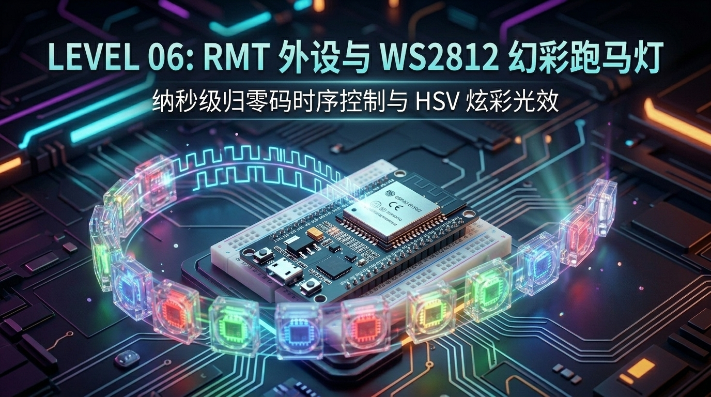
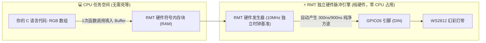

# 第 06 章：光芒与律动 —— ESP32 RMT 硬件脉冲外设与 WS2812 幻彩 RGB 跑马灯



> **写在前面**：在前几关中，我们学会了用 GPIO 控制单个蓝灯、用 PWM 呼吸灯实现明暗渐变、用中断与 FreeRTOS 队列处理多任务并发。
> 
> 但如果让你控制 **几十颗甚至上百颗全彩 RGB 灯珠（每个灯都能独立显示 1677 万种颜色）**，你该怎么做？
> * 是给每颗灯的红、绿、蓝三个引脚都连一根线吗？100 颗灯就需要 300 根线，单片机引脚立刻被挤爆！
> 
> 聪明的工程师发明了 **WS2812B（内置驱动芯片的幻彩单线灯珠）** —— **整条灯带只需 1 根数据线**，就能级联控制成千上万颗独立全彩灯！
> 
> 然而，单线通信的代价是：**它的通信时序达到了纳秒（ns）级的极致严苛要求！** 普通单片机用软件延时翻转引脚极易被中断打碎导致“群魔乱舞”乱闪。
> 
> 这一章，我们将解锁 ESP32 的独门王牌硬件外设 —— **RMT（Remote Control Peripheral，硬件脉冲发生器）**，用硬件状态机自动发射高精度方波，不占 CPU 任何算力，驱动梦幻般的彩虹流光！

---

## 6.1 什么是 WS2812？为什么 1 根线就能控制成百上千颗灯？

很多初学者第一次接触 WS2812 灯珠（常被称为“幻彩 RGB”、“像素灯”或“魔术灯带”）时，最震撼的莫过于：**只需 1 根信号线（DIN），就能让每颗灯发出截然不同的颜色！**

```text
                  【WS2812 级联数据传送图 —— 贪吃蛇吃糖果机制】
 
   ESP32 (GPIO26)
   ┌──────────┐   DIN     ┌─────────┐   DOUT    ┌─────────┐   DOUT    ┌─────────┐
   │  RMT     ├──────────►│ 第 1 颗 │──────────►│ 第 2 颗 │──────────►│ 第 3 颗 │ ...
   │ 硬件脉冲 │           │ WS2812  │           │ WS2812  │           │ WS2812  │
   └──────────┘           └─────────┘           └─────────┘           └─────────┘
```

### 🍭 “贪吃蛇吃糖果”原理（级联数据传递）：
1. **数据打包**：每颗 WS2812 灯珠包含绿（G）、红（R）、蓝（B）三个颜色通道，每个通道占 8 位（0~255），因此**一颗灯需要 24 bit（3 字节）数据**；
2. **第一颗灯吞下数据**：ESP32 一口气发送 N 颗灯的所有数据。第 1 颗灯首先截取并吞下最前面的 24 bit 作为自己的显示颜色；
3. **整形转发给下一颗**：从第 25 bit 开始，第 1 颗灯内部的硬件整形电路会自动把后续数据通过 `DOUT` 引脚原封不动吐给第 2 颗灯；
4. **锁存刷新（Reset 信号）**：当所有灯的数据发送完毕后，ESP32 保持信号线**低电平超过 50 微秒（µs）**，所有灯珠同时“吞下肚锁存”，一起亮起对应颜色！

---

## 6.2 纳秒级生死时速：WS2812 的单线归零码（NZR）时序

为什么 WS2812 这么难用普通代码驱动？因为它是 **单线归零码（Non-Return-to-Zero, NZR）**，没有专门的“时钟线（SCLK）”，每一位数据（`0` 还是 `1`）完全由**高低电平持续的时间长短**来区分！

### ⏱️ WS2812 标准 800kHz 脉冲时序表（每个 bit 周期固定为 1.25 µs）：

```text
    【发送数据 0 时的波形】                   【发送数据 1 时的波形】
    ┌────┐ (高电平短: 300ns)                 ┌────────────┐ (高电平长: 900ns)
    │ T0H│                                   │    T1H     │
────┘    └───────────────────────        ────┘            └──────────
         │   T0L (低电平长: 900ns)                        │ T1L (低电平短: 300ns)
         ◄────── 1.25 µs ───────►                         ◄────── 1.25 µs ───────►
```

| 符号 | 描述 | 标准时间 | 允许误差范围 |
| :--- | :--- | :--- | :--- |
| **`T0H`** | 发送 **0** 码时的高电平时间 | **300 ns (0.3 µs)** | ±150 ns |
| **`T0L`** | 发送 **0** 码时的低电平时间 | **900 ns (0.9 µs)** | ±150 ns |
| **`T1H`** | 发送 **1** 码时的高电平时间 | **900 ns (0.9 µs)** | ±150 ns |
| **`T1L`** | 发送 **1** 码时的低电平时间 | **300 ns (0.3 µs)** | ±150 ns |
| **`RESET`**| 复位锁存信号（低电平保持） | **> 50 µs** | 无上限（通常 80~280 µs） |

### 💥 为什么传统 CPU 死等延时（NOP / delayMicroseconds）必定翻车？
* **时间太短**：`300 纳秒` 只有 `0.0003 毫秒`！在 240MHz 的 ESP32 CPU 下，仅相当于 72 条时钟指令；
* **FreeRTOS 中断打断**：ESP32 内部时刻在运行 Wi-Fi、蓝牙、时钟节拍中断。如果 CPU 正在精确数指令延时发送 `T0H (300ns)`，突然来了一个 Wi-Fi 中断打了 2 微秒的岔，高电平被瞬间拉长，灯珠就会把 `0` 误认为 `1`，造成整条灯带**发疯乱闪、爆出刺眼白光或杂色**！

---

## 6.3 救星降临：ESP32 独门武器 —— RMT（硬件遥控脉冲发生器）

为了彻底解决高精度脉冲被中断打乱的痛点，乐鑫（Espressif）在 ESP32 硬件硅片中内置了专属的硬件外设 —— **RMT（Remote Control Peripheral）**！



### 🌟 RMT 外设的三大无敌优势：
1. **纯硬件发射**：CPU 只需要把颜色数据转换成 RMT 符号（Symbol）扔给 RMT 硬件缓存，RMT 独立硬件引擎就会接管引脚，按纳秒时基自动发射波形；
2. **免疫任何中断打扰**：即使此时 Wi-Fi 满载传输、系统触发了极长中断，RMT 硬件模块依然由独立晶振驱动，方波精度分秒不差；
3. **CPU 彻底解放**：在发射脉冲的几百微秒内，CPU 可以去跑复杂算法、渲染 UI 或进入低功耗休眠！

---

## 6.4 为什么做动画必须用 HSV？—— 揭秘色彩数学之美

初学者做灯效最容易犯的错误是：**直接在 RGB（红绿蓝）数值上加加减减**。
* 例如想做“彩虹渐变”，如果手动写 `R++`, `G--`, `B++`，你会发现色彩变化非常生硬，经常出现发暗或中间过渡发白的现象。

在专业图形学与照明领域，制作流光彩虹必须使用 **HSV 颜色模型（色相、饱和度、明度）**！

```text
                  【HSV 柱状/圆盘色彩模型剖析】
 
           0° (正红 Red)
             \ 
   300° (洋红) \        / 60° (正黄 Yellow)
         \      \      /      /
          \       \  /       /
           ●───────●────────●
          /       /  \       \
         /      /      \      \
   240° (正蓝) /        \ 120° (正绿 Green)
              180° (青色 Cyan)
 
 • H (Hue 色相): 0° ~ 359°，绕圆盘转一圈即可丝滑遍历人类肉眼可见的所有彩虹颜色！
 • S (Saturation 饱和度): 0 (纯白灰) ~ 255 (最浓郁纯正的色彩)。
 • V (Value 明度/亮度): 0 (全黑熄灭) ~ 255 (最高亮度)。
```

### 🌈 为什么 HSV 做灯效无敌？
* **做彩虹流光**：只需让 `Hue` 从 `0` 累加到 `359`，单片机就能自动生成由红 ➔ 橙 ➔ 黄 ➔ 绿 ➔ 青 ➔ 蓝 ➔ 紫 ➔ 红的完美无缝色彩过渡！
* **做呼吸灯效果**：固定 `Hue` 为喜欢的颜色，只需让 `Value` 从 `10` 缓慢变到 `255` 再变回 `10`，即可实现纯正不偏色的深呼吸！

---

## 6.5 ⚠️ 硬件接线与关键避坑指南（JP7 与 JP3）

在我们的这块 ESP32 综合开发板上，有一个极度重要的硬件复用细节：

```text
               【板载 GPIO26 功能复用与跳线帽设置】
 
                       ┌──────────────┐
                       │  ESP32 芯片  │
                       │    GPIO26    │
                       └──────┬───────┘
                              │
               ┌──────────────┴──────────────┐
               │                             │
               ▼                             ▼
       ┌───────────────┐             ┌───────────────┐
       │ JP7 跳线帽    │             │ JP3 排针接口  │
       │ (LCD 屏幕背光) │             │ (WS2812 数据) │
       └───────┬───────┘             └───────┬───────┘
               ▼                             ▼
        ST7789 屏幕背光                WS2812 幻彩灯带
```

> [!CAUTION]
> **🚨 关键硬件警告**：
> 1. `GPIO26` 在板上**同时连接了 LCD 屏幕背光电路（JP7）与 WS2812 单线数据口（JP3）**；
> 2. 在进行本关实验前，**请务必拔下 JP7 跳线帽**！因为屏幕背光驱动电路带有滤波电容与三极管，会把纳秒级的高频方波彻底吸附变形，导致 WS2812 无法识别信号；
> 3. 板载如果连接了外接 WS2812 灯条，将灯条的 `VCC` 接 5V/3.3V，`GND` 接板子 GND，`DIN` 数据线插入 JP3 的信号引脚。

---

## 6.6 核心代码实现：5 大酷炫灯效与按键实时切歌式切灯

以下是经过深度优化的完整工程源码（`main/app_main.c`）：

```c
/**
 * 🌟 ESP32 物联网实战 —— 第 06 关：RMT 外设与 WS2812 幻彩 RGB
 */
#include <stdio.h>
#include <string.h>
#include "freertos/FreeRTOS.h"
#include "freertos/task.h"
#include "driver/gpio.h"
#include "esp_log.h"
#include "esp_err.h"
#include "led_strip.h"

static const char *TAG = "LEVEL06_WS2812";

#define WS2812_GPIO_PIN         GPIO_NUM_26   // WS2812 数据控制引脚 (JP3)
#define LED_STRIP_NUM_LEDS      8             // 灯珠数量（板载/外接灯条通用）
#define BUTTON_SW3_PIN          GPIO_NUM_39   // 模式切换按键

/* 灯效模式枚举 */
typedef enum {
    MODE_RAINBOW_FLOW = 0,  // 1. 彩虹流光瀑布
    MODE_BREATHE_PULSE,     // 2. HSV 呼吸渐变
    MODE_THEATER_CHASE,     // 3. 影院跑马追逐
    MODE_COMET_METEOR,      // 4. 流星拖尾光束
    MODE_SOLID_CYCLE,       // 5. 纯色循环切换
    MODE_MAX_COUNT
} led_mode_t;

static volatile led_mode_t g_current_mode = MODE_RAINBOW_FLOW;
static led_strip_handle_t s_led_strip = NULL;

static const char *MODE_NAMES[] = {
    "🌈 [1/5] 彩虹流光瀑布 (Rainbow Flow)",
    "🫁 [2/5] HSV 呼吸渐变 (Breathing Pulse)",
    "🎬 [3/5] 影院跑马追逐 (Theater Chase)",
    "☄️ [4/5] 流星拖尾光束 (Comet Meteor)",
    "🎨 [5/5] 纯色循环切换 (Solid Cycle)"
};

/**
 * @brief HSV 颜色空间转 RGB (0-255)
 */
static void hsv_to_rgb(uint32_t h, uint32_t s, uint32_t v, uint32_t *r, uint32_t *g, uint32_t *b)
{
    if (s == 0) {
        *r = *g = *b = v;
        return;
    }
    h %= 360;
    uint32_t region = h / 60;
    uint32_t remainder = (h - (region * 60)) * 6;

    uint32_t p = (v * (255 - s)) >> 8;
    uint32_t q = (v * (255 - ((s * remainder) >> 8))) >> 8;
    uint32_t t = (v * (255 - ((s * (360 - remainder)) >> 8))) >> 8;

    switch (region) {
        case 0: *r = v; *g = t; *b = p; break;
        case 1: *r = q; *g = v; *b = p; break;
        case 2: *r = p; *g = v; *b = t; break;
        case 3: *r = p; *g = q; *b = v; break;
        case 4: *r = t; *g = p; *b = v; break;
        default: *r = v; *g = p; *b = q; break;
    }
}

/**
 * @brief 初始化 WS2812 RMT 硬件外设
 */
static esp_err_t ws2812_init(void)
{
    ESP_LOGI(TAG, "🔧 正在配置 RMT 硬件通道驱动 WS2812 (引脚: GPIO%d, 灯珠数: %d)...",
             WS2812_GPIO_PIN, LED_STRIP_NUM_LEDS);

    led_strip_config_t strip_config = {
        .strip_gpio_num = WS2812_GPIO_PIN,
        .max_leds = LED_STRIP_NUM_LEDS,
        .led_model = LED_MODEL_WS2812,
        .color_component_format = LED_STRIP_COLOR_COMPONENT_FMT_GRB,
        .flags = { .invert_out = false }
    };

    led_strip_rmt_config_t rmt_config = {
        .clk_src = RMT_CLK_SRC_DEFAULT,
        .resolution_hz = 10 * 1000 * 1000, // 10MHz 时基 (1 tick = 100ns)
        .mem_block_symbols = 64,
        .flags = { .with_dma = false }
    };

    esp_err_t err = led_strip_new_rmt_device(&strip_config, &rmt_config, &s_led_strip);
    if (err != ESP_OK) {
        ESP_LOGE(TAG, "❌ RMT 驱动初始化失败: %s", esp_err_to_name(err));
        return err;
    }

    led_strip_clear(s_led_strip);
    ESP_LOGI(TAG, "✅ WS2812 RMT 驱动初始化成功！硬件纳秒脉冲引擎已就绪。");
    return ESP_OK;
}

/* 模式 1：彩虹流光瀑布动画 */
static void anim_rainbow_flow(uint32_t step)
{
    uint32_t r, g, b;
    for (int i = 0; i < LED_STRIP_NUM_LEDS; i++) {
        uint32_t hue = (step * 5 + (i * 360 / LED_STRIP_NUM_LEDS)) % 360;
        hsv_to_rgb(hue, 255, 180, &r, &g, &b);
        led_strip_set_pixel(s_led_strip, i, r, g, b);
    }
    led_strip_refresh(s_led_strip);
}

/* 模式 2：HSV 呼吸渐变 */
static void anim_breathing_pulse(uint32_t step)
{
    uint32_t r, g, b;
    uint32_t hue = (step * 2) % 360;
    uint32_t phase = step % 100;
    uint32_t val = (phase < 50) ? (10 + phase * 4) : (210 - (phase - 50) * 4);

    hsv_to_rgb(hue, 255, val, &r, &g, &b);
    for (int i = 0; i < LED_STRIP_NUM_LEDS; i++) {
        led_strip_set_pixel(s_led_strip, i, r, g, b);
    }
    led_strip_refresh(s_led_strip);
}

/* 模式 3：影院跑马追逐 */
static void anim_theater_chase(uint32_t step)
{
    uint32_t r, g, b;
    uint32_t hue = (step * 10) % 360;
    hsv_to_rgb(hue, 255, 200, &r, &g, &b);

    int active_idx = step % 3;
    for (int i = 0; i < LED_STRIP_NUM_LEDS; i++) {
        if ((i + active_idx) % 3 == 0) {
            led_strip_set_pixel(s_led_strip, i, r, g, b);
        } else {
            led_strip_set_pixel(s_led_strip, i, 0, 0, 0);
        }
    }
    led_strip_refresh(s_led_strip);
}

/* 模式 4：流星彗星拖尾 */
static void anim_comet_meteor(uint32_t step)
{
    uint32_t r, g, b;
    int head_pos = step % (LED_STRIP_NUM_LEDS + 4);
    uint32_t hue = (step * 8) % 360;

    for (int i = 0; i < LED_STRIP_NUM_LEDS; i++) {
        int dist = head_pos - i;
        if (dist == 0) {
            hsv_to_rgb(hue, 80, 255, &r, &g, &b);
            led_strip_set_pixel(s_led_strip, i, r, g, b);
        } else if (dist > 0 && dist <= 3) {
            uint32_t tail_val = 180 / (dist * 2);
            hsv_to_rgb(hue, 255, tail_val, &r, &g, &b);
            led_strip_set_pixel(s_led_strip, i, r, g, b);
        } else {
            led_strip_set_pixel(s_led_strip, i, 0, 0, 0);
        }
    }
    led_strip_refresh(s_led_strip);
}

/* 模式 5：经典纯色循环 */
static void anim_solid_cycle(uint32_t step)
{
    static const uint32_t PALETTE[][3] = {
        {255, 0, 0}, {255, 128, 0}, {255, 255, 0}, {0, 255, 0},
        {0, 255, 255}, {0, 0, 255}, {160, 32, 240}, {255, 20, 147}
    };
    int color_idx = (step / 30) % 8;
    for (int i = 0; i < LED_STRIP_NUM_LEDS; i++) {
        led_strip_set_pixel(s_led_strip, i, PALETTE[color_idx][0], PALETTE[color_idx][1], PALETTE[color_idx][2]);
    }
    led_strip_refresh(s_led_strip);
}

/* 灯效渲染任务 */
static void task_led_animation(void *arg)
{
    uint32_t step = 0;
    ESP_LOGI(TAG, "🚀 灯效渲染任务已启动，帧率: 50 FPS (20ms/帧)");

    while (1) {
        switch (g_current_mode) {
            case MODE_RAINBOW_FLOW:
                anim_rainbow_flow(step);
                vTaskDelay(pdMS_TO_TICKS(20)); // 50 FPS
                break;
            case MODE_BREATHE_PULSE:
                anim_breathing_pulse(step);
                vTaskDelay(pdMS_TO_TICKS(25)); // 40 FPS
                break;
            case MODE_THEATER_CHASE:
                anim_theater_chase(step);
                vTaskDelay(pdMS_TO_TICKS(80));
                break;
            case MODE_COMET_METEOR:
                anim_comet_meteor(step);
                vTaskDelay(pdMS_TO_TICKS(60));
                break;
            case MODE_SOLID_CYCLE:
                anim_solid_cycle(step);
                vTaskDelay(pdMS_TO_TICKS(20));
                break;
            default:
                break;
        }
        step++;
    }
}

/* 按键监听任务 */
static void task_button_control(void *arg)
{
    gpio_config_t io_conf = {
        .pin_bit_mask = (1ULL << BUTTON_SW3_PIN),
        .mode = GPIO_MODE_INPUT,
        .pull_up_en = GPIO_PULLUP_DISABLE,
        .pull_down_en = GPIO_PULLDOWN_DISABLE,
        .intr_type = GPIO_INTR_DISABLE,
    };
    gpio_config(&io_conf);

    ESP_LOGI(TAG, "🔘 按键监听已就绪：按下 SW3 (GPIO39) 可即时切换灯效！");
    int last_level = 1;

    while (1) {
        int current_level = gpio_get_level(BUTTON_SW3_PIN);
        if (last_level == 1 && current_level == 0) {
            vTaskDelay(pdMS_TO_TICKS(20)); // 消抖
            if (gpio_get_level(BUTTON_SW3_PIN) == 0) {
                g_current_mode = (g_current_mode + 1) % MODE_MAX_COUNT;
                ESP_LOGW(TAG, "🔀 【用户按键触发】切换灯效为: %s", MODE_NAMES[g_current_mode]);
                while (gpio_get_level(BUTTON_SW3_PIN) == 0) {
                    vTaskDelay(pdMS_TO_TICKS(20));
                }
            }
        }
        last_level = current_level;
        vTaskDelay(pdMS_TO_TICKS(10));
    }
}

void app_main(void)
{
    ESP_LOGI(TAG, "=======================================================");
    ESP_LOGI(TAG, "🚀 LEVEL 06: ESP32 RMT 硬件脉冲外设与 WS2812 幻彩 RGB");
    ESP_LOGI(TAG, "   主控架构: ESP32-D0WD-V3 (8MB Flash + 2MB PSRAM)");
    ESP_LOGI(TAG, "   当前灯效: %s", MODE_NAMES[g_current_mode]);
    ESP_LOGI(TAG, "   ⚠️ 提醒: 请拔下 JP7 跳线帽（断开背光），接通 JP3 WS2812");
    ESP_LOGI(TAG, "=======================================================");

    ESP_ERROR_CHECK(ws2812_init());
    xTaskCreate(task_led_animation, "Task_LED_Anim", 3072, NULL, 3, NULL);
    xTaskCreate(task_button_control, "Task_Btn_Ctrl", 2048, NULL, 2, NULL);
}
```

---

## 6.7 烧录与串口监视实验效果

在 VS Code 终端中执行构建与烧录：

```bash
idf.py build
idf.py -p COMx flash monitor
```

### 📺 串口终端输出日志：

```text
I (312) LEVEL06_WS2812: =======================================================
I (318) LEVEL06_WS2812: 🚀 LEVEL 06: ESP32 RMT 硬件脉冲外设与 WS2812 幻彩 RGB
I (326) LEVEL06_WS2812:    主控架构: ESP32-D0WD-V3 (8MB Flash + 2MB PSRAM)
I (334) LEVEL06_WS2812:    当前灯效: 🌈 [1/5] 彩虹流光瀑布 (Rainbow Flow)
I (342) LEVEL06_WS2812:    ⚠️ 提醒: 请拔下 JP7 跳线帽（断开背光），接通 JP3 WS2812
I (350) LEVEL06_WS2812: =======================================================
I (358) LEVEL06_WS2812: 🔧 正在配置 RMT 硬件通道驱动 WS2812 (引脚: GPIO26, 灯珠数: 8)...
I (372) LEVEL06_WS2812: ✅ WS2812 RMT 驱动初始化成功！硬件纳秒脉冲引擎已就绪。
I (380) LEVEL06_WS2812: 🚀 灯效渲染任务已启动，帧率: 50 FPS (20ms/帧)
I (388) LEVEL06_WS2812: 🔘 按键监听已就绪：按下 SW3 (GPIO39) 可即时切换灯效！
W (4520) LEVEL06_WS2812: 🔀 【用户按键触发】切换灯效为: 🫁 [2/5] HSV 呼吸渐变 (Breathing Pulse)
W (9800) LEVEL06_WS2812: 🔀 【用户按键触发】切换灯效为: 🎬 [3/5] 影院跑马追逐 (Theater Chase)
W (14300) LEVEL06_WS2812: 🔀 【用户按键触发】切换灯效为: ☄️ [4/5] 流星拖尾光束 (Comet Meteor)
```

---

## 6.8 本章总结与通关思考题

### 🌟 核心知识收获清单：
1. **WS2812 单线归零码时序**：掌握了 800kHz 频率下 300ns/900ns 高低电平判别 `0` 与 `1` 的纳秒级原理；
2. **ESP32 RMT 硬件脉冲外设**：掌握了硬件符号发生器与零 CPU 占用纳秒发波机制；
3. **HSV 色彩空间转换**：掌握了色相环 `0~359°` 旋转算法在彩虹渐变和呼吸灯中的无敌优势；
4. **硬件引脚复用排查**：深刻理解了 `GPIO26` 背光与 WS2812 复用的物理电容效应与跳线帽切换原则。

### 🧠 通关思考题：
* **思考题 1**：如果将灯珠数量从 8 颗增加到 1000 颗（大型户外舞台灯带），以 800kHz 时序计算，刷新一帧 1000 颗灯大约需要多少毫秒？此时能否跑满 60 FPS 刷新率？
* **思考题 2**：WS2812 的默认颜色数据传输顺序是 `GRB` 还是 `RGB`？如果配错了顺序，红光和绿光会发生什么现象？
