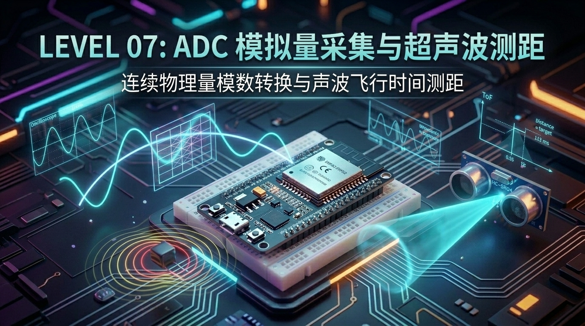
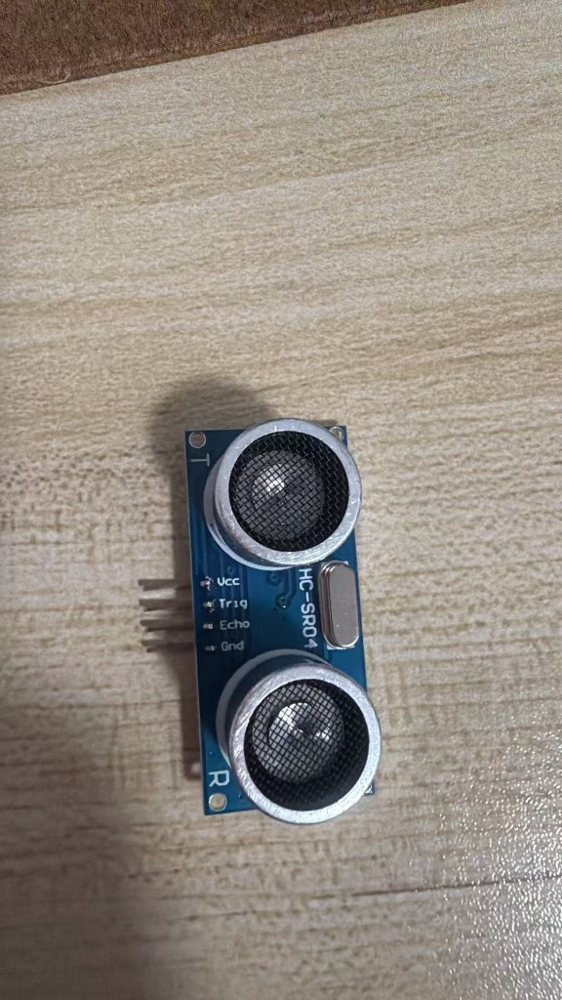

# 第 07 章：感知世界 —— ESP32 模拟量采集(ADC 测温)与超声波飞行时间测距(HC-SR04)



> **写在前面**：在前面的 6 个关卡中，我们和单片机交流的都是**“非黑即白”的数字世界** —— 不是高电平 `1`（3.3V）就是低电平 `0`（0V）。
> 
> 但真实的物理世界从来不是只有 `0` 和 `1`：
> * *房间的温度是连续平滑变化的（比如 26.5℃、26.6℃）；*
> * *物体与单片机的距离也是连续变化的（比如 15.2 厘米、38.6 厘米）。*
> 
> **单片机怎样才能长出一双“能感受温度高低、能测量物体远近”的眼睛呢？**
> 
> 这一章，我们将带领你跨入经典的**【模拟量传感器与物理波形】**世界：
> 1. 解锁 ESP32 内部的 **ADC（模数转换器）**，通过板载 **NTC 热敏电阻** 精准测量环境摄氏度；
> 2. 学习蝙蝠回声定位的奥秘 —— 用 **HC-SR04 超声波探头** 测量微秒级声波飞行时间，实现厘米级精准测距；
> 3. **终极融合**：用 NTC 实时温度反哺校准空气中的超声波声速，做出工业级的雷达测距仪！

---

## 7.1 什么是模拟量与 ADC？—— 单片机的“电子体温计与刻度尺”

在进入代码之前，我们先用生活中的大白话搞清楚什么是数字量、什么是模拟量，以及 ADC 到底在干嘛。

```text
               【数字量 VS 模拟量的直观对比】

   【数字量 (Digital)】: 只有两个台阶 (开/关, 1/0)
   3.3V ───┐       ┌───
           │       │
     0V ───┴───────┴───

   【模拟量 (Analog)】: 像滑梯一样连续平滑变化 (0.1V, 1.25V, 2.88V...)
   3.3V ───┐   ╭───╮
           │  ╭╯   ╰╮
     0V ───┴──╯     ╰───
```

### 📏 什么是 ADC（Analog-to-Digital Converter，模数转换器）？
* 单片机 CPU 的大脑只能处理二进制数字（0 和 1）；
* **ADC 就是一把微型的“数字刻度尺”**：它把输入的连续模拟电压（0V ~ 3.3V），等比例切成很多个小格子，转换成一个数字给 CPU 看！

```text
                  【ESP32 12位 ADC 模数转换原理】

  真实输入电压:     0V ────────── 1.65V ────────── 3.3V
                    │              │              │
                    ▼              ▼              ▼
  ADC 读出的数字:   0 ─────────── 2047 ────────── 4095  (2^12 = 4096 个刻度)
```

> [!NOTE]
> **💡 关键参数：12 位分辨率 (12-bit Resolution)**  
> $2^{12} = 4096$。也就是说，ESP32 会把测量的电压范围平均切成 **4096 份**：
> * 测到 `0V` 时，ADC 输出 `0`；
> * 测到 `1.65V` 时，ADC 输出 `2047`；
> * 测到 `3.3V` 时，ADC 输出 `4095`。

---

## 7.2 NTC 热敏电阻测温：什么是 NTC？怎么把“电阻”变成“摄氏度”？

### 🤔 1. NTC 热敏电阻到底是个啥东西？

**NTC** 是英文 **N**egative **T**emperature **C**oefficient 的缩写，中文翻译为**“负温度系数热敏电阻”**。

```text
               【普通电阻 VS NTC 热敏电阻的区别】

   【普通电阻 (追求稳定)】: 无论春夏秋冬，阻值永远保持 10kΩ 不变。
   
   【NTC 热敏电阻 (温度传感器)】: “脾气反着来” ——
      🔥 外部温度越高 ──► 内部半导体自由电子越活跃 ──► 自身电阻越小 (如 5kΩ)
      ❄️ 外部温度越低 ──► 内部电子活跃度下降     ──► 自身电阻越大 (如 20kΩ)
```

#### 🍳 现实生活中它都在哪里？
你在家里用的很多家电，内部核心测温头其实全都是 NTC：
* **🔥 电热水壶 / 电饭煲 / 烤箱**：锅底紧贴着一颗 NTC，用来精确控温、防止水烧干着火；
* **🔋 手机与充电宝锂电池**：紧贴电芯的小黑头就是 NTC，充电发烫超过 45℃ 时自动断电降速，防止电池爆炸；
* **🖨️ 3D 打印机**：加热喷头旁的测温探针；
* **🚗 汽车发动机**：测量水箱冷却液温度。

---

### ⚡ 2. 核心疑问：单片机怎么测电阻？（分压电路原理）

很多初学者会问：*“ESP32 芯片难道能像万用表一样，直接插两根线量出有多少欧姆吗？”*  
答案是：**不能！单片机“不识欧姆，只认电压”**。

ESP32 内部的 ADC 只能测量 **`0V ~ 3.3V` 的电压**。  
为了测量 NTC 的电阻变化，硬件工程师设计了一个极其巧妙的**“串联分压电路（电阻跷跷板）”**：

```text
                 【NTC 串联分压电路（电阻跷跷板）】

         +3.3V 供电电源
           │
          ┌┴┐
          │ │ R1 (板载 10kΩ 精密固定电阻，稳如泰山)
          └┬┘
           ├────────► 【GPIO36 / ADC1_CH0 测量这里的“中间分压”】
          ┌┴┐
          │ │ NTC (热敏电阻探头：温度越高，电阻越小)
          └┬┘
           │
          GND (0V 地线)
```

#### ⚖️ 电阻分压的“跷跷板”大白话：
1. **天气变热（或你用手指捏住 NTC）**：
   * NTC 的电阻变小（比如从 10kΩ 降到 6kΩ）；
   * 下半部分对地电阻变小，把中间节点的电位强行“拉向地面”；
   * 👉 **`GPIO36` 测到的电压明显下降**。
2. **天气变冷（或往 NTC 上吹冷风）**：
   * NTC 的电阻变大（比如从 10kΩ 涨到 20kΩ）；
   * 下半部分阻力变大，中间节点电压被上面的 3.3V“顶上去”；
   * 👉 **`GPIO36` 测到的电压明显上升**。

---

### 🌡️ 3. 怎么把 ADC 测到的“电压”一步步换算为“摄氏度”？

整个计算流程在单片机内部分为 **3 个清晰的小步骤**：

```text
 ┌───────────────┐     ┌──────────────────┐     ┌──────────────────────┐
 │ 1. ADC 测电压 │ ──► │ 2. 算 NTC 实时阻值 │ ──► │ 3. 套公式算出摄氏度(℃) │
 └───────────────┘     └──────────────────┘     └──────────────────────┘
```

#### 第 1 步：ADC 读出原始采样值
ESP32 的 12 位 ADC 会读出一个 `0 ~ 4095` 之间的数值（记为 $D_{\text{adc}}$）。

#### 第 2 步：根据分压比例算出 NTC 实时阻值 $R_{\text{ntc}}$
根据串联分压公式：
$$V_{\text{out}} = V_{\text{cc}} \times \frac{R_{\text{ntc}}}{R_1 + R_{\text{ntc}}}$$
倒推得到 NTC 当前的真实阻值公式（代码中采用）：
$$R_{\text{ntc}} = R_1 \times \frac{D_{\text{adc}}}{4095 - D_{\text{adc}}}$$
*注：$R_1$ 为板载串联分压固定电阻，阻值为 $10000\ \Omega$（10kΩ）。*

#### 第 3 步：套用经典热力学公式（B 值方程）求出摄氏度
物理学家通过大量实验总结出了热敏电阻材料的 **B 值方程**：

$$\frac{1}{T} = \frac{1}{T_0} + \frac{1}{B} \ln\left(\frac{R_{\text{ntc}}}{R_0}\right)$$

* **$T_0 = 25^\circ\text{C} = 298.15\text{ K}$**（25℃ 常温基准开尔文温度）；
* **$R_0 = 10000\ \Omega$**（25℃ 时的标称基准阻值 10kΩ）；
* **$B = 3950$**（该型号热敏电阻的核心材料常数）；
* **$T$** 算出来是绝对开尔文温度（K），最后只要减去 **$273.15$**，就得到了我们生活中最熟悉的**摄氏度（℃）**！

---

## 7.3 HC-SR04 超声波测距：从倒车雷达到蝙蝠回声定位

除了测量温度，现实世界中另一个最核心的物理量是**距离**。  
单片机怎么才能长出一把**“隔空测距的无形卷尺”**呢？这就是 **HC-SR04 超声波传感器** 的用武之地！

### 🚗 1. 现实生活中的大展身手（它到底有什么用？）

你在日常生活中其实每天都在和它打交道：

| 生活与工业场景 | 它是怎么工作的？ | 对应成熟产品 |
| :--- | :--- | :--- |
| **🚗 汽车倒车雷达** | 装在汽车后保险杠，探测车尾离障碍物有多远。越靠近障碍物，“哔哔哔”报警声越急促。 | 家用轿车、货车倒车系统 |
| **🤖 扫地机与避障小车** | 机器人向前行进时持续发射声波，探测到前方 10cm 内有桌腿或墙壁立即减速刹车并拐弯。 | 扫地机器人、AGV 搬运车 |
| **🚰 智能水箱 / 水位监测** | 探头安装在水箱顶部朝下探测水面，实时测量水面距离，无需接触水体即可算出剩余水位。 | 智能水表、油罐物位计 |
| **🗑️ 感应自动翻盖垃圾桶** | 人手或膝盖靠近垃圾桶上方 15cm 范围，自动开盖，离开后倒计时关闭。 | 智能家居感应垃圾桶 |

---

### 🦇 2. 蝙蝠回声定位的声波飞行时间（ToF）原理

HC-SR04 模块就像单片机的一双“大眼睛”，采用的是大自然中海豚与蝙蝠的**“回声定位”**原理：

```text
              【HC-SR04 超声波飞行时间 (ToF) 测距时序图】

  1. ESP32 (GPIO32 Trig) 发送 10µs 启动脉冲:
     ┌──┐
  ───┘  └─── (10微秒高电平)

  2. 模块 T 探头发射 8 周期 40kHz 超声波束:
     ~~( ( ( ( ( ( ( ( 🔊 40kHz 超声波向外飞行 ──► [ 🧱 遇到前方障碍物 ]
                                                      │ (被反弹折返)
  3. 模块 R 探头接收回声，同时 GPIO33 Echo 输出高电平:   ▼
     ┌───────────────────────────────────────────────┐ ◄── 回声接收完毕变低
  ───┘                                               └───
     ◄─────────── 测量这段高电平持续的时间 t (微秒) ────────►
```

---

### 📐 3. 测距核心算术（小学数学秒懂）

声音在空气中的传播速度大约是 **340 米/秒（即 0.034 厘米/微秒）**。  
因为超声波从发出到弹回走的是**“往返双程路”**，所以单程物理距离公式为：

$$\text{距离 } S = \frac{\text{Echo 持续时间 } t \times 0.034\text{ cm/\mu s}}{2} = \frac{t}{58.8}\text{ 厘米}$$

* **计算示例**：如果 ESP32 测得 Echo 引脚的高电平持续了 **588 微秒**，那么目标物体的真实距离就是：  
  $$S = \frac{588}{58.8} = \mathbf{10.0\text{ 厘米}}$$

---

### 📊 4. 测量范围、精度与物理极限（为什么有 2cm 盲区与 4m 上限？）

| 参数指标 | 规格数值 | 实际体验说明 |
| :--- | :--- | :--- |
| **📏 有效测量范围** | **`2 cm` ～ `400 cm` (0.02 米 ~ 4 米)** | 最适合桌面级实验、室内避障与近距离测距 |
| **🚫 测量下限（盲区）** | **`< 2 cm` (小于 2 厘米测不到)** | **物理盲区**：太近了回声瞬间弹回，探头来不及从发射切换到接收 |
| **🛑 测量上限（极限）** | **`400 cm` (4 米)** | 超过 4 米后，声波在空气中衰减太微弱，接收探头无法识别 |
| **🎯 测量精度** | **约 `0.3 cm` (3 毫米)** | 灵敏度极高，手掌微微晃动都能敏锐察觉 |
| **📐 探测波束角** | **约 `15°` 锥形视场** | 发射的是类似手电筒光束的“扇形声波”，具备一定角度覆盖面 |

#### 🔍 深度拆解：为什么会有“2cm 盲区”和“4m 上限”？
1. **为什么 2cm 以内测不准（盲区效应）？**
   * 模块发射 40kHz 声波时，压电陶瓷晶片处于强烈振荡状态，发射完毕后会有微弱的**“机械余震”**；
   * 声音走完 2 厘米往返只需要约 $116 \mu s$。如果物体贴得过近（如 1cm），回声在余震还没结束时就撞回来了，接收电路无法分辨这是“自身余震”还是“真实回声”，因此 **2cm 以内是物理盲区**。
2. **为什么上限是 4 米？**
   * 声波在空气中以球面波扩散，能量随传播距离呈**平方反比衰减**（往返 4 米相当于传播了 8 米）；
   * 超出 4 米后反射信号极其微弱，且我们的驱动代码设置了 **30ms（约 5.1 米）** 的防卡死超时保护，一旦超时立即判定为 `Out of Range`（超出量程）。

---

## 7.4 🔌 外置硬件准备与实物接线指南 (保姆级图解)

很多初学者打开这一章最大的疑问是：**“需要我插什么外置元器件？插哪里？怎么插？”**  
在本关卡中，开发板已经为我们预留好了标准的即插即用插座，**无需复杂的面包板接线，直接对准插座插入即可**！

### 📦 1. 硬件物料清单与外观识别

| 元件名称 | 实物外观特征 | 作用与物理原理 | 插入插座位置 |
| :--- | :--- | :--- | :--- |
| **NTC 热敏电阻** | 黑色/深色水滴状探头，拖着两根细长的金属引脚 | 阻值随温度变化，用于 ADC 测量环境温度 | **`JP4`** (2-Pin 白色插座) |
| **HC-SR04 超声波探头** | 蓝色长方形电路板，带有两只并排的金属“大眼睛”和 4 根排针 | 40kHz 声波测距，测量物体微秒级飞行时间 | **`JP2`** (4-Pin 白色母座) |

---

### 🗺️ 2. 开发板插座位置与引脚连接图

```text
 ┌─────────────────────────────────────────────────────────────┐
 │                      ESP32 实战开发板                        │
 │                                                             │
 │   【JP4 插座】(2-Pin)               【JP2 插座】(4-Pin)       │
 │   ┌────────┐                        ┌──────────────┐        │
 │   │  [..]  │ ◄── NTC 热敏电阻         │  [....]      │ ◄── HC-SR04 超声波
 │   └────────┘   (无极性，两脚直接插)    └──────────────┘   (两只眼睛朝板外)
 │    Pin 1: GPIO36 (ADC1_CH0 / VP)     Pin 1: +3.3V 供电      │
 │    Pin 2: GND (地线)                 Pin 2: Trig (GPIO32)   │
 │                                      Pin 3: Echo (GPIO33)   │
 │                                      Pin 4: GND (地线)      │
 └─────────────────────────────────────────────────────────────┘
```

---

### 🛠️ 3. 手把手实物接入步骤与实物照片对照

#### ① 接入 HC-SR04 超声波模块（插至 `JP2`）：



* **识别实物标识（如上图实物所示）**：
  * 模块正面有两只金属圆形网罩“眼睛”：上面标注 **`T`（Transmitter，超声波发射端）**，下面标注 **`R`（Receiver，超声波接收端）**；
  * 左侧有 4 根 90° 弯折排针，电路板正面清晰印着 4 个引脚名字：**`Vcc`**、**`Trig`**、**`Echo`**、**`Gnd`**。
* **接入开发板 `JP2` 插座**：
  * 找到开发板边缘的 **`JP2`**（4孔白色母座，旁边印有 `VCC / Trig / Echo / GND`）；
  * 将模块的 4 根弯针直接插入 `JP2` 插座中；
  * **引脚对齐检查（一一对应，无需跳线）**：
    * 模块 **`Vcc`**（靠近 T 端） $\rightarrow$ 对准开发板 `JP2` 的 **`Pin 1 (+3.3V)`**
    * 模块 **`Trig`** $\rightarrow$ 对准开发板 `JP2` 的 **`Pin 2 (GPIO32)`**
    * 模块 **`Echo`** $\rightarrow$ 对准开发板 `JP2` 的 **`Pin 3 (GPIO33)`**
    * 模块 **`Gnd`**（靠近 R 端） $\rightarrow$ 对准开发板 `JP2` 的 **`Pin 4 (GND)`**
  * **朝向效果**：插好后，两个金属大眼睛自然朝向板子外侧前方，方便正对前方障碍物发射声波。

---

#### ② 接入 NTC 热敏电阻（插至 `JP4`）：
* **找到插座**：在开发板上找到标有 **`JP4`**（或丝印标有 `NTC / TEMP`）的 2-Pin 插座；
* **极性说明**：NTC 热敏电阻（黑色小水滴状探头）属于纯电阻元件，**完全无极性（不分正反方向、不分正负极）**；
* **操作方法**：直接将两根细金属引脚分别插入 `JP4` 的两个小孔中即可。

---

### 🔍 4. 硬件引脚速查表

| 外设模块 | 引脚名称 | 对应开发板 GPIO | 模式与功能说明 | 关键注意事项 |
| :--- | :--- | :--- | :--- | :--- |
| **NTC 热敏电阻** | **`NTC_PIN`** | **`GPIO36 (VP)`** | ADC1 通道 0 (`ADC_CHANNEL_0`) | **仅支持输入！** 切勿配置为输出。 |
| **HC-SR04 超声波** | **`TRIG` (触发)** | **`GPIO32`** | GPIO 输出 (发出 10µs 触发脉冲) | 纯数字引脚。 |
| **HC-SR04 超声波** | **`ECHO` (回响)** | **`GPIO33`** | GPIO 输入 (测量回响高电平时间) | 纯数字引脚。 |

---

### 🚨 5. 超声波与 ADC 调试避坑黄金法则

> [!CAUTION]
> **💥 避坑 1：ESP32 为什么优先使用 ADC1，而不是 ADC2？**
> * ESP32 内部有两组 ADC：`ADC1`（GPIO32~39）和 `ADC2`（GPIO0, 2, 4, 12~15, 25~27）；
> * **`ADC2` 与 Wi-Fi 硬件内部共用硬件资源**。一旦开启 Wi-Fi 联网，`ADC2` 就会被 Wi-Fi 强制占用导致读数全为 0 或报错！
> * 👉 **法则**：做传感器采集时，**一律优先选用 ADC1 的引脚（如 GPIO36）**，永远不与 Wi-Fi 冲突！

> [!TIP]
> **💡 避坑 2：超声波测距必须设置“防卡死超时保护”**
> * 如果前方没有任何障碍物（一片开阔地），发射出去的超声波永远不会反弹折返；
> * 如果代码傻傻死等 Echo 变低，任务就会彻底死锁卡死！
> * 👉 **法则**：在代码中设置 **30 毫秒超时限制**（声波往返 30ms 相当于测距超过 5 米极限范围），一旦超时立即判定为“超出量程”，绝不死等！

---

## 7.5 📚 核心库函数功能字典与关键参数解密（小白必读）

在进入实战代码之前，我们先把本章出现的所有**全新库函数与关键技术参数**做一次地毯式拆解。就像学做菜前先认识调料一样，看懂了这些函数，后面的代码你就能像读故事一样轻松看懂！

---

### 1. 🛠️ 本章引入的全新头文件与 CMake 依赖

| 头文件 | 作用说明 | 对应 CMake REQUIRES | 核心函数 / 宏 |
| :--- | :--- | :--- | :--- |
| **`"esp_adc/adc_oneshot.h"`** | **ADC 单次模数转换驱动** | **`esp_adc`** | `adc_oneshot_new_unit()`、`adc_oneshot_config_channel()`、`adc_oneshot_read()` |
| **`"esp_rom_sys.h"`** | **硬件级微秒忙等待延时** | 系统自带 (无需额外依赖) | `esp_rom_delay_us()` (专用于 10µs 级别极短延时) |
| **`"esp_timer.h"`** | **高精度硬件微秒时间戳** | `esp_timer` | `esp_timer_get_time()` (获取开机微秒数，用于声波 ToF 计时) |
| **`"math.h"`** | **标准 C 数学计算库** | 系统自带 (无需额外依赖) | `log()` (计算自然对数 $\ln(x)$，用于 B 值热力学方程) |

> [!WARNING]
> **💥 编译避坑提示**：
> 在 ESP-IDF v6 中，使用 ADC Oneshot 驱动必须在 [`main/CMakeLists.txt`](../main/CMakeLists.txt) 中的 `REQUIRES` 后面添加 **`esp_adc`**，否则编译时会提示找不到头文件！

---

### 2. 🎛️ ADC 驱动配置三步法（为什么每个参数都要这么配？）

在 ESP-IDF 最新官方驱动中，ADC 采用了现代化的 **Oneshot（单次触发）驱动模型**。初始化 ADC 必须经过标准的 **3 步流水线**：


#### ① 第一步：`adc_oneshot_new_unit(&init_config, &adc_handle)`
* **生活比喻**：从芯片工具箱里申领一把“数字刻度尺”。
* **参数 `.unit_id = ADC_UNIT_1`**：选择使用 **ADC1**（引脚对应 GPIO32~39）。正如前面避坑指南所讲，ADC1 永远不与 Wi-Fi 硬件冲突，是最安全的测量单元。

#### ② 第二步：`adc_oneshot_config_channel(adc_handle, channel, &chan_config)`
这是初学者最容易懵圈的一步，我们把两个核心参数彻底讲透：

1. **`.bitwidth = ADC_BITWIDTH_12`（12 位分辨率）**：
   * $2^{12} = 4096$。意味着将电压等比例切成 **4096 个微小刻度（0 ~ 4095）**；
   * 刻度越密，测量的电压越精准（最小能分辨约 0.8 毫伏的微小变化）。
2. **`.atten = ADC_ATTEN_DB_12`（12dB 衰减器，核心关键 ⚠️）**：
   * **为什么需要衰减器？** ESP32 内部 ADC 原始测量的物理电压范围其实只有 `0V ~ 1.1V`（超过 1.1V 就会爆表溢出）；
   * 开启 **12dB 衰减（Attenuation）** 后，芯片内部会自动接入分压衰减网络，将实际测量上限**从 1.1V 扩展到 3.3V（即 0 ~ 3300mV）**！
   * 👉 **铁律**：只要测量开发板上的 3.3V 传感器（如 NTC、电位器），**必须配置为 `ADC_ATTEN_DB_12`**，否则电压一超过 1.1V 读数就会全卡死在 4095！

#### ③ 第三步：`adc_oneshot_read(adc_handle, NTC_ADC_CHANNEL, &raw_val)`
* **作用**：命令 ADC 硬件瞬间对目标引脚（`GPIO36`）进行一次采样，将结果存入 `raw_val` 中；
* **读数范围**：`0 ~ 4095`（0 代表 0V，4095 代表 3.3V）。

---

### 3. ⏱️ 微秒级时间捕获：为什么延时 10µs 不能用 `vTaskDelay()`？

在超声波测距中，我们需要产生一个 **10 微秒（10µs）** 的超短脉冲，并且测量声波飞行的 **微秒时间**。这里有两个关键函数：

#### ① 为什么发射脉冲必须用 `esp_rom_delay_us(10)`？
* **`vTaskDelay(pdMS_TO_TICKS(1))`**：FreeRTOS 的系统延时，它的**最小刻度是 1 毫秒（1000 微秒）**！如果你用它延时，就像用“米尺”去量“蚂蚁的触角”，根本无法做到 10 微秒的精准控制；
* **`esp_rom_delay_us(10)`**：直接调用芯片内部 ROM 的硬件级空循环指令，实现**微秒级（$\mu s$）的绝对精准忙等待**！

#### ② 为什么飞行时间用 `esp_timer_get_time()`？
* **作用**：读取 ESP32 内部 64 位高精度硬件定时器从开机至今走过的**微秒数（1 秒 = 1,000,000 微秒）**；
* **测距原理**：
  * 在 Echo 变高电平的瞬间打一个时间戳：`echo_start = esp_timer_get_time()`；
  * 在 Echo 变低电平的瞬间再打一个时间戳：`echo_end = esp_timer_get_time()`；
  * 两个时间戳一减：`duration_us = echo_end - echo_start`，就得到了声波在空气中飞行往返的精准微秒数！

---

## 7.6 实战第 1 步：ADC 单次采样与电压测量（Hello ADC）

我们先从最基础的模数转换开始，学习如何用刚刚掌握的 **ADC Oneshot 驱动**，测量 `GPIO36` 的原始数字与转换电压！

> 📁 **配套源码文件**：[`code/07_adc_ultrasonic/01_adc_raw.c`](../code/07_adc_ultrasonic/01_adc_raw.c)  
> ⚡ **一键切换运行**：在终端运行 `./switch_code.sh 7 1 --flash` 即可秒级切换并自动烧录！

### 🌟 实验 1 完整代码：

```c
#include <stdio.h>
#include "freertos/FreeRTOS.h"
#include "freertos/task.h"
#include "esp_log.h"
#include "esp_adc/adc_oneshot.h"

static const char *TAG = "EXP1_ADC_RAW";

#define NTC_ADC_UNIT        ADC_UNIT_1
#define NTC_ADC_CHANNEL     ADC_CHANNEL_0 // GPIO36 (VP)

void app_main(void)
{
    // 1. 初始化 ADC1 单元
    adc_oneshot_unit_handle_t adc_handle;
    adc_oneshot_unit_init_cfg_t init_config = {
        .unit_id = NTC_ADC_UNIT,
    };
    ESP_ERROR_CHECK(adc_oneshot_new_unit(&init_config, &adc_handle));

    // 2. 配置通道 0：12位分辨率 + 12dB 衰减 (测量范围 0 ~ 3.3V)
    adc_oneshot_chan_cfg_t chan_config = {
        .bitwidth = ADC_BITWIDTH_12,
        .atten = ADC_ATTEN_DB_12,
    };
    ESP_ERROR_CHECK(adc_oneshot_config_channel(adc_handle, NTC_ADC_CHANNEL, &chan_config));

    ESP_LOGI(TAG, "✅ ADC1 Channel 0 (GPIO36) 初始化成功！");

    while (1) {
        int raw_val = 0;
        // 3. 读取 ADC 原始值 (0 ~ 4095)
        ESP_ERROR_CHECK(adc_oneshot_read(adc_handle, NTC_ADC_CHANNEL, &raw_val));
        
        // 简易换算估算电压 (毫伏 mV)
        int voltage_mv = raw_val * 3300 / 4095;

        ESP_LOGI(TAG, "📊 ADC 原始数值: %4d | 估算电压: %4d mV", raw_val, voltage_mv);
        vTaskDelay(pdMS_TO_TICKS(500));
    }
}
```

---

## 7.7 实战第 2 步：NTC 阻值计算与精准摄氏度测量

学会读电压后，我们套用 B值方程，把电压精准换算为环境温度（℃）！

> 📁 **配套源码文件**：[`code/07_adc_ultrasonic/02_ntc_temperature.c`](../code/07_adc_ultrasonic/02_ntc_temperature.c)  
> ⚡ **一键切换运行**：在终端运行 `./switch_code.sh 7 2 --flash` 即可秒级切换并自动烧录！

### 🌟 实验 2 完整代码：NTC 摄氏度温度计：

```c
#include <stdio.h>
#include <math.h>
#include "freertos/FreeRTOS.h"
#include "freertos/task.h"
#include "esp_log.h"
#include "esp_adc/adc_oneshot.h"

static const char *TAG = "EXP2_NTC_TEMP";

#define NTC_ADC_UNIT        ADC_UNIT_1
#define NTC_ADC_CHANNEL     ADC_CHANNEL_0 // GPIO36
#define NTC_B_VALUE         3950.0f       // 热敏电阻 B 常数
#define NTC_R_SERIES        10000.0f      // 板载串联分压电阻 10kΩ
#define NTC_R25             10000.0f      // 25℃ 时的基准阻值 10kΩ
#define NTC_T25_KELVIN      298.15f       // 25℃ 对应的开尔文温度 (273.15 + 25)

static float read_ntc_temperature(adc_oneshot_unit_handle_t handle)
{
    int raw_val = 0;
    adc_oneshot_read(handle, NTC_ADC_CHANNEL, &raw_val);
    if (raw_val <= 0 || raw_val >= 4095) return -999.0f; // 异常保护

    // 1. 根据分压电路计算 NTC 实时阻值
    float v_ratio = (float)raw_val / (4095.0f - (float)raw_val);
    float r_ntc = NTC_R_SERIES * v_ratio;

    // 2. 套用 B 值方程计算开尔文温度
    float kelvin = 1.0f / ( (1.0f / NTC_T25_KELVIN) + (log(r_ntc / NTC_R25) / NTC_B_VALUE) );
    
    // 3. 换算为人类熟悉的摄氏度
    return kelvin - 273.15f;
}

void app_main(void)
{
    adc_oneshot_unit_handle_t adc_handle;
    adc_oneshot_unit_init_cfg_t init_config = { .unit_id = NTC_ADC_UNIT };
    ESP_ERROR_CHECK(adc_oneshot_new_unit(&init_config, &adc_handle));

    adc_oneshot_chan_cfg_t chan_config = {
        .bitwidth = ADC_BITWIDTH_12,
        .atten = ADC_ATTEN_DB_12,
    };
    ESP_ERROR_CHECK(adc_oneshot_config_channel(adc_handle, NTC_ADC_CHANNEL, &chan_config));

    while (1) {
        float temp_c = read_ntc_temperature(adc_handle);
        ESP_LOGI(TAG, "🌡️ 当前环境温度: \033[32m%.2f ℃\033[0m", temp_c);
        vTaskDelay(pdMS_TO_TICKS(1000));
    }
}
```

> [!TIP]
> **💡 动手试试看**：用你的大拇指和食指捏住板子上的 NTC 热敏电阻探头，观察串口终端，你会看到温度立刻从 25℃ 慢慢爬升到 32℃ 左右！放开手指后又会慢慢降回室温！

---

## 7.8 实战第 3 步：HC-SR04 超声波微秒级声波测距

温度搞定了，接下来我们让 ESP32 测量声波在空气中飞行的时间，实现厘米级精准测距！

> 📁 **配套源码文件**：[`code/07_adc_ultrasonic/03_ultrasonic_distance.c`](../code/07_adc_ultrasonic/03_ultrasonic_distance.c)  
> ⚡ **一键切换运行**：在终端运行 `./switch_code.sh 7 3 --flash` 即可秒级切换并自动烧录！

### 🌟 实验 3 完整代码：超声波微秒测距仪：

```c
#include <stdio.h>
#include "freertos/FreeRTOS.h"
#include "freertos/task.h"
#include "driver/gpio.h"
#include "esp_timer.h"
#include "esp_log.h"
#include "esp_rom_sys.h"

static const char *TAG = "EXP3_ULTRASONIC";

#define TRIG_PIN    GPIO_NUM_32
#define ECHO_PIN    GPIO_NUM_33

static void ultrasonic_init(void)
{
    // 1. 配置 Trig 为输出引脚
    gpio_config_t trig_conf = {
        .pin_bit_mask = (1ULL << TRIG_PIN),
        .mode = GPIO_MODE_OUTPUT,
        .pull_down_en = GPIO_PULLDOWN_DISABLE,
        .pull_up_en = GPIO_PULLUP_DISABLE,
    };
    gpio_config(&trig_conf);
    gpio_set_level(TRIG_PIN, 0);

    // 2. 配置 Echo 为输入引脚
    gpio_config_t echo_conf = {
        .pin_bit_mask = (1ULL << ECHO_PIN),
        .mode = GPIO_MODE_INPUT,
        .pull_down_en = GPIO_PULLDOWN_DISABLE,
        .pull_up_en = GPIO_PULLUP_DISABLE,
    };
    gpio_config(&echo_conf);
}

static float measure_distance_cm(void)
{
    // 1. 发射 10 微秒的高电平触发脉冲
    gpio_set_level(TRIG_PIN, 0);
    esp_rom_delay_us(2);
    gpio_set_level(TRIG_PIN, 1);
    esp_rom_delay_us(10);
    gpio_set_level(TRIG_PIN, 0);

    // 2. 等待 Echo 变高电平 (带 30ms 超时保护)
    int64_t start_wait = esp_timer_get_time();
    while (gpio_get_level(ECHO_PIN) == 0) {
        if (esp_timer_get_time() - start_wait > 30000) return -1.0f; // 超时
    }

    // 3. 记录高电平开始时刻
    int64_t echo_start = esp_timer_get_time();

    // 4. 等待 Echo 变低电平
    while (gpio_get_level(ECHO_PIN) == 1) {
        if (esp_timer_get_time() - echo_start > 30000) return -1.0f; // 超时
    }
    int64_t echo_end = esp_timer_get_time();

    // 5. 计算持续时间并换算为厘米
    int64_t duration_us = echo_end - echo_start;
    return (float)duration_us / 58.8f;
}

void app_main(void)
{
    ultrasonic_init();
    ESP_LOGI(TAG, "📡 HC-SR04 超声波测距模块已就绪 (Trig: GPIO32, Echo: GPIO33)");

    while (1) {
        float distance = measure_distance_cm();
        if (distance > 0) {
            ESP_LOGI(TAG, "📏 目标距离: \033[36m%6.1f cm\033[0m (%4.2f m)", distance, distance / 100.0f);
        } else {
            ESP_LOGW(TAG, "⚠️ 超出量程或无障碍物 (Out of Range)");
        }
        vTaskDelay(pdMS_TO_TICKS(300));
    }
}
```

---

## 7.9 实战第 4 步：高阶质变 —— 用 NTC 温度实时补偿超声波声速

此时我们迎来了一个真正的**工业级物理学细节**：
* 很多人以为声音在空气中的速度永远是固定的 `340 m/s`；
* **但实际上，气温越高，空气分子越活跃，声速越快！**
* 物理学标准公式：$v = 331.3 + 0.606 \times T\text{ (m/s)}$

| 环境温度 | 真实空气声速 | 如果固定用 340m/s 计算的误差 |
| :---: | :---: | :---: |
| **0 ℃ (冬天严寒)** | **331.3 m/s** | 误差高达 **+2.6%**（测得距离偏大） |
| **25 ℃ (常温室内)** | **346.5 m/s** | 误差约 **-1.9%** |
| **40 ℃ (夏天酷暑)** | **355.5 m/s** | 误差高达 **-4.5%**（测得距离明显偏小） |

```text
 ┌─────────────────────────────────────────────────────────────┐
 │               【温声融合算法闭环】                          │
 │                                                             │
 │   1. NTC 测得环境温度 T = 30.0 ℃                             │
 │                  │                                          │
 │                  ▼                                          │
 │   2. 动态计算实时声速 v = 331.3 + 0.606 * 30 = 349.48 m/s    │
 │                  │                                          │
 │                  ▼                                          │
 │   3. 带入超声波飞行时间 t，计算出 100% 真实物理距离！         │
 └─────────────────────────────────────────────────────────────┘
```

---

## 7.10 实战第 5 步：终极综合大工程 —— 双任务温声融合环境监测雷达

以下是融合了 **FreeRTOS 多任务调度**、**ADC 测温**、**HC-SR04 超声波测距** 以及 **实时声速动态温度补偿** 的完整工程源码：

> 📁 **配套源码文件**：[`code/07_adc_ultrasonic/04_radar_integrated.c`](../code/07_adc_ultrasonic/04_radar_integrated.c)  
> ⚡ **一键切换运行**：在终端运行 `./switch_code.sh 7 4 --flash` 即可秒级切换并自动烧录！

```c
/**
 * 🌟 ESP32 物联网实战 —— 第 07 关：ADC 模拟量采集与超声波测距
 *    主控架构: ESP32-D0WD-V3 (8MB Flash + 2MB PSRAM)
 *    外设分配: NTC 测温 (GPIO36), 超声波 Trig(GPIO32), Echo(GPIO33)
 */
#include <stdio.h>
#include <math.h>
#include "freertos/FreeRTOS.h"
#include "freertos/task.h"
#include "driver/gpio.h"
#include "esp_timer.h"
#include "esp_log.h"
#include "esp_rom_sys.h"
#include "esp_adc/adc_oneshot.h"

static const char *TAG = "LEVEL07_RADAR";

/* 引脚定义 */
#define NTC_ADC_UNIT        ADC_UNIT_1
#define NTC_ADC_CHANNEL     ADC_CHANNEL_0 // GPIO36 (VP)
#define ULTRASONIC_TRIG_PIN GPIO_NUM_32
#define ULTRASONIC_ECHO_PIN GPIO_NUM_33

/* NTC 算法常数 */
#define NTC_B_VALUE         3950.0f
#define NTC_R_SERIES        10000.0f
#define NTC_R25             10000.0f
#define NTC_T25_KELVIN      298.15f

/* 全局共享数据 (多任务安全访问) */
static volatile float g_current_temperature = 25.0f; // 默认 25℃
static adc_oneshot_unit_handle_t s_adc_handle = NULL;

/* 1. NTC 测温驱动初始化与采样 */
static void ntc_sensor_init(void)
{
    adc_oneshot_unit_init_cfg_t init_config = { .unit_id = NTC_ADC_UNIT };
    ESP_ERROR_CHECK(adc_oneshot_new_unit(&init_config, &s_adc_handle));

    adc_oneshot_chan_cfg_t chan_config = {
        .bitwidth = ADC_BITWIDTH_12,
        .atten = ADC_ATTEN_DB_12,
    };
    ESP_ERROR_CHECK(adc_oneshot_config_channel(s_adc_handle, NTC_ADC_CHANNEL, &chan_config));
}

static float ntc_get_temperature(void)
{
    int raw_val = 0;
    adc_oneshot_read(s_adc_handle, NTC_ADC_CHANNEL, &raw_val);
    if (raw_val <= 0 || raw_val >= 4095) return 25.0f;

    float v_ratio = (float)raw_val / (4095.0f - (float)raw_val);
    float r_ntc = NTC_R_SERIES * v_ratio;
    float kelvin = 1.0f / ((1.0f / NTC_T25_KELVIN) + (log(r_ntc / NTC_R25) / NTC_B_VALUE));
    return kelvin - 273.15f;
}

/* 2. 超声波引脚初始化与测距 */
static void ultrasonic_sensor_init(void)
{
    gpio_config_t trig_conf = {
        .pin_bit_mask = (1ULL << ULTRASONIC_TRIG_PIN),
        .mode = GPIO_MODE_OUTPUT,
    };
    gpio_config(&trig_conf);
    gpio_set_level(ULTRASONIC_TRIG_PIN, 0);

    gpio_config_t echo_conf = {
        .pin_bit_mask = (1ULL << ULTRASONIC_ECHO_PIN),
        .mode = GPIO_MODE_INPUT,
    };
    gpio_config(&echo_conf);
}

static float ultrasonic_get_distance(float current_temp)
{
    // 发射 10us 脉冲
    gpio_set_level(ULTRASONIC_TRIG_PIN, 0);
    esp_rom_delay_us(2);
    gpio_set_level(ULTRASONIC_TRIG_PIN, 1);
    esp_rom_delay_us(10);
    gpio_set_level(ULTRASONIC_TRIG_PIN, 0);

    // 等待 Echo 变高
    int64_t start_wait = esp_timer_get_time();
    while (gpio_get_level(ULTRASONIC_ECHO_PIN) == 0) {
        if (esp_timer_get_time() - start_wait > 30000) return -1.0f;
    }

    int64_t echo_start = esp_timer_get_time();
    while (gpio_get_level(ULTRASONIC_ECHO_PIN) == 1) {
        if (esp_timer_get_time() - echo_start > 30000) return -1.0f;
    }
    int64_t echo_end = esp_timer_get_time();

    int64_t duration_us = echo_end - echo_start;

    // 💡 核心：动态温度补偿声速计算公式 (cm/us)
    float sound_speed_m_s = 331.3f + (0.606f * current_temp);
    float sound_speed_cm_us = sound_speed_m_s / 10000.0f;

    return (float)duration_us * sound_speed_cm_us / 2.0f;
}

/* 3. 后台独立测温任务 (每秒采集一次) */
static void task_temperature_monitor(void *arg)
{
    ESP_LOGI(TAG, "🌡️ NTC 测温任务已就绪...");
    while (1) {
        g_current_temperature = ntc_get_temperature();
        vTaskDelay(pdMS_TO_TICKS(1000));
    }
}

/* 4. 主超声波雷达扫描任务 (每 250ms 测距一次) */
static void task_radar_scan(void *arg)
{
    ESP_LOGI(TAG, "📡 超声波雷达扫描任务已就绪...");
    while (1) {
        float temp = g_current_temperature;
        float dist = ultrasonic_get_distance(temp);

        if (dist > 0 && dist < 400.0f) {
            ESP_LOGI(TAG, "🎯 [目标检测] 距离: \033[36m%6.1f cm\033[0m | 环境温度: \033[32m%5.1f ℃\033[0m | 补偿声速: %5.1f m/s",
                     dist, temp, 331.3f + 0.606f * temp);
        } else {
            ESP_LOGW(TAG, "🔭 [雷达空载] 前方无障碍物或超出量程 | 环境温度: %.1f ℃", temp);
        }
        vTaskDelay(pdMS_TO_TICKS(250));
    }
}

void app_main(void)
{
    ESP_LOGI(TAG, "============================================================");
    ESP_LOGI(TAG, "🚀 LEVEL 07: ESP32 ADC 模拟量采集与超声波飞行时间测距");
    ESP_LOGI(TAG, "   硬件引脚: NTC (GPIO36), 超声波 Trig(GPIO32)/Echo(GPIO33)");
    ESP_LOGI(TAG, "============================================================");

    ntc_sensor_init();
    ultrasonic_sensor_init();

    xTaskCreate(task_temperature_monitor, "Task_NTC", 3072, NULL, 2, NULL);
    xTaskCreate(task_radar_scan, "Task_Radar", 3072, NULL, 3, NULL);
}
```

---

## 7.10 烧录与串口监视实验效果

在 VS Code 终端中执行构建与烧录：

```bash
idf.py build
idf.py -p COMx flash monitor
```

### 📺 串口终端输出日志：

```text
I (315) LEVEL07_RADAR: ============================================================
I (322) LEVEL07_RADAR: 🚀 LEVEL 07: ESP32 ADC 模拟量采集与超声波飞行时间测距
I (330) LEVEL07_RADAR:    硬件引脚: NTC (GPIO36), 超声波 Trig(GPIO32)/Echo(GPIO33)
I (338) LEVEL07_RADAR: ============================================================
I (346) LEVEL07_RADAR: 🌡️ NTC 测温任务已就绪...
I (354) LEVEL07_RADAR: 📡 超声波雷达扫描任务已就绪...
I (610) LEVEL07_RADAR: 🎯 [目标检测] 距离:   15.4 cm | 环境温度:  26.3 ℃ | 补偿声速: 347.2 m/s
I (860) LEVEL07_RADAR: 🎯 [目标检测] 距离:   15.5 cm | 环境温度:  26.3 ℃ | 补偿声速: 347.2 m/s
I (1110) LEVEL07_RADAR: 🎯 [目标检测] 距离:   28.2 cm | 环境温度:  26.4 ℃ | 补偿声速: 347.3 m/s
I (1360) LEVEL07_RADAR: 🎯 [目标检测] 距离:   45.8 cm | 环境温度:  26.4 ℃ | 补偿声速: 347.3 m/s
W (1610) LEVEL07_RADAR: 🔭 [雷达空载] 前方无障碍物或超出量程 | 环境温度: 26.4 ℃
```

---

## 7.11 本章总结与通关思考题

### 🌟 核心知识收获清单：
1. **连续物理量模数转换（ADC）**：掌握了 12 位 ADC（0~4095 刻度）将电压转为数字的物理原理；
2. **NTC 热敏电阻算法**：掌握了串联分压电路与 B值方程在摄氏度测量中的完整数学换算链条；
3. **超声波飞行时间法（ToF）**：掌握了 10µs 触发脉冲、40kHz 声波往返与微秒级定时测距机制；
4. **温声融合算法**：学会了用 NTC 测得的环境温度实时校准空气声速（$v = 331.3 + 0.606 \times T$），消除了 4% 以上的物理环境误差；
5. **硬件设计避坑**：深刻理解了 `ADC1`（与 Wi-Fi 不冲突）与 `ADC2` 的关键区别，以及超声波 30ms 防卡死超时保护。

### 🧠 通关思考题：
* **思考题 1**：为什么测温时如果用手一直按住 NTC 电阻，ADC 读到的原始数字会不断变小？
* **思考题 2**：如果将超声波模块安装在移动小车上做避障雷达，当距离小于 15cm 时触发蜂鸣器报警，代码应该如何与 FreeRTOS 队列进行联动？
