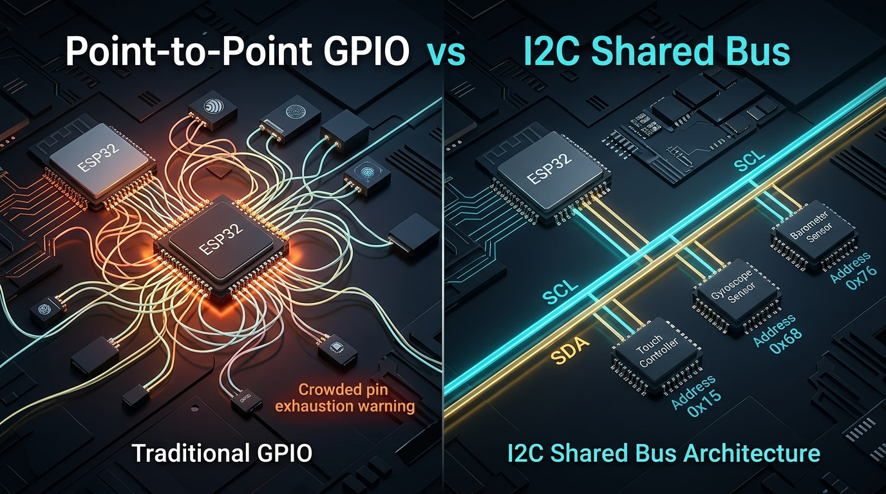
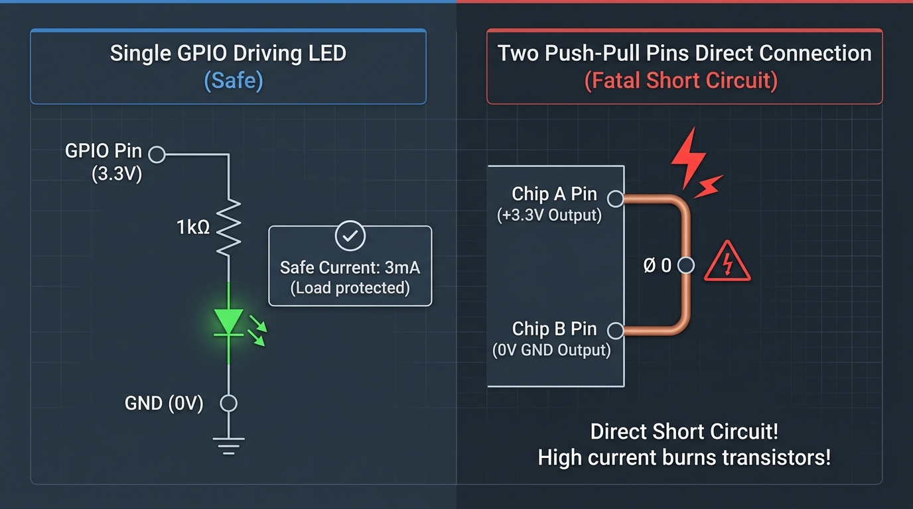
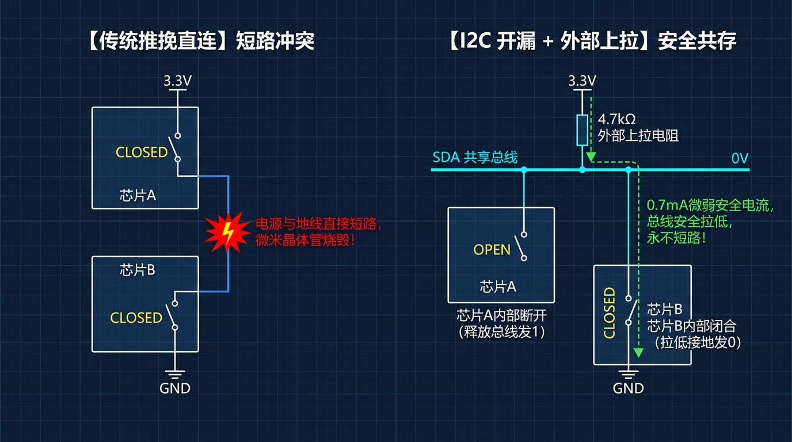

# 第 08 关：I2C 硬件总线探秘与 DHT11 单总线温湿度解析

---

## 📖 本章导读

在前几关中，我们学会了用 GPIO 高低电平点亮 LED、用 ADC 采集连续变化的模拟电压、用定时器测量脉冲宽度。但不知你是否发现了一个巨大的瓶颈：  
**每个电子器件都要占用 1~2 个独立的单片机引脚！**

如果有 10 个传感器，单片机的引脚很快就会被彻底耗尽。更麻烦的是：面对智能电容触摸屏、高精度环境传感器、六轴陀螺仪等复杂器件，单凭简单的“高低电平”根本无法传递复杂的结构化数据。

在这一关中，我们将跨入**“芯片级数字通信总线”**的宏伟世界：
1. 深入剖析 **I2C 双线制同步串行总线** 的开漏上拉物理机制与四大标准通信时序；
2. 掌握 ESP-IDF v6 全新现代 **`esp_driver_i2c`** 主机驱动，编写一个 **I2C 总线雷达扫描器**，一键探测板载 CST816S 触摸芯片；
3. 攻克 **1-Wire 单总线** 裸机微秒级通信协议，实现 **DHT11 数字温湿度传感器** 的精准数据采集与校验和比对；
4. 构建一个 **双总线并发环境监控与设备巡检综合终端**！

---

## 🎯 学习目标

* [ ] **硬件原理**：理解为什么普通 GPIO 并联会短路烧毁，彻底掌握开漏输出（Open-Drain）与上拉电阻（Pull-Up）的物理协同机制；
* [ ] **通信协议**：熟练掌握 I2C 的四大时序（START 起始、数据发送、ACK/NACK 应答、STOP 停止）及 7-bit 从机寻址机制；
* [ ] **ESP-IDF v6 驱动**：熟练掌握 `driver/i2c_master.h` 现代 API，掌握 `i2c_master_probe()` 高效探测设备的方法；
* [ ] **单总线协议解码**：掌握 DHT11 的微秒级起始、响应与 40-bit 脉宽编码原理，熟练实现 Checksum 校验算法；
* [ ] **多任务协同**：在 FreeRTOS 多核环境下，实现 I2C 硬件设备心跳巡检与 1-Wire 传感器采集的稳定并发。

---

## 8.1 什么是通信总线？从“按门铃”到“打微信电话”

### 🚪 1. 为什么“单独引脚控制”走不通了？

在前面第 01~07 关中，我们控制硬件的方式就像**“给每个房间拉一根专属门铃线”**：
* 想让板载 LED 亮：拿 `GPIO27` 发送高电平；
* 想读用户按键：拿 `GPIO39` 检测低电平；
* 想测 NTC 温度：拿 `GPIO36` 读取模拟电压。

这种**“点对点专属直连（Point-to-Point）”**的方式在初期简单直观，但当外设变多时，会撞上两堵无法逾越的物理高墙：

```text
 💥 痛点 1：引脚枯竭（Pin Exhaustion）
    ESP32 芯片即使引脚再多，可用的通用 GPIO 也只有 20~30 个。
    如果你要做一个智能手表：屏幕要 6 根线、触摸要 4 根线、心率传感器要 3 根线、
    陀螺仪要 4 根线、气压计要 2 根线…… 单片机引脚瞬间被彻底榨干！

 💥 痛点 2：无法传递复杂的“结构化数据（Structured Payload）”
    普通 GPIO 只有两种状态（高电平 1、低电平 0）。
    当你想让触摸芯片告诉你：『用户刚刚在坐标 (120, 200) 位置向右滑动了 50 像素』时，
    单纯靠“引脚高低电平”根本无法表达如此丰富的信息！
```

---

### 🚌 2. 破局之道：通信总线（Bus）—— 芯片世界的“公共交通网络”

为了解决引脚危机，计算机工程师发明了 **总线（Bus）** 的概念。

总线就像一条**公用的双向公路**：所有芯片不再单独向单片机拉专属电线，而是**全部并联挂在同一组公共电线上**！



* **公共车道**：所有芯片共用这 2 根电线；
* **车辆车牌号**：每个芯片出厂时都有一个唯一的**“身份证号”（7 位从机设备地址，如 `0x15`）**；
* **点名通话**：ESP32（主机）在总线上喊一句：`“0x15（触摸芯片），请把最新的坐标发给我！”`，只有 0x15 芯片会回复，其他芯片（如 0x68 陀螺仪）会自动忽略静音。

---

### 📜 3. 嵌入式四大通信总线演进简史（1960s ~ 1990s）

在过去半个世纪中，为了在**引脚数量、传输速度、通信距离、硬件成本**之间取得权衡，工程师们发明了四种各具特色的主流总线：

```text
 1960s: UART 串口 (异步串行)  ──► 解决【长距离点对点】通信 (无需时钟线，靠波特率约定)
                                  代表应用: 电脑串口调试、蓝牙/GPS 模组通信
       │
 1970s: SPI 总线 (同步高速)   ──► 追求【极致传输速度】 (主从时钟驱动，最高可达 80MHz+)
                                  代表应用: LCD 彩屏、Flash 闪存、SD 卡
       │
 1980s: I2C 总线 (飞利浦发明) ──► 追求【极限节省引脚】 (仅用 2 根线并联上百个器件)
                                  代表应用: 电容触摸屏、温湿度计、陀螺仪、RTC 时钟
       │
 1990s: 1-Wire 单总线 (达拉斯) ──► 追求【单线极限精简】 (1 根线搞定供电+时钟+双向数据)
                                  代表应用: DHT11 温湿度、DS18B20 防水测温探头
```

---

### 📊 4. 嵌入式四大主流通信接口全方位横向对比

| 通信协议 | 连线数量 | 典型传输速率 | 最大通信距离 | 能否挂载多设备？ | 时钟同步方式 | 典型应用场景 |
| :--- | :--- | :--- | :--- | :--- | :--- | :--- |
| **I2C** | **2 根** (`SCL`, `SDA`) | **100k ~ 400 kbps** | $< 1$ 米（板级） | ✅ **能**（通过 7-bit 地址并联上百个从机） | 同步（主机提供 SCL 时钟） | **触摸屏、陀螺仪、气压计、RTC** |
| **SPI** | **4 根** (`SCK`, `MOSI`, `MISO`, `CS`) | **10M ~ 80 Mbps** | $< 0.5$ 米（板级） | ✅ **能**（通过独立 CS 片选引脚切换） | 同步（主机提供 SCK 时钟） | **1.69寸彩屏、TF卡、高频采样** |
| **1-Wire** | **1 根** (`DATA`) | **约 10 ~ 15 kbps** | $1 \sim 10$ 米（线缆） | ✅ **能**（支持单线并联） | 异步（靠微秒脉冲宽度编码） | **DHT11、DS18B20 防水温度探头** |
| **UART** | **2 根** (`TX`, `RX`) | **9.6k ~ 921.6 kbps** | $1 \sim 15$ 米 | ❌ **否**（仅支持 1 对 1 点对点通信） | 异步（依赖双方预设波特率） | **串口打印调试、蓝牙/Wi-Fi 透传** |

---

### 🚲 5. 交通工具哲学：没有最好的协议，只有最适合的场景

各种通信协议没有绝对的优劣之分，就像城市里的交通工具：

```text
 ✈️ SPI (高铁/飞机)      ──► 追求【极致吞吐量】: 每秒运载千万字节数据 (驱动彩屏、刷图片)
                             代价: 占用的铁轨多 (4 根线)，每多加一个乘客就要多拉一根片选线 (CS)

 🚌 I2C (公共汽车)       ──► 追求【最高利用率】: 2 根公用车道，刷卡报站 (7位地址)，全车乘客共享
                             代价: 站点多限速，跑不快 (400kHz 左右)

 🚲 1-Wire (共享单车)    ──► 追求【极限穿梭】: 哪怕只有一条极窄的羊肠小道也能钻过去 (只用 1 根线)
                             代价: 载货量少且颠簸，全靠人力踩微秒时序 (消耗 CPU 算力)

 📞 UART (私家车/专线)    ──► 追求【独立私密】: 两个人点对点直接开聊，无需时钟线 (调试日志、蓝牙透传)
                             代价: 无法并联多个车道，速度适中
```

#### 🎯 工业界一秒选型黄金法则（记住这 4 句话）：
* 🖼️ **要传大量图片或高速读写存储？** $
ightarrow$ 毫无疑问选 **SPI**（240×280 彩屏必须靠它才能跑出 50+ FPS）；
* 🕹️ **板子上挂了一堆小传感器（触摸、陀螺仪、气压计）？** $
ightarrow$ 毫不犹豫选 **I2C**（2 根线搞定全家桶）；
* 🌡️ **传感器拖着长长引线在机箱外测温（如防水温度探头）？** $
ightarrow$ 优先选 **1-Wire**（线越少成本越低、越不易损坏）；
* 💻 **单片机要连电脑调试打印、或者连 4G/GPS 模组发 AT 指令？** $
ightarrow$ 永远首选 **UART 串口**！

---

## 8.2 I2C 硬件底层机制：如何把多个芯片的电线“安全拧在一起”？

在前面的公交车模型中，我们想象了一个极其美好的画面：  
**“只要把 ESP32 和 10 个传感器的引脚，全部用电线并联拧在一起，大家就能在同一根线里聊天了！”**

但这在真实的物理电路中，真的只要把电线简单拧在一起就可以了吗？  
如果你直接拿两个普通 GPIO 引脚拧在一起，**只要一通电，芯片很可能会当场冒烟烧毁！**

为什么会这样？我们必须先看看普通 GPIO 引脚的“物理死穴”，你就会瞬间明白为什么全世界的 I2C 总线都必须绑定**“开漏输出”**和**“上拉电阻”**这两个概念！

---

### 💥 1. 物理死穴：如果把普通引脚直接拧在一起，为什么会“短路烧板”？

我们在前几关使用的普通单片机引脚，内部电路结构叫做 **推挽输出（Push-Pull）**。

#### 🧐 为什么叫“推挽（Push-Pull）”？这两个字有什么讲究？
“推挽”其实是电子学里非常形象传神的一个词：
* **Push（推）**：像推手一样，**把电流从 +3.3V 电源强力“推”向外部引脚**（输出高电平 1）；
* **Pull / 挽（拉）**：像拉弓挽弦一样，**把外部电流强力“拉”进 0V 地线**（输出低电平 0）。

引脚肚子里其实藏着**一上一下两个强力电子开关（MOS 晶体管）**：

```text
               【单片机普通 GPIO 的“推挽”内部结构】

                  +3.3V 供电电源
                       │
                     ┌─┴─┐
                     │ ⭕ │ ◄── 上开关 (P-MOS): 闭合时把电流往外【推 Push ──► 3.3V】
                     └─┬─┘
                       ├───► 【GPIO 外部引脚】 (连接 LED / 传感器)
                     ┌─┴─┐
                     │ ⭕ │ ◄── 下开关 (N-MOS): 闭合时把电流往里【拉/挽 Pull ──► 0V】
                     └─┬─┘
                       │
                    GND (0V 地线)
```

* **输出 `1`（高电平）时**：上开关闭合、下开关断开 $
ightarrow$ 3.3V 电源直接连通引脚，**死劲往外“推”出 3.3V 电压**；
* **输出 `0`（低电平）时**：上开关断开、下开关闭合 $
ightarrow$ 0V 地线直接连通引脚，**死劲往里“拉”到 0V 电平**。
* **为什么平时最爱用它？** 因为两兄弟轮流发力，**推得猛、拉得快、波形方方正正干脆利落**，带 LED 或蜂鸣器特别有力气！

---

#### 🤔 为什么平时单个引脚接 LED 时完全没事？
因为当单片机引脚接 LED 灯时，回路是：  
$$	ext{GPIO (3.3V)} \longrightarrow 	ext{【1000 }\Omega	ext{ 限流电阻 + LED 灯珠】} \longrightarrow 	ext{GND (0V)}$$
* 中间有 **限流电阻（如 1kΩ）和 LED 灯珠** 在死死阻挡并消耗电流；
* 就像打开水龙头，水流经过了一个**洗手水车（用电器负载）**缓缓流进下水道，电流被严格限制在微弱安全的 **3 毫安（3mA）**，电能全部转化成了光能发光，所以安然无恙！

---

#### 💥 为什么两个引脚直接拧在一起就会短路烧毁？
如果你把两个芯片的普通推挽引脚用一根电线直接并联拧在一起：
* 芯片 A 想输出 `1`（内部开关连通 3.3V）；
* 芯片 B 想输出 `0`（内部开关连通 0V）；
* **致命死穴**：两个引脚之间**只有一根光秃秃的铜导线，中间没有任何电阻！没有用电器负载！电阻几乎为 0 欧姆！**
* 根据欧姆定律 $I = rac{U}{R}$，电阻接近 0 时，电流会**暴涨到几百毫安甚至上安培**！芯片内部微米级的晶体管就像细保险丝一样，瞬间被高温融化烧毁！



---

### 🧩 2. 破局推导：怎么做到“既能发 0 和 1，又绝对不短路”？（三步进化论）

你现在已经完全看懂了短路的死穴：  
**短路是因为芯片 A 内部接了 3.3V，而芯片 B 内部接了 0V，两个芯片硬碰硬连在一起，中间电阻为 0 欧姆，电流瞬间失控！**

那么，工程师是怎么一步步解决这个死穴的？我们分 **3 个极其自然的小步骤** 把它推导出来：



---

#### 思考第 1 步：短路的罪魁祸首是谁？—— 拆掉它！（这就是“开漏”）
* 短路的根源，就是芯片引脚肚子里**多了一个“接通 3.3V 的上开关”**！
* 解决办法干脆利落：**把所有芯片引脚内部的“3.3V 上开关”统统拆掉！**
* 拆掉之后：所有芯片的肚子里只剩下一个**“接通 0V 地线的下开关”**（如上图右侧所示）：
  * **想发 `0` 时**：把肚子里唯一的开关闭合（CLOSED），连通到 0V 地线；
  * **想发 `1` 时**：把肚子里的开关断开（OPEN），引脚彻底松手，什么也不连。
* 👉 **效果**：所有芯片都只能接地或断开，再也没有任何人能往电线里硬灌 3.3V 电源，**神仙打架短路的死穴被 100% 物理消除了！**
* 💡 **名字由来**：在芯片微观结构里，拆掉上开关后，负责接地的 MOS 晶体管的“漏极（Drain）”悬空露在外面，所以被形象地称为 **“开漏（Open-Drain）”**！

---

#### 思考第 2 步：拆掉之后遇到新问题了 —— 谁来提供 3.3V 高电平？
* 大家只能接地（发 `0`）或者断开（发 `1`）。那当所有芯片都断开时，电线上是悬空的，根本没有电压来源。
* 怎么让电线在没人接地时，稳稳处于 3.3V 高电平（表示 `1`）呢？
* 👉 **解决办法**：芯片肚子里不能提供 3.3V，**那我们在外部电线上“挂一颗电阻（4.7kΩ）”连到 3.3V 电源上！**
* 这颗挂在总线和 3.3V 之间的电阻，负责把总线默认“往上拉到 3.3V”，因此被称为 **“上拉电阻（Pull-Up Resistor，常用阻值 4.7kΩ）”**！

---

#### 思考第 3 步：见证奇迹的时刻 —— 它是怎么完美工作的？
现在电路里只有：**外部一个 3.3V 上拉电阻（4.7kΩ）** + **芯片肚子里只能接地的开关**。我们看两种场景：

1. **场景一：想发数字 `1`（高电平）**
   * 所有芯片都**断开肚子里的开关（OPEN）**；
   * 3.3V 电源通过外部 4.7kΩ 电阻，把整根电线充到 **3.3V 高电平**；
   * 👉 此时总线上是稳定的 3.3V，**成功发出了数字 `1`！**
2. **场景二：芯片 B 想发数字 `0`（低电平）**
   * 芯片 B **闭合肚子里的开关（CLOSED），把引脚接地（0V）**；
   * 此时 3.3V 电源确实会流向 0V 地线（看图中**绿色虚线箭头**），**但关键来了：中间隔着一颗 4.7kΩ 的外部电阻！**
   * 根据欧姆定律计算电流：
     $$I = rac{3.3	ext{V}}{4700\ \Omega} pprox \mathbf{0.7	ext{ 毫安 (0.7mA)}}$$
   * **只有 0.7 毫安极其微弱的安全电流！** 芯片完全不发热，同时整根总线的电压被稳稳拉到了 **0V**！
   * 👉 **成功发出了数字 `0`，而且绝对不会发生任何短路烧芯片的悲剧！**
3. **场景三：就算芯片 A 和芯片 B 同时闭合开关想发 `0`**
   * 两个开关都连到 0V 地线，电流依然只是 0.7mA 流入地线，总线上依然是 0V，安全如初！

---

### 💡 核心大白话总结（一秒顿悟）：
* **开漏（Open-Drain）** = 拆掉芯片内部的 3.3V 开关，大家肚子里只保留“接地开关”或“断开松手”，**物理根除短路**；
* **上拉电阻（Pull-Up）** = 在外部总线上挂一颗 4.7kΩ 电阻连到 3.3V，**负责提供默认的高电平 1，并充当安全限流垫（将短路电流死死限制在 0.7mA）**！
* **两者一配合** = 100 个芯片接在同一根线上，既能安全发 0，又能安全发 1，彻底实现了多芯片安全共享总线！

---

### ⏱️ 3. I2C 通信四大时序动作：对讲机通话的“对暗号”礼仪

在一条所有芯片都能听到的公共总线上，ESP32 怎么通知目标芯片“我要开始说话了”、“请记笔记”、“听懂了请回答”、“我说完了”呢？  
这就是 I2C 的 **四大核心时序动作**（就像两个人用对讲机打电话的标准对话礼仪）：

```text
               【I2C 一帧完整通信的时序全景图】

 SDA ────┐          ┌─── D7 ─── D6 ─── ... ─── D0 ───┐     ┌─── ACK ───┐     ┌──── (空闲高)
         └──────────┘                                └─────┘           └─────┘
 SCL ────────┐          ┌──┐   ┌──┐            ┌──┐     ┌──┐            ┌──── (空闲高)
             └──────────┘  └───┘  └─── ... ────┘  └─────┘  └────────────┘
        【① START 起始】               【② 8-bit 数据传输】          【③ 从机 ACK】  【④ STOP 停止】
       (按对讲机清嗓子)                  (打着拍子念密码)             (对方回一句收到)  (松开对讲机挂断)
```

#### 📞 通俗生活对话还原：

1. **① START 起始信号（按住对讲机：“喂，全员请注意！”）**
   * **物理动作**：在时钟线 SCL 保持高电平（大家都在安静听）的时候，数据线 SDA 突然从高电平跳变到低电平（产生一个**下降沿**）；
   * **现实意义**：宣告总线被主机霸占，所有挂在总线上的芯片瞬间“竖起耳朵”准备听讲。

2. **② 8-bit 数据传输（司机打着节拍念二进制密码）**
   * SCL 时钟线就像交警吹哨子打拍子：
     * **SCL 变低时（哨音落下）**：发送方抓紧时间在 SDA 线上摆出下一个 0（拉低）或 1（松手）；
     * **SCL 变高时（哨音响起）**：接收方必须在这一瞬间拍照读取 SDA 电平（此时 SDA 必须绝对保持稳定，不准乱动！）。
   * 如此反复循环 8 次，将一个完整的字节（8 位，如 `0x15` = `00010101`）精准传递过去。

3. **③ ACK / NACK 确认应答（对方回一句：“收到，over！”）**
   * **物理动作**：主机发完 8 个 bit 后，在第 9 个时钟周期会**松开手释放 SDA 线**，把话筒交给从机；
   * **从机回复 ACK（收到）**：如果目标从机（如 CST816S 触摸芯片）成功接收，它会在第 9 个节拍主动把 SDA 狠狠拽低（**ACK = Acknowledge**），告诉主机：*“我收到了，请继续！”*；
   * **从机回复 NACK（未应答）**：如果地址不存在或从机掉电，没人拽绳子，SDA 就会被上拉电阻吊在高处（**NACK**），主机就知道：*“糟糕，对方没反应或掉线了！”*

4. **④ STOP 停止信号（松开对讲机：“我说完了，大家自由活动！”）**
   * **物理动作**：在时钟线 SCL 为高电平期间，数据线 SDA 突然从低电平跳变回高电平（产生一个**上升沿**）；
   * **现实意义**：宣告本次通信彻底圆满结束，总线恢复空闲状态，等待下一次唤醒。

---

## 8.3 ESP-IDF v6 现代 I2C Master 驱动 API 字典

在 ESP-IDF v6 中，乐鑫推出了全新一代面向对象的 **I2C Master 驱动库（`esp_driver_i2c`）**，彻底取代了旧版本的陈旧接口。掌握这套现代 API 是后续驱动所有 I2C 传感器（陀螺仪、气压计、触摸屏、OLED 等）的基石！

### 1. 🛠️ CMake 依赖与头文件引入

| 头文件 | 作用说明 | 对应 CMake REQUIRES | 核心函数 / 宏 |
| :--- | :--- | :--- | :--- |
| **`"driver/i2c_master.h"`** | **ESP-IDF v6 新一代 I2C Master 驱动** | **`esp_driver_i2c`** | `i2c_new_master_bus()`、`i2c_master_probe()` |

> [!WARNING]
> **💥 编译避坑提示**：
> ESP-IDF v6 将 I2C 驱动独立为了 `esp_driver_i2c` 组件。必须确保项目 [`main/CMakeLists.txt`](../main/CMakeLists.txt) 中的 `REQUIRES` 包含 **`esp_driver_i2c`**，否则会报错找不到头文件！

---

### 2. 🎛️ I2C Master 控制器配置与初始化

初始化 I2C 总线分为两步：配置结构体参数 ➔ 调用新建总线函数。


#### 🧐 深度剖析：`i2c_port` 端口编号有什么讲究？
在配置结构体中，第一项就是 `.i2c_port = -1`。很多初学者会好奇：*“什么是 I2C 端口？芯片到底支持几个？从哪里可以查到？”*

* **硬件实质**：ESP32 芯片硅片内部在出厂时集成了 **两套完全独立、平行的 I2C 硬件控制器引擎**，分别编号为 **`I2C_NUM_0`（0号控制器）** 和 **`I2C_NUM_1`（1号控制器）**；
* **各自独立**：每个控制器都拥有专属的硬件时钟发生器、独立的 FIFO 收发缓冲区和中断逻辑；

#### 📖 工程师技能：从哪里查看芯片支持几个 I2C 端口？
1. **查阅芯片《数据手册》（Datasheet）**：翻到第 1 章 **Features（特性列表）**，会明确注明 `Two I2C bus interfaces`；
2. **查阅芯片《技术参考手册》（TRM）**：专门有 `I2C Controller` 章节，详细记载 `I2C0` 和 `I2C1` 的硬件寄存器基地址；
3. **代码宏一键速查（`soc_caps.h`）**：ESP-IDF 为每款芯片定义了底层硬件能力宏 **`SOC_I2C_NUM`**（如 `#define SOC_I2C_NUM 2`）。

##### 📊 ESP32 家族常见芯片 I2C 硬件资源对比速查表：
| 芯片型号 | CPU 架构 | 硬件 I2C 数量 (`SOC_I2C_NUM`) | 典型选型场景 |
| :--- | :--- | :---: | :--- |
| **ESP32（本板）** | Xtensa 双核 240MHz | **2 个** (`I2C0`, `I2C1`) | 物联网中控、双总线设备 |
| **ESP32-S3** | Xtensa 双核 240MHz | **2 个** (`I2C0`, `I2C1`) | 智能语音、带屏带摄像头 AI 终端 |
| **ESP32-C3** | RISC-V 单核 160MHz | **1 个** (`I2C0`) | 极简单传感器智能插座/灯具 |
| **ESP32-C6** | RISC-V Wi-Fi 6 | **1 个** (`I2C0`) | Matter/Thread 智慧家庭节点 |
| **ESP32-P4** | RISC-V 双核 400MHz | **3 个** (2个高性能+1个低功耗) | 旗舰级工业多仪表中控台 |

---

* **选型法则与官方推荐最佳实践**：
  * 🌟 **最佳实践（首选推荐）**：填 **`-1`（自动分配）**！让 ESP-IDF 底层驱动自动寻找当前空闲的控制器。
    * **优势 1（跨芯片通杀）**：经典 ESP32 有 2 个 I2C，而 ESP32-C3 只有 1 个 I2C。若代码写死 `I2C_NUM_1` 移植到 C3 会直接崩溃，填 `-1` 则在任何 ESP32 系列芯片上都能完美兼容自适应！
    * **优势 2（防库冲突）**：当项目同时引入多个第三方传感器库时，自动分配可避免不同模块硬编码争抢同一个硬件端口。
  * **手动指定场景**：直接填 **`I2C_NUM_0`** 或 **`I2C_NUM_1`**；
    * 场景 A（**速率隔离**）：`I2C_NUM_0` 绑定 GPIO22/23 跑 400kHz 极速连接板载触摸；`I2C_NUM_1` 绑定 GPIO14/15 跑 100kHz 低速引脚连接外部老旧传感器，互不拖慢；
    * 场景 B（**地址冲突**）：两个外接器件硬件地址撞车（如都是 `0x68`），分别挂在两个不同端口的两组独立 GPIO 上彻底物理隔离。

```text
 ┌─────────────────────────────────────────────────────────────┐
 │                      ESP32 芯片内部                         │
 │                                                             │
 │   ┌───────────────────────┐     ┌───────────────────────┐   │
 │   │  I2C_NUM_0 (0号硬件窗口)│     │  I2C_NUM_1 (1号硬件窗口)│   │
 │   │  [独立FIFO / 独立时钟]  │     │  [独立FIFO / 独立时钟]  │   │
 │   └──────────┬────────────┘     └──────────┬────────────┘   │
 └──────────────┼─────────────────────────────┼────────────────┘
                ▼ 映射引脚                     ▼ 映射引脚
          GPIO22/GPIO23                 GPIO14/GPIO15 (举例)
                │                             │
       ┌────────┴────────┐           ┌────────┴────────┐
       │ 板载 CST816S 触摸│           │ 外部接的温湿度传感器 │
       └─────────────────┘           └─────────────────┘
```

---

#### 📋 I2C 总线初始化代码（逐行通俗生活化大白话拆解）

我们把初始化总线比喻为**“成立一家专车运输车队并申领营业执照”**：

```c
// 1. 声明总线句柄（相当于给车队办一张“专属营业执照”，后面所有发车探测、读写指令都凭此执照识别）
static i2c_master_bus_handle_t s_bus_handle = NULL;

// 2. 填写车队开业登记申请表
i2c_master_bus_config_t bus_config = {
    // 🏢 选定哪个发货窗口？
    .i2c_port = -1,
    // 👉 说明：填 -1 表示【自动分配】（官方推荐最佳实践）！
    //          底层驱动会自动挑选空闲硬件控制器，跨芯片（ESP32/S3/C3）移植绝不翻车。
    //          也可以手动显式指定 I2C_NUM_0。

    // 🛣️ 运输车道绑定到哪两个物理引脚？
    .sda_io_num = GPIO_NUM_23,           // SDA 数据线：接 GPIO23（负责运送具体数据货物）
    .scl_io_num = GPIO_NUM_22,           // SCL 时钟线：接 GPIO22（负责吹哨打节拍喊口令）
    // 👉 说明：ESP32 具备强大的 GPIO Matrix（引脚矩阵），I2C 可以映射到任意引脚；
    //          此处我们绑定到板载硬件已经固定焊好的 GPIO22 和 GPIO23。

    // ⏰ 吹哨节拍器的动力来源？
    .clk_source = I2C_CLK_SRC_DEFAULT,
    // 👉 说明：选用芯片默认的主时钟源（系统 APB 80MHz 时钟），由硬件自动分频产生精确节拍。

    // 🛡️ 车道入口安检：硬件毛刺噪点滤波器
    .glitch_ignore_cnt = 7,
    // 👉 说明：现实环境中电线容易受空间电磁辐射产生微小的尖峰静电毛刺。
    //          设置为 7 代表：若信号线上出现宽度小于 7 个时钟周期的异常微抖动，
    //          硬件会直接当垃圾杂波过滤掉，不当作有效跳变，大幅提升通信稳定性！

    // 🧲 芯片内部辅助上拉
    .flags.enable_internal_pullup = true,
    // 👉 说明：I2C 属于开漏总线，必须靠上拉电阻拉高电平。虽然我们板载已焊了 3.3kΩ 物理上拉电阻，
    //          但开启芯片内部弱上拉（约 45kΩ）能多一层保险，让上升沿更加干脆利落。
};

// 3. 盖章生效！正式向系统注册并开通 I2C Master 总线
ESP_ERROR_CHECK(i2c_new_master_bus(&bus_config, &s_bus_handle));
```

---

### 3. 🌿 实战拓展：如果后续要并联多个 I2C 器件，该怎么做？

很多初学者会问：*“如果我想在外接一个温湿度传感器、一个陀螺仪，是直接把线并联拧在一起就可以了吗？”*

**答案是：完全正确！就像家里的插线板一样，所有器件并联挂在同一组 GPIO22/23 上即可！**

#### 🔌 硬件接线拓扑图（同名引脚全部并联）
```text
       ESP32 开发板
      ┌─────────────┐
      │  3.3V 供电  ├──────┬──────────────┬──────────────┬─────────────► 3.3V 电源线
      │  GND  地线  ├──────┼──────────────┼──────────────┼─────────────► GND 地线
      │             │      │              │              │
      │  GPIO22(SCL)├──────┼──────────────┼──────────────┼─────────────► SCL 公共时钟线
      │  GPIO23(SDA)├──────┼──────────────┼──────────────┼─────────────► SDA 公共数据线
      └─────────────┘      │              │              │
                           ▼              ▼              ▼
                     ┌───────────┐  ┌───────────┐  ┌───────────┐
                     │ 板载触摸屏 │  │ AHT20温湿度│  │ MPU6050陀螺│
                     │ CST816S   │  │ 传感器    │  │ 仪传感器  │
                     │(地址:0x15)│  │(地址:0x38)│  │(地址:0x68)│
                     └───────────┘  └───────────┘  └───────────┘
```

#### 💻 软件代码：总线初始化一次，添加多个设备句柄
```c
// 1. 初始化公共 I2C 总线 (只需执行一次)
i2c_master_bus_handle_t bus_handle;
i2c_master_bus_config_t bus_cfg = {
    .i2c_port = -1,
    .sda_io_num = GPIO_NUM_23,
    .scl_io_num = GPIO_NUM_22,
    .clk_source = I2C_CLK_SRC_DEFAULT,
    .glitch_ignore_cnt = 7,
    .flags.enable_internal_pullup = true,
};
ESP_ERROR_CHECK(i2c_new_master_bus(&bus_cfg, &bus_handle));

// 2. 注册第 1 个设备：板载 CST816S 触摸芯片 (从机地址 0x15)
i2c_device_config_t dev_touch_cfg = {
    .dev_addr_length = I2C_ADDR_BIT_LEN_7,
    .device_address = 0x15,
    .scl_speed_hz = 400000, // 400kHz 高速
};
i2c_master_dev_handle_t touch_handle;
ESP_ERROR_CHECK(i2c_master_bus_add_device(bus_handle, &dev_touch_cfg, &touch_handle));

// 3. 注册第 2 个设备：外接 AHT20 温湿度传感器 (从机地址 0x38)
i2c_device_config_t dev_sensor_cfg = {
    .dev_addr_length = I2C_ADDR_BIT_LEN_7,
    .device_address = 0x38,
    .scl_speed_hz = 100000, // 100kHz 标准速
};
i2c_master_dev_handle_t sensor_handle;
ESP_ERROR_CHECK(i2c_master_bus_add_device(bus_handle, &dev_sensor_cfg, &sensor_handle));
```

#### ⚠️ 并联多设备的三大物理红线：
1. **地址唯一性**：挂在同一组引脚上的器件，7 位 I2C 从机地址必须不同（不能重名冲突）；
2. **走线距离**：I2C 属于板级近距离总线，杜邦线建议控制在 **30 厘米以内**，防止寄生电容让信号失真；
3. **设备数量**：同一总线上通常建议并联 **1 ~ 8 个器件**，数量过多时建议分流到第 2 组 I2C 控制器。

---

#### 💡 实战避坑：若开发板未引出 GPIO22/23 排针，该怎么办？（场景还原与底层铺垫）

很多初学者在拿到高集成度开发板（如咱们板载 1.69 寸彩屏的一体板）时，拿着杜邦线准备外接传感器，突然发现一个尴尬的现实：

```text
 ❓ 困惑场景还原：
    “前面不是说 I2C 像插线板一样并联在 GPIO22/23 上就能接多个设备吗？
     但我翻遍了开发板四周引出的排针，根本找不到 GPIO22 和 GPIO23 的插孔！
     原来为了屏幕走线紧凑，板厂把 GPIO22/23 的铜皮走线直接做在电路板内部连到屏幕背面了。
     那我岂不是彻底没法外接新的 I2C 传感器了？！”
```

#### 🛠️ 破局黑科技：ESP32 的“超级电话接线总机”（GPIO Matrix）

如果是在传统老单片机（如 51 单片机或部分 STM32）上，遇到这种情况确实只能干瞪眼，因为它们的引脚功能在出厂时是**物理写死的**。

但 ESP32 拥有极其强大的 **GPIO 交换矩阵（GPIO Matrix）** 机制！

```text
 传统老单片机 (功能引脚写死):
 [I2C 硬件控制器] ═══════════════► 必须固定从 [Pin 22] 出来 (被屏幕占了就彻底歇菜)

 ESP32 芯片 (内部有智能电话接线总机):
                   ┌────────────────────────────────────────┐
                   │       GPIO Matrix (内部引脚交换机)      │
                   │                                        │
 [I2C 硬件控制器0] ──┼──► 连线 ──► [GPIO22/23 内部连触摸屏]   │ (板内走线给屏幕)
                   │                                        │
 [I2C 硬件控制器1] ──┼──► 自由连线 ──► [GPIO32/33 外侧排针]   │ 🌟 听你指挥，任意映射！
                   └────────────────────────────────────────┘
```

* **通俗理解**：你可以把 ESP32 芯片内部想象成一个**“智能电话总机”**。
* 芯片内有两个独立的 I2C 硬件引擎：
  * **控制器 0**：已经被总机连到了内部的 `GPIO22/23` 给触摸屏专用；
  * **控制器 1**：还闲在芯片里！而且总机听你调遣 —— **你可以让总机把控制器 1 的信号线，插到排针上有物理插孔的任意空闲引脚上（比如 GPIO32 / GPIO33）！**

#### 💻 两行代码开辟全新的外接 I2C 总线：
你在外侧排针挑两个空闲的插孔（例如 `GPIO32` 作 SCL，`GPIO33` 作 SDA），代码只需这样配置：

```c
// 🌟 选定排针引出的任意空闲引脚 (例如 GPIO32 为 SCL, GPIO33 为 SDA) 开辟外接总线
i2c_master_bus_handle_t ext_bus_handle;
i2c_master_bus_config_t ext_bus_cfg = {
    .i2c_port = -1,                      // 填 -1 自动分配芯片内闲置的第 2 个硬件控制器
    .sda_io_num = GPIO_NUM_33,           // 绑定排针引出的 GPIO33 (SDA)
    .scl_io_num = GPIO_NUM_32,           // 绑定排针引出的 GPIO32 (SCL)
    .clk_source = I2C_CLK_SRC_DEFAULT,
    .glitch_ignore_cnt = 7,
    .flags.enable_internal_pullup = true,// 开启内部辅助上拉
};
ESP_ERROR_CHECK(i2c_new_master_bus(&ext_bus_cfg, &ext_bus_handle));
```
#### 🏭 进阶视野：如果不是杜邦线，而是自己画 PCB 打板贴片（SMT）呢？

很多工程师在从“原型验证”走向“量产打板”时会发现：**PCB 贴片打板的 I2C 性能比杜邦线强悍数十倍！**

```text
 🔌 杜邦线飞线 (原型验证):
   - 金属插针接触电阻大、电线悬空容易像天线一样吸附空间电磁辐射；
   - 每一根线会引入 10 ~ 30 pF 寄生电容 ➔ 建议挂载 3 ~ 8 个模块。

 🖥️ PCB 铜皮贴片走线 (量产打板):
   - 铜皮紧贴电路板，走线极短（几毫米到几厘米），器件直接焊接在焊盘上；
   - 每个芯片寄生电容骤降到 1 ~ 3 pF ➔ 轻松稳定挂载 10 ~ 20+ 个贴片器件，且可轻松跑满 400kHz 极速！
```

##### 🛠️ PCB 打板量产的三大黄金法则：
1. **全板只焊【一组】上拉电阻**：在靠近 ESP32 处放置一对 2.2kΩ ~ 4.7kΩ 上拉电阻即可，外围传感器全部裸挂，切忌重复并联；
2. **走线避开强干扰源**：SCL/SDA 走线远离 Wi-Fi 天线射频区与 DCDC 开关电源大电感，下方保持完整 GND 铺铜屏蔽；
3. **海量器件/同地址冲突终极大招（I2C 多路复用器）**：若需并联数十个传感器或多个同地址器件，在板上加一颗 **TCA9548A（1分8 I2C 电子开关）**，1 组总线瞬间分流为 8 条独立子通道，实现百量级设备群控！

---

### 4. 🔍 核心探测函数：`i2c_master_probe()`（I2C 寻宝神器深度解析）

在 ESP-IDF v6 中，乐鑫推出了全新一代的设备在线探测函数 `i2c_master_probe()`，被誉为嵌入式开发者的**“I2C 寻宝雷达”**。

```c
esp_err_t ret = i2c_master_probe(s_bus_handle, address, timeout_ms);
```

#### 👨‍🏫 1. 生活大白话比喻：老师拿着花名册在教室“点名”

你可以把这个函数想象成老师在教室里快速点名：

```text
 👨‍🏫 ESP32 (老师): 拿起对讲机在教室喊：“学号 0x15 的同学，在吗？！”
                    (发送 START 起始信号 + 目标地址 0x15 + 写入标志位 0)
                                    │
                                    ▼
       ┌────────────────────────────┴────────────────────────────┐
       ▼                                                         ▼
 🙋‍♂️ 【场景 A：0x15 同学在教室】                      🦗 【场景 B：这个学号根本没人】
   板载 CST816S 触摸芯片听到自己名字：                整条总线上没有任何芯片响应：
   立即在第 9 个节拍主动把 SDA 线【狠狠拽低】(ACK)    SDA 电线被上拉电阻一直吊在高处 (NACK)
   大喊一声：“到！我在线且正常！”                      教室一片死寂，没人搭理老师。
       │                                                         │
       ▼                                                         ▼
 🟢 函数返回：ESP_OK (设备在线且通信良好)            🔴 函数返回：ESP_ERR_NOT_FOUND (查无此人)
```

---

#### 🔬 2. 底层黑科技：它在微秒级时间内干了什么？（时序动作拆解）

很多初学者会担心：*“探测芯片时，会不会向传感器乱发垃圾数据，导致传感器误动作？”*

**答案是：绝对不会！`i2c_master_probe()` 是一个极度克制、轻量的“只问候不打扰”函数。**  
它在总线上仅仅执行了 4 个极简动作（全程耗时不到 **0.1 毫秒**）：

```text
         ┌──────┐  1. START 信号 (敲门提示：“大家安静，我要点名了！”)
         ▼      ▼
SCL  ───┐   ┌───┐   ┌───┐   ┌───┐   ┌───┐   ┌───┐   ┌───┐   ┌───┐   ┌───┐ ───┐   ┌─── ───
        └───┘   └───┘   └───┘   └───┘   └───┘   └───┘   └───┘   └───┘   └───┘    └───┘
         2. 发送 7位地址 (0x15) + 写标志(0)               3. 第9拍检测      4. 立即 STOP 释放
SDA  ───╳  A6 ╳  A5 ╳  A4 ╳  A3 ╳  A2 ╳  A1 ╳  A0 ╳ W(0) ╳  【ACK 应答】 ╳──────────────────
                                                             (从机拉低=在线)
```

1. **第 1 步：敲门（START）**：发出起始信号，宣告霸占总线；
2. **第 2 步：喊名字（Address + Write）**：把 7 位从机地址和 1 个写入位 `0` 拼成 1 个字节发送出去；
3. **第 3 步：听回答（Check ACK）**：ESP32 松手释放 SDA 线，如果目标芯片在线，它会在第 9 个 SCL 时钟周期**主动拉低 SDA 线回复 ACK**；
4. **第 4 步：立刻离开（STOP）**：ESP32 确认收到 ACK 后**不发送任何后续业务数据**，直接发出 STOP 停止信号释放总线！

👉 **整个过程就像按了一下门铃，确认屋里有人就走，绝不打扰芯片的内部寄存器！**

---

#### 📋 3. 函数参数与返回值判定法则

* **📥 输入参数解析**：
  * **`s_bus_handle`**：总线句柄（传入已成功初始化的 I2C Master 总线对象）；
  * **`address`**：要点名的 7 位从机身份证号（例如 `0x15`、`0x38`、`0x68`，取值范围 `0x01 ~ 0x7F`）；
  * **`timeout_ms`**：最长等待超时时间（毫秒）。
    * 💡 **工程经验值**：常规探测推荐设置为 **`50 ms`**。既能给慢速芯片足够的响应裕量，又不会在扫描 128 个空地址时造成界面卡顿。
* **📤 返回值健康诊断**：
  * **`ESP_OK`（0）**：🎉 **证明该设备真实在线**！且间接证明了该节点的**供电正常、物理上拉电阻正常、SCL/SDA 焊接完好**，是一次全方位的物理链路健康体检！
  * **`ESP_ERR_NOT_FOUND`**：❌ 从机未返回 ACK（代表该地址无设备，或设备断电/休眠）；
  * **`ESP_ERR_TIMEOUT`**：⚠️ 总线通信超时（通常是总线被异常短路到 GND 或 SCL 被外部锁死）。

---

## 8.4 🚀【实战演练 1】I2C 总线雷达扫描器（探测板载 CST816S 触摸芯片）

理论学完，立即上手！我们现在编写一个 **I2C 总线雷达扫描器**，把开发板上通过 I2C 挂载的芯片全部揪出来！

> 📁 **配套源码文件**：[`code/08_i2c_dht11/01_i2c_scanner.c`](../code/08_i2c_dht11/01_i2c_scanner.c)  
> ⚡ **一键切换运行**：在终端运行 `./switch_code.sh 8 1 --flash` 即可秒级切换并自动烧录！

---

### 📦 1. 硬件连接速查与屏幕/触摸挂载架构解密

本实验探测的是开发板上已经**硬件板载集成的 CST816S 电容触摸屏控制器**，无需插任何杜邦线。

#### 🔌 板载 I2C 引脚分配
| 功能信号 | ESP32 GPIO 引脚 | 硬件电路特性 |
| :--- | :--- | :--- |
| **I2C 时钟线 (SCL)** | **`GPIO22`** | 板载硬件焊有 3.3kΩ 物理上拉电阻至 3.3V |
| **I2C 数据线 (SDA)** | **`GPIO23`** | 板载硬件焊有 3.3kΩ 物理上拉电阻至 3.3V |
| **触摸中断 (INT)** | **`GPIO35`** *(可选)* | 当手指触碰时由 CST816S 拉低通知 ESP32（纯输入引脚） |

---

#### 💡 灵魂发问：板载这块 1.69 寸屏幕，到底是走 I2C 还是走 SPI 挂载的？

初学者最容易产生的一个误区是：*“屏幕上面有触摸，那我用 I2C 是不是就能同时控制屏幕显示和触摸了？”*

**答案是：不行！这块屏幕总成是由两层完全独立的硬件芯片‘合体’而成的！**

```text
┌────────────────────────────────────────────────────────┐
│  👆 顶层：电容触摸玻璃盖板 (内置 CST816S 芯片)         │ ──► 【走 I2C 总线: GPIO22/23】
│     - 传输内容：手指坐标 (X, Y)、按下/抬起状态、手势码  │      数据极轻量（每次仅 6 个字节）
├────────────────────────────────────────────────────────┤
│  🖥️ 底层：ST7789 240×280 16位彩色液晶面板             │ ──► 【走 高速 SPI 总线: GPIO18/19/5/17】
│     - 传输内容：整屏 67,200 个像素的 16位 RGB 颜色数据  │      数据极庞大（每秒高达数兆字节）
└────────────────────────────────────────────────────────┘
```

#### 📊 为什么硬件工程师要设计成“显示走 SPI，触摸走 I2C”？
1. **显示刷屏（ST7789 走 SPI）**：
   * 240×280 分辨率、16 位色彩（RGB565）的整屏数据量高达 **134.4 KB**；
   * 若要实现 30 FPS 流畅动画，每秒吞吐量需要 **4 MB (32 Mbps)**；
   * I2C 极速才 400 kbps，若用 I2C 刷屏，刷一帧画面需要足足 **3~4 秒**；
   * 因此显示部分必须走 **40MHz+ 的硬件 SPI + DMA 内存直通**（挂载引脚：SCLK=`GPIO18`, MOSI=`GPIO19`, CS=`GPIO5`, DC=`GPIO17`, RST=`GPIO21`, BLK=`GPIO26`）。
2. **触摸检测（CST816S 走 I2C）**：
   * 触摸芯片每次只需要给单片机汇报：`手指按下状态(1B)` + `X坐标(2B)` + `Y坐标(2B)` + `手势码(1B)`，总共才 **6 个字节**；
   * 数据量极小，采用开漏双线的 I2C 既稳定又极度节省引脚。

因此，**本章 I2C 扫描器探测到的 `0x15` 地址，正是贴合在屏幕表面的 CST816S 触摸大脑！**

> [!NOTE]
> **🎬 承上启下的进阶预告（为什么本章先不讲 SPI？）**  
> 为了降低初学者的认知负荷，我们遵循**由浅入深、逐层击破**的节奏：
> * **第 08 关（当前）**：先彻底攻克 **I2C 双线总线**，探明屏幕表面的 **CST816S 触摸大脑**；
> * **第 10 关**：我们将正式开启 **40MHz 高速 SPI 硬件总线与 DMA 显存加速**，深度拆解 **ST7789 每一颗彩色像素的渲染底层**；
> * **第 11 关**：**双剑合璧！** 引入手机级 GUI 引擎 **LVGL v9**，把 SPI 彩屏渲染与 I2C 手指触控融为一体，打造完整的智能家居触控中控大屏！

---

### 🌟 2. 实验 1 完整源码：

```c
#include <stdio.h>
#include "freertos/FreeRTOS.h"
#include "freertos/task.h"
#include "esp_log.h"
#include "driver/i2c_master.h"

static const char *TAG = "EXP1_I2C_SCANNER";

#define I2C_PORT_NUM        I2C_NUM_0
#define I2C_SCL_PIN         GPIO_NUM_22
#define I2C_SDA_PIN         GPIO_NUM_23

static i2c_master_bus_handle_t s_bus_handle = NULL;

// 1. 初始化 I2C Master 总线
static void i2c_master_init(void)
{
    i2c_master_bus_config_t bus_config = {
        .i2c_port = I2C_PORT_NUM,
        .sda_io_num = I2C_SDA_PIN,
        .scl_io_num = I2C_SCL_PIN,
        .clk_source = I2C_CLK_SRC_DEFAULT,
        .glitch_ignore_cnt = 7,
        .flags.enable_internal_pullup = true,
    };

    ESP_ERROR_CHECK(i2c_new_master_bus(&bus_config, &s_bus_handle));
    ESP_LOGI(TAG, "✅ I2C Master 总线初始化成功 (SCL: GPIO%d, SDA: GPIO%d)", I2C_SCL_PIN, I2C_SDA_PIN);
}

// 2. 扫描 I2C 总线上的所有 7 位从机地址 (0x01 ~ 0x77)
static void i2c_scan_devices(void)
{
    ESP_LOGI(TAG, "🔍 开始扫描 I2C 总线 (地址范围: 0x01 ~ 0x77)...");
    int device_count = 0;

    // 打印 16 进制矩阵表头
    printf("
     0  1  2  3  4  5  6  7  8  9  a  b  c  d  e  f
");
    printf("00:         ");

    for (int addr = 1; addr < 0x78; addr++) {
        if (addr % 16 == 0) printf("
%02x: ", addr);

        // 使用 probe 探测该地址是否有设备回复 ACK
        esp_err_t ret = i2c_master_probe(s_bus_handle, addr, 50);
        if (ret == ESP_OK) {
            printf("%02x ", addr); // 发现设备，绿色高亮输出
            device_count++;
        } else {
            printf("-- ");                       // 无设备，打印横杠
        }
    }
    printf("

");

    // 输出探测结果总结
    if (device_count > 0) {
        ESP_LOGI(TAG, "🎉 扫描完成！共发现 %d 个 I2C 在线设备：", device_count);
        for (int addr = 1; addr < 0x78; addr++) {
            if (i2c_master_probe(s_bus_handle, addr, 50) == ESP_OK) {
                if (addr == 0x15) {
                    ESP_LOGI(TAG, "   📍 发现设备地址 [0x%02X] ➔ CST816S 电容触摸屏芯片", addr);
                } else {
                    ESP_LOGI(TAG, "   📍 发现外挂设备地址 [0x%02X]", addr);
                }
            }
        }
    } else {
        ESP_LOGW(TAG, "⚠️ 未在 I2C 总线上探测到任何设备，请检查跳线帽与供电！");
    }
}

void app_main(void)
{
    ESP_LOGI(TAG, "==================================================");
    ESP_LOGI(TAG, "      🚀 实验 1 启动：I2C 硬件总线雷达扫描器       ");
    ESP_LOGI(TAG, "==================================================");

    i2c_master_init();

    while (1) {
        i2c_scan_devices();
        vTaskDelay(pdMS_TO_TICKS(5000)); // 每 5 秒周期性扫描一次
    }
}
```

---

### 💻 3. 运行验证与串口输出展示：

使用 `./switch_code.sh 8 1 --flash` 烧录后，打开串口监视器，你会看到极其漂亮的 16 进制矩阵扫描图谱：

```text
I (320) EXP1_I2C_SCANNER: ==================================================
I (325) EXP1_I2C_SCANNER:       🚀 实验 1 启动：I2C 硬件总线雷达扫描器       
I (330) EXP1_I2C_SCANNER: ==================================================
I (336) EXP1_I2C_SCANNER: ✅ I2C Master 总线初始化成功 (SCL: GPIO22, SDA: GPIO23)
I (345) EXP1_I2C_SCANNER: 🔍 开始扫描 I2C 总线 (地址范围: 0x01 ~ 0x77)...

     0  1  2  3  4  5  6  7  8  9  a  b  c  d  e  f
00:          -- -- -- -- -- -- -- -- -- -- -- -- -- -- 
10: -- -- -- -- -- 15 -- -- -- -- -- -- -- -- -- -- 
20: -- -- -- -- -- -- -- -- -- -- -- -- -- -- -- -- 
30: -- -- -- -- -- -- -- -- -- -- -- -- -- -- -- -- 
40: -- -- -- -- -- -- -- -- -- -- -- -- -- -- -- -- 
50: -- -- -- -- -- -- -- -- -- -- -- -- -- -- -- -- 
60: -- -- -- -- -- -- -- -- -- -- -- -- -- -- -- -- 
70: -- -- -- -- -- -- -- -- 

I (410) EXP1_I2C_SCANNER: 🎉 扫描完成！共发现 1 个 I2C 在线设备：
I (415) EXP1_I2C_SCANNER:    📍 发现设备地址 [0x15] ➔ CST816S 电容触摸屏芯片
```

> [!NOTE]
> **🎉 阶段性通关！**  
> 看到高亮的 **`0x15`** 了吗？这证明：
> 1. ESP32 成功发出了真实的 I2C 起始信号、寻址信号和时钟脉冲；
> 2. 板载的 CST816S 触摸芯片通过开漏总线，在第 9 个时钟节拍成功返回了 `ACK` 应答！我们彻底打通了 I2C 硬件通信链路！

---

## 8.5 走向极简：1-Wire 单总线与 DHT11 温湿度实战

在前面的实验中，我们用 **I2C 双线总线（SCL + SDA）** 成功驱动了板载的触摸芯片。在板级短距离通信中，I2C 拥有专用硬件控制器，规范且省心。

但在实际项目中，我们经常会遇到另一类场景：**把温湿度探头通过长长的线缆引到户外、机房或冰箱里**。在长距离拉线时，多一根线就会增加线缆成本与故障率。为了把接线精简到极致，嵌入式领域演化出了 **1-Wire（单总线）** 技术 —— **连时钟线都省了，只用 1 根信号线完成数据交互**。

本关的后半段，我们就以大家最熟悉、性价比极高的 **DHT11 温湿度模块** 为例，一起来体验单总线的通信魅力！

---

### 🏷️ 1. 认识 DHT11 温湿度模块

* **名字含义**：`Digital Humidity & Temperature`（数字温湿度传感器），`11` 为型号代号；
* **为什么适合入门**：成本极低（1~2元），内部集成了温湿度感应元件与 8 位单片机，开箱即用；
* **通信特点（纯只读）**：它出厂时已固化所有逻辑，不需要也不支持写入配置。ESP32 只需要向它发送一个低电平唤醒信号，它就会乖乖地把测量好的 40 位温湿度数据一口气回传过来。

```text
 📜 常见温湿度传感器一览：
 • DHT11 (蓝色外壳): 经典入门款，单总线通信，测量整数，适合学习原理；
 • DHT22 (白色外壳): 高精度款，单总线通信，支持 1 位小数；
 • SHT30 / AHT20: 现代工业贴片款，I2C 接口，体积小、精度高。
```

---

### 🌡️ 3. 概念先导：什么是“相对湿度（%RH）”？（海绵吸水模型与人体舒适度）

我们在天气预报或传感器上读出的湿度百分比（如 `55%`），学术名称叫做 **相对湿度（Relative Humidity，单位写为 %RH）**。

#### 🧲 空气海绵吸水大白话比喻：
你可以把身边的空气想象成一块**“吸水海绵”**：
* 在当前温度下，海绵最多能吸 100 滴水（100% 饱和极限）；
* 若空气里实际只吸了 50 滴水，那相对湿度就是 **50% RH**；
* 若达到 **100% RH**，海绵彻底吸饱，多出一滴水就会凝结成**大雾、露水或下暴雨**！

#### 📊 湿度五级健康阶梯与智能家居联动对照表：
| 湿度区间 (%RH) | 等级评定 | 真实体感与环境影响 | 智能家居自动化联动建议 |
| :---: | :---: | :--- | :--- |
| **$< 30\%$** | 🌵 **极度干燥** | 皮肤起皮、喉咙干痒、**静电噼啪作响**，流感病毒活跃 | 自动开启【智能加湿器】加湿 |
| **$30\% \sim 40\%$** | 🍂 **略微偏干** | 略感干燥，需要多喝水 | 适度加湿 |
| **$40\% \sim 60\%$** | 🌟 **黄金舒适区** | **医学公认最适宜人类生活的湿度！** 呼吸顺畅，病菌与霉菌均被抑制 | 最佳状态（保持现状） |
| **$60\% \sim 70\%$** | 🌧️ **略微潮湿** | 衣服晾干变慢，体感略有黏腻感 | 开启自然通风 |
| **$> 70\%$** | 🍄 **极度潮湿 (霉变区)** | **墙壁“出汗”冒水珠、被褥潮湿、衣物食物极易长霉斑** | 自动开启【空调除湿模式/排气扇】 |

---

### 📦 4. DHT11 40-bit（5字节）数据包格式

每次通信，DHT11 会一次性向 ESP32 吐出 **40 个 bit（5 个字节）** 的连续数据：

```text
 ┌─────────────────────────────────────────────────────────────┐
 │                【DHT11 单总线 40-bit 数据格式】              │
 │                                                             │
 │   [Byte 1] 湿度整数部分 (0 ~ 99 %)                          │
 │   [Byte 2] 湿度小数部分 (DHT11 恒为 0)                      │
 │   [Byte 3] 温度整数部分 (0 ~ 50 ℃)                          │
 │   [Byte 4] 温度小数部分 (DHT11 恒为 0)                      │
 │   [Byte 5] 校验和 (Checksum = Byte1 + Byte2 + Byte3 + Byte4)│
 │                                                             │
 │   👉 校验法则: 只有当前 4 字节相加等于第 5 字节，数据才有效！ │
 └─────────────────────────────────────────────────────────────┘
```

---

### ⏱️ 5. DHT11 完整通信时序四部曲：

单总线没有独立的时钟线，它靠**高低电平的持续微秒时间（脉宽）**来表达信息：

```text
 1. 主机唤醒:    ESP32 拉低 DATA 引脚至少 18ms ➔ 然后拉高 30us ➔ 切换为输入模式
                       │
                       ▼
 2. 从机应答:    DHT11 检测到起始信号后，拉低 80us ➔ 然后拉高 80us (握手成功)
                       │
                       ▼
 3. 接收 40bit:  连续接收 40 个数据位。每一位都以 50us 低电平作为前奏：
                  - 接下来高电平持续 26~28us  ➔ 代表数据 【0】
                  - 接下来高电平持续 70us     ➔ 代表数据 【1】
                       │
                       ▼
 4. 校验比对:    计算 Byte1+Byte2+Byte3+Byte4 是否等于 Checksum，100% 相符才采纳！
```

```text
               【DHT11 0 和 1 的脉宽编码差异】

  数据 0:  ──┐          ┌────── 28us ──────┐          ┌──
             └─ 50us ───┘ (短高电平 = 0)     └─ 50us ───┘

  数据 1:  ──┐          ┌────────────── 70us ──────────────┐          ┌──
             └─ 50us ───┘       (长高电平 = 1)               └─ 50us ───┘
```

* **判定诀窍**：以 **40 微秒** 为分水岭 —— 低电平过去后，如果高电平持续时间小于 40us 判为 `0`，大于 40us 判为 `1`！

---

## 8.6 ⏱️ 单总线驱动核心 API：GPIO 双向切换与微秒高精度测量

#### 💡 小白顿悟：这和第 03 关的人体红外/按键检测到底有什么异同？

很多初学者看到代码里的 `gpio_set_direction` 和 `gpio_get_level` 会纳闷：*“这不就是第 03 关学过的普通 GPIO 读写函数吗？怎么突然就变成‘通信总线’了？”*

**答案是：底层函数完全一样，区别全在‘是否在运行时动态变脸’！**

```text
 🚶‍♂️ 第 03 关：人体红外检测 (静态只读)
    [ESP32 引脚] ──► 一上电永久配置为 【输入模式 INPUT】 ──► 永远只做“被动的倾听者”
                      (静静等待人体模块送来 0V 或 3.3V)

 🌡️ 第 08 关：DHT11 单总线协议 (动态反复横跳)
    阶段 1 (发令): [ESP32 引脚] 动态切换为 【输出模式 OUTPUT】 ──► 主动拉低电平 20ms (拍桌子唤醒 DHT11)
                                      │ (立刻交出话筒)
                                      ▼
    阶段 2 (听讲): [ESP32 引脚] 动态切换为 【输入模式 INPUT】  ──► 侧耳倾听 DHT11 回传的 40 位二进制密码！
```

#### 🌟 行业黑话：什么是“Bit-Banging（裸机软件模拟时序）”？
在嵌入式工业界，这种**“芯片没有专用硬件总线外设，全靠软件写代码动态切换 GPIO 输入/输出、掐着微秒表一拍一拍硬抠数据”**的骚操作，有一个全球通用的专业术语：  
👉 **【Bit-Banging】（中文常叫：软件模拟时序 / 裸机引脚弹钢琴）**

* **厂商省钱**：DHT11 厂商为了压缩成本，连 I2C/SPI 硬件电路都没做，只留 1 根引脚既接收命令又回传数据；
* **单片机全力配合**：ESP32 依靠高速 CPU 算力，通过代码在微秒级时间内快速切换方向，生生在普通 GPIO 上“凭空拼出”了一条单总线！

#### 🌐 行业全景认知：厂商私有“方言” vs 国际通用“普通话”

很多初学者容易误以为 DHT11 的 40 位时序也是某种国际通用标准，其实完全不是！

| 通信协议类型 | 代表选手 | 规则制定者 | 跨器件通用性 | 单片机支持方式 |
| :--- | :--- | :--- | :--- | :--- |
| **🏠 厂商私有协议<br>(自研方言)** | **DHT11、DHT22、<br>DS18B20 (Dallas)** | 芯片生产厂商自己拍脑袋定规则，怎么省钱怎么来 | ❌ **无法通用！**<br>读 DHT11 的代码去读 DS18B20 会彻底抓瞎 | 必须由 CPU 运行软件代码（Bit-Banging）掐秒表硬解 |
| **🌐 国际工业标准<br>(全球普通话)** | **I2C、SPI、<br>UART 串口** | 国际半导体巨头联合制定（如 Philips/IEEE） | ✅ **全球万物互联！**<br>无论是德、美、日还是国产芯片，一律严格遵守 | 单片机内部直接焊有**专用硬件控制器**，无需 CPU 费力掐秒表 |

---

### 1. 🔄 GPIO 动态方向切换三步法（发令、听讲与防悬空）

```c
#include "driver/gpio.h"

// 步骤 1：【发令阶段】主机发唤醒脉冲时，配置为输出模式拉低 20ms
gpio_set_direction(DHT11_PIN, GPIO_MODE_OUTPUT);
gpio_set_level(DHT11_PIN, 0);

// 步骤 2：【听讲阶段】发完唤醒脉冲后，立刻交出话筒，切换为输入模式接收数据
gpio_set_direction(DHT11_PIN, GPIO_MODE_INPUT);

// 步骤 3：【防悬空保护】开启内部弱上拉电阻 (极其关键的物理防抖保护！)
gpio_set_pull_mode(DHT11_PIN, GPIO_PULLUP_ONLY);
```

#### 🧐 深度剖析：步骤 3 为什么要开“内部弱上拉”？（从物理现象到解决之道）

很多初学者直觉上会认为：*“电线只要插着上面就有电，为什么切成输入后还要额外加一行上拉代码？”*

我们用**“拔河绳子”**的生活场景，分三步彻底看懂背后的物理必然性：

##### 1. 物理常识铺垫：切成“输入”后，单片机松开了双手！
* 当引脚是 **输出（OUTPUT）** 时：单片机像电源一样，主动往电线上送 3.3V（高电平）或 0V（低电平）；
* 当引脚切换为 **输入（INPUT）** 时：单片机像**彻底松开了双手**，不再往电线里送任何电，只负责睁大眼睛看！

##### 2. 尴尬瞬间：两头都没人管的“拔河绳子（引脚悬空）”
在单片机刚松手、而 DHT11 还没开始发报的瞬间：
* 单片机松手了（不给电）；
* DHT11 还在准备，也松着手（不给电）；
* **结果：这根电线成了两头没人拉的拔河绳子，在物理上处于完全“悬空（Floating）”状态！**
* 😱 **悬空的后果**：掉在半空中的绳子只要受一点微风（空气中的人体静电、手机 Wi-Fi 辐射），电压就会在 0V~3.3V 之间剧烈上下乱晃，单片机瞬间读到一堆杂波乱码，程序直接死锁崩溃！

```text
                      空气中的电磁波 / Wi-Fi 辐射 / 静电
                              ⚡      ⚡      ⚡
  [ESP32 单片机] ════════════════ 悬空的电线 ════════════════► [DHT11 传感器]
  (输入模式: 松开了手)                                     (准备阶段: 也松着手)
  👉 电线没有电压支撑，被电磁辐射晃得疯狂乱跳，产生随机假信号！
```

##### 3. 救命解药：在 3.3V 天花板上挂一根“细弹簧”（内部 45kΩ 弱上拉）
为了稳住这根绳子，`gpio_set_pull_mode(..., GPIO_PULLUP_ONLY)` 做的事情就是：  
👉 **在芯片内部的 3.3V 天花板与电线之间，挂上一根轻柔的“细弹簧”（45kΩ 弱电阻）！**

```text
                       +3.3V 电源天花板
                            │
                          ┌─┴─┐
                          │ 🌀│ ◄── 内部 45kΩ 弱电阻 (细弹簧)
                          └─┬─┘
                            │
  [ESP32 输入端] ───────────┼────────────────────────► [DHT11 传感器]
```

* **当两头都松手时（空闲时）**：细弹簧轻轻把电线吊在 **3.3V 天花板上**，电线被稳稳拽住，静电根本晃不动它；
* **当 DHT11 想发 `0` 时**：DHT11 抓住电线往 0V 地线一拉，轻松拉低（发出 0）；
* **当 DHT11 放手想发 `1` 时**：细弹簧“嗖”地一下把电线弹回 **3.3V 天花板（恢复为 1）**！

---

### 2. ⏳ 微秒级高精度计时：`esp_timer_get_time()`（为什么必须掐秒表解密数据？）

#### 💡 灵魂发问：以前读高电平就是 1，低电平就是 0，为什么这里非要大费周章量时间？

很多初学者看到这段计时代码会纳闷：*“单片机直接用 `gpio_get_level()` 读引脚不就知道是 0 还是 1 了吗？为什么要掐秒表量时间？”*

**答案是：在 DHT11 的单总线世界里，高电平根本不代表 1，低电平也不代表 0！**

* 在传统 GPIO 中：3.3V 代表 1，0V 代表 0；
* **在 DHT11 单总线中**：DHT11 发送任何一个 bit（不管是 0 还是 1），它都是**高电平**！它使用**【高电平维持的时间长短（脉冲宽度 Pulse Width）】**来编码数据：
  * 👉 **发送数字 `0`**：拉高电平，但**只持续 28 微秒**就迅速拉低（短脉冲）；
  * 👉 **发送数字 `1`**：拉高电平，**足足持续 70 微秒**才拉低（长脉冲）。

```text
 🔦 手电筒暗号大白话比喻：
    特工在远处向你发暗号，每次手电筒都是亮的 (都是高电平)：
    • 闪亮一下立刻关掉 (持续 0.1 秒) ➔ 代表暗号【点 (0)】
    • 亮住手电筒不关 (持续 2.0 秒)   ➔ 代表暗号【划 (1)】
    👉 你如果不掐秒表去量这盏手电筒“到底亮了多久”，你根本无法解密对方到底发的是 0 还是 1！
```

---

#### 📻 裁判按秒表代码模型：

单片机识别它的方式，就是**像裁判拿着电子秒表掐时间**：

```text
                        DHT11 发来的电报信号
                          ┌─────────────────┐
                          │                 │
 ── 低电平 (0V) ──────────┘                 └────────── 低电平 (0V) ──
                          ▲                 ▲
                          │                 │
                    【按下秒表 ⏱️】    【按下暂停 ⏱️】
                 (记录开始时刻: start)  (当前时刻 - start = 持续多久?)
```

#### 💻 代码逐行大白话拆解：

```c
#include "esp_timer.h"

// 1. ⏱️ 裁判按下秒表：记录电平刚变高的起始时刻 (微秒)
int64_t start_time = esp_timer_get_time();

// 2. 👁️ 裁判死死盯住引脚：只要引脚还是高电平 1，就一直死等！
while (gpio_get_level(DHT11_PIN) == 1) {
    if (esp_timer_get_time() - start_time > 100) {
        // 防死锁保护：如果等了超过 100 微秒电平还不掉下来，说明电线坏了，赶紧超时退出！
        break;
    }
}

// 3. 🏁 电平掉回 0 了！裁判看秒表一共耗时多少微秒
int64_t duration_us = esp_timer_get_time() - start_time;

// 4. 判定是“嘀(0)”还是“嗒(1)”：
if (duration_us < 40) {
    // 耗时小于 40 微秒 ➔ 是个短脉冲“嘀” ➔ 代表二进制数字 0
} else {
    // 耗时大于 40 微秒 ➔ 是个长脉冲“嗒” ➔ 代表二进制数字 1
}
```

#### 🧐 深度剖析：为什么分水岭阈值正好是“40 微秒”？可以改成其他数字吗？
* **为什么是 40？（芯片手册规定）**：
  * DHT11 官方手册规定：数字 `0` 的高电平持续 **26 ~ 28 微秒**；数字 `1` 的高电平持续 **70 微秒**。
  * `40 微秒` 正好卡在 28us 和 70us 之间最宽阔的**“安全无人区”**，给信号抖动留出了充足的容错裕量！
* **可以改成其他数字吗？**：
  * **可以，但必须落在【35 ~ 55 微秒】安全区间内！**
  * ❌ 若改太小（如 `20`）：发来的 28us（数字0）会被误判为数字 1；
  * ❌ 若改太大（如 `80`）：发来的 70us（数字1）会被误判为数字 0；
  * ✅ 选 **`40 微秒`** 是工业界实测容错率最高的黄金阈值。

如此循环重复 40 次，单片机按了 40 次秒表，就收齐了完整的 40 位温湿度电报密码！

---

## 8.7 🚀【实战演练 2】DHT11 裸机微秒精准解码与温湿度采集

现在，我们把 DHT11 传感器插上开发板，编写裸机解码程序！

> 📁 **配套源码文件**：[`code/08_i2c_dht11/02_dht11_read.c`](../code/08_i2c_dht11/02_dht11_read.c)  
> ⚡ **一键切换运行**：在终端运行 `./switch_code.sh 8 2 --flash` 即可秒级切换并自动烧录！

---

### 📦 1. 硬件接线指南（JP1 插座）

将 DHT11 模块插入开发板上的 **`JP1`（4-Pin 白色母座）**：

```text
 ┌─────────────────────────────────────────────────────────────┐
 │                      ESP32 实战开发板                        │
 │                                                             │
 │                【JP1 温湿度插座】 (4-Pin)                    │
 │                ┌──────────────────┐                         │
 │                │ [ 1  2  3  4 ]   │ ◄── 插入 DHT11 传感器   │
 │                └──────────────────┘     (正面栅格朝板外)    │
 │                 Pin 1: +3.3V 供电                           │
 │                 Pin 2: DATA 数据线 (GPIO25)                 │
 │                 Pin 3: NC (悬空无连接)                       │
 │                 Pin 4: GND (地线)                           │
 └─────────────────────────────────────────────────────────────┘
```

> [!IMPORTANT]
> **⚠️ 接线防呆说明**：
> 插入 **`JP1`** 时，请确保正面蓝色栅格朝向板子外侧，引脚对齐插到底（对应 DATA 引脚为 **`GPIO25`**）。

### 📦 2. 软件设计蓝图：40-bit 快递包裹与解码状态机

在直接看代码前，我们必须先理清 DHT11 数据包的**“5 字节内部结构”**与**“解码的 4 大核心阶段”**：

#### 📋 40-bit (5 字节) 数据包格式规范
```text
 ┌──────────────┬──────────────┬──────────────┬──────────────┬──────────────┐
 │   第 1 字节   │   第 2 字节   │   第 3 字节   │   第 4 字节   │   第 5 字节   │
 │   (Byte 0)   │   (Byte 1)   │   (Byte 2)   │   (Byte 3)   │   (Byte 4)   │
 ├──────────────┼──────────────┼──────────────┼──────────────┼──────────────┤
 │  💧 湿度整数  │  💧 湿度小数  │  🌡️ 温度整数  │  🌡️ 温度小数  │  🛡️ 校验和   │
 │  (例如 56 %) │  (例如 0)    │  (例如 25 ℃) │  (例如 0)    │  (防伪防篡改)│
 └──────────────┴──────────────┴──────────────┴──────────────┴──────────────┘
  └────────────────────────── 前 4 字节相加 ─────────────────────────┘ == 第 5 字节 (校验和)
```

#### 🔄 解码函数的 4 大核心步骤：
1. **阶段 1（唤醒）**：单片机切为输出，拉低电平 20ms（拍桌子叫醒休眠的传感器）；
2. **阶段 2（握手）**：单片机切为输入，挂上内部上拉弹簧，等待 DHT11 回复 `80us低 + 80us高` 响应脉冲；
3. **阶段 3（采数）**：循环 40 次，每次按秒表测量高电平持续时长（$<40\text{us}$ 为 0，$>40\text{us}$ 为 1），通过**位移运算**依次拼进 5 个字节中；
4. **阶段 4（验算）**：计算前 4 字节之和，与第 5 字节对比。若一致则计算温湿度返回，若不一致则当作脏数据丢弃！

---

### 🌟 3. 实验 2 完整源码：

```c
#include <stdio.h>
#include "freertos/FreeRTOS.h"
#include "freertos/task.h"
#include "driver/gpio.h"
#include "esp_timer.h"
#include "esp_log.h"
#include "esp_rom_sys.h"

static const char *TAG = "EXP2_DHT11";
#define DHT11_PIN   GPIO_NUM_25

typedef struct {
    float temperature;
    float humidity;
} dht11_data_t;

// 辅助函数：等待引脚跳变到目标电平，并返回等待所耗费的微秒数（超时返回 -1）
static int64_t dht11_wait_level(int target_level, int timeout_us)
{
    int64_t start = esp_timer_get_time();
    while (gpio_get_level(DHT11_PIN) != target_level) {
        if (esp_timer_get_time() - start > timeout_us) return -1;
    }
    return esp_timer_get_time() - start;
}

// 核心解码函数：读取 40-bit 数据包并校验
static bool dht11_read(dht11_data_t *result)
{
    uint8_t data[5] = {0};

    // 1. 发送至少 18ms 的低电平唤醒脉冲
    gpio_set_direction(DHT11_PIN, GPIO_MODE_OUTPUT);
    gpio_set_level(DHT11_PIN, 0);
    vTaskDelay(pdMS_TO_TICKS(20));

    // 2. 主机拉高 30us 并切换为输入模式
    gpio_set_level(DHT11_PIN, 1);
    esp_rom_delay_us(30);
    gpio_set_direction(DHT11_PIN, GPIO_MODE_INPUT);
    gpio_set_pull_mode(DHT11_PIN, GPIO_PULLUP_ONLY);

    // 3. 握手阶段：等待 DHT11 回复 80us 低电平 + 80us 高电平
    if (dht11_wait_level(0, 100) < 0) return false;
    if (dht11_wait_level(1, 100) < 0) return false;
    if (dht11_wait_level(0, 100) < 0) return false;

    // 4. 数据接收阶段：连续采集 40 个 bit
    for (int i = 0; i < 40; i++) {
        // 等待 50us 低电平过去
        if (dht11_wait_level(1, 100) < 0) return false;

        // 测量高电平持续时长
        int64_t high_start = esp_timer_get_time();
        if (dht11_wait_level(0, 100) < 0) return false;
        int64_t high_duration = esp_timer_get_time() - high_start;

        data[i / 8] <<= 1;
        if (high_duration > 40) {
            data[i / 8] |= 1; // 高电平超过 40us 判为数字 1
        }
    }

    // 5. 校验和检验 (前4字节之和 == 第5字节)
    if (((data[0] + data[1] + data[2] + data[3]) & 0xFF) != data[4]) {
        ESP_LOGW(TAG, "❌ Checksum 校验和不匹配，丢弃脏数据！");
        return false;
    }

    result->humidity = (float)data[0] + (float)data[1] * 0.1f;
    result->temperature = (float)data[2] + (float)data[3] * 0.1f;
    return true;
}

void app_main(void)
{
    ESP_LOGI(TAG, "==================================================");
    ESP_LOGI(TAG, "      🚀 实验 2 启动：DHT11 单总线温湿度精准采集   ");
    ESP_LOGI(TAG, "==================================================");

    dht11_data_t sensor_val;

    while (1) {
        if (dht11_read(&sensor_val)) {
            ESP_LOGI(TAG, "🌡️ [DHT11 采样成功] 温度: %4.1f ℃ | 湿度: %4.1f %%",
                     sensor_val.temperature, sensor_val.humidity);
        } else {
            ESP_LOGW(TAG, "⚠️ DHT11 采样超时，请检查 JP1 插座是否插紧！");
        }
        vTaskDelay(pdMS_TO_TICKS(2000)); // DHT11 物理限制两次采样间隔至少 1 秒
    }
}
```

---

### 🔍 4. 核心代码精髓深度逐行拆解（小白必读）

很多初学者直接看源码容易被底层的位运算搞晕，下面我们把这几个最关键的代码细节逐一拆开讲透：

#### ① 为什么要有 `dht11_wait_level()` 辅助函数？
* **作用**：单总线协议是在微秒级时间里跳变的（一会儿变高、一会儿变低）。
* 这个函数就像一个**“站岗哨兵”**：
  * 它死死盯着引脚，只要引脚还没跳变到目标电平，就在 `while` 循环里死等；
  * **防死锁保护（Timeout）**：如果等待时间超过了 `timeout_us`（100 微秒），说明传感器没插好或电线断了，立刻返回 `-1` 退出，**绝不让 CPU 陷入无限死循环！**

#### ② 移位拼装算法：`data[i / 8] <<= 1` 与 `|= 1` 是怎么把 40 个 bit 装进 5 个盒子的？
这是全篇代码中最精妙的 C 语言位运算技巧：
* 数组 `uint8_t data[5]` 是 **5 个储物盒**（`data[0]` 到 `data[4]`），每个盒子里有 **8 个小格子（8 bit）**；
* `i / 8`：当 `i` 在 $0 \sim 7$ 时，`i / 8 = 0`，往第 0 个盒子装；当 `i` 在 $8 \sim 15$ 时，`i / 8 = 1`，往第 1 个盒子装……
* `data[i / 8] <<= 1`（左移一位）：把盒子里已有的数据往左挪腾出一个新空位（默认补 0）；
* `if (high_duration > 40) data[i / 8] |= 1;`：如果秒表测出是个长脉冲（数字 1），就在刚腾出来的空位上写上 `1`！

```text
 假设收到数字 1 (嗒):
 盒子原状态:   [0][0][0][0][0][0][0][0]
 1. 左移一位:  [0][0][0][0][0][0][0][0] ◄── 腾出最右边空位
 2. 写入 1:    [0][0][0][0][0][0][0][1]

 下一次收到数字 0 (嘀):
 1. 左移一位:  [0][0][0][0][0][0][1][0] ◄── 腾出最右边空位 (默认是0)
 2. 不用写 1:  保持为 [0][0][0][0][0][0][1][0]
```

#### ③ 校验和为什么要加 `& 0xFF`？
```c
if (((data[0] + data[1] + data[2] + data[3]) & 0xFF) != data[4])
```
* 前 4 个数字相加，总和可能会超过 255（发生 8 位整数溢出）；
* `& 0xFF`（按位与 0xFF）的作用就是**“只保留计算结果的最后 8 位”**，严格与只有 8 位的 `data[4]` 进行对齐比较！

#### ④ 温湿度数值最终还原算法：
```c
result->humidity = (float)data[0] + (float)data[1] * 0.1f;
result->temperature = (float)data[2] + (float)data[3] * 0.1f;
```
* `data[0]` 是湿度整数（如 56）；`data[1]` 是湿度小数（如 5）；
* $56 + 5 \times 0.1 = \mathbf{56.5\%}$，完美的浮点温湿度数据就此出炉！

---

### 💻 5. 运行验证与串口输出展示：

使用 `.\switch_code.ps1 8 2 --flash`（或 `./switch_code.sh 8 2 --flash`）烧录后，你可以对着 DHT11 蓝色栅格哈一口热气，观察串口输出：

```text
I (310) EXP2_DHT11: ==================================================
I (315) EXP2_DHT11:       🚀 实验 2 启动：DHT11 单总线温湿度精准采集   
I (320) EXP2_DHT11: ==================================================
I (2330) EXP2_DHT11: 🌡️ [DHT11 采样成功] 温度: 24.0 ℃ | 湿度: 55.0 %
I (4330) EXP2_DHT11: 🌡️ [DHT11 采样成功] 温度: 24.0 ℃ | 湿度: 56.0 %
I (6330) EXP2_DHT11: 🌡️ [DHT11 采样成功] 温度: 25.0 ℃ | 湿度: 78.0 %  <-- 对着传感器哈气，湿度剧烈上升！
I (8330) EXP2_DHT11: 🌡️ [DHT11 采样成功] 温度: 25.0 ℃ | 湿度: 82.0 %
```

---

## 8.8 🚀【实战演练 3】综合大工程 —— I2C 触摸在线监测与双总线气象站

现在，我们把本关学到的所有技能融合为一体，构建一个**双核并发微气象监测终端**：
* **Core 0 运行任务 A**：以 2 秒为周期，精准采集 DHT11 单总线温湿度；
* **Core 1 运行任务 B**：以 3 秒为周期，向 I2C 总线发送探测心跳，实时监控 CST816S 触摸芯片的健康在线状态！

> 📁 **配套源码文件**：[`code/08_i2c_dht11/03_i2c_dht11_integrated.c`](../code/08_i2c_dht11/03_i2c_dht11_integrated.c)  
> ⚡ **一键切换运行**：在终端运行 `./switch_code.sh 8 3 --flash` 即可秒级切换并自动烧录！

---

### 🌟 实验 3 完整源码：

```c
#include <stdio.h>
#include "freertos/FreeRTOS.h"
#include "freertos/task.h"
#include "driver/gpio.h"
#include "esp_timer.h"
#include "esp_log.h"
#include "esp_rom_sys.h"
#include "driver/i2c_master.h"

static const char *TAG = "LEVEL08_INTEGRATED";

#define I2C_PORT_NUM        I2C_NUM_0
#define I2C_SCL_PIN         GPIO_NUM_22
#define I2C_SDA_PIN         GPIO_NUM_23
#define CST816S_I2C_ADDR    0x15
#define DHT11_PIN           GPIO_NUM_25

static i2c_master_bus_handle_t s_i2c_bus = NULL;

typedef struct {
    float temperature;
    float humidity;
} dht11_data_t;

static int64_t dht11_wait_level(int target_level, int timeout_us)
{
    int64_t start = esp_timer_get_time();
    while (gpio_get_level(DHT11_PIN) != target_level) {
        if (esp_timer_get_time() - start > timeout_us) return -1;
    }
    return esp_timer_get_time() - start;
}

static bool dht11_read(float *temp, float *humi)
{
    uint8_t data[5] = {0};

    gpio_set_direction(DHT11_PIN, GPIO_MODE_OUTPUT);
    gpio_set_level(DHT11_PIN, 0);
    vTaskDelay(pdMS_TO_TICKS(20));

    gpio_set_level(DHT11_PIN, 1);
    esp_rom_delay_us(30);
    gpio_set_direction(DHT11_PIN, GPIO_MODE_INPUT);
    gpio_set_pull_mode(DHT11_PIN, GPIO_PULLUP_ONLY);

    if (dht11_wait_level(0, 100) < 0) return false;
    if (dht11_wait_level(1, 100) < 0) return false;
    if (dht11_wait_level(0, 100) < 0) return false;

    for (int i = 0; i < 40; i++) {
        if (dht11_wait_level(1, 100) < 0) return false;
        int64_t high_start = esp_timer_get_time();
        if (dht11_wait_level(0, 100) < 0) return false;
        int64_t high_duration = esp_timer_get_time() - high_start;

        data[i / 8] <<= 1;
        if (high_duration > 40) data[i / 8] |= 1;
    }

    if (((data[0] + data[1] + data[2] + data[3]) & 0xFF) != data[4]) {
        return false;
    }

    *humi = (float)data[0] + (float)data[1] * 0.1f;
    *temp = (float)data[2] + (float)data[3] * 0.1f;
    return true;
}

static void i2c_bus_init(void)
{
    i2c_master_bus_config_t bus_config = {
        .i2c_port = I2C_PORT_NUM,
        .sda_io_num = I2C_SDA_PIN,
        .scl_io_num = I2C_SCL_PIN,
        .clk_source = I2C_CLK_SRC_DEFAULT,
        .glitch_ignore_cnt = 7,
        .flags.enable_internal_pullup = true,
    };

    ESP_ERROR_CHECK(i2c_new_master_bus(&bus_config, &s_i2c_bus));
    ESP_LOGI(TAG, "✅ I2C Master 总线初始化成功");
}

/* 任务 A：Core 0 运行 DHT11 单总线微气象监测 */
static void task_dht11_monitor(void *pvParameters)
{
    ESP_LOGI(TAG, "🌡️ [任务 A: DHT11 气象采集] 启动并在 Core %d 运行...", xPortGetCoreID());
    float temp = 0.0f, humi = 0.0f;

    while (1) {
        if (dht11_read(&temp, &humi)) {
            ESP_LOGI(TAG, "📊 [气象站报告] 🌡️ 环境温度: %4.1f ℃ | 💧 相对湿度: %4.1f %%", temp, humi);
        } else {
            ESP_LOGW(TAG, "⚠️ [气象站报告] DHT11 采样超时 (请确认 JP1 模块接入良好)");
        }
        vTaskDelay(pdMS_TO_TICKS(2000));
    }
}

/* 任务 B：Core 1 运行 I2C 设备心跳与健康巡检 */
static void task_i2c_health_check(void *pvParameters)
{
    ESP_LOGI(TAG, "🔍 [任务 B: I2C 触摸心跳] 启动并在 Core %d 运行...", xPortGetCoreID());

    while (1) {
        esp_err_t ret = i2c_master_probe(s_i2c_bus, CST816S_I2C_ADDR, 50);
        if (ret == ESP_OK) {
            ESP_LOGI(TAG, "💚 [I2C 巡检] CST816S 触摸芯片 (0x%02X) ➔ [在线正常 ACK]", CST816S_I2C_ADDR);
        } else {
            ESP_LOGW(TAG, "💛 [I2C 巡检] CST816S 触摸芯片 (0x%02X) ➔ [无应答 NACK / 休眠中]", CST816S_I2C_ADDR);
        }
        vTaskDelay(pdMS_TO_TICKS(3000));
    }
}

void app_main(void)
{
    ESP_LOGI(TAG, "==================================================");
    ESP_LOGI(TAG, "   🚀 关卡 08 启动：I2C 触摸巡检与 DHT11 气象雷达   ");
    ESP_LOGI(TAG, "==================================================");

    i2c_bus_init();

    // 创建双核并发任务
    xTaskCreatePinnedToCore(task_dht11_monitor, "dht11_task", 4096, NULL, 5, NULL, 0);
    xTaskCreatePinnedToCore(task_i2c_health_check, "i2c_task", 4096, NULL, 4, NULL, 1);
}
```

---

## 8.9 💡 进阶拓展与工程师硬核答疑

在真正动手做复杂嵌入式项目时，初学者常常会产生几个非常经典而深刻的疑问，本节为你系统梳理：

### ❓ 疑问 1：人体红外/微动开关（只有 1 根引脚 S）能接到 I2C 上吗？

* **答案是：不能直接接！**
  * 人体红外模块（如 SR602）是**“只会举红绿牌子的哑巴”**，有人就输出 3.3V 高电平，没人就输出 0V 低电平；
  * I2C 总线是一套**“高度文明的对讲机协议”**，必须懂 7 位地址和时钟节拍。直接插在 SDA 上会把总线强行拉死瘫痪。
* **🛠️ 工业界解决方案：加一颗“传达室大爷”——【I2C GPIO 扩展芯片】！**
  * 工业界极度常用的芯片是 **`PCF8574`（8路扩展）** 或 **`MCP23017`（16路扩展）**；
  * **工作原理**：
    * PCF8574 连在 ESP32 的 I2C 总线上（拥有独立 I2C 地址如 `0x20`）；
    * 芯片另一侧引出 8 个普通 GPIO 插孔（`P0 ~ P7`），人体红外、微动开关、继电器统统插在 P0~P7 上；
    * ESP32 只要向 `0x20` 发送一条 I2C 读取指令，“传达室大爷”就会把这 8 个开关的状态打包汇报给 ESP32！

```text
       ESP32 主控
      ┌─────────────┐
      │  GPIO32(SCL)├────────────┐
      │  GPIO33(SDA)├──────┐     │
      └─────────────┘      │     │  (走 I2C 双线对讲)
                           ▼     ▼
                    ┌─────────────────┐
                    │ PCF8574 扩展芯片│ ◄──【翻译官 / 传达室大爷】
                    │  (I2C地址: 0x20) │
                    └──┬───┬───┬───┬──┘
                       │   │   │   │  (变成 8 个独立的普通 GPIO 引脚 P0~P7)
                       ▼   ▼   ▼   ▼
                     ┌───┐┌───┐┌───┐┌───┐
                     │人 ││人 ││微 ││继 │
                     │体1││体2││动 ││电 │
                     │   ││   ││按 ││器 │
                     │   ││   ││键 ││   │
                     └───┘└───┘└───┘└───┘
```

---

### ❓ 疑问 2：明明实物插了 4 根线（VCC, GND, SCL, SDA），为什么叫“双线制（2-Wire）”？

* **答案在于：它只消耗单片机宝贵的 2 个 GPIO 通信引脚！**
  * `VCC (3.3V)` 和 `GND (0V)` 是所有电子系统的公共基础设施（就像每家每户必须通水管和地线一样），不占用单片机的计算/控制引脚；
  * 无论你在总线上挂载 1 个、5 个还是 10 个传感器，**ESP32 真正用于通信的引脚永远只有 2 个（SCL/SDA）**！

---

### ❓ 疑问 3：ESP32 容易混淆的“0 / 1”硬件资源，到底谁被 Wi-Fi 占用了？

很多学习者在深入学习后容易把各个外设的 0/1 编号记混，这张速查表帮你彻底分清：

| 硬件外设 | 0号 与 1号 的真实分配情况 | 是否会被 Wi-Fi 霸占？ |
| :--- | :--- | :---: |
| **ADC 模数转换<br>(第 07 关)** | * **`ADC1`**：开发者完全自由使用（GPIO32~39）<br>* **`ADC2`**：**与 Wi-Fi 底层射频共用模拟硬件！** 开 Wi-Fi 时 ADC2 彻底锁死 | 💥 **ADC2 会被 Wi-Fi 强占！**<br>*(务必避坑)* |
| **CPU 双核<br>(第 05 关)** | * **`Core 0`**：默认由 FreeRTOS 调度运行 Wi-Fi / 蓝牙协议栈<br>* **`Core 1`**：开发者运行自己的应用主逻辑 `app_main` | 💡 **Core 0 优先处理 Wi-Fi** |
| **SPI 硬件总线<br>(第 10 关)** | * **`SPI1`**：芯片内部固定连接 SPI Flash 闪存颗粒<br>* **`SPI2 / SPI3`**：留给开发者自由驱动 1.69 寸彩屏或高速 SD 卡 | ⚠️ **SPI1 被 Flash 占用** |
---

### ❓ 疑问 4：太神奇了！为什么写一行 C 代码，能控制芯片内部的“物理开关”？

很多初学者学到这里都会产生强烈的震撼：*“我的 C 语言代码只是一串文本字符，它是怎么穿透虚拟世界，去控制硅片里的物理开关断开或闭合的？”*

* **微观实质：芯片里不是机械开关，而是“纳米级电子水龙头”（MOSFET 晶体管）！**
  * 在 ESP32 指甲盖大小的硅晶圆上，光刻机雕刻了数千万个由二氧化硅和单晶硅组成的 **MOS 场效应晶体管**；
  * 它就像一个**“用电压控制开闭的水龙头”**：给电门（栅极 Gate）加上电压，开关立刻导通；撤掉电压，开关瞬间截断！

```text
 1. 你的 C 语言代码 (软件世界):
    gpio_set_pull_mode(GPIO_NUM_25, GPIO_PULLUP_ONLY);
        │
        ▼ 编译器翻译为机器汇编指令 (s32i)
 2. CPU 执行寄存器写入 (数字世界):
    CPU 向芯片内部的一块物理存储器【GPIO 寄存器地址 0x3FF44000】写入二进制数字 1！
        │
        ▼ 锁存器产生微弱物理电压
 3. 建立微观电场 (物理世界):
    这个 1 转化为一股微小的电场，直接施加在引脚旁边的【P-MOS 晶体管】的大门（栅极）上！
        │
        ▼ 导电沟道形成
 4. 物理开关导通 (电路世界):
    晶体管物理导电，芯片内部那颗 45kΩ 的弱电阻，被实打实连通到了 3.3V 电源天花板！
```

> 💡 **嵌入式底层开发的硬核浪漫**：  
> 在写上层纯软件时，代码只是内存中的数据流；而在写嵌入式单片机代码时，**你的每一行代码，都在实打实地指挥微观世界里纳米晶体管的通断、电场的建立与电流的流向！**

---

## 8.10 关卡总结与通关打卡

恭喜你完成了第 08 关的学习！在这一关中，我们彻底跨越了**“纯数字开关”**与**“连续模拟量”**的初级阶段，正式进入了**微处理器与外围芯片之间的数字总线通信领域**！

### 🏆 核心技能清单回顾：
* [x] **I2C 通信精髓**：理解 SCL/SDA、开漏上拉与 ACK 机制，熟练使用 `driver/i2c_master.h`；
* [x] **I2C Scanner**：掌握了 `i2c_master_probe()` 探测芯片 7-bit 地址的优雅方法，探明了 CST816S 触摸屏的在线地址 `0x15`；
* [x] **1-Wire 协议解码**：掌握了 GPIO 动态输入输出切换与 40-bit 脉宽编码判定及 Checksum 校验；
* [x] **双总线多任务融合**：在 FreeRTOS 多核环境下，实现了 I2C 与 1-Wire 的独立稳定协同。

---

接下来，请翻开 [**第 09 章：ESP32 NVS 非易失性存储与 Flash 偏好设置**](./09_NVS非易失性存储与Flash偏好设置.md)，让我们探索如何把 Wi-Fi 密码、用户配置永久固化保存在芯片内部的 Flash 中，实现断电永不丢失！
