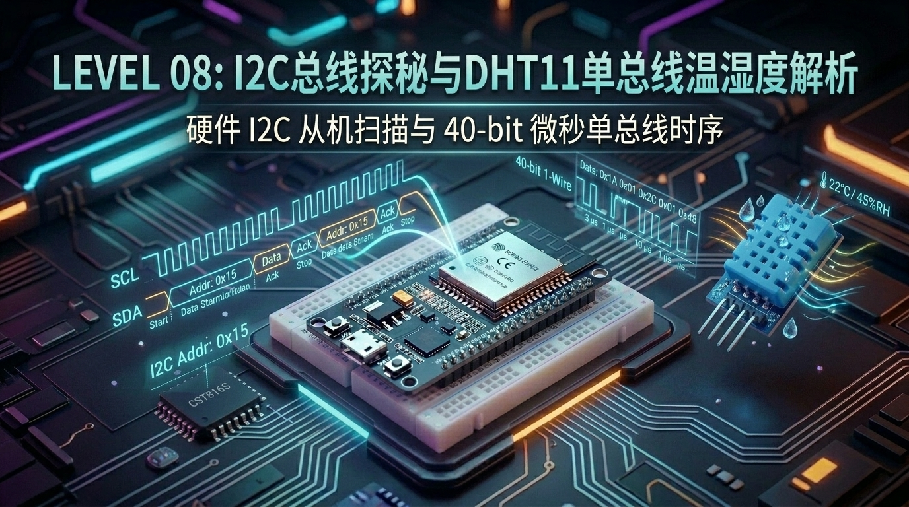

# 第 08 关：ESP32 I2C 通信总线探秘与 DHT11 单总线温湿度解析



---

## 🎯 本关学习目标

在前几关中，我们学会了用 GPIO 控制高低电平、捕获外部中断、生成 PWM 呼吸灯，并用 ADC 采集了连续变化的模拟电压。

但在现实的物联网世界中，绝大多数现代芯片（如**触摸屏、六轴陀螺仪、气压计、OLED 屏、温湿度传感器**）都不是通过简单的模拟电压或单根高低电平通信的，而是通过**数字通信总线（Digital Communication Bus）** 与主控芯片进行高速、精准的数据对话。

完成本关卡后，你将达成以下核心成就：
1. **彻底搞懂通信总线的本质**：理解 SPI、I2C 与 1-Wire（单总线）的区别与应用场景；
2. **掌握 I2C 总线底层硬核机制**：深入理解 SCL 时钟线、SDA 数据线、开漏输出（Open-Drain）、上拉电阻与 ACK/NACK 握手时序；
3. **掌握 ESP-IDF v6 最新 I2C Master 驱动**：编写通用的 **I2C Scanner（总线扫描器）**，自动发现板载的 CST816S 电容触摸芯片（地址 `0x15`）；
4. **攻克 1-Wire 微秒级单总线通信**：掌握 GPIO 动态输入输出切换，精准解码 DHT11 的 **40-bit 脉宽调制数据包** 与 Checksum 校验和；
5. **双任务融合气象站工程**：构建 FreeRTOS 双核多任务并发系统，实现 I2C 触摸设备心跳巡检与微气象监测！

---

## 8.1 什么是通信总线？从“专车专线”到“公共大巴车”

很多嵌入式初学者最大的困惑是：**“既然单片机引脚可以输出高低电平，为什么还要搞出这么多总线名字（SPI、I2C、UART、1-Wire）？”**

```text
 ┌─────────────────────────────────────────────────────────────┐
 │                【单片机三大主流通信总线对比】                 │
 │                                                             │
 │  1. SPI 总线 (高铁/专线) : 4 根线 (SCK, MOSI, MISO, CS)      │
 │     特点: 速度极高(几十MHz)，但引脚消耗多 (彩屏、Flash 专用) │
 │                                                             │
 │  2. I2C 总线 (公交车)   : 仅 2 根线 (SCL 时钟, SDA 数据)    │
 │     特点: 引脚极省，挂载几十个芯片 (触摸屏、传感器、RTC)     │
 │                                                             │
 │  3. 1-Wire (单车道)     : 仅 1 根数据线 (DATA)              │
 │     特点: 极限节省引脚，对微秒级软件时序要求极高 (DHT11)     │
 └─────────────────────────────────────────────────────────────┘
```

### 📊 主流通信接口横向对比

| 通信协议 | 物理连线数 | 典型通信速率 | 核心优势 | 常见连接器件 |
| :--- | :--- | :--- | :--- | :--- |
| **I2C (双线总线)** | **2 根** (SCL + SDA) | 100 kHz ~ 400 kHz | **极省引脚**，2 根线可挂载多达 127 个设备 | 电容触摸芯片、陀螺仪、OLED屏、RTC时钟 |
| **SPI (四线高速)** | **4 根** (SCK+MOSI+MISO+CS) | 10 MHz ~ 80 MHz | **极速传输**，适合大批量显存吞吐 | 1.69寸彩屏 (ST7789)、SPI Flash/PSRAM |
| **1-Wire (单总线)** | **1 根** (DATA) | 几 kHz (微秒级) | **极限节省引脚**，硬件结构极简 | DHT11/DHT22 温湿度、DS18B20 温度探头 |
| **UART (串口)** | **2 根** (TX + RX) | 115200 bps | 点对点全双工，调试与日志打印 | 电脑串口监视器、GPS 模块、蓝牙透传 |

---

## 8.2 I2C 总线工作机制详解（小白也能秒懂的公交车模型）

I2C（Inter-Integrated Circuit，发音为 *“I-Squared-C”* 或 *“I-Two-C”*）是由飞利浦公司发明的双向二线制同步串行总线。

### 🚌 1. 公交车模型：为什么 2 根线可以连接 100 多个芯片？
把 I2C 总线想象成一条**公共公路**：
* **`SCL`（Serial Clock，时钟线）**：由**司机（ESP32 主机）** 敲击的节拍鼓点，所有乘客按照节拍统一收发数据；
* **`SDA`（Serial Data，数据线）**：车上的货物通道，所有数据的 0 和 1 都从这条线上传递；
* **每个芯片都有唯一的“身份证号”（7-bit 从机设备地址）**：
  * 当 ESP32 想找触摸芯片对话时，它在总线上大喊：`“0x15，你听到了吗？”`
  * 只有地址匹配的 `0x15` 芯片会在第 9 个时钟周期将 SDA 拉低，回复一个 **`ACK`（Acknowledge，应答信号）**！
  * 其他芯片（如 0x68 陀螺仪）发现不是找自己的，就会保持沉默静音。

```text
       ESP32 (I2C Master 主机)
         ├── SCL (GPIO22) ───┬──────────────┬──────────────┐
         └── SDA (GPIO23) ───┼──────────────┼──────────────┤
                             │              │              │
                    ┌────────┴──────┐ ┌─────┴────────┐ ┌───┴──────────┐
                    │ CST816S 触摸  │ │ MPU6050 陀螺仪 │ │ SSD1306 屏幕 │
                    │ (地址: 0x15)  │ │ (地址: 0x68)  │ │ (地址: 0x3C)  │
                    └───────────────┘ └──────────────┘ └──────────────┘
```

---

### 🔌 2. 什么是开漏输出（Open-Drain）与上拉电阻？

这是很多初学者学 I2C 时最容易懵的概念：
* **普通推挽输出（Push-Pull）**：单片机引脚可以直接输出 3.3V（推）或 0V（挽）。但如果两个芯片同时输出高电平和低电平，就会导致**电源与地直接短路烧毁芯片**！
* **I2C 采用开漏输出（Open-Drain）**：
  * 引脚**只能主动把电平拉低到 0V**（接地），**无法主动输出 3.3V 高电平**；
  * 平时总线靠外部的一个 **4.7kΩ ~ 10kΩ 上拉电阻** 被拉高到 3.3V；
  * **好处**：无论有多少个芯片挂在总线上，即使大家同时拉低，也绝对不会发生短路，这叫做**“线与（Wired-AND）”逻辑**。

---

### ⏱️ 3. I2C 通信的四大核心时序动作

```text
 SDA ────┐          ┌─── D7 ─── D6 ─── ... ─── D0 ───┐     ┌─── ACK ───┐     ┌──── (空闲高)
         └──────────┘                                └─────┘           └─────┘
 SCL ────────┐          ┌──┐   ┌──┐            ┌──┐     ┌──┐            ┌──── (空闲高)
             └──────────┘  └───┘  └─── ... ────┘  └─────┘  └────────────┘
        【START 起始】                 【8-bit 数据传输】            【从机 ACK】    【STOP 停止】
```

1. **START 起始条件**：SCL 为高电平时，SDA 产生一个**下降沿**（宣告总线被占用，通信开始）；
2. **8-bit 数据传输**：在 SCL 为低电平期间改变 SDA，在 SCL 为高电平期间保持 SDA 稳定读取；
3. **ACK / NACK 确认位**：传输完 8 位数据后，接收方在第 9 个时钟周期将 SDA 拉低表示 **ACK（收到）**，保持高电平表示 **NACK（未收到/忙）**；
4. **STOP 停止条件**：SCL 为高电平时，SDA 产生一个**上升沿**（宣告通信结束，释放总线）。

---

## 8.3 DHT11 单总线通信时序深度拆解

DHT11 是一款极其普及的数字温湿度复合传感器。与 I2C 不同，它采用**极简的 1-Wire 单总线协议**，一根线兼顾了“时钟+数据+双向握手”！

```text
 ┌─────────────────────────────────────────────────────────────┐
 │                【DHT11 单总线 40-bit 数据格式】              │
 │                                                             │
 │   [Byte 1] 湿度整数部分 (0 ~ 99 %)                          │
 │   [Byte 2] 湿度小数部分 (DHT11 恒为 0)                      │
 │   [Byte 3] 温度整数部分 (0 ~ 50 ℃)                          │
 │   [Byte 4] 温度小数部分 (DHT11 恒为 0)                      │
 │   [Byte 5] 校验和 (Checksum = Byte1 + Byte2 + Byte3 + Byte4)│
 └─────────────────────────────────────────────────────────────┘
```

### ⏱️ DHT11 完整通信时序四部曲：

```text
 1. 主机唤醒:    ESP32 拉低 DATA 引脚至少 18ms ➔ 然后拉高 30us ➔ 切换为输入模式
                      │
                      ▼
 2. 从机应答:    DHT11 检测到起始信号后，拉低 80us ➔ 然后拉高 80us (握手成功)
                      │
                      ▼
 3. 接收 40bit:  连续接收 40 个数据位。每一位都以 50us 低电平开始：
                 - 接下来高电平持续 26~28us  ➔ 代表数据 【0】
                 - 接下来高电平持续 70us     ➔ 代表数据 【1】
                      │
                      ▼
 4. 校验比对:    计算前 4 个字节之和，与第 5 字节校验和比对，100% 相符才确认有效！
```

---

## 8.4 🔌 外置硬件准备与实物接线指南

在本关卡中，我们需要准备 **DHT11 温湿度传感器** 插入开发板的专用插座：

### 📦 1. 硬件物料与引脚速查

| 外设模块 | 实物外观特征 | 开发板连接插座 | 对应 GPIO 引脚 |
| :--- | :--- | :--- | :--- |
| **CST816S 触摸芯片** | 贴片芯片（集成于 1.69寸彩屏内） | 板载内部直连 | **SCL: GPIO22**, **SDA: GPIO23** |
| **DHT11 温湿度探头** | 蓝色网格小方块，带有 4 根或 3 根引脚 | **`JP1`** (4-Pin 白色母座) | **DATA: GPIO25** |

---

### 🗺️ 2. JP1 接口引脚定义与插入方向

```text
 ┌─────────────────────────────────────────────────────────────┐
 │                      ESP32 实战开发板                        │
 │                                                             │
 │                【JP1 温湿度插座】 (4-Pin)                    │
 │                ┌──────────────────┐                         │
 │                │ [ 1  2  3  4 ]   │ ◄── 插入 DHT11 传感器   │
 │                └──────────────────┘     (正面栅格朝板外)    │
 │                 Pin 1: +3.3V 供电                           │
 │                 Pin 2: DATA 数据线 (GPIO25)                 │
 │                 Pin 3: NC (悬空无连接)                       │
 │                 Pin 4: GND (地线)                           │
 └─────────────────────────────────────────────────────────────┘
```

> [!IMPORTANT]
> **⚠️ 接线防呆提醒**：
> 1. DHT11 模块的引脚顺序通常为：`Pin1: VCC`、`Pin2: DATA`、`Pin3: NC`、`Pin4: GND`；
> 2. 插入 **`JP1`** 时，请确保正面蓝色网格朝向板子外侧，引脚对齐插到底即可！

---

## 8.5 📚 核心库函数功能字典与关键参数解密（小白必读）

在进入实战代码前，我们把本章使用的 ESP-IDF v6 最新 **I2C Master 驱动** 与 **微秒级单总线驱动函数** 逐一拆解：

---

### 1. 🛠️ 本章引入的全新头文件与 CMake 依赖

| 头文件 | 作用说明 | 对应 CMake REQUIRES | 核心函数 / 宏 |
| :--- | :--- | :--- | :--- |
| **`"driver/i2c_master.h"`** | **ESP-IDF v6 新一代 I2C Master 驱动** | **`esp_driver_i2c`** | `i2c_new_master_bus()`、`i2c_master_probe()` |
| **`"driver/gpio.h"`** | **GPIO 模式动态切换** | `esp_driver_gpio` | `gpio_set_direction()`、`gpio_set_pull_mode()` |
| **`"esp_timer.h"`** | **高精度微秒脉宽测量** | `esp_timer` | `esp_timer_get_time()` |
| **`"esp_rom_sys.h"`** | **微秒级忙等待延时** | 系统自带 | `esp_rom_delay_us()` |

> [!WARNING]
> **💥 编译避坑提示**：
> ESP-IDF v6 将 I2C 驱动独立为了 `esp_driver_i2c` 组件。必须确保 [`main/CMakeLists.txt`](../main/CMakeLists.txt) 中的 `REQUIRES` 包含 **`esp_driver_i2c`**！

---

### 2. 🎛️ I2C Master 驱动初始化关键参数深度解密

```c
i2c_master_bus_config_t bus_config = {
    .i2c_port = I2C_NUM_0,               // 1. 选择 I2C 硬件控制器编号 (0 或 1)
    .sda_io_num = GPIO_NUM_23,           // 2. 指定 SDA 数据引脚
    .scl_io_num = GPIO_NUM_22,           // 3. 指定 SCL 时钟引脚
    .clk_source = I2C_CLK_SRC_DEFAULT,   // 4. 时钟源选择默认系统时钟
    .glitch_ignore_cnt = 7,              // 5. 硬件毛刺滤波器 (滤除小于 7 个时钟周期的瞬态噪点)
    .flags.enable_internal_pullup = true,// 6. 开启 ESP32 内部上拉电阻 (增强信号稳定性)
};
```

* **`i2c_new_master_bus(&bus_config, &s_bus_handle)`**：
  * 初始化 I2C 主机控制器硬件，并返回一个总线句柄 `s_bus_handle`。
* **`i2c_master_probe(s_bus_handle, address, timeout_ms)`**（🔥 ESP-IDF v6 核心神器）：
  * **作用**：向指定 7 位从机地址 `address` 发送一个探测帧；
  * **返回值**：如果收到从机的 `ACK` 回复，返回 **`ESP_OK`**（证明设备在线！）；如果无响应返回超时错误。这让编写 I2C Scanner 变得极其优雅精简！

---

### 3. ⏱️ GPIO 动态双向模式切换三步法（DHT11 专用）

单总线通信要求 ESP32 既能**输出**唤醒脉冲，又能立刻切换为**输入**接收数据：

```c
// 步骤 1：配置为输出模式，发送 18ms 低电平唤醒 DHT11
gpio_set_direction(DHT11_PIN, GPIO_MODE_OUTPUT);
gpio_set_level(DHT11_PIN, 0);

// 步骤 2：切换为输入模式，准备读取 40-bit 高低电平
gpio_set_direction(DHT11_PIN, GPIO_MODE_INPUT);

// 步骤 3：开启内部弱上拉，防止引脚悬空引入空中噪声
gpio_set_pull_mode(DHT11_PIN, GPIO_PULLUP_ONLY);
```

---

## 8.6 实战第 1 步：I2C 硬件总线地址扫描器（I2C Scanner）

现在让我们编译运行第 1 个实验，扫描总线上到底有哪些设备！

> 📁 **配套源码文件**：[`code/08_i2c_dht11/01_i2c_scanner.c`](../code/08_i2c_dht11/01_i2c_scanner.c)  
> ⚡ **一键切换运行**：在终端运行 `./switch_code.sh 8 1 --flash` 即可秒级切换并自动烧录！

### 🌟 实验 1 完整源码：

```c
#include <stdio.h>
#include "freertos/FreeRTOS.h"
#include "freertos/task.h"
#include "esp_log.h"
#include "driver/i2c_master.h"

static const char *TAG = "EXP1_I2C_SCANNER";

#define I2C_PORT_NUM        I2C_NUM_0
#define I2C_SCL_PIN         GPIO_NUM_22
#define I2C_SDA_PIN         GPIO_NUM_23
#define I2C_FREQ_HZ         100000       // 标准模式 100 kHz

static i2c_master_bus_handle_t s_bus_handle = NULL;

static void i2c_master_init(void)
{
    i2c_master_bus_config_t bus_config = {
        .i2c_port = I2C_PORT_NUM,
        .sda_io_num = I2C_SDA_PIN,
        .scl_io_num = I2C_SCL_PIN,
        .clk_source = I2C_CLK_SRC_DEFAULT,
        .glitch_ignore_cnt = 7,
        .flags.enable_internal_pullup = true,
    };

    ESP_ERROR_CHECK(i2c_new_master_bus(&bus_config, &s_bus_handle));
    ESP_LOGI(TAG, "✅ I2C Master 总线初始化成功 (SCL: GPIO%d, SDA: GPIO%d)", I2C_SCL_PIN, I2C_SDA_PIN);
}

static void i2c_scan_devices(void)
{
    ESP_LOGI(TAG, "🔍 开始扫描 I2C 总线 (地址范围: 0x01 ~ 0x7F)...");
    int device_count = 0;

    printf("\n     0  1  2  3  4  5  6  7  8  9  a  b  c  d  e  f\n");
    printf("00:         ");

    for (int addr = 1; addr < 0x78; addr++) {
        if (addr % 16 == 0) printf("\n%02x: ", addr);

        esp_err_t ret = i2c_master_probe(s_bus_handle, addr, 50);
        if (ret == ESP_OK) {
            printf("\033[32m%02x \033[0m", addr); // 绿色高亮
            device_count++;
        } else {
            printf("-- ");
        }
    }
    printf("\n\n");

    if (device_count > 0) {
        ESP_LOGI(TAG, "🎉 扫描完成！共发现 %d 个 I2C 设备：", device_count);
        for (int addr = 1; addr < 0x78; addr++) {
            if (i2c_master_probe(s_bus_handle, addr, 50) == ESP_OK) {
                if (addr == 0x15) {
                    ESP_LOGI(TAG, "   📍 发现地址 [0x%02X] ➔ \033[36mCST816S 电容触摸屏芯片\033[0m", addr);
                } else {
                    ESP_LOGI(TAG, "   📍 发现未知设备地址 [0x%02X]", addr);
                }
            }
        }
    } else {
        ESP_LOGW(TAG, "⚠️ 未在 I2C 总线上探测到任何设备！");
    }
}

void app_main(void)
{
    i2c_master_init();
    while (1) {
        i2c_scan_devices();
        vTaskDelay(pdMS_TO_TICKS(5000));
    }
}
```

---

## 8.7 实战第 2 步：DHT11 单总线 40-bit 微秒级温湿度读取

接下来我们用微秒高精度定时器，捕获 DHT11 的 40-bit 数据包并校验！

> 📁 **配套源码文件**：[`code/08_i2c_dht11/02_dht11_read.c`](../code/08_i2c_dht11/02_dht11_read.c)  
> ⚡ **一键切换运行**：在终端运行 `./switch_code.sh 8 2 --flash` 即可秒级切换并自动烧录！

### 🌟 实验 2 核心代码解析：

```c
#include <stdio.h>
#include "freertos/FreeRTOS.h"
#include "freertos/task.h"
#include "driver/gpio.h"
#include "esp_timer.h"
#include "esp_log.h"
#include "esp_rom_sys.h"

static const char *TAG = "EXP2_DHT11";
#define DHT11_PIN   GPIO_NUM_25

typedef struct {
    float temperature;
    float humidity;
} dht11_data_t;

static int64_t dht11_wait_level(int target_level, int timeout_us)
{
    int64_t start = esp_timer_get_time();
    while (gpio_get_level(DHT11_PIN) != target_level) {
        if (esp_timer_get_time() - start > timeout_us) return -1;
    }
    return esp_timer_get_time() - start;
}

static bool dht11_read(dht11_data_t *result)
{
    uint8_t data[5] = {0};

    // 1. 发送 20ms 起始脉冲
    gpio_set_direction(DHT11_PIN, GPIO_MODE_OUTPUT);
    gpio_set_level(DHT11_PIN, 0);
    vTaskDelay(pdMS_TO_TICKS(20));

    // 2. 拉高 30us 并切为输入模式
    gpio_set_level(DHT11_PIN, 1);
    esp_rom_delay_us(30);
    gpio_set_direction(DHT11_PIN, GPIO_MODE_INPUT);
    gpio_set_pull_mode(DHT11_PIN, GPIO_PULLUP_ONLY);

    // 3. 握手检测 (80us 低 + 80us 高)
    if (dht11_wait_level(0, 100) < 0) return false;
    if (dht11_wait_level(1, 100) < 0) return false;
    if (dht11_wait_level(0, 100) < 0) return false;

    // 4. 连续接收 40 位数据
    for (int i = 0; i < 40; i++) {
        if (dht11_wait_level(1, 100) < 0) return false;

        int64_t high_start = esp_timer_get_time();
        if (dht11_wait_level(0, 100) < 0) return false;
        int64_t high_duration = esp_timer_get_time() - high_start;

        data[i / 8] <<= 1;
        if (high_duration > 40) data[i / 8] |= 1; // 高电平超过 40us 判为 1
    }

    // 5. 校验和校验
    if (((data[0] + data[1] + data[2] + data[3]) & 0xFF) != data[4]) {
        ESP_LOGW(TAG, "❌ Checksum 校验失败！");
        return false;
    }

    result->humidity = (float)data[0] + (float)data[1] * 0.1f;
    result->temperature = (float)data[2] + (float)data[3] * 0.1f;
    return true;
}
```

---

## 8.8 实战第 3 步：综合大工程 —— I2C 触摸在线监测与双总线气象站

以下是将 **I2C 触摸设备心跳巡检** 与 **DHT11 周期性微气象监测** 结合的完整工程代码：

> 📁 **配套源码文件**：[`code/08_i2c_dht11/03_i2c_dht11_integrated.c`](../code/08_i2c_dht11/03_i2c_dht11_integrated.c)  
> ⚡ **一键切换运行**：在终端运行 `./switch_code.sh 8 3 --flash` 即可秒级切换并自动烧录！

```c
#include <stdio.h>
#include "freertos/FreeRTOS.h"
#include "freertos/task.h"
#include "driver/gpio.h"
#include "esp_timer.h"
#include "esp_log.h"
#include "esp_rom_sys.h"
#include "driver/i2c_master.h"

static const char *TAG = "LEVEL08_INTEGRATED";

#define I2C_PORT_NUM        I2C_NUM_0
#define I2C_SCL_PIN         GPIO_NUM_22
#define I2C_SDA_PIN         GPIO_NUM_23
#define CST816S_I2C_ADDR    0x15
#define DHT11_PIN           GPIO_NUM_25

static i2c_master_bus_handle_t s_i2c_bus = NULL;

/* 任务 A：DHT11 单总线微气象监测 */
static void task_dht11_monitor(void *pvParameters)
{
    ESP_LOGI(TAG, "🌡️ [任务 A: DHT11 采集] 启动...");
    float temp = 0.0f, humi = 0.0f;

    while (1) {
        if (dht11_read(&temp, &humi)) {
            ESP_LOGI(TAG, "📊 [气象站报告] 🌡️ 环境温度: \033[32m%4.1f ℃\033[0m | 💧 相对湿度: \033[36m%4.1f %%\033[0m", temp, humi);
        } else {
            ESP_LOGW(TAG, "⚠️ [气象站报告] DHT11 采样超时 (请确认 JP1 模块接入良好)");
        }
        vTaskDelay(pdMS_TO_TICKS(2000));
    }
}

/* 任务 B：I2C 设备心跳与健康巡检 */
static void task_i2c_health_check(void *pvParameters)
{
    ESP_LOGI(TAG, "🔍 [任务 B: I2C 巡检] 启动...");

    while (1) {
        esp_err_t ret = i2c_master_probe(s_i2c_bus, CST816S_I2C_ADDR, 50);
        if (ret == ESP_OK) {
            ESP_LOGI(TAG, "💚 [I2C 巡检] CST816S 触摸芯片 (0x%02X) ➔ \033[32m[在线通信正常 ACK]\033[0m", CST816S_I2C_ADDR);
        } else {
            ESP_LOGW(TAG, "💛 [I2C 巡检] CST816S 触摸芯片 (0x%02X) ➔ [无应答 NACK / 休眠中]", CST816S_I2C_ADDR);
        }
        vTaskDelay(pdMS_TO_TICKS(3000));
    }
}

void app_main(void)
{
    ESP_LOGI(TAG, "==================================================");
    ESP_LOGI(TAG, "   🚀 关卡 08 启动：I2C 触摸巡检与 DHT11 气象雷达   ");
    ESP_LOGI(TAG, "==================================================");

    i2c_bus_init();

    xTaskCreatePinnedToCore(task_dht11_monitor, "dht11_task", 4096, NULL, 5, NULL, 0);
    xTaskCreatePinnedToCore(task_i2c_health_check, "i2c_task", 4096, NULL, 4, NULL, 1);
}
```

---

## 8.9 关卡总结与通关打卡

恭喜你完成了第 08 关的学习！在这一关中，我们彻底跨越了**“纯数字开关”**与**“连续模拟量”**的初级阶段，正式进入了**微处理器与外围芯片之间的数字总线通信领域**！

### 🏆 核心技能清单回顾：
* [x] **I2C 通信精髓**：理解 SCL/SDA、开漏上拉与 ACK 机制，熟练使用 `driver/i2c_master.h`；
* [x] **I2C Scanner**：掌握了 `i2c_master_probe()` 探测芯片 7-bit 地址的优雅方法，探明了 CST816S 触摸屏的在线地址 `0x15`；
* [x] **1-Wire 协议解码**：掌握了 GPIO 动态输入输出切换与 40-bit 脉宽编码判定及 Checksum 校验。

---

接下来，请翻开 [**第 09 章：ESP32 NVS 非易失性存储与 Flash 偏好设置**](./09_NVS非易失性存储与Flash偏好设置.md)，让我们探索如何把 Wi-Fi 密码、用户配置永久固化保存在芯片内部的 Flash 中，实现断电永不丢失！
