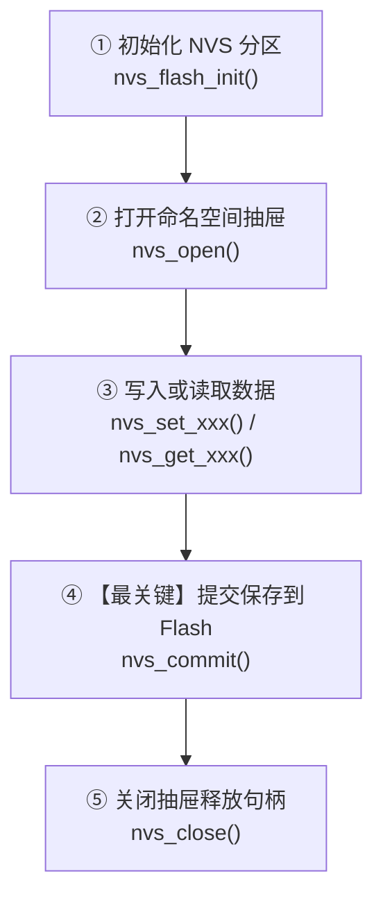

# 第 09 关：ESP32 NVS 非易失性存储与 Flash 偏好设置


---

## 🎯 本关学习目标

在前 8 关的学习中，我们写的所有程序都有一个共同的特点：**一旦拔掉 USB 供电线或者按下复位按键，单片机里的所有变量都会瞬间“清零失忆”！**

但在真实的智能家居产品中：
* 你的 Wi-Fi 路由器账号密码、家里的智能台灯亮度、闹钟时间……**绝对不能一断电就全部丢失**；
* 每次给单片机重新插上电，它必须能够**“回忆”**起断电前保存的所有配置！

本关我们将学习 ESP32 的核心杀手级技术 —— **NVS（Non-Volatile Storage，非易失性键值对存储）**。

完成本关卡后，你将达成以下核心成就：
1. **彻底搞懂 Flash 与 RAM 的区别**：理解为什么普通变量断电会丢，而 Flash 可以保存 10 年不丢；
2. **掌握 NVS 的“抽屉与便利贴”模型**：搞懂命名空间（Namespace）与键值对（Key-Value）结构；
3. **掌握 ESP-IDF NVS 驱动六步闭环**：初始化 ➔ 打开抽屉 ➔ 写入数据 ➔ **`nvs_commit` 关键提交** ➔ 读取数据 ➔ 关闭抽屉；
4. **开发开机计数器与 Wi-Fi 配置管理器**：学会存储整型、字符串和自定义结构体；
5. **实现硬件“恢复出厂设置（Factory Reset）”**：长按 SW3 按键 3 秒，全量擦除 Flash 并重启！

---

## 9.1 数据的“临时草稿”与“永久存档”：RAM 与 Flash 的职责分工

无论是我们每天使用的手机、笔记本电脑，还是这块指甲盖大小的 ESP32 单片机，整个计算机体系结构中都遵循着一套最基础的物理法则：**“运行内存”与“持久存储”分工合作**。

```text
 ┌─────────────────────────────────────────────────────────────┐
 │           【运行内存 (RAM)  VS  持久化存储 (Flash)】         │
 ├──────────────────────────────┬──────────────────────────────┤
 │ ⚡ 易失性运行内存 (SRAM)      │ 💾 非易失性持久存储 (Flash)  │
 ├──────────────────────────────┼──────────────────────────────┤
 │ • 电脑的 16GB 内存条 (DDR)   │ • 电脑的 1TB 固态硬盘 (SSD)  │
 │ • 手机的 12GB 运行内存       │ • 手机的 256GB 存储空间      │
 │ • ESP32 的 520KB 内部 SRAM   │ • ESP32 的 8MB 板载 Flash    │
 ├──────────────────────────────┼──────────────────────────────┤
 │ • 作用: 存放程序运行时的临时变量│ • 作用: 存放固件代码、配置参数│
 │ • 特点: 读写纳秒级极速       │ • 特点: 写入较慢，寿命约10万次│
 │ • 物理法则: 【断电瞬间清空】 │ • 物理法则: 【断电保存10年】 │
 └──────────────────────────────┴──────────────────────────────┘
```

### 💡 为什么智能硬件必须要有“持久化存储”？

在前 8 关的实验中，我们声明的所有变量（如 `temperature`、`state`）都是放在 **SRAM 运行内存** 中的。一旦拔掉 USB 线断电，内存失电，数据全部灰飞烟灭。

但在真实的物联网产品中，有三大类数据**绝对不能因为断电而丢失**：

1. **📶 网络认证凭证**：用户配网输入的家庭 Wi-Fi 账号和密码（断电丢失意味着每次停电都需要重新扫码配网！）；
2. **🎛️ 用户个性偏好**：智能台灯上次关机前设定的亮度（80%）、夜灯模式开关、主题颜色；
3. **📊 设备生命周期黑匣子**：设备累计开机次数、总运行时间、机器故障日志。

### 🌐 硬核科普：为什么电脑叫 RAM/SSD，而单片机叫 SRAM/Flash？

很多初学者在跨界学习时会被各种计算机术语搞晕，其实它们是**“家族统称”**与**“具体物理流派”**的关系：

#### 1. 内存家族谱系：RAM 是姓氏，SRAM 和 DRAM 是亲兄弟
* **RAM（随机存取内存）**：指所有“通电极速读写、断电立刻清空”的内存统称。
* **弟弟 DRAM（动态内存） ➔ 电脑/手机使用**：用微小电容存电，电容漏电必须每秒由电路“疯狂刷新几千次”。造价极其便宜、容量巨大（16GB/32GB），大家习惯简称为 **RAM**；
* **哥哥 SRAM（静态内存） ➔ 单片机/CPU 内部 Cache 使用**：用 6 个晶体管搭建触发器锁存电平，稳如泰山**永远不需要刷新**。速度快到极致、无需复杂外围电路，ESP32 内部集成的 520KB 就是纯正的 **SRAM**。

#### 2. 存储家族真相：SSD 肚子里装的其实就是 Flash！
* **Flash（闪存芯片）**：利用微观“浮栅绝缘笼子”关住电子存数据，断电后电子跑不掉（可保存 10 年！）；
* **电脑的 SSD（固态硬盘）**：拆开 SSD 的金属外壳，里面其实就是**一堆 Flash 闪存颗粒 + 1 颗主控芯片**；
* **手机的 ROM（机身存储）**：里面其实也是一颗大容量的 Flash 芯片（UFS/eMMC）；
* **单片机的 Flash**：因为单片机只需要几兆空间（本板为 8MB），直接把这颗**绿豆大小的原始 Flash 颗粒**焊在主板上，因此直接称呼其物理原名 **Flash**。

| 设备类型 | 运行内存 (RAM) 的真实身份 | 持久存储 (Storage) 的真实身份 |
| :--- | :--- | :--- |
| **💻 笔记本电脑** | **DRAM**（16GB 内存条 / DDR5） | **多颗 Flash 芯片打包**（1TB SSD 固态硬盘） |
| **📱 智能手机** | **LPDDR**（12GB 运行内存） | **大容量 Flash 芯片**（256GB ROM 机身存储） |
| **⚡ ESP32 单片机** | **SRAM**（520KB 极速静态内存） | **单颗 SPI Flash 芯片**（8MB 板载闪存颗粒） |

---

## 9.2 什么是 NVS？ESP32 内置的“字典保险箱”

很多单片机（如传统的 51 或部分 STM32）如果想在 Flash 里存数据，程序员必须自己去算扇区地址、自己按字节擦除，一不小心就会把自己的程序固件给擦掉！

**ESP-IDF 的 NVS（Non-Volatile Storage）直接帮我们解决了这个痛点！**
* 它在 8MB Flash 中专门划分了一块安全区域（默认通常为 24KB）；
* 它把这块区域包装成了一个现代化的 **Key-Value（键值对）数据库**（就像 Python 的字典或 JSON 对象一样简单）：
  * `键 (Key)`：数据的名字（如 `"wifi_ssid"`、`"brightness"`）；
  * `值 (Value)`：真实的数据（如 `"MyHomeWiFi"`、`85`）。
* 你只需要告诉它：`存入 key="brightness", value=85`，它就会自动在 Flash 中寻找空闲空间安全存好，并自带**磨损均衡（Wear Leveling）**！

---

### 💡 拓展阅读：什么是“磨损均衡（Wear Leveling）”？Flash 为什么能用 10 年不坏？

Flash 闪存虽然能断电保存数据，但它在微观物理上有一个致命弱点：**每个物理存储单元一生大约只能承受 10 万次擦写！**

#### 1. 😱 没有磨损均衡的惨剧（同一块地方摩擦到穿孔）
假设你做了一个“开机计数器”，如果单片机每次都死死写入 Flash 的第 1 个固定物理地址：
* 10 万次修改后，第 1 个物理扇区被彻底“擦爆击穿”；
* 此时虽然整颗芯片 99.9% 的区域还是崭新的，但因为关键地址损坏，整颗芯片直接报废！

#### 2. 🛡️ NVS 磨损均衡的“雨露均沾”保命机制
ESP32 的 NVS 驱动采用了一种类似日志追加（Log-structured）的极其聪明的算法：
* **不原地覆盖**：当你第 2 次修改 `brightness=90` 时，NVS **绝不会原地擦除旧数据**，而是把旧地址标记为“过期”，顺延写入后面的空白新格子；
* **轮流分摊压力**：数据在分配给 NVS 的整个分区（如 24KB）内均匀轮流滚动写入，所有存储单元“大家一起慢慢变老”；
* **自动垃圾回收（GC）**：只有当整个分区快写满时，NVS 才会触发一次后台整理，把有效数据搬家并整体擦除一次过期区域。

```text
 ❌ 无磨损均衡: [ 💥 擦爆击穿! ] [ 全新闲置 ] [ 全新闲置 ] ➔ 几个月整片报废
 ✅ NVS 磨损均衡: [ 磨损 1 次 ] [ 磨损 1 次 ] [ 磨损 1 次 ] ➔ 寿命暴增数百倍，坚挺 10 年！
```

---

## 9.3 命名空间（Namespace）：防止“撞名”的分类抽屉

想象一下，如果你的项目里既有 `wifi` 模块，又有 `display` 模块，两个模块都想保存一个叫 `"status"` 的变量，岂不是打架冲突了？

NVS 引入了 **命名空间（Namespace）** 概念：
* 可以把命名空间想象成**带有标签的大抽屉**；
* 抽屉 A 叫 `"wifi_cfg"`，里面可以放一个叫 `"status"` 的便签；
* 抽屉 B 叫 `"screen_cfg"`，里面也可以放一个叫 `"status"` 的便签；
* 互不干扰，井井有条！

```text
  NVS 存储分区 (8MB Flash)
    ├── 【抽屉 1: "wifi_cfg"】
    │     ├── "ssid"  ➔ "My_Home_5G"
    │     └── "pass"  ➔ "12345678"
    │
    └── 【抽屉 2: "screen_cfg"】
          ├── "brightness" ➔ 80
          └── "dark_mode"  ➔ 1
```

---

## 9.4 📚 核心库函数功能字典与关键参数解密（小白必读）

在看实战代码前，我们先把 NVS 的 **标准 6 步流水线** 与库函数搞清楚：



---

### 1. 🛠️ 本章引入的全新头文件与 CMake 依赖

| 头文件 | 作用说明 | 对应 CMake REQUIRES | 核心函数 / 宏 |
| :--- | :--- | :--- | :--- |
| **`"nvs_flash.h"`** | **NVS 分区底层初始化与全盘格式化** | **`nvs_flash`** | `nvs_flash_init()`、`nvs_flash_erase()` |
| **`"nvs.h"`** | **NVS 键值对增删改查操作** | `nvs_flash` | `nvs_open()`、`nvs_set_xxx()`、`nvs_get_xxx()`、`nvs_commit()` |

---

### 2. 🎛️ 核心函数与关键细节深度解密

#### ① `nvs_flash_init()` 与 分区自愈容错机制

`nvs_flash_init()` 负责挂载并检验 Flash 中的 NVS 存储分区。它的常见返回值如下：

| 错误码常量 | 物理含义 | 应对处理策略 |
| :--- | :--- | :--- |
| **`ESP_OK` (0)** | ✅ **初始化成功** | NVS 分区完好，直接进入后续业务 |
| **`ESP_ERR_NVS_NO_FREE_PAGES`** | 💥 **无可用空闲页** (分区写满或元数据损坏) | **必须调用 `nvs_flash_erase()` 全盘擦除格式化再重建！** |
| **`ESP_ERR_NVS_NEW_VERSION_FOUND`** | ⚠️ **版本不兼容** (升级了新固件导致格式变更) | **必须调用 `nvs_flash_erase()` 擦除旧格式重新格式化！** |
| **`ESP_ERR_NOT_FOUND`** | 🔍 **找不到分区** (分区表中缺少 `"nvs"` 项) | 检查项目 `partitions.csv` 分区表配置 |
| **`ESP_ERR_NO_MEM`** | 🚫 **内存耗尽** (SRAM 堆内存不足) | 检查系统剩余堆内存 |
| **`ESP_ERR_INVALID_STATE`** | 🔄 **重复初始化** (NVS 已处于挂载状态) | 无需重复调用 |

##### 🛡️ 工业级官方标准自愈代码：
```c
esp_err_t err = nvs_flash_init();

// 核心防御：遇到“写满/损坏”或“版本不兼容”时，自动格式化自愈！
if (err == ESP_ERR_NVS_NO_FREE_PAGES || err == ESP_ERR_NVS_NEW_VERSION_FOUND) {
    ESP_LOGW(TAG, "⚠️ NVS 损坏或版本不兼容，自动全盘擦除自愈中...");
    ESP_ERROR_CHECK(nvs_flash_erase()); // 1. 彻底擦除
    err = nvs_flash_init();              // 2. 重新初始化
}
ESP_ERROR_CHECK(err); // 3. 确保最终初始化成功
```

---

#### ② `nvs_open(namespace, open_mode, &handle)`
* **生活比喻**：拉开一个指定的分类抽屉；
* **参数 `open_mode`**：
  * `NVS_READONLY`：只读模式（省电安全）；
  * `NVS_READWRITE`：可读可写模式（最常用）。
* **返回 `handle`**：抽屉的操作把手（句柄）。

#### ③ `nvs_set_xxx()` 与 `nvs_get_xxx()`
* **支持丰富的数据类型**：
  * 32位整型：`nvs_set_i32(handle, "boot_count", 42)` / `nvs_get_i32(handle, "boot_count", &val)`；
  * 字符串：`nvs_set_str(handle, "ssid", "MyWiFi")` / `nvs_get_str(handle, "ssid", buf, &len)`；
  * 结构体/二进制块：`nvs_set_blob(handle, "custom_struct", &data, sizeof(data))`。

#### ④ 🚨 为什么必须调用 `nvs_commit(handle)`？（小白最常踩的坑 ⚠️）
* **大白话**：当你调用 `nvs_set_i32()` 时，数据其实只是暂时写在**内存缓冲区（剪贴板）**里，**并没有真正通电写入物理 Flash 颗粒**！
* **`nvs_commit(handle)` 就像你在 Word 里按下 `Ctrl + S` 保存键**！如果不写这行代码，断电后数据依然会丢失！

---

## 9.5 实战第 1 步：开机启动计数器（断电不丢失）

我们先来做最经典、最直观的实验：让 ESP32 记录自己一生中被开机了多少次！

> 📁 **配套源码文件**：[`code/09_nvs_storage/01_boot_counter.c`](../code/09_nvs_storage/01_boot_counter.c)  
> ⚡ **一键切换运行**：在终端运行 `./switch_code.sh 9 1 --flash` 即可秒级切换并自动烧录！

### 🌟 实验 1 完整源码：

```c
#include <stdio.h>
#include "freertos/FreeRTOS.h"
#include "freertos/task.h"
#include "esp_log.h"
#include "nvs_flash.h"
#include "nvs.h"

static const char *TAG = "EXP1_BOOT_COUNTER";

#define NVS_NAMESPACE   "app_data"
#define KEY_BOOT_COUNT  "boot_count"

void app_main(void)
{
    // 1. 初始化 NVS 底层分区
    esp_err_t err = nvs_flash_init();
    if (err == ESP_ERR_NVS_NO_FREE_PAGES || err == ESP_ERR_NVS_NEW_VERSION_FOUND) {
        ESP_ERROR_CHECK(nvs_flash_erase());
        err = nvs_flash_init();
    }
    ESP_ERROR_CHECK(err);

    // 2. 打开命名空间抽屉
    nvs_handle_t nvs_handle;
    ESP_ERROR_CHECK(nvs_open(NVS_NAMESPACE, NVS_READWRITE, &nvs_handle));

    // 3. 读取历史开机次数 (带容错处理)
    int32_t boot_count = 0;
    err = nvs_get_i32(nvs_handle, KEY_BOOT_COUNT, &boot_count);
    if (err == ESP_ERR_NVS_NOT_FOUND) {
        ESP_LOGW(TAG, "💡 未找到历史记录！这是首次烧录后的【第 1 次开机】！");
        boot_count = 0;
    } else if (err == ESP_OK) {
        ESP_LOGI(TAG, "📖 从 Flash 读到历史开机记录: \033[32m%ld\033[0m 次", (long)boot_count);
    }

    // 4. 次数 +1 并写回
    boot_count++;
    ESP_LOGI(TAG, "✍️ 正在写回最新开机次数: \033[36m%ld\033[0m 次...", (long)boot_count);
    ESP_ERROR_CHECK(nvs_set_i32(nvs_handle, KEY_BOOT_COUNT, boot_count));

    // 5. 关键提交 (Ctrl + S)
    ESP_ERROR_CHECK(nvs_commit(nvs_handle));

    // 6. 关闭抽屉
    nvs_close(nvs_handle);

    ESP_LOGI(TAG, "🎉 数据已固化！按一下板子上的 RST 物理按键试试看！");

    while (1) {
        vTaskDelay(pdMS_TO_TICKS(1000));
    }
}
```

> [!TIP]
> **💡 动手试试看**：
> 烧录完成后，打开串口监视器，按下开发板上的 **`EN / RST` 复位按键**（或直接拔掉 USB 线重新插上）。你会惊喜地发现：计数值从 1 变成 2、3、4……断电绝不丢失！

---

## 9.6 实战第 2 步：用户偏好设置与 Wi-Fi 账号密码持久化

学会存数字后，我们来模拟一个真实的智能家居设备，把 **Wi-Fi 账号、密码、屏幕亮度与深色模式开关** 一起存入 Flash！

> 📁 **配套源码文件**：[`code/09_nvs_storage/02_preferences_rw.c`](../code/09_nvs_storage/02_preferences_rw.c)  
> ⚡ **一键切换运行**：在终端运行 `./switch_code.sh 9 2 --flash` 即可秒级切换并自动烧录！

### 🌟 实验 2 核心代码解析：

```c
// 1. 存入字符串与整型
ESP_ERROR_CHECK(nvs_set_str(handle, "wifi_ssid", "My_Home_WiFi_5G"));
ESP_ERROR_CHECK(nvs_set_str(handle, "wifi_pass", "SuperSecret123"));
ESP_ERROR_CHECK(nvs_set_i32(handle, "brightness", 85));
ESP_ERROR_CHECK(nvs_set_i32(handle, "dark_mode", 1));
ESP_ERROR_CHECK(nvs_commit(handle)); // 提交保存

// 2. 读取字符串 (两步安全法：先查长度，再分配读取)
size_t required_size = 0;
char ssid[64] = {0};
if (nvs_get_str(handle, "wifi_ssid", NULL, &required_size) == ESP_OK) {
    nvs_get_str(handle, "wifi_ssid", ssid, &required_size);
    ESP_LOGI(TAG, "📶 成功读取 Wi-Fi 名称: %s", ssid);
}
```

---

## 9.7 实战第 3 步：综合大工程 —— 配置管理中心与按键长按恢复出厂设置

真正的消费级电子产品（如智能音箱、路由器）都具备一个 **“长按 Reset 恢复出厂设置”** 的物理功能。以下是完整的工程代码：

> 📁 **配套源码文件**：[`code/09_nvs_storage/03_nvs_factory_reset.c`](../code/09_nvs_storage/03_nvs_factory_reset.c)  
> ⚡ **一键切换运行**：在终端运行 `./switch_code.sh 9 3 --flash` 即可秒级切换并自动烧录！

```c
#include <stdio.h>
#include <string.h>
#include "freertos/FreeRTOS.h"
#include "freertos/task.h"
#include "driver/gpio.h"
#include "esp_log.h"
#include "esp_system.h"
#include "nvs_flash.h"
#include "nvs.h"

static const char *TAG = "LEVEL09_MANAGER";

#define SW3_BUTTON_PIN      GPIO_NUM_39
#define LED2_PIN            GPIO_NUM_27
#define NVS_NAMESPACE       "device_cfg"
#define KEY_RUN_SECONDS     "run_seconds"

/* 恢复出厂设置：清空 NVS 并重启芯片 */
static void perform_factory_reset(void)
{
    ESP_LOGW(TAG, "🚨 触发长按 3 秒！正在执行【恢复出厂设置】...");
    
    // LED2 快闪 5 次警示
    for (int i = 0; i < 5; i++) {
        gpio_set_level(LED2_PIN, 1);
        vTaskDelay(pdMS_TO_TICKS(100));
        gpio_set_level(LED2_PIN, 0);
        vTaskDelay(pdMS_TO_TICKS(100));
    }

    // 格式化擦除整个 NVS 分区
    ESP_ERROR_CHECK(nvs_flash_erase());
    ESP_LOGI(TAG, "🧹 NVS 分区已清空！系统将在 1 秒后自动重启...");
    vTaskDelay(pdMS_TO_TICKS(1000));
    esp_restart();
}

/* 按键长按监控任务 */
static void task_button_monitor(void *pvParameters)
{
    int press_counter = 0;
    while (1) {
        if (gpio_get_level(SW3_BUTTON_PIN) == 0) { // SW3 按下
            press_counter++;
            gpio_set_level(LED2_PIN, 1);
            ESP_LOGW(TAG, "⚠️ 正在长按 SW3 按键重置倒计时: %d / 3 秒...", press_counter);
            if (press_counter >= 3) {
                perform_factory_reset();
            }
        } else {
            press_counter = 0;
            gpio_set_level(LED2_PIN, 0);
        }
        vTaskDelay(pdMS_TO_TICKS(1000));
    }
}

void app_main(void)
{
    // 初始化硬件与 NVS
    // ...
    xTaskCreate(task_button_monitor, "btn_task", 2048, NULL, 5, NULL);

    while (1) {
        vTaskDelay(pdMS_TO_TICKS(5000));
        // 每 5 秒自动将累计运行时间刷入 Flash
    }
}
```

---

## 9.8 关卡总结与通关打卡

太棒了！你已经攻克了单片机存储领域的核心山头 —— **Flash 非易失性存储**！

### 🏆 核心技能清单回顾：
* [x] **存储本质**：理解 RAM（通电草稿纸）与 Flash（永久笔记本）的物理差异；
* [x] **NVS 机制**：掌握命名空间抽屉与 Key-Value 键值对读写模型；
* [x] **避坑铁律**：牢记必须调用 `nvs_commit()` 才能真正落盘保存；
* [x] **出厂重置**：掌握 `nvs_flash_erase()` 与 `esp_restart()` 恢复出厂设置。

---

接下来，我们将推开**视觉显示的大门**！请翻开 [**第 10 章：ESP32 驱动 1.69寸 ST7789 彩屏与几何图形渲染**](./10_ST7789彩屏驱动与几何图形渲染.md)，让我们用高速 SPI DMA 把绚丽的色彩画在开发板的液晶屏上！
