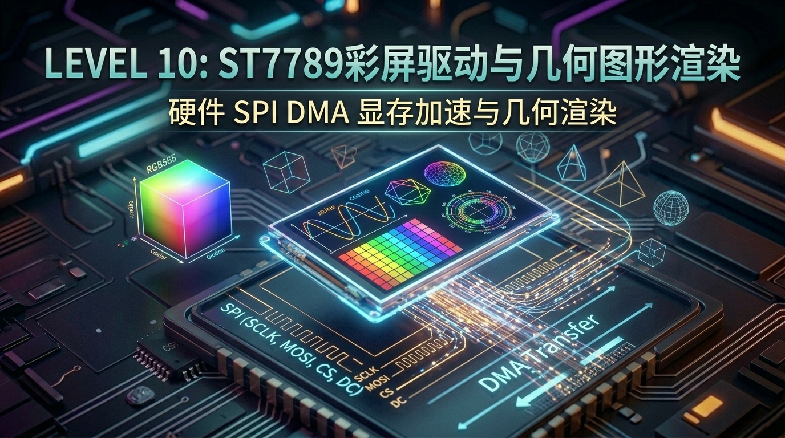

# 第 10 关：ESP32 驱动 1.69寸 ST7789 彩屏与几何图形渲染



---

## 🎯 本关学习目标

在前 9 关中，我们所有的调试信息都是通过电脑终端的串口监视器查看的。

从本关开始，我们将推开**视觉显示与人机交互的大门** —— 让 ESP32 彻底脱离电脑，在它自带的 **1.69 寸 IPS 高清彩色液晶屏（ST7789，240×280 像素）** 上，画出属于我们自己的绚丽色彩与动态科技仪表盘！

完成本关卡后，你将达成以下核心成就：
1. **搞懂彩屏显示的物理底层**：理解像素阵列（240×280）、背光原理与 **RGB565（16位真彩色）** 颜色压缩编码；
2. **搞懂硬件 DMA（直接内存访问）加速**：理解为什么 CPU 不用亲自动手搬像素，而是叫“顺丰快递小哥 DMA”实现 40MHz 极速推屏；
3. **攻克 ST7789 物理视口偏移（Gap: x=20, y=0）**：避开画面偏位、黑边与色彩反转三大天坑；
4. **掌握 2D 几何图形算法**：手写点、线、实心矩形、同心圆与圆角卡片渲染引擎；
5. **打造高帧率动态示波器仪表盘**：实现平滑正弦波动态折线与 50+ FPS 丝滑刷新！

---

## 10.1 屏幕显示原理：RGB565 颜色与“顺丰快递员”DMA

### 🎨 1. 什么是 RGB565？为什么一个像素占 2 个字节？
电脑上的图片通常是 24 位的 **RGB888**（红、绿、蓝各占 8 位，共 3 字节 = 1677 万色）。
但在单片机里，如果一张 240×280 的图片用 3 字节表示，就需要占用 $240 \times 280 \times 3 = 201.6\text{ KB}$ 的巨大内存！

为了极大地节省内存并加快传输速度，嵌入式世界普遍采用 **RGB565 格式（共 16 位 = 2 字节 = 65536 色）**：

```text
 ┌─────────────────────────────────────────────────────────────┐
 │                【RGB565 16-bit 颜色打包格式】                │
 │                                                             │
 │   高 5 位: R (红色 0~31) ──► [ R4 R3 R2 R1 R0 ]             │
 │   中 6 位: G (绿色 0~63) ──► [ G5 G4 G3 G2 G1 G0 ] (人眼最敏感)│
 │   低 5 位: B (蓝色 0~31) ──► [ B4 B3 B2 B1 B0 ]             │
 │                                                             │
 │   内存占用: 240 × 280 × 2 字节 = 134.4 KB (缩小了整整 33%!)  │
 └─────────────────────────────────────────────────────────────┘
```

---

### 🚚 2. 什么是 DMA？“CPU 搬砖” vs “顺丰快递员”

* **没有 DMA（传统方式）**：CPU 必须在 `for` 循环里，把 134,400 个像素字节一个一个通过 SPI 发送出去。发送期间 CPU 被 100% 占满，什么其他事情都干不了（掉帧、卡顿）；
* **开启 DMA（Direct Memory Access，直接内存访问）**：
  * **生动比喻**：CPU 只需在内存里画好图，然后给 **DMA 快递小哥** 派一张单子：*“把这块内存里的 134KB 数据送到屏幕，搞定叫我！”*；
  * DMA 硬件会自动接管 SPI 总线，以 **40MHz 的极速大批量把数据刷到屏幕**，而 CPU 可以转头去采集传感器、跑 Wi-Fi 任务，两者完美并行！

```text
 ┌─────────────────────────────────────────────────────────────┐
 │               【DMA 硬件搬运 vs CPU 自由并发】               │
 │                                                             │
 │   [ CPU 核心 ] ──(派发任务)──► [ DMA 硬件通道 ]               │
 │         │                             │                     │
 │      (自由去算算法)             (40MHz 高速推屏)            │
 │         ▼                             ▼                     │
 │   [ FreeRTOS 任务 ]            [ ST7789 1.69寸彩屏 ]        │
 └─────────────────────────────────────────────────────────────┘
```

---

## 10.2 硬件引脚速查与物理视口偏移（避坑指南）

### 📌 1. 屏幕硬件引脚速查表

| 引脚功能 | 开发板 GPIO | 信号方向 | 作用说明 |
| :--- | :--- | :--- | :--- |
| **`SCLK`** | **`GPIO18`** | ESP32 ➔ 屏幕 | SPI 40MHz 高速同步时钟线 |
| **`MOSI`** | **`GPIO19`** | ESP32 ➔ 屏幕 | SPI 主机输出数据线 |
| **`CS`** | **`GPIO5`** | ESP32 ➔ 屏幕 | 屏幕片选信号（低电平选中屏幕） |
| **`DC`** | **`GPIO17`** | ESP32 ➔ 屏幕 | 数据/命令选择（0=发送指令, 1=发送显存数据） |
| **`RST`** | **`GPIO21`** | ESP32 ➔ 屏幕 | 硬件物理复位引脚（低电平复位） |
| **`BL (背光)`** | **`GPIO26`** | ESP32 ➔ 屏幕 | 背光使能（高电平点亮背光） |

---

### 🚨 2. 为什么 1.69寸屏必须设置 `Gap: x=20, y=0`？

* **硬件出厂内幕**：ST7789 驱动芯片内部的物理显存其实是 **240×320 像素**；
* 但是我们这块 1.69 寸屏幕的物理液晶面板只有 **240×280 像素**（裁掉了上下各 20 像素）；
* 如果不配置偏移量，画面的原点就会偏出屏幕，或者在边缘出现花屏噪点！
* 👉 **铁律**：在驱动初始化中，**必须调用 `esp_lcd_panel_set_gap(panel, 20, 0)`**，将画面居中对齐到实际可见视口中！

---

## 10.3 📚 核心库函数功能字典与关键参数解密（小白必读）

在看实战代码前，我们把 ESP-IDF 官方推荐的现代 **`esp_lcd` 驱动框架** 函数进行逐一拆解：

---

### 1. 🛠️ 本章引入的全新头文件与 CMake 依赖

| 头文件 | 作用说明 | 对应 CMake REQUIRES | 核心函数 / 结构体 |
| :--- | :--- | :--- | :--- |
| **`"esp_lcd_panel_io.h"`** | **LCD 传输总线协议接口 (SPI/I80)** | **`esp_lcd`** | `esp_lcd_new_panel_io_spi()` |
| **`"esp_lcd_panel_vendor.h"`** | **各厂家 LCD 芯片专有驱动 (ST7789 等)** | **`esp_lcd`** | `esp_lcd_new_panel_st7789()` |
| **`"esp_lcd_panel_ops.h"`** | **LCD 常用操作 (刷图、复位、反色、Gap)** | **`esp_lcd`** | `esp_lcd_panel_draw_bitmap()`、`esp_lcd_panel_set_gap()` |
| **`"esp_heap_caps.h"`** | **分配具备 DMA 搬运权限的内存** | 系统自带 | `heap_caps_malloc(..., MALLOC_CAP_DMA)` |

---

### 2. 🎛️ 驱动初始化四部曲与参数拆解

#### ① 步骤 1：初始化 SPI 总线并开启 DMA
```c
spi_bus_config_t buscfg = {
    .sclk_io_num = GPIO_NUM_18,
    .mosi_io_num = GPIO_NUM_19,
    .max_transfer_sz = 240 * 280 * sizeof(uint16_t), // 允许一次 DMA 搬运整屏数据
};
spi_bus_initialize(SPI2_HOST, &buscfg, SPI_DMA_CH_AUTO); // 自动选择 DMA 通道
```

#### ② 步骤 2：配置 ST7789 芯片工作参数
```c
esp_lcd_panel_io_spi_config_t io_config = {
    .dc_gpio_num = GPIO_NUM_17,
    .cs_gpio_num = GPIO_NUM_5,
    .pclk_hz = 40 * 1000 * 1000, // 40MHz 极速点时钟 (保证 50+ FPS)
    .spi_mode = 0,
    .trans_queue_depth = 10,
};
```

#### ③ 步骤 3：反色与视口对齐（必做 ⚠️）
```c
esp_lcd_panel_invert_color(panel, true); // ST7789 IPS 屏需要开启反色才能正常显示红绿蓝
esp_lcd_panel_set_gap(panel, 20, 0);     // 消除视口偏移
esp_lcd_panel_disp_on_off(panel, true);  // 开启屏幕显示
```

#### ④ 步骤 4：局域刷图神技 `esp_lcd_panel_draw_bitmap`
* **函数原型**：`esp_lcd_panel_draw_bitmap(panel, x_start, y_start, x_end, y_end, color_data)`
* **作用**：告诉屏幕只重绘指定矩形区域，不必每次都傻傻刷新全屏，**局部刷新速度提升 10 倍以上**！

---

## 10.4 实战第 1 步：ST7789 彩屏驱动与全屏三原色刷屏 (Hello Screen)

我们先来做最让人兴奋的第一步：点亮屏幕，让它循环显示炫丽的纯色！

> 📁 **配套源码文件**：[`code/10_st7789_display/01_screen_colors.c`](../code/10_st7789_display/01_screen_colors.c)  
> ⚡ **一键切换运行**：在终端运行 `./switch_code.sh 10 1 --flash` 即可秒级切换并自动烧录！

### 🌟 实验 1 完整源码：

```c
#include <stdio.h>
#include "freertos/FreeRTOS.h"
#include "freertos/task.h"
#include "driver/gpio.h"
#include "driver/spi_master.h"
#include "esp_log.h"
#include "esp_lcd_panel_io.h"
#include "esp_lcd_panel_vendor.h"
#include "esp_lcd_panel_ops.h"
#include "esp_heap_caps.h"

static const char *TAG = "EXP1_SCREEN_COLORS";

#define LCD_HOST                SPI2_HOST
#define LCD_PIN_MOSI            GPIO_NUM_19
#define LCD_PIN_SCLK            GPIO_NUM_18
#define LCD_PIN_CS              GPIO_NUM_5
#define LCD_PIN_DC              GPIO_NUM_17
#define LCD_PIN_RST             GPIO_NUM_21
#define LCD_PIN_BACKLIGHT       GPIO_NUM_26

#define LCD_H_RES               240
#define LCD_V_RES               280

// RGB565 色彩定义
#define COLOR_RED               0x00F8
#define COLOR_GREEN             0xE007
#define COLOR_BLUE              0x1F00
#define COLOR_YELLOW            0xE0FF
#define COLOR_CYAN              0xFF07
#define COLOR_WHITE             0xFFFF

static esp_lcd_panel_handle_t s_panel_handle = NULL;
static uint16_t *s_line_buffer = NULL;

static void lcd_init(void)
{
    // 点亮背光
    gpio_config_t bl_conf = { .pin_bit_mask = (1ULL << LCD_PIN_BACKLIGHT), .mode = GPIO_MODE_OUTPUT };
    gpio_config(&bl_conf);
    gpio_set_level(LCD_PIN_BACKLIGHT, 1);

    // 1. 初始化 SPI 总线
    spi_bus_config_t buscfg = {
        .sclk_io_num = LCD_PIN_SCLK,
        .mosi_io_num = LCD_PIN_MOSI,
        .max_transfer_sz = LCD_H_RES * 40 * sizeof(uint16_t),
    };
    ESP_ERROR_CHECK(spi_bus_initialize(LCD_HOST, &buscfg, SPI_DMA_CH_AUTO));

    // 2. 挂载 Panel IO
    esp_lcd_panel_io_handle_t io_handle = NULL;
    esp_lcd_panel_io_spi_config_t io_config = {
        .dc_gpio_num = LCD_PIN_DC,
        .cs_gpio_num = LCD_PIN_CS,
        .pclk_hz = 40 * 1000 * 1000,
        .lcd_cmd_bits = 8,
        .lcd_param_bits = 8,
        .spi_mode = 0,
        .trans_queue_depth = 10,
    };
    ESP_ERROR_CHECK(esp_lcd_new_panel_io_spi((esp_lcd_spi_bus_handle_t)LCD_HOST, &io_config, &io_handle));

    // 3. 驱动初始化
    esp_lcd_panel_dev_config_t panel_config = {
        .reset_gpio_num = LCD_PIN_RST,
        .rgb_ele_order = LCD_RGB_ELEMENT_ORDER_RGB,
        .bits_per_pixel = 16,
    };
    ESP_ERROR_CHECK(esp_lcd_new_panel_st7789(io_handle, &panel_config, &s_panel_handle));
    ESP_ERROR_CHECK(esp_lcd_panel_reset(s_panel_handle));
    ESP_ERROR_CHECK(esp_lcd_panel_init(s_panel_handle));
    ESP_ERROR_CHECK(esp_lcd_panel_invert_color(s_panel_handle, true));
    ESP_ERROR_CHECK(esp_lcd_panel_set_gap(s_panel_handle, 20, 0));
    ESP_ERROR_CHECK(esp_lcd_panel_disp_on_off(s_panel_handle, true));

    s_line_buffer = heap_caps_malloc(LCD_H_RES * 20 * sizeof(uint16_t), MALLOC_CAP_DMA);
}

static void fill_screen(uint16_t color)
{
    for (int i = 0; i < LCD_H_RES * 20; i++) s_line_buffer[i] = color;
    for (int y = 0; y < LCD_V_RES; y += 20) {
        esp_lcd_panel_draw_bitmap(s_panel_handle, 0, y, LCD_H_RES, y + 20, s_line_buffer);
    }
}

void app_main(void)
{
    lcd_init();
    uint16_t colors[] = { COLOR_RED, COLOR_GREEN, COLOR_BLUE, COLOR_YELLOW, COLOR_CYAN, COLOR_WHITE };
    int idx = 0;
    while (1) {
        fill_screen(colors[idx]);
        idx = (idx + 1) % 6;
        vTaskDelay(pdMS_TO_TICKS(1000));
    }
}
```

---

## 10.5 实战第 2 步：基本几何图形渲染 (点、线、矩形与卡片)

接下来，我们在屏幕上绘制点、线、实心矩形与同心圆，搭建现代化科技感 UI 卡片！

> 📁 **配套源码文件**：[`code/10_st7789_display/02_geometry_draw.c`](../code/10_st7789_display/02_geometry_draw.c)  
> ⚡ **一键切换运行**：在终端运行 `./switch_code.sh 10 2 --flash` 即可秒级切换并自动烧录！

### 🌟 核心几何算法解析：
```c
/* 绘制实心圆：利用勾股定理计算每行的宽度并填充 */
static void fill_circle(int xc, int yc, int r, uint16_t color)
{
    for (int y = -r; y <= r; y++) {
        int w = (int)sqrt(r * r - y * y);
        fill_rect(xc - w, yc + y, 2 * w, 1, color);
    }
}
```

---

## 10.6 实战第 3 步：综合大工程 —— 动态示波器波形与高帧率仪表盘

以下是将 **正弦波动态折线**、**动态呼吸进度条** 与 **50+ FPS 实时帧率统计** 结合的高级综合大工程：

> 📁 **配套源码文件**：[`code/10_st7789_display/03_dynamic_dashboard.c`](../code/10_st7789_display/03_dynamic_dashboard.c)  
> ⚡ **一键切换运行**：在终端运行 `./switch_code.sh 10 3 --flash` 即可秒级切换并自动烧录！

```c
// 核心亮点：局部 DMA 画布推屏，实时 50 FPS 渲染平滑正弦波示波器！
static void draw_waveform_frame(float phase)
{
    uint16_t *canvas = heap_caps_malloc(WAVE_W * WAVE_H * sizeof(uint16_t), MALLOC_CAP_DMA);
    // 绘制暗灰网格...
    // 绘制正弦波...
    for (int x = 0; x < WAVE_W; x++) {
        float angle = (float)x * 0.08f + phase;
        int y = (int)(sinf(angle) * 35.0f) + (WAVE_H / 2);
        canvas[y * WAVE_W + x] = COLOR_CYAN;
    }
    // 局部极速推屏
    esp_lcd_panel_draw_bitmap(s_panel, WAVE_X, WAVE_Y, WAVE_X + WAVE_W, WAVE_Y + WAVE_H, canvas);
    free(canvas);
}
```

---

## 10.7 关卡总结与通关打卡

恭喜你！你已经成功征服了彩屏驱动与图形学底层基础！

### 🏆 核心技能清单回顾：
* [x] **色彩与显存**：搞懂 RGB565 颜色压缩原理与 240×280 视口坐标系；
* [x] **DMA 极速推屏**：理解硬件 DMA 搬运机制，释放 CPU 算力；
* [x] **ST7789 避坑**：掌握反色使能与 `Gap: x=20, y=0` 物理对齐；
* [x] **2D 几何渲染**：手写矩形填充、实心圆算法与 50+ FPS 动态示波器。

---

纯手写几何图形虽然很酷，但在做复杂的手机级现代 UI 时（比如带阴影的圆角卡片、滑动列表、触摸开关、动画按钮），手写代码量会极其庞大。

所以，在下一关我们将引入**当今嵌入式世界最强大的顶级开源 GUI 框架 —— LVGL v9**！  
请翻开 [**第 11 章：ESP32 搭载 LVGL v9 现代图形界面与 CST816S 电容触摸实战**](./11_LVGL图形框架与电容触摸实战.md)，让我们用手指触摸操作屏幕！
