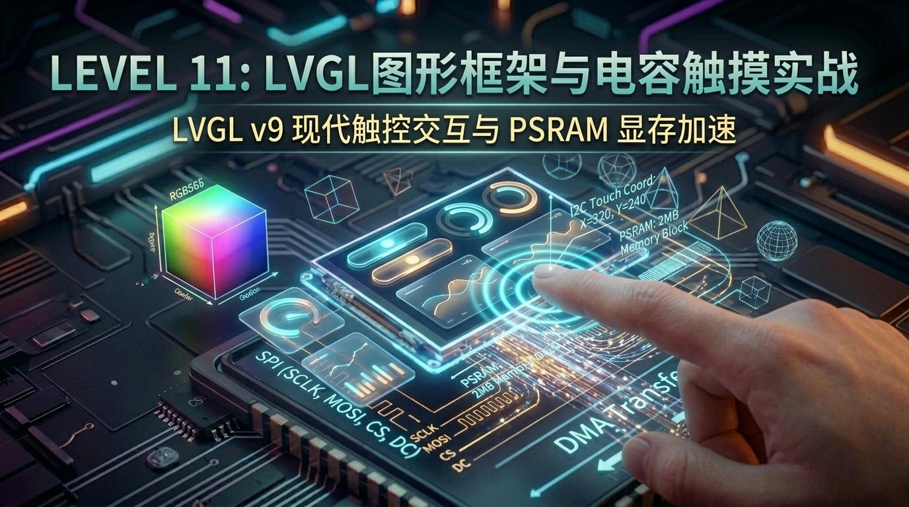

# 第 11 关：ESP32 搭载 LVGL v9 现代图形界面与 CST816S 电容触摸实战



---

## 🎯 本关学习目标

在前一关中，我们用纯 C 语言手写了点、线、矩形和简单的正弦波，成功点亮了 1.69 寸彩屏。但如果要实现带有**圆角卡片、毛玻璃阴影、手指轻触按钮下沉、平滑滑动条和拖拽弧形仪表**的现代智能手表级 UI，手写算法就力不从心了。

本关我们将引入当今**全球嵌入式领域最强大、最流行的开源 GUI 引擎 —— LVGL v9（Light and Versatile Graphics Library）**，并结合板载的 **CST816S I2C 电容触摸芯片**，打造属于我们自己的**智能家居触控中控屏**！

完成本关卡后，你将达成以下核心成就：
1. **搞懂 LVGL v9 的核心架构**：理解控件树（Object Tree）、样式选择器（Styles）与事件驱动模型（Event Callback）；
2. **掌握 FreeRTOS 与 LVGL 线程安全锁**：搞懂 `lvgl_port_lock()` 与 `lvgl_port_unlock()` 互斥锁机制；
3. **驱动板载 CST816S 电容触摸芯片**：理解电容微观扰动感应与 I2C 坐标映射；
4. **精通 LVGL 核心控件体系**：按钮（`Button`）、标签（`Label`）、开关（`Switch`）、滑动条（`Slider`）与弧形仪表（`Arc`）；
5. **打造智能家居中控大工程**：手指滑动调节亮度、轻触切换灯光、弧形表盘实时展示气象。

---

## 11.1 什么是 LVGL？嵌入式领域的“iOS / Android”

```text
 ┌─────────────────────────────────────────────────────────────┐
 │                     【为什么需要 LVGL？】                    │
 │                                                             │
 │  1. 传统手写 UI ➔ 刀耕火种                                  │
 │     - 画一个圆角按钮需要算三角函数；                          │
 │     - 做一个滑动条需要自己监听触摸坐标并逐像素重绘；          │
 │     - 几乎无法实现抗锯齿文字和流畅动画。                     │
 │                                                             │
 │  2. 现代化 LVGL v9 ➔ 工业级引擎                             │
 │     - 像写 HTML/CSS 一样，几行代码生成高颜值控件；          │
 │     - 自带丰富动画引擎、平滑阴影、抗锯齿字体；              │
 │     - 自动处理手指点击、长按、滑动、拖拽等手势！            │
 └─────────────────────────────────────────────────────────────┘
```

---

## 11.2 CST816S 电容触摸原理：手指触摸的物理感应

很多小白好奇：**“为什么开发板上的屏幕表面是一层玻璃，手指一按上去单片机就能知道我按在哪个点？”**

```text
 ┌─────────────────────────────────────────────────────────────┐
 │                【CST816S 电容感应与坐标上报】                │
 │                                                             │
 │  ① 玻璃下方铺设有透明的微观电极网格（X轴与Y轴导电层）；     │
 │  ② 人体本身是一个巨大的导体；                               │
 │  ③ 当你的手指靠近屏幕时，手指与微电极之间会产生【微小电容扰动】；│
 │  ④ CST816S 触摸芯片以每秒 100 次的频率扫描这些电容变化；    │
 │  ⑤ 计算出精准的触摸坐标 (X: 0~240, Y: 0~280)；              │
 │  ⑥ 通过 I2C 总线 (0x15 地址) 瞬间发送给 ESP32！            │
 └─────────────────────────────────────────────────────────────┘
```

---

## 11.3 硬件引脚分配与 I2C / SPI 资源速查

| 功能模块 | 引脚名称 | ESP32 GPIO | 协议类型 | 作用说明 |
| :--- | :--- | :--- | :--- | :--- |
| **ST7789 显示** | `SCLK / MOSI` | `GPIO18 / GPIO19` | SPI (40MHz) | 高速显存推屏数据流 |
| | `CS / DC / RST` | `GPIO5 / 17 / 21` | SPI 控制 | 屏幕片选、数据/命令选择、硬件复位 |
| | `Backlight (BL)`| `GPIO26` | GPIO 输出 | 屏幕背光点亮使能 |
| **CST816S 触摸** | `SCL / SDA` | `GPIO22 / GPIO23` | I2C (400kHz)| 触摸坐标读取总线（从机地址 `0x15`） |
| | `INT` | `GPIO35` (纯输入) | GPIO 中断 | 触摸按下触发中断通知 |

---

## 11.4 📚 核心库函数功能字典与关键参数解密（小白必读）

---

### 1. 🛠️ 本章引入的核心头文件与 CMake 依赖

| 头文件 | 作用说明 | 对应 CMake / Component | 核心函数 / 宏 |
| :--- | :--- | :--- | :--- |
| **`"esp_lvgl_port.h"`** | **乐鑫官方 LVGL FreeRTOS 端口封装** | `espressif/esp_lvgl_port` | `lvgl_port_init()`、`lvgl_port_lock()`、`lvgl_port_unlock()` |
| **`"esp_lcd_touch_cst816s.h"`** | **CST816S 电容触摸驱动接口** | `espressif/esp_lcd_touch_cst816s` | `esp_lcd_touch_new_i2c_cst816s()` |
| **`"lvgl.h"`** | **LVGL 核心控件库** | `lvgl/lvgl` | `lv_button_create()`、`lv_slider_create()`、`lv_arc_create()` 等 |

---

### 2. 🎛️ 核心函数与并发锁机制深度拆解

#### ① 🚨 为什么操作 LVGL 控件必须调用 `lvgl_port_lock(0)`？（多任务必读 ⚠️）
* **原理**：`esp_lvgl_port` 会在后台启动一个专门的 FreeRTOS 高优先级任务不断渲染屏幕；
* 如果你在 `app_main` 或传感器任务里直接去修改按钮文字或颜色，就会和后台渲染任务发生**“内存访问冲突”**导致单片机崩溃重启（Guru Meditation Error）；
* 👉 **铁律**：**所有创建、修改、更新 LVGL 控件的代码，必须包在 `lvgl_port_lock(0)` 和 `lvgl_port_unlock()` 之间！**

#### ② 控件创建三步法：
```c
// 1. 创建控件对象（指定父容器为当前活动屏幕）
lv_obj_t *btn = lv_button_create(lv_screen_active());

// 2. 设置尺寸、位置与样式
lv_obj_set_size(btn, 160, 60);
lv_obj_align(btn, LV_ALIGN_CENTER, 0, 0);
lv_obj_set_style_radius(btn, 16, 0); // 16px 现代圆角

// 3. 绑定触摸点击事件
lv_obj_add_event_cb(btn, my_btn_click_cb, LV_EVENT_CLICKED, NULL);
```

---

## 11.5 实战第 1 步：LVGL v9 基础跑通 —— 科技卡片与流光旋转环 (Hello LVGL)

我们先来把 LVGL v9 引擎跑起来，感受现代 GUI 的颜值震撼！

> 📁 **配套源码文件**：[`code/11_lvgl_touch/01_lvgl_hello.c`](../code/11_lvgl_touch/01_lvgl_hello.c)  
> ⚡ **一键切换运行**：在终端运行 `./switch_code.sh 11 1 --flash` 即可秒级切换并自动烧录！

```c
static void create_hello_ui(void)
{
    lvgl_port_lock(0); // 加锁保护

    lv_obj_t *scr = lv_screen_active();
    lv_obj_set_style_bg_color(scr, lv_color_hex(0x0F172A), 0); // 科技深蓝底色

    // 1. 顶部荧光青标题
    lv_obj_t *title = lv_label_create(scr);
    lv_label_set_text(title, "ESP32 LVGL v9");
    lv_obj_set_style_text_color(title, lv_color_hex(0x38BDF8), 0);
    lv_obj_set_style_text_font(title, &lv_font_montserrat_18, 0);
    lv_obj_align(title, LV_ALIGN_TOP_MID, 0, 20);

    // 2. 现代磨砂卡片
    lv_obj_t *card = lv_obj_create(scr);
    lv_obj_set_size(card, 210, 140);
    lv_obj_align(card, LV_ALIGN_CENTER, 0, 10);
    lv_obj_set_style_bg_color(card, lv_color_hex(0x1E293B), 0);
    lv_obj_set_style_radius(card, 16, 0);

    // 3. 卡片内旋转加载环 (Spinner)
    lv_obj_t *spinner = lv_spinner_create(card);
    lv_obj_set_size(spinner, 50, 50);
    lv_obj_align(spinner, LV_ALIGN_TOP_MID, 0, 10);

    lvgl_port_unlock(); // 解锁释放
}
```

---

## 11.6 实战第 2 步：CST816S 电容触摸按键与 LED2 硬件联动

接入 CST816S 触摸屏，实现手指按下屏幕大按钮，控制板载绿色 LED2（GPIO27）点亮/熄灭！

> 📁 **配套源码文件**：[`code/11_lvgl_touch/02_touch_button.c`](../code/11_lvgl_touch/02_touch_button.c)  
> ⚡ **一键切换运行**：在终端运行 `./switch_code.sh 11 2 --flash` 即可秒级切换并自动烧录！

### 🌟 触摸事件回调函数：
```c
static void btn_click_event_cb(lv_event_t *e)
{
    if (lv_event_get_code(e) == LV_EVENT_CLICKED) {
        s_led_state = !s_led_state;
        gpio_set_level(LED2_PIN, s_led_state ? 1 : 0); // 切换 LED2 电平

        // 动态修改按钮文字与背景颜色
        if (s_led_state) {
            lv_label_set_text(s_btn_label, "LED: ON 💡");
            lv_obj_set_style_bg_color(lv_event_get_target(e), lv_color_hex(0x10B981), 0); // 翠绿
        } else {
            lv_label_set_text(s_btn_label, "LED: OFF 💤");
            lv_obj_set_style_bg_color(lv_event_get_target(e), lv_color_hex(0x64748B), 0); // 灰蓝
        }
    }
}
```

---

## 11.7 实战第 3 步：综合大工程 —— 智能家居中控触控面板

以下是集成 **温度圆弧仪表盘**、**灯光开关 Switch** 与 **亮度调节 Slider** 的高颜值触控综合工程：

> 📁 **配套源码文件**：[`code/11_lvgl_touch/03_smart_home_panel.c`](../code/11_lvgl_touch/03_smart_home_panel.c)  
> ⚡ **一键切换运行**：在终端运行 `./switch_code.sh 11 3 --flash` 即可秒级切换并自动烧录！

```c
// 1. 开关状态变更事件
static void switch_event_cb(lv_event_t *e)
{
    bool is_on = lv_obj_has_state(lv_event_get_target(e), LV_STATE_CHECKED);
    gpio_set_level(LED2_PIN, is_on ? 1 : 0);
    ESP_LOGI(TAG, "💡 智能灯光开关切换 ➔ %s", is_on ? "ON" : "OFF");
}

// 2. 亮度滑动条拖拽事件
static void slider_event_cb(lv_event_t *e)
{
    int32_t val = lv_slider_get_value(lv_event_get_target(e));
    char buf[32];
    snprintf(buf, sizeof(buf), "Brightness: %ld%%", (long)val);
    lv_label_set_text(s_slider_label, buf);
}
```

---

## 11.8 关卡总结与通关打卡

太震撼了！你已经完全掌握了现代嵌入式触控 GUI 的核心全流程！

### 🏆 核心技能清单回顾：
* [x] **LVGL v9 架构**：掌握官方 `esp_lvgl_port` 中间件与 FreeRTOS 线程安全锁；
* [x] **CST816S 触摸驱动**：搞懂 I2C 电容触摸感应与输入设备（Pointer）注册；
* [x] **事件驱动模型**：掌握 `LV_EVENT_CLICKED`、`LV_EVENT_VALUE_CHANGED` 事件回调；
* [x] **智能中控实战**：成功搭建包含 Arc 仪表盘、Switch 开关、Slider 滑动条的完整触控人机界面！

---

现在，单片机本地的“声、光、电、感、存、显、触”七大技能我们已经全部打通！  
在接下来的 **【阶段五：网络互联与物联网通信】** 中，我们将为 ESP32 插上无线翅膀 —— 让它连接 Wi-Fi 冲入互联网！

请翻开 [**第 12 章：ESP32 Wi-Fi 连接管理与 HTTP 互联网天气时钟**](./12_WiFi连接管理与HTTP天气时钟.md)！
