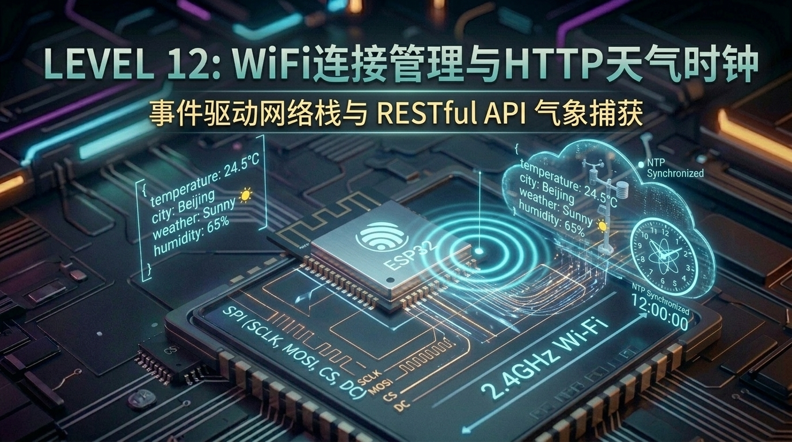
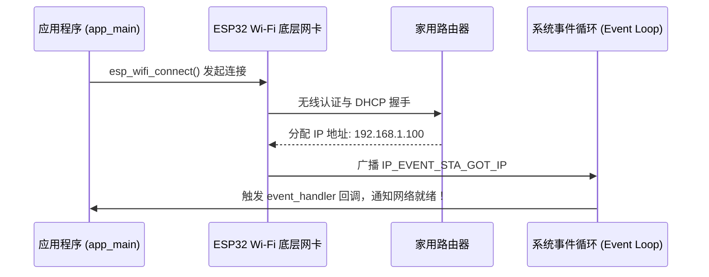

# 第 12 关：ESP32 Wi-Fi 连接管理与 HTTP 互联网天气时钟



---

## 🎯 本关学习目标

在前 11 关中，我们的 ESP32 都是作为一个“单机设备”在独立运行。

从本关开始，我们将正式进入 **【阶段五：无线互联与智能物联网】** —— 为 ESP32 插上 2.4GHz 无线 Wi-Fi 的翅膀，让它连接家庭路由器冲入互联网，实时抓取世界各地的天气预报、同步国家授时中心毫秒级北京时间！

完成本关卡后，你将达成以下核心成就：
1. **搞懂 Wi-Fi STA（客户端）与 AP（热点）模式**：理解单片机连接 Wi-Fi 路由器的底层流程；
2. **掌握 ESP-IDF 事件驱动网络架构（Event Loop）**：理解状态广播大喇叭与 FreeRTOS 事件组（EventGroup）同步；
3. **掌握 SNTP 网络授时机制**：同步阿里云与国家授时中心 NTP 服务器，配置中国标准时间（UTC+8: CST-8）；
4. **掌握 `esp_http_client` 与 RESTful API 交互**：发起 HTTP GET 请求抓取实时云端气象数据；
5. **掌握嵌入式 `cJSON` 库解析标准**：安全解析嵌套 JSON 结构体并提取气温、风速与天气代号。

---

## 12.1 什么是 Wi-Fi STA 与 AP 模式？

初学物联网的小白经常被 STA 和 AP 搞晕，其实它们就在我们日常生活中：

```text
 ┌─────────────────────────────────────────────────────────────┐
 │                【Wi-Fi STA 模式 VS AP 模式】                 │
 │                                                             │
 │  1. STA (Station 客户端模式) ➔ 相当于你的【智能手机】         │
 │     - 自身不发 Wi-Fi 信号；                                 │
 │     - 主动去搜索并输入密码连接家里的 Wi-Fi 路由器；         │
 │     - 从路由器获取 IP 地址，从而访问互联网！                │
 │                                                             │
 │  2. AP (Access Point 热点模式) ➔ 相当于【便携式路由器】      │
 │     - 自己发射一个 Wi-Fi 名字（例如 "ESP32-Setup-WiFi"）；   │
 │     - 允许手机或电脑连上来给它配置参数（配网模式）。        │
 └─────────────────────────────────────────────────────────────┘
```

👉 **本关重点**：我们让 ESP32 运行在 **STA 客户端模式**，连入家里的路由器获取上网能力！

---

## 12.2 事件驱动网络栈：为什么不能用 `while` 死等 Wi-Fi？

单片机连 Wi-Fi 是一个**耗时 1~3 秒的复杂无线握手过程**（扫描信道 ➔ 身份认证 ➔ 4次握手 ➔ DHCP 分配 IP）。

如果让 CPU 在 `while` 死循环里傻等，整个系统的屏幕、按键全部都会卡死。

ESP-IDF 采用了现代化的 **Event Loop（系统事件循环）大喇叭机制**：
1. **CPU 启动 Wi-Fi**：直接给底层网卡下令：*“你去连路由器的这个账号密码，我先去干别的事了！”*；
2. **底层网卡自动握手**：
   - 握手成功 ➔ 大喇叭广播事件：`WIFI_EVENT_STA_CONNECTED`；
   - 路由器分配好 IP ➔ 大喇叭广播事件：`IP_EVENT_STA_GOT_IP`；
   - 密码错误断开 ➔ 大喇叭广播事件：`WIFI_EVENT_STA_DISCONNECTED`；
3. **回调函数响应**：我们在回调函数里听到对应广播后，再精准执行业务逻辑，**CPU 利用率几乎为 0%**！



---

## 12.3 什么是 SNTP？单片机如何获得“毫秒级精准北京时间”？

很多小白问：**“单片机没有电池，断电重启后时间怎么知道现在是几点？”**

答案是 **SNTP（Simple Network Time Protocol，简单网络时间协议）**：
* 只要 ESP32 连上 Wi-Fi，它就会向世界著名的授时服务器（如阿里云 `ntp.aliyun.com`）发送一个轻量级 UDP 数据包；
* 阿里云授时中心返回当前的**国际原子钟高精度时间戳（UTC 时间）**；
* ESP32 自动加上 8 小时（东八区 UTC+8），并同步校准内部的硬件 RTC 时钟！

---

## 12.4 📚 核心库函数功能字典与关键参数解密（小白必读）

---

### 1. 🛠️ 本章引入的核心头文件与 CMake 依赖

| 头文件 | 作用说明 | 对应 CMake / Component | 核心函数 / 宏 |
| :--- | :--- | :--- | :--- |
| **`"esp_wifi.h"`** | **Wi-Fi 射频控制与模式配置** | **`esp_wifi`** | `esp_wifi_init()`、`esp_wifi_set_mode()`、`esp_wifi_start()` |
| **`"esp_event.h"`** | **系统事件大喇叭分发** | **`esp_event`** | `esp_event_loop_create_default()`、`esp_event_handler_register()` |
| **`"esp_sntp.h"`** | **网络 NTP 原子钟授时协议** | **`lwip`** | `esp_sntp_init()`、`esp_sntp_setservername()` |
| **`"esp_http_client.h"`** | **HTTP/HTTPS 客户端网络请求** | **`esp_http_client`** | `esp_http_client_init()`、`esp_http_client_perform()` |
| **`"cJSON.h"`** | **轻量级嵌入式 JSON 格式解析器** | **`espressif/cjson`** | `cJSON_Parse()`、`cJSON_GetObjectItem()`、`cJSON_Delete()` |

---

### 2. 🎛️ 核心函数与关键细节深度解密

#### ① `cJSON` 拆快递三步法（内存释放警示 ⚠️）
* **第一步：拆封包裹**
  ```c
  cJSON *root = cJSON_Parse(json_string); // 将字符串转换成内存树状结构
  ```
* **第二步：按键名取值**
  ```c
  cJSON *temp = cJSON_GetObjectItem(root, "temperature");
  double current_temp = temp->valuedouble; // 获取浮点数数值
  ```
* **第三步：🚨 必须销毁包装盒（极易导致内存泄漏 ⚠️）**
  ```c
  cJSON_Delete(root); // 必须释放整棵 JSON 树占用的 RAM！
  ```

---

## 12.5 实战第 1 步：Wi-Fi Station 模式健壮连接器 (带断线重连)

> 📁 **配套源码文件**：[`code/12_wifi_weather/01_wifi_sta_connect.c`](../code/12_wifi_weather/01_wifi_sta_connect.c)  
> ⚡ **一键切换运行**：在终端运行 `./switch_code.sh 12 1 --flash` 即可秒级切换并自动烧录！

> [!IMPORTANT]
> **⚠️ 实验前必看**：
> 打开源码，将 `#define EXAMPLE_ESP_WIFI_SSID` 和 `EXAMPLE_ESP_WIFI_PASS` 改为你身边的 **2.4GHz Wi-Fi 名称和密码**（ESP32 不支持 5GHz 频段 Wi-Fi）。

### 🌟 实验 1 核心代码解析：

```c
static void event_handler(void* arg, esp_event_base_t event_base,
                          int32_t event_id, void* event_data)
{
    if (event_base == WIFI_EVENT && event_id == WIFI_EVENT_STA_START) {
        esp_wifi_connect(); // 硬件启动，开始握手
    } else if (event_base == WIFI_EVENT && event_id == WIFI_EVENT_STA_DISCONNECTED) {
        if (s_retry_num < EXAMPLE_ESP_MAXIMUM_RETRY) {
            esp_wifi_connect(); // 掉线自动重连
            s_retry_num++;
        }
    } else if (event_base == IP_EVENT && event_id == IP_EVENT_STA_GOT_IP) {
        ip_event_got_ip_t* event = (ip_event_got_ip_t*) event_data;
        ESP_LOGI(TAG, "🎉 联网成功！获取到 IP 地址: " IPSTR, IP2STR(&event->ip_info.ip));
    }
}
```

---

## 12.6 实战第 2 步：SNTP 自动授时与北京时间实时时钟

连上 Wi-Fi 后，单片机向阿里云 NTP 服务器请求授时，并每秒打印一次标准北京时间！

> 📁 **配套源码文件**：[`code/12_wifi_weather/02_sntp_time_sync.c`](../code/12_wifi_weather/02_sntp_time_sync.c)  
> ⚡ **一键切换运行**：在终端运行 `./switch_code.sh 12 2 --flash` 即可秒级切换并自动烧录！

```c
static void sntp_sync_init(void)
{
    esp_sntp_setoperatingmode(SNTP_OPMODE_POLL);
    esp_sntp_setservername(0, "ntp.aliyun.com"); // 阿里云授时中心
    esp_sntp_init();

    // 设置中国东八区时区 (UTC+8)
    setenv("TZ", "CST-8", 1);
    tzset();
}

// 获取并格式化当前时间
time_t now;
struct tm timeinfo;
time(&now);
localtime_r(&now, &timeinfo);
char strftime_buf[64];
strftime(strftime_buf, sizeof(strftime_buf), "%Y-%m-%d %H:%M:%S", &timeinfo);
ESP_LOGI(TAG, "🕒 北京时间: %s", strftime_buf);
```

---

## 12.7 实战第 3 步：综合大工程 —— HTTP 实时天气客户端与时钟站

发起 HTTP GET 请求访问开放气象 RESTful API，并使用 `cJSON` 提取温度与风速：

> 📁 **配套源码文件**：[`code/12_wifi_weather/03_http_weather_clock.c`](../code/12_wifi_weather/03_http_weather_clock.c)  
> ⚡ **一键切换运行**：在终端运行 `./switch_code.sh 12 3 --flash` 即可秒级切换并自动烧录！

```c
/* HTTP 请求与 cJSON 键值提取 */
static void parse_weather_json(const char *json_str)
{
    cJSON *root = cJSON_Parse(json_str);
    if (!root) return;

    cJSON *current = cJSON_GetObjectItem(root, "current_weather");
    if (current) {
        cJSON *temp = cJSON_GetObjectItem(current, "temperature");
        cJSON *wind = cJSON_GetObjectItem(current, "windspeed");
        ESP_LOGI(TAG, "🌡️ 实时气温: %.1f °C, 实时风速: %.1f km/h", 
                 temp->valuedouble, wind->valuedouble);
    }
    cJSON_Delete(root); // 销毁内存
}
```

---

## 12.8 关卡总结与通关打卡

太棒了！你的 ESP32 已经成功跃入广阔的互联网世界！

### 🏆 核心技能清单回顾：
* [x] **Wi-Fi STA 联网**：理解 2.4GHz 客户端模式与断线重连容错机制；
* [x] **事件驱动循环**：掌握 `WIFI_EVENT` 与 `IP_EVENT_STA_GOT_IP` 响应机制；
* [x] **SNTP 原子钟授时**：掌握时区配置（CST-8）与硬件 RTC 同步；
* [x] **HTTP Client 与 cJSON**：掌握 RESTful API 调用与 JSON 键值安全提取。

---

HTTP 是典型的“一问一答”短连接协议，单片机必须每次主动去问服务器。但在物联网实时控制场景中（比如手机 App 远程遥控开灯、毫秒级传感器报警），HTTP 就显得太笨重了。

在下一关，我们将学习**当今整个物联网产业统治级的长连接通信协议 —— MQTT**！  
请翻开 [**第 13 章：ESP32 MQTT 协议接入与阿里云 IoT 物联网平台实战**](./13_MQTT协议接入与阿里云IoT实战.md)！
