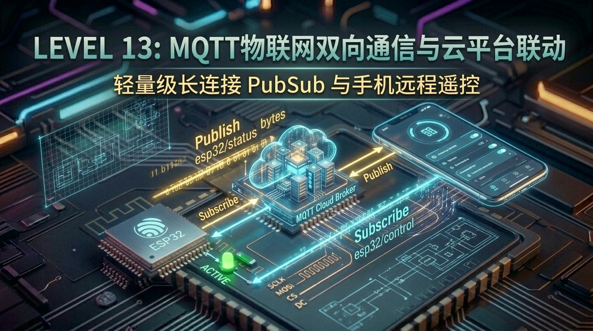

# 第 13 关：ESP32 MQTT 物联网双向通信与云平台联动实战 (手机远程控制)



---

## 🎯 本关学习目标

在前一关中，我们用 HTTP 协议成功抓取了天气预报。但是，如果你想开发一个**智能家居插座**或**智能防盗门锁**：
* 难道手机要每隔 0.1 秒不停地向 ESP32 发送 HTTP 请求询问“门锁状态”？（这会把单片机累死，电量和流量瞬间耗光）；
* 当你在外面用手机点击“开灯”时，家里的单片机躲在路由器防火墙内，手机根本无法直接通过局域网 IP 访问到它！

本关我们将学习当今**整个全球物联网（IoT）产业事实上的国际标准通信协议 —— MQTT（Message Queuing Telemetry Transport）**！

完成本关卡后，你将达成以下核心成就：
1. **搞懂 MQTT 发布/订阅（Pub/Sub）通信模型**：用“微信公众号”大白话彻底理解 Broker、Topic 与 Payload；
2. **理解为什么 MQTT 是物联网之王**：极轻量（报文头部仅 2 字节）、长连接、穿透局域网 NAT、毫秒级下发；
3. **掌握 ESP-IDF `mqtt_client` 驱动框架**：事件监听、断线自动重连与 QoS 服务质量机制；
4. **掌握工业级设备遥测属性（Telemetry）上报**：将温湿度、内存占用、开机时长打包为 JSON 发送至云端；
5. **打造手机远程控制闭环中枢**：手机/电脑发送指令 ➔ ESP32 毫秒级执行开灯 ➔ 立即回传 ACK 确认报文！

---

## 13.1 为什么智能家居不能用 HTTP？MQTT 的“微信公众号”比喻

```text
 ┌─────────────────────────────────────────────────────────────┐
 │               【HTTP 模式 VS MQTT 发布/订阅模式】             │
 │                                                             │
 │  1. HTTP 模式 ➔ 【打电话】                                  │
 │     - 必须一问一答，打通一次电话建立一次连接，耗电耗流量；   │
 │     - 外网手机打不进家里局域网内的单片机（被路由器墙挡住）。 │
 │                                                             │
 │  2. MQTT 模式 ➔ 【微信公众号】                               │
 │     - 云端服务器 (Broker) 就像【微信服务器】；               │
 │     - 主题 (Topic) 就像【公众号名字】(如 "esp32/led")；       │
 │     - 单片机只要【关注（Subscribe）】这个公众号；             │
 │     - 任何时候手机在世界任何地方【群发推送（Publish）】消息， │
 │       单片机都会在 10 毫秒内瞬间收到推送！                  │
 └─────────────────────────────────────────────────────────────┘
```

---

## 13.2 MQTT 三大核心概念：Broker、Topic 与 Payload

```text
 ┌─────────────────────────────────────────────────────────────┐
 │                【MQTT 消息流转三要素】                       │
 │                                                             │
 │   [ 手机 App / MQTTX ]  ──(Publish: 开灯)──► [ 云端 Broker ] │
 │                                                     │       │
 │                                             (转发给订阅者)  │
 │                                                     ▼       │
 │   [ ESP32 开发板 ]     ◄──(收到并执行开灯)── [ 微信/EMQX ]   │
 └─────────────────────────────────────────────────────────────┘
```

1. **Broker（代理服务器 / 邮局）**：负责接收所有消息，并精准分发给订阅了该主题的设备（如 EMQX、阿里云 IoT、腾讯云物联网等）；
2. **Topic（主题 / 邮寄地址）**：用斜杠分层的字符串，例如：
   - 遥测上报主题：`esp32_journey/device_01/telemetry`
   - 控制下发主题：`esp32_journey/device_01/command`
3. **Payload（载荷 / 信件正文）**：实际传输的内容，通常为 **JSON 字符串**（如 `{"cmd":"set_led","state":1}`）。

---

## 13.3 什么是 QoS？为什么有 0、1、2 三种等级？

* **QoS 0（最多发一次）**：像普通平信，发送出去就不管了，丢了不补发（适合发送不重要的每秒温度波形）；
* **QoS 1（至少到一次，最常用 👍）**：像挂号信，必须收到对方的 ACK 回执确认；如果网络卡顿没收到回执就自动重发（适合开灯、关锁指令）；
* **QoS 2（保证仅到达一次）**：四次握手确保绝不重复（消耗资源较大，单片机通常用 QoS 0 或 1）。

---

## 13.4 📚 核心库函数功能字典与关键参数解密（小白必读）

---

### 1. 🛠️ 本章引入的核心头文件与组件

| 头文件 | 作用说明 | 对应组件 / 库 | 核心函数 / 结构体 |
| :--- | :--- | :--- | :--- |
| **`"mqtt_client.h"`** | **MQTT 客户端核心连接与通信管理** | `espressif/mqtt` | `esp_mqtt_client_init()`、`esp_mqtt_client_publish()`、`esp_mqtt_client_subscribe()` |
| **`"cJSON.h"`** | **打包与解析 MQTT JSON 载荷** | `espressif/cjson` | `cJSON_CreateObject()`、`cJSON_PrintUnformatted()` |

---

### 2. 🎛️ 核心函数与调用标准流水线

#### ① 步骤 1：配置并启动 MQTT 客户端
```c
esp_mqtt_client_config_t mqtt_cfg = {
    .broker.address.uri = "mqtt://broker.emqx.io:1883", // 目标 Broker 地址
};
esp_mqtt_client_handle_t client = esp_mqtt_client_init(&mqtt_cfg);
esp_mqtt_client_register_event(client, ESP_EVENT_ANY_ID, mqtt_event_handler, NULL);
esp_mqtt_client_start(client);
```

#### ② 步骤 2：订阅主题（Subscribe）与发布消息（Publish）
```c
// 在 MQTT_EVENT_CONNECTED 事件触发后执行订阅
esp_mqtt_client_subscribe(client, "esp32/cmd", 1); // QoS 等级 1

// 发布消息
esp_mqtt_client_publish(client, "esp32/status", "{\"led\":1}", 0, 1, 0);
```

#### ③ 步骤 3：收到下行数据处理（`MQTT_EVENT_DATA`）
* 当别人向单片机订阅的主题发消息时，会触发 `MQTT_EVENT_DATA`；
* 此时通过 `event->data` 与 `event->data_len` 即可提取正文，丢给 `cJSON_Parse` 执行相应动作！

---

## 13.5 实战第 1 步：MQTT 客户端 Pub/Sub 基础 (Hello MQTT)

连接到全球公共测试 Broker（`broker.emqx.io`），订阅自身测试主题，实现自发自收验证！

> 📁 **配套源码文件**：[`code/13_mqtt_iot/01_mqtt_pubsub.c`](../code/13_mqtt_iot/01_mqtt_pubsub.c)  
> ⚡ **一键切换运行**：在终端运行 `./switch_code.sh 13 1 --flash` 即可秒级切换并自动烧录！

```c
static void mqtt_event_handler(void *handler_args, esp_event_base_t base, int32_t event_id, void *event_data)
{
    esp_mqtt_event_handle_t event = event_data;
    switch ((esp_mqtt_event_id_t)event_id) {
        case MQTT_EVENT_CONNECTED:
            ESP_LOGI(TAG, "🎉 成功连接 MQTT Broker！正在订阅测试主题...");
            esp_mqtt_client_subscribe(s_mqtt_client, MQTT_TOPIC_TEST, 0);
            esp_mqtt_client_publish(s_mqtt_client, MQTT_TOPIC_TEST, "Hello from ESP32!", 0, 0, 0);
            break;
        case MQTT_EVENT_DATA:
            ESP_LOGI(TAG, "📩 收到主题 [%.*s] 消息 ➔ %.*s", 
                     event->topic_len, event->topic, event->data_len, event->data);
            break;
        default:
            break;
    }
}
```

---

## 13.6 实战第 2 步：设备遥测数据定时 JSON 上报 (Telemetry Upload)

每隔 5 秒将 ESP32 的 **剩余内存（Free Heap）**、**运行时间（Uptime）** 和 **气温** 组装成 JSON 报文推送至云端：

> 📁 **配套源码文件**：[`code/13_mqtt_iot/02_telemetry_upload.c`](../code/13_mqtt_iot/02_telemetry_upload.c)  
> ⚡ **一键切换运行**：在终端运行 `./switch_code.sh 13 2 --flash` 即可秒级切换并自动烧录！

```c
// 构建并上报 JSON 遥测报文
cJSON *root = cJSON_CreateObject();
cJSON_AddStringToObject(root, "device_id", "esp32_starter_01");
cJSON_AddNumberToObject(root, "uptime_sec", (double)uptime_sec);
cJSON_AddNumberToObject(root, "free_heap", (double)free_heap);
cJSON_AddNumberToObject(root, "temperature", (double)mock_temp);

char *json_str = cJSON_PrintUnformatted(root);
esp_mqtt_client_publish(s_mqtt_client, "esp32_journey/device_01/telemetry", json_str, 0, 1, 0);

free(json_str);
cJSON_Delete(root);
```

---

## 13.7 实战第 3 步：综合大工程 —— 手机远程控制中枢与双向联动

真正的物联网控制中枢：使用电脑上的 **MQTTX 软件** 或手机上的 **MQTT 调试 App**，向 `esp32_journey/device_01/command` 发送 JSON 指令控制板载绿色 LED2（GPIO27）：

> 📁 **配套源码文件**：[`code/13_mqtt_iot/03_remote_control_hub.c`](../code/13_mqtt_iot/03_remote_control_hub.c)  
> ⚡ **一键切换运行**：在终端运行 `./switch_code.sh 13 3 --flash` 即可秒级切换并自动烧录！

```json
// 手机发送的控制指令示例:
{
  "cmd": "set_led",
  "state": 1
}
```

```c
// ESP32 收到指令后执行并立即回传 ACK 确认报文：
static void handle_downlink_command(const char *payload, int len)
{
    cJSON *root = cJSON_Parse(json_buf);
    cJSON *cmd = cJSON_GetObjectItem(root, "cmd");
    if (cmd && strcmp(cmd->valuestring, "set_led") == 0) {
        cJSON *state = cJSON_GetObjectItem(root, "state");
        s_led_status = (state->valueint != 0);
        gpio_set_level(LED2_PIN, s_led_status ? 1 : 0);
        
        // 立即回复 ACK
        send_ack_response("set_led", true, s_led_status ? "LED Turned ON" : "LED Turned OFF");
    }
    cJSON_Delete(root);
}
```

---

## 13.8 关卡总结与通关打卡

恭喜你！你已经掌握了整个现代物联网最核心的通信神经系统 —— **MQTT 双向物联**！

### 🏆 核心技能清单回顾：
* [x] **MQTT 核心机制**：搞懂 Pub/Sub 订阅发布模型与微信公众号生动比喻；
* [x] **NAT 穿透与长连接**：理解为什么 MQTT 能让外网手机随时随地控制家里的单片机；
* [x] **遥测数据流**：掌握用 `cJSON` 组装标准 IoT 遥测报文并定时推送；
* [x] **远程指令闭环**：掌握指令下发解析与 ACK 应答双向闭环机制。

---

现在，ESP32 已经能够通过 Wi-Fi 和云端进行毫秒级通信。但在近距离交互场景（例如用手机靠近单片机自动开门、无需配网直接收发数据），**BLE 低功耗蓝牙** 则是最不可替代的利器！

请翻开 [**第 14 章：ESP32 BLE 低功耗蓝牙 GATT 广播与手机 App 透传控制**](./14_BLE低功耗蓝牙GATT与手机透传.md)！
