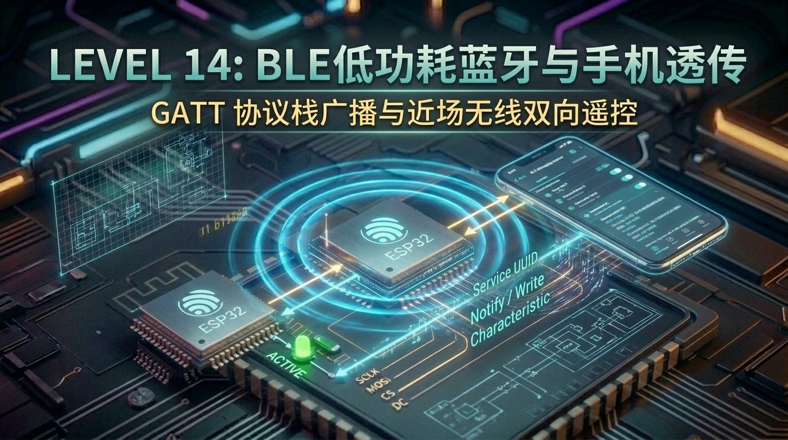
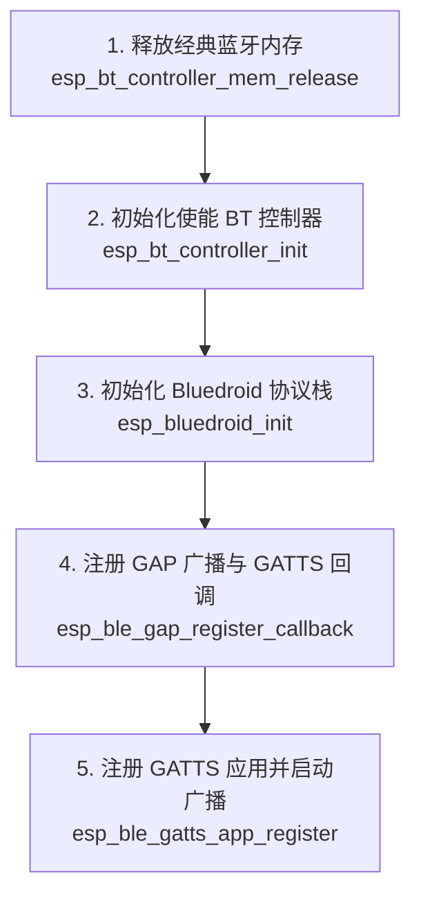

# 第 14 关：ESP32 BLE 低功耗蓝牙实战与手机 App / 微信小程序双向互联



---

## 🎯 本关学习目标

在前两关中，我们让 ESP32 连上了 Wi-Fi 路由器和云端服务器。但在很多日常生活场景中：
* **智能手环 / 电子秤 / 共享单车车锁**：周围根本没有 Wi-Fi 密码，如何让手机一靠近就能秒级开锁或读取体重？
* **智能家居配网**：新买的智能灯泡连不上路由器，需要手机先近距离给它发送 Wi-Fi 账号密码。

这种“近距离、免配网、极度省电”的通信利器，就是 **BLE（Bluetooth Low Energy，低功耗蓝牙）**！

完成本关卡后，你将达成以下核心成就：
1. **搞懂 BLE 低功耗蓝牙与经典蓝牙的区别**：理解手环续航 14 天的底层秘密；
2. **彻底掌握 GATT 协议四层树状模型**：用“商场柜台与商品抽屉”大白话拆解 Service 与 Characteristic；
3. **掌握 BLE 三大通信动作**：读取（Read）、写入（Write）与主动推送通知（Notify）；
4. **掌握 ESP32 Bluedroid 蓝牙协议栈开发**：GAP 广播配置、GATT Server 服务注册与事件驱动循环；
5. **打造手机蓝牙遥控器与按键 Notify 推送中枢**：手机发送数据控制 LED2，单片机按键 SW3 触发主动推送到手机！

---

## 14.1 什么是 BLE？它和传统蓝牙有什么区别？

```text
 ┌─────────────────────────────────────────────────────────────┐
 │                【经典蓝牙 (Classic BT) VS BLE 低功耗蓝牙】    │
 │                                                             │
 │  1. 经典蓝牙 (BT 2.0/3.0) ➔ 相当于【大卡车】                 │
 │     - 传输速率高，适合连续传输大流量数据（如蓝牙耳机听歌）； │
 │     - 极其耗电（耳机听歌 4~6 小时就没电了）。                │
 │                                                             │
 │  2. BLE 低功耗蓝牙 (BT 4.0/5.0+) ➔ 相当于【电动滑板车】      │
 │     - 99% 的时间都在深度睡眠，只有发数据的几毫秒醒来；       │
 │     - 极低功耗（纽扣电池供电的手环、防丢器能用 1~2 年！）； │
 │     - 手机免配对弹窗，微信小程序直接秒级读写！               │
 └─────────────────────────────────────────────────────────────┘
```

---

## 14.2 GATT 架构大白话解密：商场专柜与商品抽屉

BLE 设备连接后，所有数据都是通过 **GATT（通用属性配置文件）** 组织管理的。很多初学者被 UUID、Handle 绕晕，其实它就是一个**四层结构的“大型商场”**：

```text
 ┌─────────────────────────────────────────────────────────────┐
 │                  【GATT 层次模型结构】                      │
 │                                                             │
 │  Level 1: Profile (商场名字) ➔ 例如 "智能家居设备档案"      │
 │    │                                                        │
 │    └── Level 2: Service (专柜) ➔ 例如 "灯光控制服务"        │
 │          │      (UUID: 0xFFE0)                              │
 │          │                                                  │
 │          └── Level 3: Characteristic (商品抽屉) ➔ "开关灯"  │
 │                │  (UUID: 0xFFE1)                            │
 │                │  (权限: 允许手机 Read / Write / Notify)    │
 │                │                                            │
 │                └── Level 4: Value (抽屉里的数据) ➔ 1 或 0   │
 └─────────────────────────────────────────────────────────────┘
```

* **Service（服务）**：一组功能的集合，用 UUID（如 `0xFFE0`）唯一标识；
* **Characteristic（特征值）**：真正存储数据的地方（类似一个有名字的变量），支持三种操作：
  - **Read（读）**：手机向单片机主动要数据（例如读取当前电量）；
  - **Write（写）**：手机向单片机写入数据（例如发送 `'1'` 开灯）；
  - **Notify（主动通知 ⚡）**：单片机数据发生变化时（例如 SW3 按键按下），单片机**主动把最新状态弹射推送给手机**！

---

## 14.3 📚 核心库函数功能字典与关键参数解密（小白必读）

---

### 1. 🛠️ 本章引入的核心头文件

| 头文件 | 作用说明 | 核心函数 / 宏 |
| :--- | :--- | :--- |
| **`"esp_bt.h"`** | **ESP32 蓝牙控制器（Controller）电源与模式管理** | `esp_bt_controller_init()`、`esp_bt_controller_enable()` |
| **`"esp_bt_main.h"`** | **Bluedroid 协议栈启停管理** | `esp_bluedroid_init()`、`esp_bluedroid_enable()` |
| **`"esp_gap_ble_api.h"`** | **GAP（通用访问协议）：广播名称、广播频率与扫描响应** | `esp_ble_gap_set_device_name()`、`esp_ble_gap_start_advertising()` |
| **`"esp_gatts_api.h"`** | **GATT Server：创建服务、添加特征值、处理读写与 Notify** | `esp_ble_gatts_create_service()`、`esp_ble_gatts_send_indicate()` |

---

### 2. 🎛️ BLE 初始化经典五步流水线



---

## 14.4 实战第 1 步：BLE 广播与手机扫描发现 (BLE Beacon)

配置 ESP32 发射低功耗广播包，手机打开任何蓝牙调试 App 即可在周围秒级搜到它！

> 📁 **配套源码文件**：[`code/14_ble_gatt/01_ble_beacon_adv.c`](../code/14_ble_gatt/01_ble_beacon_adv.c)  
> ⚡ **一键切换运行**：在终端运行 `./switch_code.sh 14 1 --flash` 即可秒级切换并自动烧录！

```c
static void gap_event_handler(esp_gap_ble_cb_event_t event, esp_ble_gap_cb_param_t *param)
{
    if (event == ESP_GAP_BLE_ADV_DATA_SET_COMPLETE_EVT) {
        ESP_LOGI(TAG, "📡 广播数据配置就绪，启动 BLE 广播...");
        esp_ble_gap_start_advertising(&adv_params);
    }
}
```

---

## 14.5 实战第 2 步：GATT Server 特征值读写与数据透传 (Read/Write)

创建自定义服务与特征值，手机 App 点击特征值写入 `'1'` 或 `'0'` 即可点亮或熄灭板载 LED2：

> 📁 **配套源码文件**：[`code/14_ble_gatt/02_ble_gatt_server.c`](../code/14_ble_gatt/02_ble_gatt_server.c)  
> ⚡ **一键切换运行**：在终端运行 `./switch_code.sh 14 2 --flash` 即可秒级切换并自动烧录！

```c
case ESP_GATTS_WRITE_EVT: {
    ESP_LOGI(TAG, "✍️ 收到手机写入数据: %.*s", param->write.len, param->write.value);
    if (param->write.value[0] == '1') {
        gpio_set_level(LED2_PIN, 1); // 开灯
    } else if (param->write.value[0] == '0') {
        gpio_set_level(LED2_PIN, 0); // 关灯
    }
    break;
}
```

---

## 14.6 实战第 3 步：综合大工程 —— 手机 BLE 遥控器与主动 Notify 状态推送

完整的近场蓝牙双向遥控系统：
1. 手机写入 `'1'`/`'0'` 控制板载 LED2；
2. 当按下开发板上的 **SW3 用户按键（GPIO39）** 时，ESP32 立即通过 `esp_ble_gatts_send_indicate` **主动向手机推送 Notify 消息**！

> 📁 **配套源码文件**：[`code/14_ble_gatt/03_ble_smart_remote.c`](../code/14_ble_gatt/03_ble_smart_remote.c)  
> ⚡ **一键切换运行**：在终端运行 `./switch_code.sh 14 3 --flash` 即可秒级切换并自动烧录！

```c
/* 按键扫描任务：按下时主动 Notify 推送 */
if (gpio_get_level(BUTTON_PIN) == 0) {
    click_count++;
    char notify_msg[64];
    snprintf(notify_msg, sizeof(notify_msg), "SW3_CLICK_%d", click_count);
    
    // 主动弹射推送给手机
    esp_ble_gatts_send_indicate(s_gatts_if, s_conn_id, s_char_handle,
                                strlen(notify_msg), (uint8_t *)notify_msg, false);
    ESP_LOGI(TAG, "📤 [主动 Notify 推送给手机] ➔ %s", notify_msg);
}
```

---

## 14.7 关卡总结与通关打卡

太酷了！你已经解锁了 ESP32 的近距离无线霸主技能 —— **BLE 低功耗蓝牙**！

### 🏆 核心技能清单回顾：
* [x] **BLE 协议精髓**：理解低功耗睡眠广播机制与纽扣电池超长待机原理；
* [x] **GATT 四层结构**：掌握 Service 与 Characteristic 的组织关系；
* [x] **读写与 Notify**：掌握手机下发控制与单片机硬件事件主动弹射通知；
* [x] **Bluedroid 协议栈**：熟练运用 GAP 与 GATTS 事件驱动流水线。

---

现在，ESP32 已经集成了彩屏、触控、Wi-Fi、MQTT 和 BLE 蓝牙！  
接下来，我们来看看另一个极为实用的黑科技：**ESP-NOW 超低延迟免配网局域互联**（无人机遥控器与智能灯组群控的终极秘密）！

请翻开 [**第 15 章：ESP-NOW 超低延迟私有局域网通信实战**](./15_ESPNOW免配网低延迟通信.md)！
