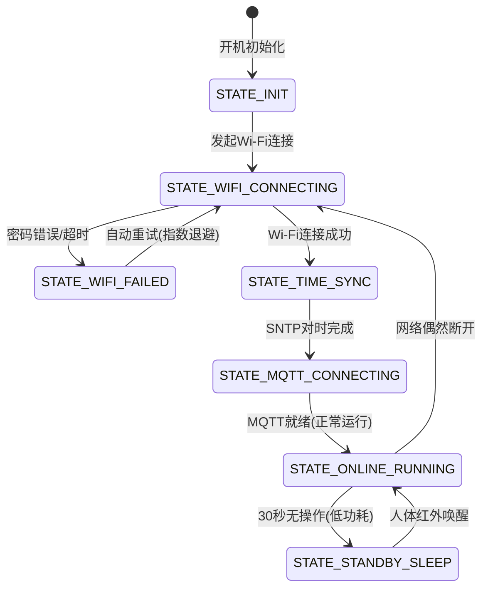

# 第 17 章：代码重构与企业级架构 —— 嵌入式软件工程化与模块化分层设计

> **写在前面**：恭喜你已经通关了前 16 关！此时的你，已经掌握了点灯、测温、测距、刷彩屏、触摸、Wi-Fi 联网、MQTT 远程遥控和 TF 卡读取等所有单点技能。
> 
> 但此时许多初学者会遭遇一道巨大的**“工程化高墙”**：
> * *如果把所有的外设和网络代码全部硬塞进一个 `app_main.c`，代码动辄几千行；*
> * *全局变量满天飞，改一个传感器引脚导致整个工程到处报错；*
> * *业务逻辑和底层硬件死死绑在一起，想把这个功能移植到下一个新项目比重写还难！*
> 
> **这就是所谓的“业余玩具式代码”与“工业级商业项目”的本质差距。**  
> 在进入第 18 关终极结业大实战之前，本章将为你传授现代嵌入式开发中**最宝贵、最具价值的软件工程化内功** —— 驱动与业务三层分层解耦、事件数据总线与组件化模块设计！

---

## 17.1 为什么必须分层？—— “五星级现代化餐厅”架构哲学

初学者最容易写的代码是**“意大利面条式（Spaghetti Code）”**：在按钮中断里直接刷新屏幕、在 MQTT 回调里直接操作 GPIO……牵一发而动全身。

在工业级项目中，我们采用经典的 **嵌入式三层解耦架构（Three-Tier Embedded Architecture）**：

```text
                 【嵌入式现代化三层分层解耦架构图】

  ┌─────────────────────────────────────────────────────────────┐
  │ 🏢 第三层：应用与业务展示层 (Application & UI Layer)         │
  │    (前厅经理与服务员：只负责根据数据刷新界面、用户交互、切歌切灯) │
  │    • app_weather.c (天气业务)   • ui_dashboard.c (LVGL视图) │
  │    • app_control.c (控制逻辑)   • app_alarm.c (报警联动)    │
  └──────────────────────────────┬──────────────────────────────┘
                                 │ 💡 统一事件数据总线 (Event Loop / Queue)
  ┌──────────────────────────────┴──────────────────────────────┐
  │ 🚚 第二层：系统服务与中间件层 (Middleware & Services Layer)  │
  │    (调度台与传菜员：负责数据中转、多任务并发、网络状态管理)   │
  │    • srv_wifi.c (Wi-Fi状态机)   • srv_mqtt.c (物联网数据流) │
  │    • srv_storage.c (NVS存储)    • srv_sensor_mgr.c (数据池) │
  └──────────────────────────────┬──────────────────────────────┘
                                 │ 🔌 纯净硬件驱动 API (init / read / write)
  ┌──────────────────────────────┴──────────────────────────────┐
  │ 🍳 第一层：板级支持驱动层 (BSP / Board Support Package)     │
  │    (后厨大厨与炉灶：只专心对付具体芯片、引脚与纳秒微秒通信)   │
  │    • bsp_st7789.c (屏幕底驱)    • bsp_cst816s.c (触摸底驱)  │
  │    • bsp_dht11.c (温湿度底驱)   • bsp_ws2812.c (RGB彩灯底驱)│
  │    • bsp_ntc.c (ADC测温底驱)    • bsp_hcsr04.c (超声波底驱) │
  └─────────────────────────────────────────────────────────────┘
```

### 🌟 经典分层的四大工业级优势：
1. **后厨换锅，前厅不慌（极高可维护性）**：  
   如果老板明天把温湿度传感器从 DHT11 换成更高端的 SHT30（I2C通信），你**只需要重写 `bsp_dht11.c` 为 `bsp_sht30.c`**，中间服务层和上层 UI 界面一行代码都不需要动！
2. **硬件无关性（跨平台移植）**：  
   如果你将来把主控从 ESP32 升级为 ESP32-S3 或 STM32，你的所有上层业务代码（UI界面、MQTT业务、控制算法）可以 100% 原封不动复用！
3. **多人协同开发**：  
   驱动工程师专门写 BSP 层，算法工程师专门写服务层，UI 工程师专门写 LVGL 页面，互不干扰、并行推进。

---

## 17.2 核心模式一：统一事件数据总线（Event Broker / Loop）

传统的坏习惯是：传感器读到数据，直接去调用 UI 的更新函数 `ui_update_temp(temp)`。  
这种直接调用会导致模块之间“死死咬在一起（强耦合）”。

在现代 ESP-IDF 架构中，我们使用 **事件驱动总线（Event-Driven Architecture）**：

```text
 ┌────────────────┐
 │ 传感器采集任务  │──发布事件(EVENT_TEMP_UPDATED, 26.5℃)──┐
 └────────────────┘                                       │
                                                          ▼
                                             ┌──────────────────────────┐
                                             │ ESP-IDF 系统事件总线      │
                                             │ (esp_event_loop / Queue) │
                                             └────────────┬─────────────┘
                                                          │ 广播通知所有订阅者
                        ┌─────────────────────────────────┴─────────────────────────────────┐
                        ▼                                                                   ▼
             ┌─────────────────────┐                                             ┌─────────────────────┐
             │ UI 页面订阅者        │                                             │ MQTT 远程上报订阅者  │
             │ (自动更新屏幕上的温度) │                                             │ (自动将温度打包发往云)│
             └─────────────────────┘                                             └─────────────────────┘
```

* **发布者（Publisher）**：只负责往总线扔数据（“我测到了温度 26.5℃”），根本不用关心谁需要它；
* **订阅者（Subscriber）**：谁关心这个数据就注册监听（UI、MQTT、TF卡存储任务各自独立接收）。

---

## 17.3 核心模式二：彻底消灭 if-else 地狱 —— 有限状态机（FSM）

在大型项目中，设备经常面临复杂的网络和工作模式（未联网 ➔ 正在连接Wi-Fi ➔ 联网成功 ➔ 正在同步时钟 ➔ 断线重连……）。

如果全靠全局布尔变量 `is_connected`, `is_syncing` 和多层 `if-else`，逻辑必定死锁崩溃。



* **状态枚举（State Enum）**：严格定义系统所有可能的状态；
* **状态转移函数**：每次事件到来只改变 `current_state`，每个状态下的行为互不干扰，逻辑清晰如教科书！

---

## 17.4 核心模式三：ESP-IDF 标准组件化（`components/` 乐高积木）

在大型项目中，我们不再把所有 `.c/.h` 都堆在 `main/` 目录下，而是采用乐鑫官方推荐的 **组件化目录体系**：

```text
├── CMakeLists.txt                 # 项目总构建脚本
├── main/                          # 顶层入口与任务启动
│   ├── CMakeLists.txt
│   └── app_main.c                 # 只负责系统初始化与任务创建 (极度精简!)
│
└── components/                    # 🧱 独立业务与驱动组件库 (乐高积木)
    ├── bsp_drivers/               # 硬件驱动抽象组件
    │   ├── include/
    │   │   ├── bsp_st7789.h
    │   │   ├── bsp_dht11.h
    │   │   └── bsp_ws2812.h
    │   ├── src/
    │   │   ├── bsp_st7789.c
    │   │   ├── bsp_dht11.c
    │   │   └── bsp_ws2812.c
    │   └── CMakeLists.txt
    │
    ├── app_gui/                   # LVGL 界面与交互组件
    │   ├── include/ui_dashboard.h
    │   ├── src/ui_dashboard.c
    │   └── CMakeLists.txt
    │
    └── srv_network/               # Wi-Fi / MQTT / BLE 网络服务组件
        ├── include/srv_network.h
        ├── src/srv_network.c
        └── CMakeLists.txt
```

---

## 17.5 本章小结

* **掌握三层分层架构**：后厨（BSP驱动）、调度台（服务中转）、前厅（UI与业务）各司其职；
* **掌握事件总线机制**：用广播与订阅彻底消除模块间的直接耦合；
* **掌握组件化管理**：让每一段写好的驱动都成为以后可以随时复用的“传家宝代码”！

现在，你的架构内功已经登峰造极！  
翻开 [**第 18 章：ESP32 终极综合大实战 —— 桌面多功能智能气象站与物联网超级中控台**](./18_桌面智能气象站与物联网超级中控.md)，让我们用这套工业级架构，打造属于你的终极毕业大作！
